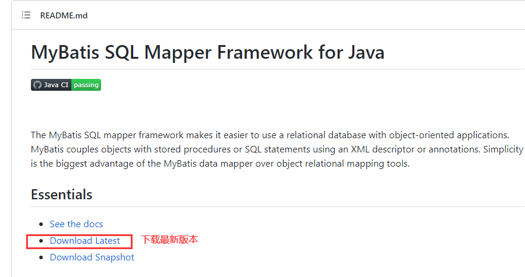
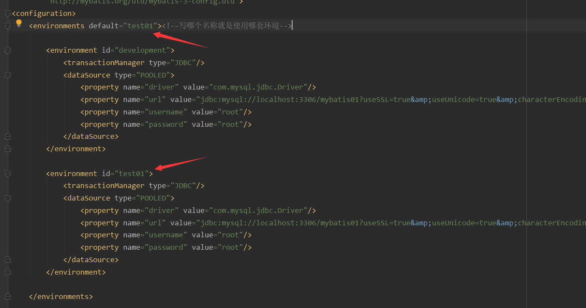
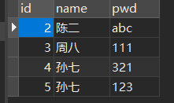
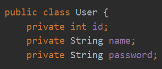
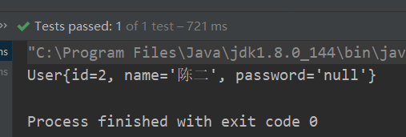
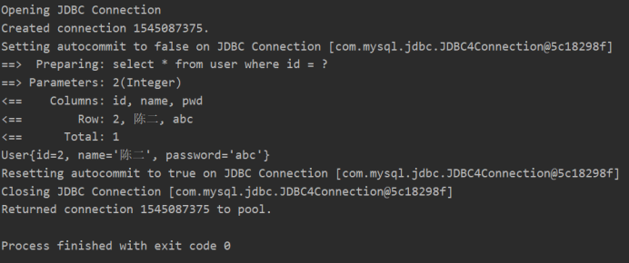
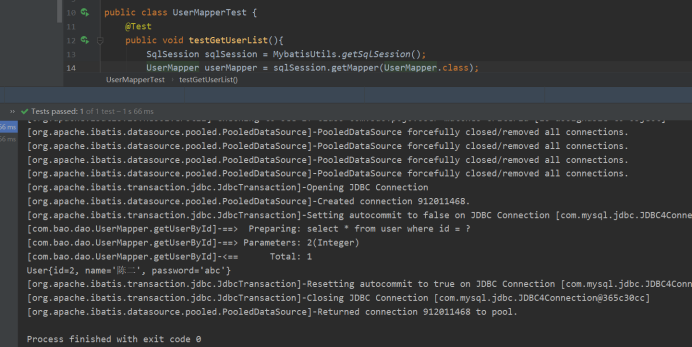

# Mybatis简介

##什么是Mybatis

- MyBatis 是一款优秀的持久层框架
- MyBatis 避免了几乎所有的JDBC代码和手动设置参数以及获取结果集的过程
- MyBatis 可以使用简单的XML 或注解来配置和映射原生信息，将接口和Java的实体类【Plain Old Java Object，普通的Java 对象】映射成数据库中的记录。
- MyBatis 本是apache的一个开源项目ibatis, 2010年这个项目由apache 迁移到了google code，并且改名为MyBatis 。
- 2013年11月迁移到Github 


##持久化

> 持久化是将程序数据在持久化状态和瞬时状态转化的机制。

- 持久化状态：将内存中的对象存储在数据库中，或者存储在磁盘文件中、XML数据文件中等等
- 瞬时状态：刚new出来一个对象，还没有被保存到数据库中
- JDBC 就是一种持久化机制。文件IO 也是一种持久化机制

> 为什么需要持久化服务

- 第一：内存断电后数据会丢失，但是一些对象是无论如何都不能丢失的，比如银行账号等
- 第二：内存过于昂贵，与硬盘、光盘等外存相比，内存的价格要高2~3个数量级，而且维持成本也高，至少需要一直供电。
- 第三：即使对象不需要永久保存，也会因为内存的容量限制不能一直呆在内存中，需要持久化来缓存到外存。


##持久层

> 什么是持久层：完成持久化工作的代码块，也就是dao层 【DAO (Data Access Object)  数据访问对象】
>
> 大多数情况下特别是企业级应用，数据持久化往往也就意味着将内存中的数据保存到磁盘上加以固化，而持久化的实现过程则大多通过各种关系型数据库来完成。


## MyBatis下载

- [MyBatis下载地址](https://github.com/mybatis/mybatis-3)
- 


##为什么需要MyBatis

> MyBatis就是帮助程序员将数据存入数据库中，和从数据库中取数据。
>
> 传统的jdbc操作，有很多重复代码块，比如： 数据取出时的封装，数据库的建立连接等。通过框架可以减少重复代码，提高开发效率。
>
> Mybatis 是一个半自动化的ORM（Object Relational Mapping，对象关系映射）框架
>
> 很多功能不用Mybatis 依旧可以做到，只是用了它实现会更加简单
>


## 和其它持久化层技术对比

- JDBC  
  - SQL 夹杂在Java代码中耦合度高，导致硬编码内伤  
  - 维护不易且实际开发需求中 SQL 有变化，频繁修改的情况多见  
  - 代码冗长，开发效率低
- Hibernate 和 JPA
  - 操作简便，开发效率高  
  - 程序中的长难复杂 SQL 需要绕过框架  
  - 内部自动生产的 SQL，不容易做特殊优化  
  - 基于全映射的全自动框架，大量字段的 POJO 进行部分映射时比较困难。  
  - 反射操作太多，导致数据库性能下降


##Mybatis 的优点

简单易学：本身就很小且简单。没有任何第三方依赖，最简单安装只要两个jar文件，配置几个sql映射文件就可以了，易于学习，易于使用

灵活：mybatis不会对应用程序或者数据库的现有设计强加任何影响。sql写在xml里，便于统一管理和优化。通过sql语句可以满足操作数据库的所有需求。

解除sql与程序代码的耦合：通过提供DAO层，将业务逻辑和数据访问逻辑分离，使系统的设计更清晰，更易维护，更易单元测试。sql和代码分离，提高了可维护性。

支持编写动态sql：提供xml标签

最重要的一点，使用的人多！一般公司都用！


# Mybatis入门

##思路

搭建环境--> 导入Mybatis --> 编写代码 --> 测试

##搭建环境

###环境说明

- jdk 8 +

- MySQL 5.7+

- maven 3.5+

- IDEA 2019+

- MyBatis 3.5+

  ```xml
  <dependency>
    <groupId>org.mybatis</groupId>
    <artifactId>mybatis</artifactId>
    <version>3.5.2</version>
  </dependency>
  ```

###搭建实验数据库

```sql
CREATE DATABASE mybatis;
USE mybatis;
DROP TABLE IF EXISTS user;
CREATE TABLE user (
	id INT(20) NOT NULL,
	name VARCHAR(30) DEFAULT NULL,
	pwd VARCHAR(30) DEFAULT NULL,
	PRIMARY KEY (id)
)ENGINE = INNODB DEFAULT CHARSET = utf8;
INSERT INTO user(id,name,pwd) VALUES (1,'刘一','123'),(2,'陈二','abc'),(3,'张三','哈哈');
```

###导入相关 jar 包

```xml
<dependencies>
    <!--mybatis、MySql驱动jar包、junit单元测试jar包-->
    <!-- https://mvnrepository.com/artifact/org.mybatis/mybatis -->
    <dependency>
        <groupId>org.mybatis</groupId>
        <artifactId>mybatis</artifactId>
        <version>3.5.2</version>
    </dependency>
    <dependency>
        <groupId>mysql</groupId>
        <artifactId>mysql-connector-java</artifactId>
        <version>5.1.47</version>
    </dependency>
    <!-- https://mvnrepository.com/artifact/junit/junit -->
    <dependency>
        <groupId>junit</groupId>
        <artifactId>junit</artifactId>
        <version>4.12</version>
        <scope>test</scope>
    </dependency>
</dependencies>
<!--导入插件-->
<build>
    <!--解决maven静态资源过滤的问题-->
    <resources>
        <resource>
            <directory>src/main/java</directory>
            <includes>
                <include>**/*.properties</include>
                <include>**/*.xml</include>
            </includes>
            <filtering>false</filtering>
        </resource>
        <resource>
            <directory>src/main/resources</directory>
            <includes>
                <include>**/*.properties</include>
                <include>**/*.xml</include>
            </includes>
            <filtering>false</filtering>
        </resource>
    </resources>
    
    <plugins>
      <!-- 设置jdk的版本-->
      <plugin>
        <groupId>org.apache.maven.plugins</groupId>
        <artifactId>maven-compiler-plugin</artifactId>
        <configuration>
          <source>1.8</source>
          <target>1.8</target>
          <encoding>UTF-8</encoding>
        </configuration>
      </plugin>
    </plugins>
</build>
```


###编写MyBatis核心配置文件（查看Mybatis官网）

> 习惯上命名为`mybatis-config.xml`，这个文件名仅仅只是建议，并非强制要求。将来整合Spring之后，这个配置文件可以省略，所以大家操作时可以直接复制、粘贴。
>
> 核心配置文件主要用于配置连接数据库的环境以及MyBatis的全局配置信息
>
> 核心配置文件存放的位置是src/main/resources目录下

- mybatis-config.xml

```xml
<?xml version="1.0" encoding="UTF-8" ?>
<!DOCTYPE configuration
        PUBLIC "-//mybatis.org//DTD Config 3.0//EN"
        "http://mybatis.org/dtd/mybatis-3-config.dtd">
<!--核心配置文件-->
<configuration>
    <!--环境-->
    <environments default="development">
        <!--环境之一-->
        <environment id="development">
            <!--使用jdbc的事务管理-->
            <transactionManager type="JDBC"/>
            <dataSource type="POOLED">
                <property name="driver" value="com.mysql.jdbc.Driver"/>
                <!--
                useSSL=true ：设置为安全连接
                &amp; ：&符号在xml文件中需要转义，&amp;相当于一个&符号
                useUnicode=true ：参照unicode表
                characterEncoding=utf8 ：使用utf-8编码
                MySql8需要配置时区！
                -->
                <property name="url" value="jdbc:mysql://localhost:3306/mybatis?useSSL=true&amp;useUnicode=true&amp;characterEncoding=utf8"/>
                <property name="username" value="root"/>
                <property name="password" value="root"/>
            </dataSource>
        </environment>
    </environments>
    <!--每一个Mapper.xml都需要在Mybatis核心配置文件中注册-->
    <mappers>
      <mapper resource="com/bao/dao/UserMapper.xml"/>
    </mappers>
</configuration>
```

###编写MyBatis工具类（查看Mybatis官网）

> SqlSession：代表Java程序和数据库之间的会话。（HttpSession是Java程序和浏览器之间的会话）
>
> SqlSessionFactory：是“生产”SqlSession的“工厂”
>
> 工厂模式：如果创建某一个对象，使用的过程基本固定，那么我们就可以把创建这个对象的相关代码封装到一个“工厂类”中，以后都使用这个工厂类来“生产”我们需要的对象

```java
public class MybatisUtils {
    /*
    * 使用Mybatis的第一步：获取sqlSessionFactory对象
    * */
    private static SqlSessionFactory sqlSessionFactory = null;
    
    static {
        try {
            String resource = "mybatis-config.xml";
            InputStream inputStream = Resources.getResourceAsStream(resource);
            sqlSessionFactory = new SqlSessionFactoryBuilder().build(inputStream);
        } catch (IOException e) {
            e.printStackTrace();
        }
    }
    /*
    * 接下来可以获取sqlSession实例，他之中完全包含SQL命令所需的所有方法
    * */
    public static SqlSession getSqlSession(){
        return sqlSessionFactory.openSession();
    }
}
```

###创建实体类

```java
public class User {
   private int id;  //id
   private String name;   //姓名
   private String pwd;   //密码
}
```

### 编写dao接口

```java
package com.bao.dao;

import com.bao.pojo.User;
import java.util.List;

public interface UserDao {
    // 增
    int addUser(User user);
    // 删
    int deleteUser(int id);
    // 改
    int updateUser(User user);
    // 查所有
    List<User> findAllUser();
    // 查一个
    User findUserById(int id);
}
```


###映射文件

> 映射文件的命名规则
>
> - 表所对应的实体类的类名+Mapper.xml
> - 例如：表t_user，映射的实体类为User，所对应的映射文件为UserMapper.xml 
> - 因此一个映射文件对应一个实体类，对应一张表的操作
> - MyBatis映射文件用于编写SQL，访问以及操作表中的数据
>
> MyBatis中可以面向接口操作数据，要保证两个一致
>
> - mapper接口的全类名和映射文件的命名空间（namespace）保持一致
> - mapper接口中方法的方法名和映射文件中编写SQL的标签的id属性保持一致

namespace 很重要，容易忘记

```xml
<?xml version="1.0" encoding="UTF-8" ?>
<!DOCTYPE mapper
        PUBLIC "-//mybatis.org//DTD Mapper 3.0//EN"
        "http://mybatis.org/dtd/mybatis-3-mapper.dtd">
<!--
namespace:命名空间,被映射的接口的全限定名称，要与接口的全限定名称一致
resultType：返回的类型，全限定名称
-->
<mapper namespace="com.bao.dao.UserDao">
    <select id="getUserList" resultType="com.bao.pojo.User">
    	select * from user;
    </select>
</mapper>
```

###编写测试类

```java
public class UserDaoTest {
    @Test
    public void testGetUserList(){
        SqlSession sqlSession = MybatisUtils.getSqlSession();
        UserDao userDao = sqlSession.getMapper(UserDao.class);
        List<User> userList = userDao.getUserList();
        for (User user : userList) {
            System.out.println(user);
        }
        sqlSession.close();
    }
}
```

###可能出现问题

####接口绑定异常

- org.apache.ibatis.binding.BindingException: Type interface com.bao.dao.UserDao is not known to the MapperRegistry.
- 解决办法，检查在mybatis-config.xml文件中是否存在相应的mapper标签
- 

####Maven静态资源过滤问题

- Cause: org.apache.ibatis.builder.BuilderException: Error parsing SQL Mapper Configuration. Cause: java.io.IOException: Could not find resource com/bao/dao/UserMapper.xml

- 解决办法，导入插件

  ```xml
  <!--导入插件-->
  <build>
      <!--解决maven静态资源过滤的问题-->
      <resources>
          <resource>
              <directory>src/main/java</directory>
              <includes>
                  <include>**/*.properties</include>
                  <include>**/*.xml</include>
              </includes>
              <filtering>false</filtering>
          </resource>
          <resource>
              <directory>src/main/resources</directory>
              <includes>
                  <include>**/*.properties</include>
                  <include>**/*.xml</include>
              </includes>
              <filtering>false</filtering>
          </resource>
      </resources>
  </build>
  ```


####配置文件没有注册

####方法名不对

####返回类型不对


# CRUD

##namespace

> 配置文件中namespace中的名称为对应Mapper接口或者Dao接口的完整包名,必须一致！

## select

- 属性

  - parameterType：参数类型
  - id：对应对应接口中的方法名
  - resultType：Sql语句执行的返回值（JavaBean取全类名）

- 编写接口

  ```java
  /*根据id查询用户*/
  User getUserById(int id);
  ```

- 编写对应的mapper中sql语句

  ```xml
  <select id="getUserById" parameterType="int" resultType="com.bao.pojo.User">
      select * from user  where id = #{id}
  </select>
  ```

- 测试

  ```java
  @Test
  public void testGetUserById(){
      SqlSession sqlSession = MybatisUtils.getSqlSession();
      UserDao userDao = sqlSession.getMapper(UserDao.class);
      User user = userDao.getUserById(3);
      System.out.println(user);
      sqlSession.close();
  }
  ```

  

##insert

**给数据库增加一个用户**

1、在UserMapper接口中添加对应的方法

```java
/*添加用户*/
int addUser(User user);
```

2、编写对应mapper中的sql语句

```java
<insert id="addUser" parameterType="com.bao.pojo.User">
    insert into user (id,name,pwd) values (#{id},#{name},#{pwd});
</insert>
```

3、测试

```java
@Test
public void testAddUser(){
    SqlSession sqlSession = MybatisUtils.getSqlSession();
    UserDao userDao = sqlSession.getMapper(UserDao.class);
    int i = userDao.addUser(new User(4, "孙七", "321"));
    if (i > 0){
        sqlSession.commit();//提交事务
    }
    sqlSession.close();
}
```

**注意：增、删、改操作需要提交事务！**


##update

**修改用户的信息**

1、编写接口方法

```java
/*修改用户信息*/
int updateUserById(User user);
```

2、编写对应mapper中的sql语句

```xml
<update id="updateUserById" parameterType="com.bao.pojo.User">
    update user set name = #{name},pwd = #{pwd} where id = #{id};
</update>
```

3、测试

```java
@Test
public void testUpdateUserById(){
    SqlSession sqlSession = MybatisUtils.getSqlSession();
    UserDao userDao = sqlSession.getMapper(UserDao.class);
    int i = userDao.updateUserById(new User(3, "周八", "111"));
    if (i > 0){
        sqlSession.commit();
    }
    sqlSession.close();
}
```


##delete

根据id删除一个用户

1、编写接口方法

```java
/*根据id删除用户*/
int deleteUserById(int id);
```

2、编写对应的mapper中sql语句

```xml
<delete id="deleteUserById" parameterType="int">
    delete from user where id = #{id};
</delete>
```

3、测试

```java
@Test
public void testDeleteUserById(){
    SqlSession sqlSession = MybatisUtils.getSqlSession();
    UserDao userDao = sqlSession.getMapper(UserDao.class);
    int i = userDao.deleteUserById(1);
    if (i > 0){
        sqlSession.commit();
    }
    sqlSession.close();
}
```

**小结：**

- 所有的增删改操作都需要提交事务
- 接口所有的普通参数，尽量都写上@Param参数，尤其是多个参数时，必须写
- 为了规范操作，在SQL的配置文件中，我们尽量将Parameter参数和resultType写上


##Map方式操作

> 假设我们的实体类或者数据库中的表字段或者参数过多，我们可以考虑使用map

- 编写接口

  ```java
  /*使用map添加用户*/
  int addUserMap(Map<String,Object> map);
  ```

- 编写对应的mapper中sql语句

  ```xml
  <insert id="addUserMap" parameterType="map">
      insert into user (id,name,pwd) values (#{uid},#{uname},#{password});
  </insert>
  ```

- 测试

  ```java
  @Test
  public void testAddUserMap(){
      SqlSession sqlSession = MybatisUtils.getSqlSession();
      UserDao userDao = sqlSession.getMapper(UserDao.class);
      Map<String,Object> map = new HashMap<String,Object>();
      map.put("uid",5);
      map.put("uname","孙七");
      map.put("password","123");
      int i = userDao.addUserMap(map);
      if (i > 0){
          sqlSession.commit();
      }
      sqlSession.close();
  }
  ```


##模糊查询like

###在Java代码中添加sql通配符。

- 编写接口

  ```java
  /*模糊查询用户信息*/
  List<User> getLikeUserByName(String likeName);
  ```

- 编写对应的mapper中sql语句

  ```xml
  <select id="getLikeUserByName" parameterType="String" resultType="com.bao.pojo.User">
      select * from user where name like #{likeName};
  </select>
  ```

- 测试

  ```java
  @Test
  public void testGetLikeUserByName(){
      SqlSession sqlSession = MybatisUtils.getSqlSession();
      UserDao userDao = sqlSession.getMapper(UserDao.class);
      List<User> users = userDao.getLikeUserByName("%孙%");
      for (User user : users) {
          System.out.println(user);
      }
      sqlSession.close();
  }
  ```

  

###在sql语句中拼接通配符

- 编写对应的mapper中sql语句

  ```xml
  <select id="getLikeUserByName" parameterType="String" resultType="com.bao.pojo.User">
          select * from user where name like "%"#{likeName}"%";
  </select>
  ```

- 测试

  ```java
  @Test
      public void testGetLikeUserByName(){
          SqlSession sqlSession = MybatisUtils.getSqlSession();
          UserDao userDao = sqlSession.getMapper(UserDao.class);
          List<User> users = userDao.getLikeUserByName("刘");
          for (User user : users) {
              System.out.println(user);
          }
          sqlSession.close();
      }
  ```


# 配置解析

## 核心配置文件

- mybatis-config.xml 系统核心配置文件
- MyBatis 的配置文件包含了会深深影响 MyBatis 行为的设置和属性信息。
- 核心配置文件中的标签必须按照固定的顺序(有的标签可以不写，但顺序一定不能乱)：

```xml
configuration（配置）
properties（属性）（掌握）
settings（设置）
typeAliases（类型别名）（掌握）
typeHandlers（类型处理器）
objectFactory（对象工厂）
plugins（插件）
environments（环境配置）（掌握）
environment（环境变量）
transactionManager（事务管理器）
dataSource（数据源）
databaseIdProvider（数据库厂商标识）
mappers（映射器）
```

## environments元素

- MyBatis 可以配置成适应多种环境
- 不过要记住：尽管可以配置多个环境，但每个 SqlSessionFactory 实例只能选择一种环境
- 学会使用多套运行环境，default匹配的是哪个就是使用哪套环境
  
  
  
- Mybatis默认的事务管理器（transactionManager）就是JDBC；连接池（dataSource）默认值就是POOLED

  - 在MyBatis 中有两种类型的事务管理器（type="[JDBC|MANAGED]"）

    - type="JDBC"：设置当前环境的事务管理都必须手动处理
  - type="MANAGED"：设置事务被管理，例如spring中的AOP
  
- 有三种内建的数据源类型（type="[UNPOOLED|POOLED|JNDI]"）
  
  - unpooled：不使用数据库连接池，即每次使用连接都需要重新创建
  
  - pooled：使用数据库连接池，即会将创建的连接进行缓存，下次使用可以从缓存中直接获取，不需要重新创建
  
  - jndi：调用上下文中的数据源
  
  - 数据源也有很多第三方的实现，比如dbcp，c3p0，druid等等....
  
    


##Properties优化

- 我们可以通过properties属性来实现引用配置文件
- 这些属性都是可外部配置且可动态替换的，既可以在典型的java属性文件中配置，亦可以通过properties元素的子元素来传递【db.properties】

第一步 : 在资源目录下新建一个db.properties

```properties
driver=com.mysql.jdbc.Driver
url=jdbc:mysql://localhost:3306/mybatis?useSSL=true&useUnicode=true&characterEncoding=utf8
username=root
password=root
```

第二步 : 将db.properties文件导入到核心配置文件中

```xml
<configuration>
   <!--引入外部配置文件，必须写在首行-->
   <properties resource="db.properties">
       <!--在引入的同时可以继续增加一些属性，当文件中有两个相同字段时，有限使用外部配置文件的-->
       <!--<property name="passsord" value="123"/>-->
   </properties>

   <environments default="development">
       <environment id="development">
           <transactionManager type="JDBC"/>
           <!--修改dataSource的属性-->
           <dataSource type="POOLED">
                <property name="driver" value="${driver}"/>
                <property name="url" value="${url}"/>
                <property name="username" value="${username}"/>
                <property name="password" value="${password}"/>
           </dataSource>
       </environment>
   </environments>
   <mappers>
   	<mapper resource="com/bao/dao/UserMapper.xml"/>
   </mappers>
</configuration>
```

- 可以直接引入外部文件
- 可以在其中增加一些属性设置

## typeAliases优化

- 类型别名可为 Java 类型设置一个缩写名

- 它只和 XML 配置有关，存在的意义仅在于用来减少完全限定名的冗余。

- 配置别名，注意顺序

  

### 第一种方式：单独为某个类设置别名

> 设置此类型的别名，且别名不区分大小写
>
> 若不设置此属性，该类型拥有默认的别名，即类名

```xml
<!--设置别名-->
<typeAliases>
    <typeAlias alias="user" type="com.bao.pojo.User"/>
</typeAliases>
```

### 第二种方式：以包为单位设置别名

> 指定一个包名，在没有注解的情况下，设置该包下所有的类型都拥有默认的别名，即类名且不区分大小写

```xml
<!--设置包名的方式设置别名-->
<typeAliases>
    <package name="com.bao.pojo"/>
</typeAliases>
```

- 若有注解，则别名为其注解值，前提是也要设置包名


## 默认的类型别名


## 设置


一个配置完整的 settings 元素的示例如下：

```xml
<settings>
 <setting name="cacheEnabled" value="true"/>
 <setting name="lazyLoadingEnabled" value="true"/>
 <setting name="multipleResultSetsEnabled" value="true"/>
 <setting name="useColumnLabel" value="true"/>
 <setting name="useGeneratedKeys" value="false"/>
 <setting name="autoMappingBehavior" value="PARTIAL"/>
 <setting name="autoMappingUnknownColumnBehavior" value="WARNING"/>
 <setting name="defaultExecutorType" value="SIMPLE"/>
 <setting name="defaultStatementTimeout" value="25"/>
 <setting name="defaultFetchSize" value="100"/>
 <setting name="safeRowBoundsEnabled" value="false"/>
 <setting name="mapUnderscoreToCamelCase" value="false"/>
 <setting name="localCacheScope" value="SESSION"/>
 <setting name="jdbcTypeForNull" value="OTHER"/>
 <setting name="lazyLoadTriggerMethods" value="equals,clone,hashCode,toString"/>
</settings>
```

**类型处理器【了解即可】**

- 无论是 MyBatis 在预处理语句（PreparedStatement）中设置一个参数时，还是从结果集中取出一个值时， 都会用类型处理器将获取的值以合适的方式转换成 Java 类型。
- 你可以重写类型处理器或创建你自己的类型处理器来处理不支持的或非标准的类型。

**对象工厂【了解即可】**

- MyBatis 每次创建结果对象的新实例时，它都会使用一个对象工厂（ObjectFactory）实例来完成。
- 默认的对象工厂需要做的仅仅是实例化目标类，要么通过默认构造方法，要么在参数映射存在的时候通过有参构造方法来实例化。
- 如果想覆盖对象工厂的默认行为，则可以通过创建自己的对象工厂来实现。

## mapper

> 注册绑定我们的Mapper文件

### 引入资源方式

```xml
<!--推荐使用：每一个Mapper.xml都需要在Mybatis核心配置文件中注册-->
<mappers>
    <mapper resource="com/bao/dao/UserMapper.xml"/>
</mappers>
```

```xml
<!-- 使用映射器接口的完全限定类名
 	 注意：
		接口和他的Mapper配置文件必须同名
		接口和他的Mapper配置文件必须在同一包下
-->
<mappers>
  <mapper class="org.mybatis.builder.AuthorMapper"/>
  <mapper class="org.mybatis.builder.BlogMapper"/>
  <mapper class="org.mybatis.builder.PostMapper"/>
</mappers>
```

```xml
<!--
以包为单位，将包下所有的映射文件引入核心配置文件
注意：
   1. 此方式必须保证mapper接口和mapper映射文件必须在相同的包下
   2. mapper接口要和mapper映射文件的名字一致
-->
<mappers>
  <package name="org.mybatis.builder"/>
</mappers>
```

### Mapper文件

```xml
<?xml version="1.0" encoding="UTF-8" ?>
<!DOCTYPE mapper
       PUBLIC "-//mybatis.org//DTD Mapper 3.0//EN"
       "http://mybatis.org/dtd/mybatis-3-mapper.dtd">
<mapper namespace="com.bao.mapper.UserMapper">
   
</mapper>
```

- namespace中文意思：命名空间，作用如下：
  - namespace的命名必须跟某个接口同名
  - 接口中的方法名与映射文件中sql语句id应该一一对应
  - namespace和子元素的id联合保证唯一  , 区别不同的mapper
  - 绑定DAO接口
  - namespace命名规则 : 包名+类名

MyBatis 的真正强大在于它的映射语句，由于它的异常强大，映射器的 XML 文件就显得相对简单。如果拿它跟具有相同功能的 JDBC 代码进行对比，会发现省掉了将近 95% 的代码。MyBatis 为聚焦于 SQL 而构建


##生命周期和作用域

不同作用域和生命周期类别是至关重要的，因为错误的使用会导致非常严重的并发问题

### SqlSessionFactoryBuilder

这个类可以被实例化、使用和丢弃，一旦创建了 SqlSessionFactory，就不再需要它了。 因此 SqlSessionFactoryBuilder 实例的最佳作用域是方法作用域（也就是局部方法变量）。 你可以重用 SqlSessionFactoryBuilder 来创建多个 SqlSessionFactory 实例，但最好还是不要一直保留着它，以保证所有的 XML 解析资源可以被释放给更重要的事情。

### SqlSessionFactory

SqlSessionFactory 一旦被创建就应该在应用的运行期间一直存在，没有任何理由丢弃它或重新创建另一个实例。 使用 SqlSessionFactory 的最佳实践是在应用运行期间不要重复创建多次，多次重建 SqlSessionFactory 被视为一种代码“坏习惯”。因此 SqlSessionFactory 的最佳作用域是应用作用域。 有很多方法可以做到，最简单的就是使用单例模式或者静态单例模式。

### SqlSession

每个线程都应该有它自己的 SqlSession 实例。SqlSession 的实例不是线程安全的，因此是不能被共享的，所以它的最佳的作用域是请求或方法作用域。 绝对不能将 SqlSession 实例的引用放在一个类的静态域，甚至一个类的实例变量也不行。 也绝不能将 SqlSession 实例的引用放在任何类型的托管作用域中，比如 Servlet 框架中的 HttpSession。 如果你现在正在使用一种 Web 框架，考虑将 SqlSession 放在一个和 HTTP 请求相似的作用域中。 换句话说，每次收到 HTTP 请求，就可以打开一个 SqlSession，返回一个响应后，就关闭它。 这个关闭操作很重要，为了确保每次都能执行关闭操作，你应该把这个关闭操作放到 finally 块中

### 映射器实例

映射器是一些绑定映射语句的接口。映射器接口的实例是从 SqlSession 中获得的。虽然从技术层面上来讲，任何映射器实例的最大作用域与请求它们的 SqlSession 相同。但方法作用域才是映射器实例的最合适的作用域。 也就是说，映射器实例应该在调用它们的方法中被获取，使用完毕之后即可丢弃。 映射器实例并不需要被显式地关闭。尽管在整个请求作用域保留映射器实例不会有什么问题，但是你很快会发现，在这个作用域上管理太多像 SqlSession 的资源会让你忙不过来。 因此，最好将映射器放在方法作用域内

###小结

- SqlSessionFactoryBuilder 
  - 一旦创建了SqlSessionFactory，就不需要它了。
  - 所以最好设置为局部变量

- SqlSessionFactory
  - SqlSession的工厂
  - SqlSessionFactory 一旦被创建就应该在应用的运行期间一直存在，没有任何理由丢弃它或者重新创建一个实例
  - 因此SqlSessionFactory 的最佳作用域是应用作用域
  - 最简单的就是使用单例模式或者静态单例模式

- SqlSession 
  - 连接到连接池的一个请求
  - SqlSession  的实例不是线程安全的，因此是不能被共享的，所以它的最佳作用是请求或方法作用域，
  - 用完之后需要关闭，否则资源被浪费


# ResultMap

## 作用

- 解决字段名和属性名不一致的问题

## 发现问题

- 数据库的字段

  

- 新建一个项目，拷贝之前的代码，修改实体类字段

  

- 测试

  ```java
  @Test
  public void testGetUserList(){
      SqlSession sqlSession = MybatisUtils.getSqlSession();
      UserMapper userMapper = sqlSession.getMapper(UserMapper.class);
      User user = userMapper.getUserById(2);
      System.out.println(user);
      sqlSession.close();
  }
  ```

- 出现的问题

  
  

## 解决方案

- 起别名

  ```xml
  <select id="getUserById" parameterType="int" resultType="user">
      select id,name,pwd as password from user where id = #{id}
  </select>
  ```

- ResultMap（结果集映射）

  - ```xml
    <!--
    resultMap中的id需要与select标签中的resultMap相对应
    type：对应的实体类
    column：数据库中的列
    property：实体类中的属性
    -->
    <resultMap id="UserMap" type="User">
        <result column="id" property="id"/>
        <result column="name" property="name"/>
        <result column="pwd" property="password"/>
    </resultMap>
    <select id="getUserById" parameterType="int" resultMap="UserMap">
        select * from user where id = #{id}
    </select>
    ```

- 注：

  - resultMap 元素是 MyBatis 中最重要最强大的元素

  - ResultMap 的设计思想是，对简单的语句做到零配置，对于复杂一点的语句，只需要描述语句之间的关系就行了。

  - ResultMap最优秀的地方在于，虽然你已经对他相当了解了，但是根本就不需要显式的用到他们


# 日志

## 日志工厂

如果一个数据库相关的操作出现了问题，我们可以根据输出的SQL语句快速排查问题。

对于以往的开发过程，我们会经常使用到debug模式来排错，跟踪我们的代码执行过程，但是现在使用的Mybatis是基于接口、配置文件的代码执行过程，因此我们必须选择日志工具来作为我们排错的工具

Mybatis内置的日志工厂提供日志功能，具体的日志实现有以下几种工具：

- SLF4J
- Apache Commons Logging
- Log4j 2
- **Log4j**
- JDK logging
- STDOUT_LOGGING

具体选择哪个日志实现工具由MyBatis的内置日志工厂确定。它会使用最先找到的（按上文列举的顺序查找）。如果一个都未找到，日志功能就会被禁用。

##STDOUT_LOGGING：标准日志实现

- 设置为STDOUT_LOGGING


```xml
<!--设置-->
<settings>
    <!--设置日志-->
    <setting name="logImpl" value="STDOUT_LOGGING"/>
</settings>
```

- 控制台



可以看到控制台有大量的输出！我们可以通过这些输出来判断程序到底哪里出了Bug

## Log4j

**简介：**

- Log4j是Apache的一个开源项目
- 通过使用Log4j，我们可以控制日志信息输送的目的地：控制台，文本，GUI组件
- 我们也可以控制每一条日志的输出格式
- 通过定义每一条日志信息的级别，我们能够更加细致地控制日志的生成过程。最令人感兴趣的就是，这些可以通过一个配置文件来灵活地进行配置，而不需要修改应用的代码

**使用步骤：**

1、导入log4j的包

```xml
<dependency>
    <groupId>log4j</groupId>
    <artifactId>log4j</artifactId>
    <version>1.2.17</version>
</dependency>
```

2、配置log4j.properties文件

```properties
#将等级为DEBUG的日志信息输出到console和file这两个目的地，console和file的定义在下面的代码
log4j.rootLogger=DEBUG,console,file

#控制台输出的相关设置
log4j.appender.console = org.apache.log4j.ConsoleAppender 
log4j.appender.console.Target = System.out
log4j.appender.console.Threshold=DEBUG
log4j.appender.console.layout = org.apache.log4j.PatternLayout
log4j.appender.console.layout.ConversionPattern=[%c]-%m%n

#文件输出的相关设置
log4j.appender.file = org.apache.log4j.RollingFileAppender
log4j.appender.file.File=./log/bao.log
log4j.appender.file.MaxFileSize=10mb
log4j.appender.file.Threshold=DEBUG
log4j.appender.file.layout=org.apache.log4j.PatternLayout
log4j.appender.file.layout.ConversionPattern=[%p][%d{yy-MM-dd}][%c]%m%n

#日志输出级别
log4j.logger.org.mybatis=DEBUG
log4j.logger.java.sql=DEBUG
log4j.logger.java.sql.Statement=DEBUG
log4j.logger.java.sql.ResultSet=DEBUG
log4j.logger.java.sql.PreparedStatement=DEBUG
```

3、配置log4j为日志的实现

```xml
<!--设置-->
<settings>
    <!--设置日志实现，注意位置顺序-->
    <setting name="logImpl" value="LOG4J"/>
</settings>
```

4、log4j的使用，直接运行刚才的测试



5、log4j的简单使用

在程序中使用Log4j进行输出！

```java
//注意导包：org.apache.log4j.Logger
//日志对象，参数为当前类的class
static Logger logger = Logger.getLogger(MyTest.class);

@Test
public void selectUser() {
   //日志级别
   logger.info("info：进入selectUser方法");
   logger.debug("debug：进入selectUser方法");
   logger.error("error: 进入selectUser方法");
   SqlSession session = MybatisUtils.getSession();
   UserMapper mapper = session.getMapper(UserMapper.class);
   List<User> users = mapper.selectUser();
   for (User user: users){
       System.out.println(user);
   }
   session.close();
}
```


# 分页

##分页的原因

- 可以提高效率

- 方便展示


##回顾分页语句

- 从下标为1开始，查询两条数据

  ```sql
  SELECT * FROM `user` LIMIT 1,2
  ```

- 默认从下标为0开始，查询3条数据

  ```sql
  SELECT * FROM `user` LIMIT 3
  ```


##步骤

1、修改Mapper文件

```xml
<select id="getUserByLimit" parameterType="map" resultType="User">
    select * from user LIMIT #{startIndex},#{pageSize}
</select>
```

2、Mapper接口，参数为map

```java
/*分页查询数据*/
List<User> getUserByLimit(Map<String,Integer> map);
```

3、在测试类中传入参数测试

- 起始位置 =  （当前页面 - 1 ） * 页面大小

```java
@Test
public void testGetUserByLimit(){
    SqlSession sqlSession = MybatisUtils.getSqlSession();
    UserMapper userMapper = sqlSession.getMapper(UserMapper.class);
    
    Map<String,Integer> map = new HashMap<String, Integer>();
    map.put("startIndex",0);
    map.put("pageSize",3);
    
    List<User> userByLimit = userMapper.getUserByLimit(map);
    for (User user : userByLimit) {
        System.out.println(user);
    }
    sqlSession.close();
}
```


# 注解开发

## 面向接口编程

###关于接口的理解

> 接口从更深层次的理解，应是定义（规范，约束）与实现（名实分离的原则）的分离。
>
> 分层开发中 , 上层不用管具体的实现 , 大家都遵守共同的标准 , 使得开发变得容易 , 规范性更好。
>
> 在一个面向对象的系统中，系统的各种功能是由许许多多的不同对象协作完成的。在这种情况下，各个对象内部是如何实现自己的,对系统设计人员来讲就不那么重要了，而各个对象之间的协作关系则成为系统设计的关键。
>
> 小到不同类之间的通信，大到各模块之间的交互，在系统设计之初都是要着重考虑的，这也是系统设计的主要工作内容。面向接口编程就是指按照这种思想来编程
>
> 接口的本身反映了系统设计人员对系统的抽象理解
>
> 作用 :  解耦 , 可拓展 , 提高复用 


###三个面向区别

- 面向对象是指，以对象为单位，考虑它的属性及方法 
- 面向过程是指，以一个具体的流程为单位，考虑它的实现 
- 面向接口设计更多的体现就是对系统的整体架构而言的


## 2.使用注解开发

> mybatis最初配置信息是基于 XML ,映射语句(SQL)也是定义在 XML 中的。而到MyBatis 3提供了新的基于注解的配置。但是，Java 注解的的表达力和灵活性十分有限
>


**注意：**利用注解开发就不需要mapper.xml映射文件了 .

1、接口中添加注解

```java
@Select("select * from user")
        List<User> getUserList();
```

2、绑定接口

```xml
<!--绑定接口-->
<mappers>
    <mapper class="com.bao.dao.UserMapper"/>
</mappers>
```

3、测试

```java
@Test
public void getUserByIdTest(){
    SqlSession sqlSession = MybatisUtils.getSqlSession();
    UserMapper mapper = sqlSession.getMapper(UserMapper.class);
    List<User> userList = mapper.getUserList();
    for (User user : userList) {
        System.out.println(user);
    }
}
```

##3.注解实现CRUD

**查询：**

1、编写接口方法注解

```java
/*根据id查询用户*/
@Select("select * from user where id=#{id} and name = #{name}")
        User getUserByIdAndName(@Param("id") int id,@Param("name") String name);
/*查询所有用户*/
@Select("select * from user")
        List<User> getUserList();
```

2、测试

```java
@Test
public void getUserByIdAndNameTest(){
    SqlSession sqlSession = MybatisUtils.getSqlSession();
    UserMapper mapper = sqlSession.getMapper(UserMapper.class);
    User user = mapper.getUserByIdAndName(3,"周八");
    System.out.println(user);
    sqlSession.close();
}
```

3、注：在MybatisUtils中，获取SqlSession对象时可以设置参数为true，可以实现自动提交事务

```java
public static SqlSession getSqlSession(){
    //设置参数为true：可以自动提交事务
    return sqlSessionFactory.openSession(true);
}   
```

**增删改：**

1、编写接口方法注解

```java
/*增*/
@Insert("insert into user values(#{id},#{name},#{password})")
int InsertUser(User user);

/*改*/
@Update("update user set name=#{name},pwd=#{password} where id = #{id}")
int UpdateById(User user);

/*删*/
@Delete("delete from user where id = #{id} ")
int DeleteById(@Param("id") int id);
```

2、测试

```java
@Test
public void InsertUserTest(){
    SqlSession sqlSession = MybatisUtils.getSqlSession();
    UserMapper mapper = sqlSession.getMapper(UserMapper.class);
    User user = new User(7,"郑十","232");
    int i = mapper.InsertUser(user);
    sqlSession.close();
}

@Test
public void UpdateByIdTest(){
    SqlSession sqlSession = MybatisUtils.getSqlSession();
    UserMapper mapper = sqlSession.getMapper(UserMapper.class);
    User user = new User(5,"陈一","342");
    int i = mapper.UpdateById(user);
    sqlSession.close();
}

@Test
public void DeleteByIdTest(){
    SqlSession sqlSession = MybatisUtils.getSqlSession();
    UserMapper mapper = sqlSession.getMapper(UserMapper.class);
    int i = mapper.DeleteById(6);
    sqlSession.close();
}
```


##4.lombok

- Maven坐标

```xml
<!-- https://mvnrepository.com/artifact/org.projectlombok/lombok -->
<dependency>
  <groupId>org.projectlombok</groupId>
  <artifactId>lombok</artifactId>
  <version>1.18.12</version>
</dependency>
```

- 注解

```java
@Getter and @Setter
@FieldNameConstants
@ToString
@EqualsAndHashCode
@AllArgsConstructor, @RequiredArgsConstructor and @NoArgsConstructor
@Log, @Log4j, @Log4j2, @Slf4j, @XSlf4j, @CommonsLog, @JBossLog, @Flogger, @CustomLog
@Data
@Builder
@SuperBuilder
@Singular
@Delegate
@Value
@Accessors
@Wither
@With
@SneakyThrows
```

- 重点

```java
@Data/*生成所有的Get、Set、无参构造、toString、hashcode、equals方法*/
@AllArgsConstructor/*生成有参构造方法*/
@NoArgsConstructor/*生成无参构造方法*/
```

## 5.Mybatis的执行流程


## 6.补充

> @Param注解用于给方法参数起一个名字：

- 在方法只接受一个参数的情况下，@Param可写可不写

- 在方法接受多个参数的情况下，所有参数前必须加上@Param()，#中{}的参数与@param的参数一致（无论用注解还是配置文件都必须一致）

- 如果参数是 JavaBean ， 则不能使用@Param


> 在Sql语句中#{}和${}有什么区别

- \#{}是预编译，很大程度上可以防止sql注入，主要作用是替换预编译语句(PrepareStatement)中的占位符? 【推荐使用】

  ```sql
  INSERT INTO user (name) VALUES (#{name});
  INSERT INTO user (name) VALUES (?);
  ```

- ${}不是预编译，不能防止sql注入，主要作用是直接进行字符串替换

  ```sql
  INSERT INTO user (name) VALUES ('${name}');
  INSERT INTO user (name) VALUES ('bao');
  ```

  

> 当目录下有多个接口时可以使用通配

```xml
<!--绑定接口-->
<mappers>
    <mapper class="com.bao.dao.UserMapper"/>
    <!--当目录下有多个接口时可以使用通配-->
    <!--<mapper resource="com/bao/dao/*Mapper.xml"/>-->
</mappers>
```

