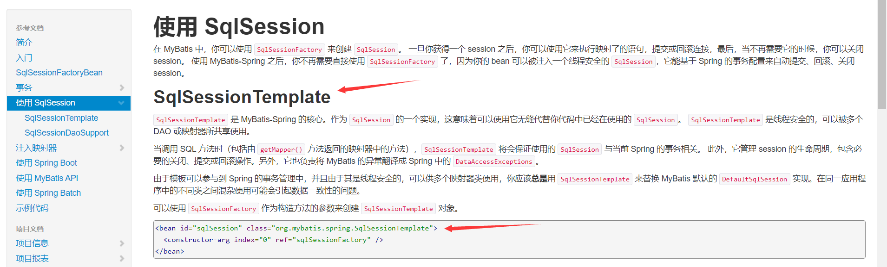
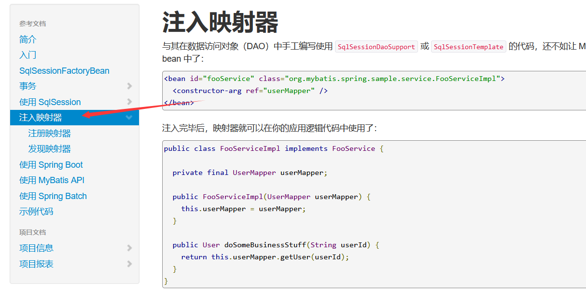
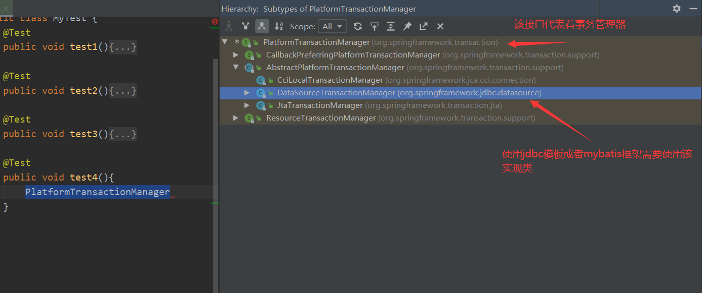
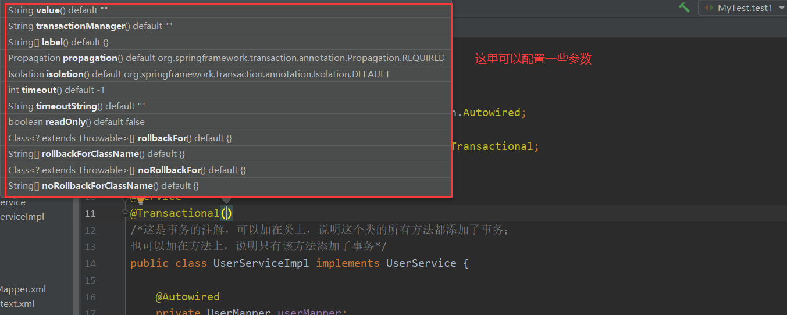
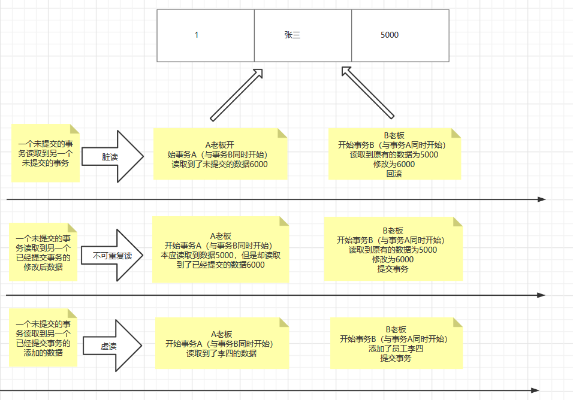
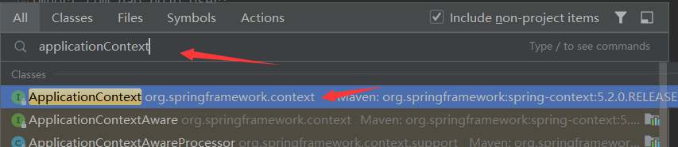
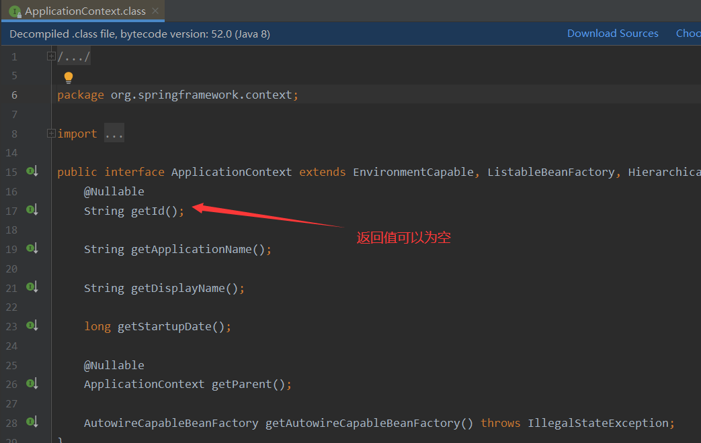
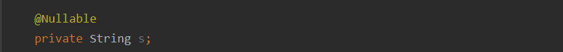
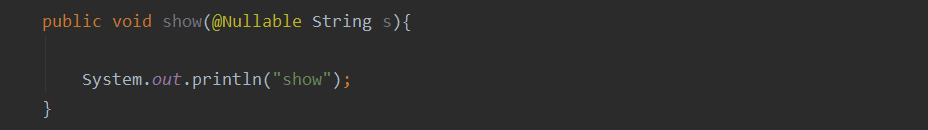

# Mybatis回顾

## 导入依赖

```xml
<dependencies>
    <dependency>
        <groupId>org.mybatis</groupId>
        <artifactId>mybatis</artifactId>
        <version>3.5.2</version>
    </dependency>
    <dependency>
        <groupId>mysql</groupId>
        <artifactId>mysql-connector-java</artifactId>
        <version>5.1.47</version>
    </dependency>
    <dependency>
        <groupId>junit</groupId>
        <artifactId>junit</artifactId>
        <version>4.12</version>
        <scope>test</scope>
    </dependency>
    <dependency>
        <groupId>org.projectlombok</groupId>
        <artifactId>lombok</artifactId>
        <version>1.18.12</version>
        <scope>provided</scope>
    </dependency>
    <dependency>
        <groupId>log4j</groupId>
        <artifactId>log4j</artifactId>
        <version>1.2.17</version>
    </dependency>
</dependencies>
<build>
    <!--解决maven静态资源过滤的问题-->
    <resources>
        <resource>
            <directory>src/main/java</directory>
            <includes>
                <include>**/*.properties</include>
                <include>**/*.xml</include>
            </includes>
            <filtering>false</filtering>
        </resource>
        <resource>
            <directory>src/main/resources</directory>
            <includes>
                <include>**/*.properties</include>
                <include>**/*.xml</include>
            </includes>
            <filtering>false</filtering>
        </resource>
    </resources>
    <plugins>
        <!-- 设置jdk的版本-->
        <plugin>
            <groupId>org.apache.maven.plugins</groupId>
            <artifactId>maven-compiler-plugin</artifactId>
            <configuration>
                <source>1.8</source>
                <target>1.8</target>
                <encoding>UTF-8</encoding>
            </configuration>
        </plugin>
    </plugins>
</build>
```

## 编写实体类

```java
package com.bao.pojo;

import lombok.AllArgsConstructor;
import lombok.Data;
import lombok.NoArgsConstructor;

@Data
@AllArgsConstructor
@NoArgsConstructor
public class User {
    private Integer id;
    private String name;
    private String pwd;

}
```

## 编写接口

```java
package com.bao.dao;

import com.bao.pojo.User;

import java.util.List;

public interface UserMapper {
    List<User> selectAllUser();
}
```

## 编写接口对应的xml文件

```xml
<?xml version="1.0" encoding="UTF-8" ?>
<!DOCTYPE mapper
        PUBLIC "-//mybatis.org//DTD Config 3.0//EN"
        "http://mybatis.org/dtd/mybatis-3-mapper.dtd">
<mapper namespace="com.bao.dao.UserMapper">

    <!--查询所有-->
    <select id="selectAllUser" resultType="user">
        select * from user
    </select>

</mapper>
```

## 编写mybatis-config.xml文件

```xml
<?xml version="1.0" encoding="UTF-8" ?>
<!DOCTYPE configuration
        PUBLIC "-//mybatis.org//DTD Config 3.0//EN"
        "http://mybatis.org/dtd/mybatis-3-config.dtd">
<configuration>

    <!--导入bataBase.properties-->
    <properties resource="dataBase.properties"/>
    <!--设置日志-->
    <settings>
        <setting name="logImpl" value="Log4j"/>
    </settings>
    <!--开启别名-->
    <typeAliases>
        <package name="com.bao.pojo"/>
    </typeAliases>
    <!--连接数据库-->
    <environments default="development">
        <environment id="development">
            <transactionManager type="JDBC"/>
            <dataSource type="POOLED">
                <property name="driver" value="${driver}"/>
                <property name="url" value="${url}"/>
                <property name="username" value="${username}"/>
                <property name="password" value="${password}"/>
            </dataSource>
        </environment>
    </environments>
    <mappers>
        <mapper resource="com/bao/dao/UserMapper.xml"/>
    </mappers>
</configuration>
```

## 编写database.properties文件

```properties
driver=com.mysql.jdbc.Driver
url=jdbc:mysql://localhost:3306/mybatis?useSSL=true&useUnicode=true&characterEncoding=utf8
username=root
password=root
```

## 编写log4j.properties文件

```properties
#将等级为DEBUG的日志信息输出到console和file这两个目的地，console和file的定义在下面的代码
log4j.rootLogger=DEBUG,console,file

#控制台输出的相关设置
#使用log4j作为日志实现
log4j.appender.console = org.apache.log4j.ConsoleAppender
log4j.appender.console.Target = System.out
log4j.appender.console.Threshold=DEBUG
log4j.appender.console.layout = org.apache.log4j.PatternLayout
#日志格式
log4j.appender.console.layout.ConversionPattern=[%c]-%m%n

#文件输出的相关设置
log4j.appender.file = org.apache.log4j.RollingFileAppender
#文件输出的位置
log4j.appender.file.File=./log/bao.log
#文件最大为10mb
log4j.appender.file.MaxFileSize=10mb
log4j.appender.file.Threshold=DEBUG
log4j.appender.file.layout=org.apache.log4j.PatternLayout
log4j.appender.file.layout.ConversionPattern=[%p][%d{yy-MM-dd}][%c]%m%n

#日志输出级别
log4j.logger.org.mybatis=DEBUG
log4j.logger.java.sql=DEBUG
log4j.logger.java.sql.Statement=DEBUG
log4j.logger.java.sql.ResultSet=DEBUG
log4j.logger.java.sql.PreparedStatement=DEBUG
```

##编写测试类

```java
package com.bao;

import com.bao.dao.UserMapper;
import com.bao.pojo.User;
import org.apache.ibatis.io.Resources;
import org.apache.ibatis.session.SqlSession;
import org.apache.ibatis.session.SqlSessionFactory;
import org.apache.ibatis.session.SqlSessionFactoryBuilder;
import org.junit.Test;
import java.io.IOException;
import java.io.InputStream;
import java.util.List;

public class MyTest {
    @Test
    public void test1() throws IOException {
        /*获取sqlSession*/
        InputStream resourceAsStream = Resources.getResourceAsStream("mybatis-config.xml");
        SqlSessionFactory sqlSessionFactory = new SqlSessionFactoryBuilder().build(resourceAsStream);
        /*设置自动提交事务*/
        SqlSession sqlSession = sqlSessionFactory.openSession(true);

        UserMapper mapper = sqlSession.getMapper(UserMapper.class);
        List<User> users = mapper.selectAllUser();
        for (User user : users) {
            System.out.println(user);
        }
    }
}
```

# Spring与Mybatis整合(一)

## 导入依赖

```xml
<dependencies>
    <dependency>
        <groupId>org.mybatis</groupId>
        <artifactId>mybatis</artifactId>
        <version>3.5.2</version>
    </dependency>
    <dependency>
        <groupId>mysql</groupId>
        <artifactId>mysql-connector-java</artifactId>
        <version>5.1.47</version>
    </dependency>
    <dependency>
        <groupId>junit</groupId>
        <artifactId>junit</artifactId>
        <version>4.12</version>
        <scope>test</scope>
    </dependency>
    <dependency>
        <groupId>org.projectlombok</groupId>
        <artifactId>lombok</artifactId>
        <version>1.18.12</version>
        <scope>provided</scope>
    </dependency>
    <dependency>
        <groupId>log4j</groupId>
        <artifactId>log4j</artifactId>
        <version>1.2.17</version>
    </dependency>
    
    <dependency>
        <groupId>org.springframework</groupId>
        <artifactId>spring-webmvc</artifactId>
        <version>5.2.0.RELEASE</version>
    </dependency>

    <!--mybatis和spring的整合jar包-->
    <dependency>
        <groupId>org.mybatis</groupId>
        <artifactId>mybatis-spring</artifactId>
        <version>2.0.6</version>
    </dependency>

    <!--导入aop核心包-->
    <dependency>
        <groupId>org.aspectj</groupId>
        <artifactId>aspectjweaver</artifactId>
        <version>1.9.4</version>
    </dependency>

    <!--spring连接数据库的包-->
    <dependency>
        <groupId>org.springframework</groupId>
        <artifactId>spring-jdbc</artifactId>
        <version>5.3.4</version>
    </dependency>
</dependencies>
<build>
    <!--解决maven静态资源过滤的问题-->
    <resources>
        <resource>
            <directory>src/main/java</directory>
            <includes>
                <include>**/*.properties</include>
                <include>**/*.xml</include>
            </includes>
            <filtering>false</filtering>
        </resource>
        <resource>
            <directory>src/main/resources</directory>
            <includes>
                <include>**/*.properties</include>
                <include>**/*.xml</include>
            </includes>
            <filtering>false</filtering>
        </resource>
    </resources>
    <plugins>
        <!-- 设置jdk的版本-->
        <plugin>
            <groupId>org.apache.maven.plugins</groupId>
            <artifactId>maven-compiler-plugin</artifactId>
            <configuration>
                <source>1.8</source>
                <target>1.8</target>
                <encoding>UTF-8</encoding>
            </configuration>
        </plugin>
    </plugins>
</build>
```

##实体类

```java
package com.bao.pojo;

import lombok.AllArgsConstructor;
import lombok.Data;
import lombok.NoArgsConstructor;

@Data
@AllArgsConstructor
@NoArgsConstructor
public class User {
    private Integer id;
    private String name;
    private String pwd;

}

```

##接口

```java
package com.bao.dao;

import com.bao.pojo.User;
import org.mybatis.spring.SqlSessionTemplate;
import java.util.List;

public interface UserMapper {
    
    List<User> selectAllUser();
}

```

##映射文件

```xml
<?xml version="1.0" encoding="UTF-8" ?>
<!DOCTYPE mapper
        PUBLIC "-//mybatis.org//DTD Config 3.0//EN"
        "http://mybatis.org/dtd/mybatis-3-mapper.dtd">
<mapper namespace="com.bao.dao.UserMapper">

    <!--查询所有-->
    <select id="selectAllUser" resultType="user">
        select * from user
    </select>

</mapper>
```

##编写mybatis-config.xml

```xml
<?xml version="1.0" encoding="UTF-8" ?>
<!DOCTYPE configuration
        PUBLIC "-//mybatis.org//DTD Config 3.0//EN"
        "http://mybatis.org/dtd/mybatis-3-config.dtd">
<configuration>

    <!--设置日志-->
    <settings>
        <setting name="logImpl" value="Log4j"/>
    </settings>
    <!--开启别名-->
    <typeAliases>
        <package name="com.bao.pojo"/>
    </typeAliases>
    <!--绑定映射文件-->
    <mappers>
        <mapper resource="com/bao/dao/UserMapper.xml"/>
    </mappers>
    
   
</configuration>
```

##编写spring-dao.xml

```xml
<?xml version="1.0" encoding="UTF-8"?>
<beans xmlns="http://www.springframework.org/schema/beans"
       xmlns:xsi="http://www.w3.org/2001/XMLSchema-instance"
       xmlns:context="http://www.springframework.org/schema/context"
       xsi:schemaLocation="http://www.springframework.org/schema/beans
       http://www.springframework.org/schema/beans/spring-beans.xsd 
       http://www.springframework.org/schema/context 
       https://www.springframework.org/schema/context/spring-context.xsd">

    <!--DataSource-->
    <!--id:配置名称
        class：确定要使用哪个数据源,我们这里使用Spring提供的jdbc，需要导入spring-jdbc的jar包
                常用数据源有：c3p0 druid dbcp Spring提供的jdbc-->
    <bean id="dataSource" class="org.springframework.jdbc.datasource.DriverManagerDataSource">
        <property name="driverClassName" value="com.mysql.jdbc.Driver"/>
        <property name="url" value="jdbc:mysql://localhost:3306/mybatis?useSSL=true&amp;useUnicode=true&amp;characterEncoding=utf8"/>
        <property name="username" value="root"/>
        <property name="password" value="root"/>
    </bean>

    <!--SqlSessionFactory-->
    <bean id="sqlSessionFactory" class="org.mybatis.spring.SqlSessionFactoryBean">
        <property name="dataSource" ref="dataSource" />
        <!--绑定mybatis-config.xml文件-->
        <property name="configLocation" value="classpath:mybatis-config.xml"/>
    </bean>
   

    <!--注册sqlSessionTemplate , 关联sqlSessionFactory，其实这就是我们使用的sqlSession-->
    <bean id="sqlSession" class="org.mybatis.spring.SqlSessionTemplate">
        <!--只能利用构造器注入，因为没有set方法-->
        <constructor-arg index="0" ref="sqlSessionFactory" />
    </bean>

    <bean id="userMapperImpl" class="com.bao.dao.UserMapperImpl">
        <property name="sqlSession" ref="sqlSession"/>
    </bean>

</beans>
```

## SqlSessionTemplate



##编写applicationContext.xml

```xml
<?xml version="1.0" encoding="UTF-8"?>
<beans xmlns="http://www.springframework.org/schema/beans"
       xmlns:xsi="http://www.w3.org/2001/XMLSchema-instance"
       xsi:schemaLocation="http://www.springframework.org/schema/beans 
       http://www.springframework.org/schema/beans/spring-beans.xsd">
    
    <import resource="spring-dao.xml"/>

</beans>
```

##编写UserMapperImpl

```java
package com.bao.dao;

import com.bao.pojo.User;
import org.mybatis.spring.SqlSessionTemplate;
import org.springframework.beans.factory.annotation.Autowired;
import org.springframework.stereotype.Component;
import java.util.List;

public class UserMapperImpl implements UserMapper {

    //sqlSession不用我们自己创建了，Spring来管理
    //在原来我们所有的操作都使用sqlSession来执行,现在都使用SqlSessionTemplate
    private SqlSessionTemplate sqlSession;

    public void setSqlSession(SqlSessionTemplate sqlSession) {
        this.sqlSession = sqlSession;
    }

    @Override
    public List<User> selectAllUser() {
        UserMapper mapper = sqlSession.getMapper(UserMapper.class);
        return mapper.selectAllUser();
    }
}

```

##编写测试类

```java
package com.bao;

import com.bao.dao.UserMapper;
import com.bao.pojo.User;
import org.apache.ibatis.io.Resources;
import org.apache.ibatis.session.SqlSession;
import org.apache.ibatis.session.SqlSessionFactory;
import org.apache.ibatis.session.SqlSessionFactoryBuilder;
import org.junit.Test;
import org.mybatis.spring.SqlSessionTemplate;
import org.springframework.context.support.ClassPathXmlApplicationContext;
import java.io.IOException;
import java.io.InputStream;
import java.util.List;

public class MyTest {

    @Test
    public void test2(){
        ClassPathXmlApplicationContext context = new ClassPathXmlApplicationContext("applicationContext.xml");
        UserMapper userMapper = context.getBean("userMapperImpl", UserMapper.class);
        List<User> users = userMapper.selectAllUser();
        for (User user : users) {
            System.out.println(user);
        }
    }

}

```

# Spring与Mybatis整合(二)



##修改spring-dao.xml

```xml
<?xml version="1.0" encoding="UTF-8"?>
<beans xmlns="http://www.springframework.org/schema/beans"
       xmlns:xsi="http://www.w3.org/2001/XMLSchema-instance"
       xmlns:context="http://www.springframework.org/schema/context"
       xsi:schemaLocation="http://www.springframework.org/schema/beans
       http://www.springframework.org/schema/beans/spring-beans.xsd http://www.springframework.org/schema/context https://www.springframework.org/schema/context/spring-context.xsd">

    <!--DataSource-->
    <!--id:配置名称
        class：确定要使用哪个数据源,我们这里使用Spring提供的jdbc，需要导入spring-jdbc的jar包
                常用数据源有：c3p0 druid dbcp Spring提供的jdbc-->
    <bean id="dataSource" class="org.springframework.jdbc.datasource.DriverManagerDataSource">
        <property name="driverClassName" value="com.mysql.jdbc.Driver"/>
        <property name="url" value="jdbc:mysql://localhost:3306/mybatis?useSSL=true&amp;useUnicode=true&amp;characterEncoding=utf8"/>
        <property name="username" value="root"/>
        <property name="password" value="root"/>
    </bean>

    <!--SqlSessionFactory-->
    <bean id="sqlSessionFactory" class="org.mybatis.spring.SqlSessionFactoryBean">
        <property name="dataSource" ref="dataSource" />
        <!--绑定mybatis-config.xml文件-->
        <property name="configLocation" value="classpath:mybatis-config.xml"/>
    </bean>

    <!--方式二：-->
    <!--配置(MapperScannerConfigurer)的bean，可以将创建的所有映射器都自动注入到sqlSessionFactory实例中 -->
    <bean class="org.mybatis.spring.mapper.MapperScannerConfigurer">
        <!-- 注入sqlSessionFactory，需要指定sqlSessionFactory -->
        <property name="sqlSessionFactoryBeanName" value="sqlSessionFactory"/>
        <!-- 给出需要扫描的Dao接口包 -->
        <property name="basePackage" value="com.bao.dao"/>
    </bean>

</beans>
```


##编写测试类

```java
package com.bao;

import com.bao.dao.UserMapper;
import com.bao.pojo.User;
import org.apache.ibatis.io.Resources;
import org.apache.ibatis.session.SqlSession;
import org.apache.ibatis.session.SqlSessionFactory;
import org.apache.ibatis.session.SqlSessionFactoryBuilder;
import org.junit.Test;
import org.mybatis.spring.SqlSessionTemplate;
import org.springframework.context.support.ClassPathXmlApplicationContext;
import java.io.IOException;
import java.io.InputStream;
import java.util.List;

public class MyTest {

    @Test
    public void test3(){
        ClassPathXmlApplicationContext context = new ClassPathXmlApplicationContext("applicationContext.xml");
        UserMapper userMapper = context.getBean("userMapper", UserMapper.class);
        
        List<User> users = userMapper.selectAllUser();
        for (User user : users) {
            System.out.println(user);
        }
    }

}

```


# 事务

##事务理解

> 事务就是将多个业务组合操作，要么全部成功，要么全部失败，比如银行转账
>
> 事务的底层使用了AOP原理

##ACID原则

###原子性（atomicity)

> 一个事务要么全部提交成功，要么全部失败回滚，不能只执行其中的一部分操作

###一致性（consistency)

> 事务的执行不能破坏数据库数据的完整性和一致性，一个事务在执行之前和执行之后，数据库都必须处于一致性状态。如果数据库系统在运行过程中发生故障，有些事务尚未完成就被迫中断，这些未完成的事务对数据库所作的修改有一部分已写入物理数据库，这时数据库就处于一种不正确的状态，也就是不一致的状态
>
> 换句话说就是银行转账的时候数据的总量是不变的

###隔离性（isolation）

> 事务的隔离性是指在并发环境中，并发时的事务是相互隔离的。一个事务的执行不能被其他事务干扰。不同的事务并发操作相同的数据时，每个事务都有各自完成的数据空间，即一个事务内部的操作及使用的数据对其他并发事务是隔离的，并发执行的各个事务之间不能相互干扰。在标准SQL规范中，定义了4个事务隔离级别，不同的隔离级别对事务的处理不同，分别是：未授权读取，授权读取，可重复读取和串行化

###持久性（durability）

> 一旦事务提交，那么它对数据库中的对应数据的状态的变更就会永久保存到数据库中。--即使发生系统崩溃或机器宕机等故障，只要数据库能够重新启动，那么一定能够将其恢复到事务成功结束的状态

## 事务分类

> 声明式事务：开发中较常用

> 编程式事务：需要构建相当多的代码，不常用

## 声明式事务(注解方式)

### 事务管理器

> spring提供了一个接口PlatformTransactionManager，代表了事务管理器，这个接口针对不同的框架提供了不同的实现类
>



### 提供数据

```sql
CREATE TABLE `user2`  (
  `id` int(11) NOT NULL AUTO_INCREMENT,
  `name` varchar(255) CHARACTER SET utf8 COLLATE utf8_general_ci NULL DEFAULT NULL,
  `money` int(11) NULL DEFAULT NULL,
  PRIMARY KEY (`id`) USING BTREE
)

INSERT INTO `user2` VALUES (1, '张三', 1000);
INSERT INTO `user2` VALUES (2, '李四', 1000);
```

### 依赖

```xml
<dependencies>
    <dependency>
        <groupId>org.mybatis</groupId>
        <artifactId>mybatis</artifactId>
        <version>3.5.2</version>
    </dependency>
    <dependency>
        <groupId>mysql</groupId>
        <artifactId>mysql-connector-java</artifactId>
        <version>5.1.47</version>
    </dependency>
    <dependency>
        <groupId>junit</groupId>
        <artifactId>junit</artifactId>
        <version>4.12</version>
        <scope>test</scope>
    </dependency>
    <dependency>
        <groupId>org.projectlombok</groupId>
        <artifactId>lombok</artifactId>
        <version>1.18.12</version>
        <scope>provided</scope>
    </dependency>
    <dependency>
        <groupId>log4j</groupId>
        <artifactId>log4j</artifactId>
        <version>1.2.17</version>
    </dependency>

    <!--mybatis和spring的整合jar包-->
    <dependency>
        <groupId>org.mybatis</groupId>
        <artifactId>mybatis-spring</artifactId>
        <version>2.0.6</version>
    </dependency>
    <dependency>
        <groupId>org.springframework</groupId>
        <artifactId>spring-webmvc</artifactId>
        <version>5.2.0.RELEASE</version>
    </dependency>
    <!--导入aop核心包-->
    <dependency>
        <groupId>org.aspectj</groupId>
        <artifactId>aspectjweaver</artifactId>
        <version>1.9.4</version>
    </dependency>
    <!--spring连接数据库的包-->
    <dependency>
        <groupId>org.springframework</groupId>
        <artifactId>spring-jdbc</artifactId>
        <version>5.3.4</version>
    </dependency>
</dependencies>
<build>
    <!--解决maven静态资源过滤的问题-->
    <resources>
        <resource>
            <directory>src/main/java</directory>
            <includes>
                <include>**/*.properties</include>
                <include>**/*.xml</include>
            </includes>
            <filtering>false</filtering>
        </resource>
        <resource>
            <directory>src/main/resources</directory>
            <includes>
                <include>**/*.properties</include>
                <include>**/*.xml</include>
            </includes>
            <filtering>false</filtering>
        </resource>
    </resources>
    <plugins>
        <!-- 设置jdk的版本-->
        <plugin>
            <groupId>org.apache.maven.plugins</groupId>
            <artifactId>maven-compiler-plugin</artifactId>
            <configuration>
                <source>1.8</source>
                <target>1.8</target>
                <encoding>UTF-8</encoding>
            </configuration>
        </plugin>
    </plugins>
</build>
```

### log4j.properties

```properties
#将等级为DEBUG的日志信息输出到console和file这两个目的地，console和file的定义在下面的代码
log4j.rootLogger=DEBUG,console,file

#控制台输出的相关设置
#使用log4j作为日志实现
log4j.appender.console = org.apache.log4j.ConsoleAppender
log4j.appender.console.Target = System.out
log4j.appender.console.Threshold=DEBUG
log4j.appender.console.layout = org.apache.log4j.PatternLayout
#日志格式
log4j.appender.console.layout.ConversionPattern=[%c]-%m%n

#文件输出的相关设置
log4j.appender.file = org.apache.log4j.RollingFileAppender
#文件输出的位置
log4j.appender.file.File=./log/bao.log
#文件最大为10mb
log4j.appender.file.MaxFileSize=10mb
log4j.appender.file.Threshold=DEBUG
log4j.appender.file.layout=org.apache.log4j.PatternLayout
log4j.appender.file.layout.ConversionPattern=[%p][%d{yy-MM-dd}][%c]%m%n

#日志输出级别
log4j.logger.org.mybatis=DEBUG
log4j.logger.java.sql=DEBUG
log4j.logger.java.sql.Statement=DEBUG
log4j.logger.java.sql.ResultSet=DEBUG
log4j.logger.java.sql.PreparedStatement=DEBUG
```

### User

```java
package com.bao.pojo;

import lombok.AllArgsConstructor;
import lombok.Data;
import lombok.NoArgsConstructor;
import org.springframework.stereotype.Component;

@Data
@AllArgsConstructor
@NoArgsConstructor
@Component
public class User {
    private Integer id;
    private String name;
    private Integer money;

}

```

### UserMapper

```java
package com.bao.dao;

import com.bao.pojo.User;
import org.apache.ibatis.annotations.Param;
import java.util.List;

public interface UserMapper {

    int addMoney(@Param("id") int id,@Param("money") int money);
    
    int deleteMoney(@Param("id") int id,@Param("money") int money);

}

```

###UserMapper.xml

```xml
<?xml version="1.0" encoding="UTF-8" ?>
<!DOCTYPE mapper
        PUBLIC "-//mybatis.org//DTD Config 3.0//EN"
        "http://mybatis.org/dtd/mybatis-3-mapper.dtd">
<mapper namespace="com.bao.dao.UserMapper">

    <update id="addMoney" parameterType="int">
        update user2 set money = money+#{money} where id = #{id}
    </update>

    <update id="deleteMoney" parameterType="int">
        update user set money = money-#{money} where id = #{id}
    </update>

</mapper>
```

### UserService

```java
package com.bao.service;

import com.bao.pojo.User;
import org.apache.ibatis.annotations.Param;
import java.util.List;

public interface UserService {

    void turnMoney();
}
```

### UserServiceImpl

```java
package com.bao.service;

import com.bao.dao.UserMapper;
import com.bao.pojo.User;
import org.springframework.beans.factory.annotation.Autowired;
import org.springframework.stereotype.Service;
import org.springframework.transaction.annotation.Transactional;
import java.util.List;

@Service
@Transactional
/*这是事务的注解，可以加在类上，说明这个类的所有方法都被事务管理；
也可以加在方法上，说明只有该方法被事务管理*/
public class UserServiceImpl implements UserService {

    @Autowired
    private UserMapper userMapper;

    @Override
    public void turnMoney() {
        //张三少100
        userMapper.deleteMoney(1,200);
        
//        int a = 1/0;
        
        //李四多100
        userMapper.addMoney(2,200);
    }
}
```

###applicationContext.xml

```xml
<?xml version="1.0" encoding="UTF-8"?>
<beans xmlns="http://www.springframework.org/schema/beans"
       xmlns:xsi="http://www.w3.org/2001/XMLSchema-instance"
       xmlns:context="http://www.springframework.org/schema/context"
       xsi:schemaLocation="http://www.springframework.org/schema/beans
       http://www.springframework.org/schema/beans/spring-beans.xsd
       http://www.springframework.org/schema/context
       https://www.springframework.org/schema/context/spring-context.xsd">
    
    <import resource="spring-dao.xml"/>

    <context:component-scan base-package="com.bao"/>

</beans>
```

###mybatis-config.xml

```xml
<?xml version="1.0" encoding="UTF-8" ?>
<!DOCTYPE configuration
        PUBLIC "-//mybatis.org//DTD Config 3.0//EN"
        "http://mybatis.org/dtd/mybatis-3-config.dtd">
<configuration>

    <!--设置日志-->
    <settings>
        <setting name="logImpl" value="Log4j"/>
    </settings>
    <!--开启别名-->
    <typeAliases>
        <package name="com.bao.pojo"/>
    </typeAliases>
    <!--绑定映射文件-->
    <mappers>
        <mapper resource="com/bao/dao/UserMapper.xml"/>
    </mappers>

</configuration>
```

###spring-mybatis.xml

```xml
<?xml version="1.0" encoding="UTF-8"?>
<beans xmlns="http://www.springframework.org/schema/beans"
       xmlns:xsi="http://www.w3.org/2001/XMLSchema-instance"
       xmlns:tx="http://www.springframework.org/schema/tx"
       xsi:schemaLocation="http://www.springframework.org/schema/beans
       http://www.springframework.org/schema/beans/spring-beans.xsd
       http://www.springframework.org/schema/tx
       http://www.springframework.org/schema/tx/spring-tx.xsd">

    <!--配置数据源-->
    <bean id="dataSource" class="org.springframework.jdbc.datasource.DriverManagerDataSource">
        <property name="driverClassName" value="com.mysql.jdbc.Driver"/>
        <property name="url" value="jdbc:mysql://localhost:3306/ssm?useSSL=true&amp;useUnicode=true&amp;characterEncoding=utf8"/>
        <property name="username" value="root"/>
        <property name="password" value="root"/>
    </bean>

    <!--SqlSessionFactory-->
    <bean id="sqlSessionFactory" class="org.mybatis.spring.SqlSessionFactoryBean">
        <property name="dataSource" ref="dataSource" />
        <!--绑定mybatis-config.xml文件-->
        <property name="configLocation" value="classpath:mybatis-config.xml"/>
    </bean>

    <!--配置(MapperScannerConfigurer)的bean，可以将创建的所有映射器都自动注入到sqlSessionFactory实例中 -->
    <bean class="org.mybatis.spring.mapper.MapperScannerConfigurer">
        <!-- 注入sqlSessionFactory，需要指定sqlSessionFactory -->
        <property name="sqlSessionFactoryBeanName" value="sqlSessionFactory"/>
        <!-- 给出需要扫描的Dao接口包 -->
        <property name="basePackage" value="com.bao.dao"/>
    </bean>

    <!--事务管理-->
    <!--1.创建事务管理器-->
    <bean id="transactionManager" class="org.springframework.jdbc.datasource.DataSourceTransactionManager">
        <!--配置数据源-->
        <constructor-arg ref="dataSource" />
    </bean>
    <!--2.开启事务注解，需要导入tx命名空间-->
    <!--transaction-manager="transactionManager" : 绑定事务管理器-->
    <tx:annotation-driven transaction-manager="transactionManager"/>
</beans>
```

### 测试类

```java
@Test
public void test1(){
    ClassPathXmlApplicationContext context = new ClassPathXmlApplicationContext("applicationContext.xml");
    UserService userServiceImpl = context.getBean("userServiceImpl", UserService.class);
    userServiceImpl.turnMoney();

}
```

## 事务的操作



### propagation：事务的传播行为

> 概念：多事务方法之间进行调用，这个过程中事务是如何进行管理的
>
> 事务方法：对数据库的数据进行变化的方法，就好比增删改方法

```java
@Transactional//add方法有事务
public void add(){
    //调用update方法
    update();
}

//update没事务
public void update(){

}
```

Spring框架事务传播行为有7种，重点了解REQUIRED和REQUIRED_NEW

- REQUIRED：如果add方法本身有事务，调用update方法之后，update使用当前add方法的事务；

  ​					  如果add方法本身没有事务，调用update方法之后，创建新事务

  ​					（REQUIRED也是默认的传播行为）

```java
@Transactional(propagation = Propagation.REQUIRED)
```

- REQUIRED_NEW：使用add方法调用update方法，add方法无论是否有事务，都创建新的事务

```java
@Transactional(propagation = Propagation.REQUIRES_NEW)
```


### isolation：事务的隔离级别

> 事务具有隔离性，多事务之间不会产生影响，事务之间一旦产生影响会出现3大问题：脏读、不可重复读、虚读（幻读）



通过设置事务的隔离级别来解决读的问题


```java
@Transactional(propagation = Propagation.REQUIRES_NEW,isolation = Isolation.REPEATABLE_READ)
//多个参数用逗号隔开
//可重复读是mysql的默认隔离级别
```

###timeout：超时时间

> 事务需要在一定时间内进行提交，如果未提交则进行回滚
>
> 以秒为单位
>
> 默认值为-1：表示没有超时时间

```java
@Transactional(timeout = 10)
```

###readOnly：是否只读

> 读：指的是查询的操作	写：指的是增删改操作
>
> readOnly默认值是false，表示可以增删改查
>
> 设置值为true，表示只可以查，不可以增删改

```java
@Transactional(readOnly = true)
```

###rollbackfor：回滚

> 设置出现哪些异常需要回滚

```java
@Transactional(rollbackFor = NullPointerException.class)
```

###noRollbackFor：不回滚

> 设置出现哪些异常不需要回滚

```
@Transactional(noRollbackFor = NullPointerException.class)
```


##声明式事务(xml方式)

### 注释@Transactional注解

### 修改spring-mybatis.xml

```xml
<?xml version="1.0" encoding="UTF-8"?>
<beans xmlns="http://www.springframework.org/schema/beans"
       xmlns:xsi="http://www.w3.org/2001/XMLSchema-instance"
       xmlns:context="http://www.springframework.org/schema/context"
       xmlns:aop="http://www.springframework.org/schema/aop"
       xmlns:tx="http://www.springframework.org/schema/tx"
       xsi:schemaLocation="http://www.springframework.org/schema/beans
       http://www.springframework.org/schema/beans/spring-beans.xsd
       http://www.springframework.org/schema/context
       https://www.springframework.org/schema/context/spring-context.xsd
       http://www.springframework.org/schema/aop
       https://www.springframework.org/schema/aop/spring-aop.xsd
       http://www.springframework.org/schema/tx
       http://www.springframework.org/schema/tx/spring-tx.xsd">

    <!--配置数据源-->
    <bean id="dataSource" class="org.springframework.jdbc.datasource.DriverManagerDataSource">
        <property name="driverClassName" value="com.mysql.jdbc.Driver"/>
        <property name="url" value="jdbc:mysql://localhost:3306/ssm?useSSL=true&amp;useUnicode=true&amp;characterEncoding=utf8"/>
        <property name="username" value="root"/>
        <property name="password" value="root"/>
    </bean>

    <!--SqlSessionFactory-->
    <bean id="sqlSessionFactory" class="org.mybatis.spring.SqlSessionFactoryBean">
        <property name="dataSource" ref="dataSource" />
        <!--绑定mybatis-config.xml文件-->
        <property name="configLocation" value="classpath:mybatis-config.xml"/>
    </bean>

     <!--配置(MapperScannerConfigurer)的bean，可以将创建的所有映射器都自动注入到sqlSessionFactory实例中 -->
    <bean class="org.mybatis.spring.mapper.MapperScannerConfigurer">
        <!-- 注入sqlSessionFactory，需要指定sqlSessionFactory -->
        <property name="sqlSessionFactoryBeanName" value="sqlSessionFactory"/>
        <!-- 给出需要扫描的Dao接口包 -->
        <property name="basePackage" value="com.bao.dao"/>
    </bean>

    <!--1.创建事务管理器-->
    <bean id="transactionManager" class="org.springframework.jdbc.datasource.DataSourceTransactionManager">
        <!--注入数据源-->
        <constructor-arg ref="dataSource" />
    </bean>

    <!--2.配置通知-->
    <tx:advice id="txAdvice">
        <!--配置事务的参数-->
        <tx:attributes>
            <!--指定哪种方法上面添加事务，name需要指定方法名-->
            <!--<tx:method name="turnMoney" propagation="REQUIRED"/>-->
            <tx:method name="*" propagation="REQUIRED"/><!--所有方法都添加事务-->
        </tx:attributes>
    </tx:advice>

    <!--3.配置切入点和切面-->
    <aop:config>
        <!--配置切入点，id可以随意起名-->
        <aop:pointcut id="pointcut" expression="execution(* com.bao.service.UserServiceImpl.*(..))"/>
        <!--配置切面，需要写明通知和切入点-->
        <aop:advisor advice-ref="txAdvice" pointcut-ref="pointcut"/>
    </aop:config>

```


# Spring5 框架新功能：@Nullable 注解（了解）

> 整个 Spring5 框架的代码基于 Java8，运行时兼容 JDK9，许多不建议使用的类和方 法在代码库中删除

> @Nullable 注解可以使用在方法上面，属性上面，参数上面，表示方法返回可以为空，属性值可以 为空，参数值可以为空 

在applicationContext源码中查看



## 用在方法上

> 注解用在方法上面，方法返回值可以为空




## 用在属性上

> 注解使用在属性上面，属性值可以为空




## 用在参数上

> 注解使用在方法参数里面，方法参数可以为空



> 该注解的使用场景多用在前后端的交互上，因为有时候并不能确定用户是否会传递某些参数


# Spring5 框架新功能：支持函数式风格 GenericApplicationContext

> spring框架可以帮助我们管理bean对象，但是当我们自己new了一个对象时是无法再次添加到容器中的，函数式风格可以做到

> refresh():清空容器内容

```java
@Test
public void testGenericApplicationContext() {
    //1 创建 GenericApplicationContext 对象
    GenericApplicationContext context = new GenericApplicationContext();
    //2 调用 context 的方法对象注册
    context.refresh();//清空容器中的内容
    context.registerBean("user",User.class,() -> new User());
    //        context.registerBean(User.class,() -> new User());
    //3 获取在 spring 注册的对象
    //        User user = (User)context.getBean("com.bao.pojo.User");
    User user = (User)context.getBean("user");
    System.out.println(user);
}
```