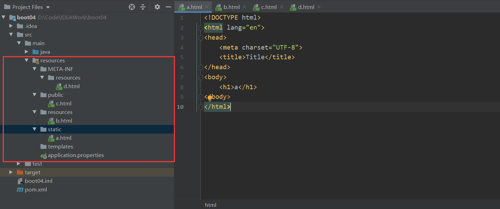
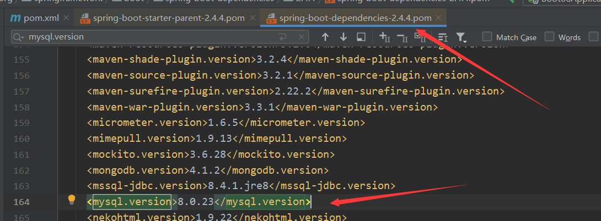
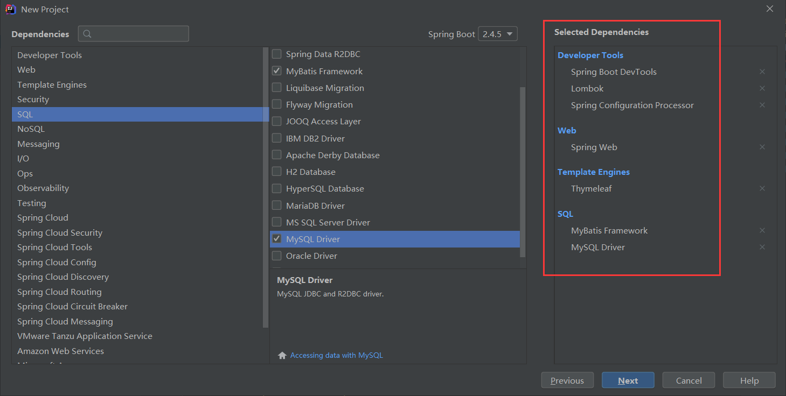

# 简单功能分析

## 静态资源访问

### 静态资源目录

#### 访问

> 只要静态资源放在这些路径下就可以直接访问： static 、public、resources、META-INF/resources
>
> 访问 ： 当前项目根路径/ + 静态资源名 




####原理

> 请求进来后，会先去找Controller，判断是否能够处理。
>
> Controller不能处理的所有请求才会交给静态资源处理器。
>
> 如果静态资源也找不到则响应404页面

#### 测试

- controller

```java
package com.bao.controller;

import org.springframework.stereotype.Controller;
import org.springframework.web.bind.annotation.RequestMapping;
import org.springframework.web.bind.annotation.ResponseBody;

@Controller
public class DemoController1 {

    @ResponseBody
    @RequestMapping("/a.html")
    public String show1(){
        return "A";
    }
}
```

- 结果


### 修改静态资源访问前缀

```yaml
spring:
  mvc:
    #静态资源访问默认无前缀
    #static-path-pattern: /**

    #修改静态资源访问路径，加了一个前缀;目录结构不需要修改，只要在url访问时修改即可
    #当前项目 + /res + 静态资源名
    static-path-pattern: /res/**
```

### 修改静态资源访问路径

```yaml
spring:
  mvc:
    #静态资源访问默认无前缀
    #static-path-pattern: /**

    #修改静态资源访问路径，加了一个前缀;目录结构不需要修改，只要在url访问时修改即可
    #当前项目 + /res + 静态资源名
    static-path-pattern: /res/**

  #框架已经定义好了静态资源的位置，不过我们可以修改静态资源默认位置
  #只有在hehe路径下的静态资源才可以生效
  resources:
    static-locations: [classpath:/hehe/]
```

#### 创建hehe文件夹


####不在hehe文件夹下的资源都不能访问


#### 访问成功


 

## 默认支持欢迎页

当静态资源路径下有index.html页面时可以被默认访问

> 注意：前提不能配置静态资源的访问前缀


## 自定义 Favicon

favicon.ico 放在静态资源目录下即可。

> 注意：前提不能配置静态资源的访问前缀


# 请求参数处理

## restful风格请求映射

> springBoot也支持restFul风格
>
> 但是需要手动开启

### 定义controller

```java
package com.bao.controller;

import org.springframework.stereotype.Controller;
import org.springframework.web.bind.annotation.*;

@RestController
public class DemoController1 {

    @RequestMapping("/a.html")
    public String show1(){
        return "A";
    }

    @GetMapping("/hello")
    public String showGet(){
        return "get";
    }

    @PostMapping("/hello")
    public String showPost(){
        return "post";
    }

    @PutMapping("/hello")
    public String showPut(){
        return "put";
    }

    @DeleteMapping("/hello")
    public String showDelete(){
        return "delete";
    }
}
```

### application.yaml

```yaml
spring:
  mvc:
    hiddenmethod:
      filter:
        #手动开启Restful风格
        enabled: true
```

###index.html

>     当我们使用form默认不支持的提交方式时，需要写这样一个标签
>
>     ```html
>     <input name="_method" type="hidden" value="DELETE">
>     ```
>
>     一般会将该标签设为隐藏
>     name是固定的
>     value需要写提交方式

```html
<!DOCTYPE html>
<html lang="en">
<head>
    <meta charset="UTF-8">
    <title>Title</title>
</head>
<body>
    <h1>hello，帅哥</h1>

    <form action="/hello" method="get">
        <input type="submit" value="get提交">
    </form>

    <form action="/hello" method="post">
        <input type="submit" value="post提交">
    </form>

    <!--当使用其他的提交方式时，提交方式必须是post提交-->
    <form action="/hello" method="post">
        <!--
            当我们使用form默认不支持的提交方式时，需要写这样一个标签
            <input name="_method" type="hidden" value="DELETE">
            一般会将该标签设为隐藏
            name是固定的
            value需要写提交方式
        -->
        <input name="_method" type="hidden" value="DELETE">
        <input type="submit" value="delete提交">
    </form>

    <form action="/hello" method="post">
        <input name="_method" type="hidden" value="put">
        <input type="submit" value="put提交">
    </form>
</body>
</html>
```


## 注解

> @PathVariable、@RequestHeader、@RequestParam、@RequestBody

###ParameterController

```java
package com.bao.controller;

import org.springframework.web.bind.annotation.*;

import java.util.HashMap;
import java.util.Map;

@RestController
public class ParameterController {

   /*
    * @PathVariable：获取路径变量的注解
    * restFul风格传递参数
    * */
    @RequestMapping("/parameter1/{id}/{username}")
    public Map<String, Object> parameter1(@PathVariable("id")Integer id, @PathVariable("username")String username){
        Map<String,Object> map = new HashMap<String,Object>();
        map.put("id",id);
        map.put("username",username);
        System.out.println(map);
        return map;
    }

   /*
    * restFul风格传递参数时，可以用一个map集合接收所有参数
    * 注意：参数前还是需要写@PathVariable注解
    * */
    @RequestMapping("/parameter2/{id}/{username}")
    public Map<String, Object> parameter2(@PathVariable Map<String,Object> map){
        System.out.println(map);
        return map;
    }

    /*
     * @RequestHeader 获取请求头的注解
     * 当注解加了值的时候是获取某个请求头
     * 如果注解不加值，用一个map集合则获取的是所有的请求头
     * */
    @RequestMapping("/parameter3")
    public Map<String, Object> parameter3(@RequestHeader("host") String host,
                                          @RequestHeader Map<String,Object> map){
        System.out.println(host);
        System.out.println("----------------------------------------------------");
        System.out.println(map);
        return map;
    }

    /*
     * RequestParam 获取请求参数的注解
     * 当注解加了值的时候是获取某个请求参数
     * 如果注解不加值，用一个map集合则获取的是所有的请求参数
     * 注意：也可以在有多个路径变量的url路径中获取某个参数
     * */
    @RequestMapping("/parameter4/{id}/{username}")
    public Map<String, Object> parameter4(@PathVariable("id") Integer id,
                                          @PathVariable("username") String username,
                                          @RequestParam("age") Integer age,
                                          @RequestParam Map<String,Object> map){
        System.out.println(age);
        System.out.println("----------------------------------------------------");
        System.out.println(map);
        return map;
    }

    /*
     * @RequestBody：获取请求体的内容
     * 注意：只有post请求才有请求体
     * */
    @RequestMapping("/parameter5")
    public String parameter5(@RequestBody String reqBody){
        System.out.println(reqBody);
        return reqBody;
    }

}
```

### index.html

```html
<!DOCTYPE html>
<html lang="en">
<head>
    <meta charset="UTF-8">
    <title>首页</title>
</head>
<body>
    <a href="/parameter1/1/张三">/parameter1/1/张三</a>
    <hr/>
    <a href="/parameter2/2/李四">/parameter2/2/李四</a>
    <hr/>
    <a href="/parameter3">/parameter3</a>
    <hr/>
    <a href="/parameter4/1/王五?age=18&gender=男">/parameter4/1/王五?age=18&gender=男</a>
    <hr/>
    <a href="/parameter4/1/王五?age=18&gender=男">/parameter4/1/王五?age=18&gender=男</a>
    <hr/>
    <form action="/parameter5" method="post">
        <input type="text" name="username">
        <input type="text" name="age">
        <input type="submit" value="提交">
    </form>
</body>
</html>
```

### RequestAttributeController

> @RequestAttribute
>
> 该注解可以将request中的值直接赋值给方法中的参数

```java
package com.bao.controller;

import org.springframework.http.HttpRequest;
import org.springframework.stereotype.Controller;
import org.springframework.web.bind.annotation.RequestAttribute;
import org.springframework.web.bind.annotation.RequestMapping;
import org.springframework.web.bind.annotation.ResponseBody;
import javax.servlet.http.HttpServletRequest;
import java.util.HashMap;
import java.util.Map;

@Controller
public class RequestAttributeController {

    @RequestMapping("/r1")
    public String r1(HttpServletRequest request){
        //在request中存储数据
        request.setAttribute("a","a");
        request.setAttribute("b",18);
        //转发到另一个controller中
        return "forward:/r2";
        //return "/r2";//转发报错
    }

    /*
    * @RequestAttribute("a")
    * 该注解可以将request中的值直接赋值给方法中的参数
    * */
    @ResponseBody
    @RequestMapping("/r2")
    public Map r2(HttpServletRequest request,
                  @RequestAttribute("a")String a,
                  @RequestAttribute("b")Integer b){
        Map<String,Object> map = new HashMap<>();
        //从request中获取数据
        Object a1 = request.getAttribute("a");
        Object b1 = request.getAttribute("b");
        //在map中添加数据
        map.put("a",a);
        map.put("b",b);
        map.put("a1",a1);
        map.put("b1",b1);
        //打印并返回到页面
        System.out.println(map);
        return map;
    }

}
```


## 复杂参数

> 在map、model中存放数据，本质上都是在request中存放数据

```java
package com.bao.controller;

import org.springframework.http.HttpRequest;
import org.springframework.stereotype.Controller;
import org.springframework.ui.Model;
import org.springframework.web.bind.annotation.RequestAttribute;
import org.springframework.web.bind.annotation.RequestMapping;
import org.springframework.web.bind.annotation.ResponseBody;
import javax.servlet.http.HttpServletRequest;
import java.util.HashMap;
import java.util.Map;

@Controller
public class RequestAttributeController {

    @RequestMapping("/r3")
    public String r3(HttpServletRequest request, Map<String,Object> map, Model model){
        //存储数据
        request.setAttribute("a","a");
        map.put("b","b");
        model.addAttribute("c","c");
        //转发到另一个controller中
        return "forward:/r4";
    }

/*    @ResponseBody
    @RequestMapping("/r4")
    public Map r4(HttpServletRequest request){
        Map<String,Object> map = new HashMap<String, Object>();
        //得到数据
        Object a = request.getAttribute("a");
        Object b = request.getAttribute("b");
        Object c = request.getAttribute("c");

        map.put("a",a);
        map.put("b",b);
        map.put("c",c);
        return map;
    }*/

    //两种方式都可以
    @ResponseBody
    @RequestMapping("/r4")
    public Map r4(HttpServletRequest request,
                  @RequestAttribute("a")String a,
                  @RequestAttribute("b")String b,
                  @RequestAttribute("c")String c){
        Map<String,Object> map = new HashMap<String, Object>();

        map.put("a",a);
        map.put("b",b);
        map.put("c",c);
        return map;
    }
}
```


# 视图解析与模板引擎

> 试图解析理解：后台处理完请求跳转到某个页面的过程

> 模板引擎理解：
>
> ​	我们曾经使用jsp页面，好处就是可以用jsp技术在页面轻松实现数据的显示、交互等。
>
> ​	但是，SoringBoot的打包方式是jar包，jsp是不支持jar包的编译方式，也就是说SpringBoot是不支持jsp的。
>
> ​	那么就需要用到其他的模板引擎，来进行页面的渲染


## thymeleaf简介

> 是服务端Java模板引擎
>
> 是一个高级语言的模板引擎，语法简单、功能强大
>
> 但是比较适合单体应用，不适合高并发的项目


## 基本语法

### 表达式

| 表达式名字 | 语法   | 用途                                   |
| ---------- | ------ | -------------------------------------- |
| 变量取值   | ${...} | 获取请求域、session域、对象等值        |
| 选择变量   | *{...} | 获取上下文对象值                       |
| 消息       | #{...} | 获取国际化等值                         |
| 链接       | @{...} | 生成链接，并且会自动拼接虚拟目录       |
| 片段表达式 | ~{...} | 好比jsp:include 作用，引入公共页面片段 |


### 字面量

> 文本值：'one text' , ,…
>
> 数字：0 , 34 , 3.0 , 12.3 ,…
>
> 布尔值：true , false
>
> 空值：null
>
> 变量：one，two，.... 变量不能有空格
>


### 文本操作

> 字符串拼接：+
>
> 变量替换: |The name is ${name}| 
>


### 数学运算

> 运算符: + , - , * , / , %
>


### 布尔运算

> 运算符：and , or
>
> 一元运算：! , not 
>


### 比较运算

> 比较：> , < , >= , <= ( gt , lt , ge , le )
>
> 等式：== , != ( eq , ne ) 


### 条件运算

> If-then：(if) ? (then)
>
> If-then-else：(if) ? (then) : (else)
>
> Default：(value) ? : (defaultvalue) 
>


## 设置属性值

###设置单个值

```html
<form action="subscribe.html" th:attr="action=@{/subscribe}">
  <fieldset>
    <input type="text" name="email" />
    <input type="submit" value="Subscribe!" th:attr="value=#{subscribe.submit}"/>
  </fieldset>
</form>
```

###设置多个值

```html

```


###以上两个的代替写法 th:xxxx

```java
<input type="submit" value="Subscribe!" th:value="#{subscribe.submit}"/>
<form action="subscribe.html" th:action="@{/subscribe}">
```


## thymeleaf入门

### 引入Starter

```xml
<dependency>
    <groupId>org.springframework.boot</groupId>
    <artifactId>spring-boot-starter-thymeleaf</artifactId>
</dependency>
```

### controller

```java
package com.bao.controller;

import org.springframework.stereotype.Controller;
import org.springframework.ui.Model;
import org.springframework.web.bind.annotation.GetMapping;
import javax.servlet.http.HttpServletRequest;
import java.util.Map;

@Controller
public class ThymeleafController {

    @GetMapping("/thymeleaf1")
    public String thymeleaf1(Model model, Map<String,Object> map, HttpServletRequest request){
        model.addAttribute("msg1","你好,thymeleaf");
        map.put("msg2","我很好，你想干啥？");
        request.setAttribute("msg3","https://www.baidu.com/");
        /*
        * thymeleaf已经帮我们配置好了
        * 前缀:"classpath:/templates/"
        * 后缀:".html"
        * 因此我们只需要写页面名称即可*/
        return "thymeleaf";
    }

    @GetMapping("/thymeleaf2")
    public String thymeleaf2(Model model, Map<String,Object> map, HttpServletRequest request){
        return "thymeleaf2";
    }

}
```

### thymeleaf.html

```html
<!DOCTYPE html>
<!--导入thymeleaf的命名空间 xmlns:th="http://www.thymeleaf.org"-->
<html lang="en" xmlns:th="http://www.thymeleaf.org">
<head>
    <meta charset="UTF-8">
    <title>Title</title>
</head>
<body>
    <!--修改该标签的文本内容：th:text="内容"-->
    <h3 th:text="${msg1}"></h3>
    <h3 th:text="${msg2}"></h3>
    <!--修改标签中的属性值：th:属性名=""-->
    <a href="" th:href="${msg3}">${msg3}点击跳转百度首页</a><br/>
    <!--需要直接写好路径-->
    <a href="" th:href="@{https://www.baidu.com/}">@{msg3}点击跳转百度首页</a><br/>
    <!--前面要写 / ，会跳转到controller层查找数据-->
    <a href="" th:href="@{/thymeleaf2}">@点击跳转到应用的另一个页面</a><br/>
    <!--直接跳转到另一个页面，前提是页面在static目录中-->
    <a href="" th:href="@{/index.html}">@直接跳转到另一个页面</a><br/>
</body>
</html>
```


## 遍历

```java
@GetMapping("/thymeleaf3")
public String thymeleaf3(Model model){
    List<User> users = new ArrayList<User>();
    User user1 = new User("张三",18);
    User user2 = new User("孙七",19);
    User user3 = new User("周八",20);

    users.add(user1);
    users.add(user2);
    users.add(user3);

    model.addAttribute("users",users);
    return "thymeleaf2";
}
```

```html
<table>
    <tr th:each="user,stats:${users}">
        <!--可以得到循环次数-->
        <td th:text="${stats.count}"></td>
        <td th:text="${user.getName()}"></td>
        <td th:text="${user.getAge()}"></td>
    </tr>
</table>
```


# MySQL

## 数据源的配置

### 导入JDBC场景

```xml
<dependency>
    <groupId>org.springframework.boot</groupId>
    <artifactId>spring-boot-starter-data-jdbc</artifactId>
</dependency>
```

###导入数据库驱动

> springBoot本身已经仲裁了驱动的版本，我们可以自行进行修改



### 修改方式一

> 在导入依赖的时候直接导入版本号

```xml
<dependency>
    <groupId>mysql</groupId>
    <artifactId>mysql-connector-java</artifactId>
    <version>5.1.49</version>
</dependency>
```

###修改方式二

> 重新声明版本

```xml
<!--声明版本-->
<properties>
    <mysql.version>5.1.49</mysql.version>
</properties>

<!--导入依赖-->
<dependency>
    <groupId>mysql</groupId>
    <artifactId>mysql-connector-java</artifactId>
</dependency>
```

### 修改配置项

```yaml
spring:
  datasource:
    url: jdbc:mysql://localhost:3306/ssm
    username: root
    password: root
    #数据源的类型：HikariDataSource，这是springBoot自带的数据源
    #也可以不用写
    #type: com.zaxxer.hikari.HikariDataSource
    driver-class-name: com.mysql.jdbc.Driver
```

### 测试

```java
package com.bao;

import org.junit.jupiter.api.Test;
import org.springframework.beans.factory.annotation.Autowired;
import org.springframework.boot.test.context.SpringBootTest;
import org.springframework.jdbc.core.JdbcTemplate;
import java.util.List;
import java.util.Map;

@SpringBootTest
class Boot06ApplicationTests {

    /*该对象是SpringBoot创建的可以对数据进行操作*/
    @Autowired
    JdbcTemplate jdbcTemplate;

    @Test
    void contextLoads() {
        /*查询所有数据*/
        List<Map<String, Object>> maps = jdbcTemplate.queryForList("select * from user1");
        for (Map<String, Object> map : maps) {
            System.out.println(map);
        }
    }
}

```


## 使用Druid数据源

### 方式一：自定义

#### 导入依赖

```xml
<!--导入druid依赖-->
<dependency>
    <groupId>com.alibaba</groupId>
    <artifactId>druid</artifactId>
    <version>1.1.24</version>
</dependency>
```

####可配置的属性

```xml
<!--druid的配置-->
<bean id="dataSource" class="com.alibaba.druid.pool.DruidDataSource" destroy-method="close">
    <property name="url" value="${jdbc.url}" />
    <property name="username" value="${jdbc.username}" />
    <property name="password" value="${jdbc.password}" />
    <property name="maxActive" value="20" />
    <property name="initialSize" value="1" />
    <property name="maxWait" value="60000" />
    <property name="minIdle" value="1" />
    <property name="timeBetweenEvictionRunsMillis" value="60000" />
    <property name="minEvictableIdleTimeMillis" value="300000" />
    <property name="testWhileIdle" value="true" />
    <property name="testOnBorrow" value="false" />
    <property name="testOnReturn" value="false" />
    <property name="poolPreparedStatements" value="true" />
    <property name="maxOpenPreparedStatements" value="20" />
</bean>
```


####创建配置类

```java
package com.bao.config;

import com.alibaba.druid.pool.DruidDataSource;
import org.springframework.boot.context.properties.ConfigurationProperties;
import org.springframework.context.annotation.Bean;
import org.springframework.context.annotation.Configuration;
import javax.sql.DataSource;

@Configuration
public class DruidConfig {
    /*
        该注解可以将配置文件的属性自动导入该组件，
        主要导入的是url、username、password、driver-class-name:
     */
    @ConfigurationProperties("spring.datasource")
    @Bean
    public DruidDataSource druidDataSource(){
        DruidDataSource druidDataSource = new DruidDataSource();
        return druidDataSource;
    }
}
```

#### 测试

```java
@Autowired
DruidDataSource druidDataSource;

@Test
public void druiddataSourceTest(){
    System.out.println(druidDataSource.getVersion()+" "+druidDataSource.getClass());
}
```


### 方式二：使用官方starter

#### 引入druid-starter

```xml
<dependency>
    <groupId>com.alibaba</groupId>
    <artifactId>druid-spring-boot-starter</artifactId>
    <version>1.1.17</version>
</dependency>
```

####使用刚才创建的配置类

#### 测试

```java
@Autowired
DruidDataSource druidDataSource;

@Test
public void druiddataSourceTest(){
    System.out.println(druidDataSource.getVersion()+" "+druidDataSource.getClass());
}
```


## 整合MyBatis操作

> 配置模式

### 导入mybatis的场景

```xml
<!--引入mybatis的场景-->
<dependency>
    <groupId>org.mybatis.spring.boot</groupId>
    <artifactId>mybatis-spring-boot-starter</artifactId>
    <version>2.1.4</version>
</dependency>
```


### 创建实体类

```java
package com.bao.pojo;

import lombok.AllArgsConstructor;
import lombok.Data;
import lombok.NoArgsConstructor;
import org.springframework.stereotype.Component;

@Component
@Data
@AllArgsConstructor
@NoArgsConstructor
public class User {
    private Integer id;
    private String name;
    private Integer money;
}
```

### 创建mapper接口

```java
package com.bao.mapper;

import com.bao.pojo.User;
import org.apache.ibatis.annotations.Mapper;

@Mapper//说明该类是一个mapper接口
public interface UserMapper {

    public User queryUserById(int id);

}
```

> ##### @Mapper
>
> @Mapper注解是由Mybatis框架中定义的一个描述数据层接口的注解，注解往往起到的都是一个描述性作用，用于告诉spring框架此接口的实现类由Mybatis负责创建，并将其实现类对象存储到spring容器中。
>
> 使用@Autowired注解时被标红线，找不到bean。
>
> 
>
> 注意：这里的报红并不影响代码的运行 
>
> 解决办法：
>
> ​	1、在mapper接口上再加一个@repository注解。
>
> ​	2、降低idea检查级别
>
> 
>


###创建mapper的映射文件

```xml
<?xml version="1.0" encoding="UTF-8" ?>
<!DOCTYPE mapper
        PUBLIC "-//mybatis.org//DTD Mapper 3.0//EN"
        "http://mybatis.org/dtd/mybatis-3-mapper.dtd">
<mapper namespace="com.bao.mapper.UserMapper">

    <select id="queryUserById" resultType="user">
        select * from user2 where id = #{id}
    </select>

</mapper>
```

###修改application.yaml文件

```yaml
spring:
  datasource:
    url: jdbc:mysql://localhost:3306/ssm
    username: root
    password: root
    #数据源的类型：HikariDataSource，这是springBoot自带的数据源
    #也可以不用写
    #type: com.zaxxer.hikari.HikariDataSource
    driver-class-name: com.mysql.jdbc.Driver
    
mybatis:
  #sql映射文件的位置
  mapper-locations: classpath:mapper/*.xml
  #开启驼峰命名转化
  configuration:
    map-underscore-to-camel-case: true
  #开启别名
  type-aliases-package: com.bao
```

###创建controller

```java
package com.bao.controller;

import com.bao.pojo.User;
import com.bao.service.UserService;
import org.springframework.beans.factory.annotation.Autowired;
import org.springframework.stereotype.Controller;
import org.springframework.web.bind.annotation.RequestMapping;
import org.springframework.web.bind.annotation.RequestParam;
import org.springframework.web.bind.annotation.ResponseBody;

@Controller
public class UserController {

    @Autowired
    UserService userService;

    @RequestMapping("/queryUserById")
    @ResponseBody
    public String queryUserById(@RequestParam("id") int id){
        User user = userService.queryUserById(id);
        return user.toString();
    }

}
```

###访问测试


# springBoot+Mybatis整合

###创建数据库数据

```sql
CREATE TABLE `user2`  (
  `id` int(11) NOT NULL AUTO_INCREMENT,
  `username` varchar(255) CHARACTER SET utf8 COLLATE utf8_general_ci NULL DEFAULT NULL,
  `password` varchar(255) CHARACTER SET utf8 COLLATE utf8_general_ci NULL DEFAULT NULL,
  `name` varchar(255) CHARACTER SET utf8 COLLATE utf8_general_ci NULL DEFAULT NULL,
  `money` int(11) NULL DEFAULT NULL,
  PRIMARY KEY (`id`) USING BTREE
)

INSERT INTO `user2` VALUES (1, 'lisi', '444', '李四', 40000);
INSERT INTO `user2` VALUES (2, 'zhaoliu', '666', '赵六', 80000);
INSERT INTO `user2` VALUES (3, 'zhangsan', '333', '张三', 30000);
```

###创建项目，导入场景依赖



```java
<?xml version="1.0" encoding="UTF-8"?>
<project xmlns="http://maven.apache.org/POM/4.0.0" xmlns:xsi="http://www.w3.org/2001/XMLSchema-instance"
         xsi:schemaLocation="http://maven.apache.org/POM/4.0.0 https://maven.apache.org/xsd/maven-4.0.0.xsd">
    <modelVersion>4.0.0</modelVersion>
    <parent>
        <groupId>org.springframework.boot</groupId>
        <artifactId>spring-boot-starter-parent</artifactId>
        <version>2.4.4</version>
        <relativePath/> <!-- lookup parent from repository -->
    </parent>
    <groupId>com.bao</groupId>
    <artifactId>boot07-mybatis</artifactId>
    <version>0.0.1-SNAPSHOT</version>
    <name>boot07-mybatis</name>
    <description>Demo project for Spring Boot</description>
        
        
    <properties>
        <java.version>1.8</java.version>
        <mysql.version>5.1.49</mysql.version>
    </properties>
        
    <dependencies>
        <!--引入druid-starter场景-->
        <dependency>
            <groupId>com.alibaba</groupId>
            <artifactId>druid-spring-boot-starter</artifactId>
            <version>1.1.17</version>
        </dependency>
        <dependency>
            <groupId>org.springframework.boot</groupId>
            <artifactId>spring-boot-starter-thymeleaf</artifactId>
        </dependency>
        <dependency>
            <groupId>org.springframework.boot</groupId>
            <artifactId>spring-boot-starter-web</artifactId>
        </dependency>
        <dependency>
            <groupId>org.mybatis.spring.boot</groupId>
            <artifactId>mybatis-spring-boot-starter</artifactId>
            <version>2.1.4</version>
        </dependency>

        <!--该依赖主要用于开启热部署-->
        <dependency>
            <groupId>org.springframework.boot</groupId>
            <artifactId>spring-boot-devtools</artifactId>
            <scope>runtime</scope>
            <optional>true</optional>
        </dependency>
        <dependency>
            <groupId>mysql</groupId>
            <artifactId>mysql-connector-java</artifactId>
            <scope>runtime</scope>
        </dependency>
        
        <!--主要用于支持：@ConfigurationProperties和@enableConfigurationProperties-->
        <dependency>
            <groupId>org.springframework.boot</groupId>
            <artifactId>spring-boot-configuration-processor</artifactId>
            <optional>true</optional>
        </dependency>
        <dependency>
            <groupId>org.projectlombok</groupId>
            <artifactId>lombok</artifactId>
            <optional>true</optional>
        </dependency>
        <dependency>
            <groupId>org.springframework.boot</groupId>
            <artifactId>spring-boot-starter-test</artifactId>
            <scope>test</scope>
        </dependency>
    </dependencies>

    <build>
        <plugins>
            <plugin>
                <groupId>org.springframework.boot</groupId>
                <artifactId>spring-boot-maven-plugin</artifactId>
                <configuration>
                    <excludes>
                        <exclude>
                            <groupId>org.projectlombok</groupId>
                            <artifactId>lombok</artifactId>
                        </exclude>
                    </excludes>
                </configuration>
            </plugin>
        </plugins>
    </build>

</project>
```

###创建实体类

```java
package com.bao.pojo;

import lombok.AllArgsConstructor;
import lombok.Data;
import lombok.NoArgsConstructor;
import org.springframework.stereotype.Component;

@Component
@Data
@AllArgsConstructor
@NoArgsConstructor
public class User {
    private Integer id;
    private String name;
    private Integer money;
    private String username;
    private String password;
}
```

###编写mapper层

```java
package com.bao.mapper;

import com.bao.pojo.User;
import org.apache.ibatis.annotations.Mapper;
import java.util.List;

@Mapper
public interface UserMapper {
    // 增
    int addUser(User user);
    // 删
    int deleteUser(int id);
    // 改
    int updateUser(User user);
    // 查一个
    User queryUserById(int id);
    // 查所有
    List<User> queryAllUser();
    // 登录
    User login(User user);
}
```

> @Mapper注解是由Mybatis框架中定义的一个描述数据层接口的注解，注解往往起到的都是一个描述性作用，用于告诉spring框架此接口的实现类由Mybatis负责创建，并将其实现类对象存储到spring容器中，也就是可以直接映射对应的xml文件

###编写mapper的映射文件

```xml
<?xml version="1.0" encoding="UTF-8" ?>
<!DOCTYPE mapper
        PUBLIC "-//mybatis.org//DTD Mapper 3.0//EN"
        "http://mybatis.org/dtd/mybatis-3-mapper.dtd">
<mapper namespace="com.bao.mapper.UserMapper">

    <insert id="addUser" parameterType="user">
        insert into user2(username, password, name, money) values (#{username},#{password},#{name},#{money})
    </insert>

    <delete id="deleteUser" parameterType="int">
        delete from user2 where id=#{id}
    </delete>

    <update id="updateUser" parameterType="user">
        update user2 set name=#{name},money=#{money} where id=#{id}
    </update>

    <select id="queryUserById" resultType="user">
        select * from user2 where id = #{id}
    </select>

    <select id="queryAllUser" resultType="user">
        select * from user2
    </select>

    <select id="login" resultType="user" parameterType="user">
        select * from user2 where username=#{username} and password=#{password}
    </select>

</mapper>
```

###编写application.yaml

```yaml
spring:
  #连接数据库
  datasource:
    url: jdbc:mysql://localhost:3306/ssm
    username: root
    password: root
    driver-class-name: com.mysql.jdbc.Driver

  #开启restful风格
  mvc:
    hiddenmethod:
      filter:
        enabled: true

mybatis:
  #绑定sql映射文件
  mapper-locations: classpath:com/bao/mapper/*.xml
  #开启驼峰命名转化
  configuration:
    map-underscore-to-camel-case: true
  #开启别名
  type-aliases-package: com.bao
```

###编写service层

```java
package com.bao.service;

import com.bao.mapper.UserMapper;
import com.bao.pojo.User;
import org.springframework.beans.factory.annotation.Autowired;
import org.springframework.stereotype.Service;
import java.util.List;

public interface UserService {

    // 增
    int addUser(User user);
    // 删
    int deleteUser(int id);
    // 改
    int updateUser(User user);
    // 查一个
    User queryUserById(int id);
    // 查所有
    List<User> queryAllUser();
    // 登录
    User login(User user);
}
```

###编写service层的实现类

```java
package com.bao.service.impl;

import com.bao.mapper.UserMapper;
import com.bao.pojo.User;
import com.bao.service.UserService;
import org.springframework.beans.factory.annotation.Autowired;
import org.springframework.stereotype.Service;
import java.util.List;

@Service
public class UserServiceImpl implements UserService {

    @Autowired
    UserMapper userMapper;

    @Override
    public int addUser(User user) {
        return userMapper.addUser(user);
    }

    @Override
    public int deleteUser(int id) {
        return userMapper.deleteUser(id);
    }

    @Override
    public int updateUser(User user) {
        return userMapper.updateUser(user);
    }

    @Override
    public User queryUserById(int id) {
        return userMapper.queryUserById(id);
    }

    @Override
    public List<User> queryAllUser() {
        return userMapper.queryAllUser();
    }

    @Override
    public User login(User user) {
        User loginUser = userMapper.login(user);
        return loginUser;
    }
}
```

### 解决UserService报错

> 1.降低idea的检查级别
>
> 
>
> 2.给Mapper层添加@Repository注解


### service层单元测试

```java
package com.bao;

import com.bao.pojo.User;
import com.bao.service.UserService;
import org.junit.jupiter.api.Test;
import org.junit.runner.RunWith;
import org.springframework.beans.factory.annotation.Autowired;
import org.springframework.boot.test.context.SpringBootTest;
import org.springframework.test.context.junit4.SpringRunner;
import java.util.List;

//注意：这里要增加注解
@RunWith(SpringRunner.class)
@SpringBootTest(webEnvironment = SpringBootTest.WebEnvironment.RANDOM_PORT)
class Boot01ApplicationTests {

    @Autowired
    UserService userServiceImpl;

    @Test
    void queryAllUserTest() {
        List<User> users = userServiceImpl.queryAllUser();
        for (User user : users) {
            System.out.println(user);
        }
    }

}
```


###编写controller

LoginController

```java
package com.bao.controller;

import com.bao.pojo.User;
import com.bao.service.UserService;
import org.springframework.beans.factory.annotation.Autowired;
import org.springframework.stereotype.Controller;
import org.springframework.ui.Model;
import org.springframework.web.bind.annotation.*;

import javax.servlet.http.HttpServletRequest;
import javax.servlet.http.HttpSession;

@Controller
public class LoginController {

    @Autowired
    UserService userService;

    @GetMapping("/")
    public String index(){
        return "index";
    }

    @GetMapping("/login")
    public String login(User user, Model model, HttpSession session){
        User loginUser = userService.login(user);
        if (loginUser == null){
            //登录失败，用户名或密码错误
            model.addAttribute("msg","用户名或密码错误");
            return "index";
        }else {
            session.setAttribute("loginUser",loginUser);
            return "forward:/queryAllUser";
        }
    }

}
```

UserController

```java
package com.bao.controller;

import com.bao.pojo.User;
import com.bao.service.UserService;
import org.springframework.beans.factory.annotation.Autowired;
import org.springframework.stereotype.Controller;
import org.springframework.ui.Model;
import org.springframework.web.bind.annotation.GetMapping;
import org.springframework.web.bind.annotation.PathVariable;
import org.springframework.web.bind.annotation.PostMapping;
import org.springframework.web.bind.annotation.RequestParam;
import java.util.List;

@Controller
public class UserController {

    @Autowired
    UserService userService;

    @GetMapping("/queryAllUser")
    public String queryAllUser(Model model){
        List<User> users = userService.queryAllUser();
        model.addAttribute("users",users);
        return "listUser";
    }

    @GetMapping("/turnAddUser")
    public String trunAddUser(){
        return "addUser";
    }

    @PostMaping("/addUser")
    public String addUser(User user){
        userService.addUser(user);
        //return "forward:/queryAllUser";//会报错
        return "redirect:/findAllUser";
    }

    @GetMapping("/queryUserById/{id}")
    public String queryUserById(@PathVariable("id")Integer id, Model model){
        User user = userService.queryUserById(id);
        model.addAttribute("user",user);
        return "updateUser";
    }

    @GetMapping("/updateUser")
    public String updateUser(User user){
        userService.updateUser(user);
        return "forward:/queryAllUser";
    }

    @GetMapping("/deleteUser/{id}")
    public String deleteUser(@PathVariable("id")Integer id){
        userService.deleteUser(id);
        return "forward:/queryAllUser";
    }
    
}
```

> 注意：SpringBoot中post请求报405错误排坑
>
> https://blog.csdn.net/tiancao222/article/details/125429874


###编写页面

####index.html

```html
<!DOCTYPE html>
<html lang="en" xmlns:th="http://www.thymeleaf.org">
<head>
    <meta charset="UTF-8">
    <title>Title</title>
    <!-- 新 Bootstrap 核心 CSS 文件 -->
    <link rel="stylesheet" href="http://cdn.bootcss.com/bootstrap/3.3.0/css/bootstrap.min.css">
    <!-- jQuery文件。务必在bootstrap.min.js 之前引入 -->
    <script src="http://cdn.bootcss.com/jquery/1.11.1/jquery.min.js"></script>
    <!-- 最新的 Bootstrap 核心 JavaScript 文件 -->
    <script src="http://cdn.bootcss.com/bootstrap/3.3.0/js/bootstrap.min.js"></script>
    
</head>
<body>
    <div style="width: 500px;height: 500px;margin:100px auto">
        <form th:action="@{/login}" method="get">
            <div class="form-group">
                <label for="username">用户名</label>
                <input type="text" class="form-control" id="username" name="username" placeholder="username">
            </div>
            <div class="form-group">
                <label for="password">密码</label>
                <input type="password" class="form-control" id="password" name="password" placeholder="Password">
            </div>
            <h4 th:text="${msg}"></h4>
            <button type="submit" class="btn btn-default">登录</button>
        </form>
    </div>
</body>
</html>
```

#### listUser.html

```html
<!DOCTYPE html>
<html lang="en" xmlns:th="http://www.thymeleaf.org">
<head>
    <meta charset="UTF-8">
    <title>Title</title>
    <!-- 新 Bootstrap 核心 CSS 文件 -->
    <link rel="stylesheet" href="http://cdn.bootcss.com/bootstrap/3.3.0/css/bootstrap.min.css">
    <!-- jQuery文件。务必在bootstrap.min.js 之前引入 -->
    <script src="http://cdn.bootcss.com/jquery/1.11.1/jquery.min.js"></script>
    <!-- 最新的 Bootstrap 核心 JavaScript 文件 -->
    <script src="http://cdn.bootcss.com/bootstrap/3.3.0/js/bootstrap.min.js"></script>
</head>
<body>
    <div style="width: 1200px;margin: auto">
        <h4>
            [[${session.loginUser == null ? "" : session.loginUser.name+"欢迎您"}]]
        </h4>
        <div style="margin: 5px; float: right;">
            <a class="btn btn-default" role="button" th:href="@{/turnAddUser}">添加用户</a>
        </div>
        <table class="table table-hover">
            <tr>
                <th>序号</th>
                <th>编号</th>
                <th>姓名</th>
                <th>薪资</th>
                <th>操作</th>
            </tr>
            <tr th:each="user,stats:${users}">
                <td th:text="${stats.count}"></td>
                <td th:text="${user.getId()}"></td>
                <td th:text="${user.getName()}"></td>
                <td th:text="${user.getMoney()}"></td>
                <td>
                    <!--@{/queryUserById/{id}(id=${user.getId()})}:路径后可以跟参数，之后需要用括号说明参数的值是什么-->
                    <a role="button" th:href="@{/queryUserById/{id}(id=${user.getId()})}">修改</a>
                    <a role="button" th:href="@{/deleteUser/{id}(id=${user.getId()})}">删除</a>
                </td>
            </tr>
        </table>
    </div>
</body>
</html>
```

####addUser.html

```html
<!DOCTYPE html>
<html lang="en" xmlns:th="http://www.thymeleaf.org">
<head>
    <meta charset="UTF-8">
    <title>Title</title>
    <!-- 新 Bootstrap 核心 CSS 文件 -->
    <link rel="stylesheet" href="http://cdn.bootcss.com/bootstrap/3.3.0/css/bootstrap.min.css">
    <!-- jQuery文件。务必在bootstrap.min.js 之前引入 -->
    <script src="http://cdn.bootcss.com/jquery/1.11.1/jquery.min.js"></script>
    <!-- 最新的 Bootstrap 核心 JavaScript 文件 -->
    <script src="http://cdn.bootcss.com/bootstrap/3.3.0/js/bootstrap.min.js"></script>
</head>
<body>
    <div style="width: 500px;height: 1000px;margin:100px auto">
        <form action="/addUser">
            <div class="form-group">
                <label for="username">用户名</label>
                <input type="text" class="form-control" id="username" name="username" placeholder="username">
            </div>
            <div class="form-group">
                <label for="password">密码</label>
                <input type="password" class="form-control" id="password" name="password" placeholder="Password">
            </div>
            <div class="form-group">
                <label for="name">姓名</label>
                <input type="text" class="form-control" id="name" name="name" placeholder="name">
            </div>
            <div class="form-group">
                <label for="money">薪资</label>
                <input type="text" class="form-control" id="money" name="money" placeholder="money">
            </div>
            <button type="submit" class="btn btn-default">添加</button>
        </form>
    </div>
</body>
</html>
```

#### updateUser.html

```html
<!DOCTYPE html>
<html lang="en" xmlns:th="http://www.thymeleaf.org">
<head>
    <meta charset="UTF-8">
    <title>Title</title>
    <!-- 新 Bootstrap 核心 CSS 文件 -->
    <link rel="stylesheet" href="http://cdn.bootcss.com/bootstrap/3.3.0/css/bootstrap.min.css">
    <!-- jQuery文件。务必在bootstrap.min.js 之前引入 -->
    <script src="http://cdn.bootcss.com/jquery/1.11.1/jquery.min.js"></script>
    <!-- 最新的 Bootstrap 核心 JavaScript 文件 -->
    <script src="http://cdn.bootcss.com/bootstrap/3.3.0/js/bootstrap.min.js"></script>
</head>
<body>
    <div style="width: 500px;height: 1000px;margin:100px auto">
        <form th:action="@{/updateUser}">
            <input type="hidden" name="id" th:value="${user.getId()}">
            <div class="form-group">
                <label for="name">姓名</label>
                <input type="text" class="form-control" id="name" name="name" th:placeholder="${user.getName()}">
            </div>
            <div class="form-group">
                <label for="money">薪资</label>
                <input type="text" class="form-control" id="money" name="money" th:placeholder="${user.getMoney()}">
            </div>
            <button type="submit" class="btn btn-default">修改</button>
        </form>
    </div>
</body>
</html>
```

### 访问

