# 						 								😊**Java自学笔记整理汇总**😊

## 一 、常量

| 常量类型   | 说明                             | 举例                    |
| ---------- | -------------------------------- | ----------------------- |
| 字符串常量 | 用双引号括起来的内容             | "Hello World"，"黑马"   |
| 整数常量   | 不带小数的数字                   | 666，-88                |
| 小数常量   | 带小数的数字                     | 13.14，-5.12            |
| 字符常量   | 用单引号括起来的内容             | 'A'，'0'，'我'          |
| 布尔常量   | 布尔值，表示真假                 | 只有两个值：true，false |
| 空常量     | 一个特殊的值，空值(不能直接输出) | 值是：null              |

#### 1.常量的释义

（1）常量：程序执行过程中，其值不发生改变的量称为常量

（2）常量分类：字面常量、自定义常量。

（3）字面常量：字符串常量”HelloWorld”、整数常量10,20、小数常量13.123、字符常量’A’、布尔常量true,false、空常量null。

（4）自定义常量：通过final关键字定义的。Final int a = 10；

#### 2.变量的释义

（1）变量就是定义出来用于保存数据的，其可以改变的变量。实质：是在内存中开辟了一块空间，来存单个值。

（2）格式：数据类型 变量名;

（3）全局变量定义只能声明、初始化一起完成。 在方法中，变量可以先声明再赋初始值。

## 二 、数据类型

​         **Java**语言是**强类型**语言，对于每一种数据都给出了明确的数据类型 ，不同的数据类型也分配了不同的内存空间，所以它们表示的数据大小也是不一样的。

------

**数据类型：**

- <u>基本数据类型</u>：

  ​						数值型：	整数（**byte,short,int,long**）

​											      		 浮点数（**float,double**）

​											       		字符（**char**）

​							                       		非数值型：布尔（**boolean**）


- <u>引用数据类型</u>：  	类（**class**）

​												    接口（**interface**）

​												    数组（  **[ ]**  ）

------


## 三 、数据类型内存占用和取值范围

| 数据类型 | 关键字  | 内存占用(B) |                           取值范围                           |
| :------: | :-----: | :---------: | :----------------------------------------------------------: |
|   整数   |  byte   |      1      |                           -125~127                           |
|          |  short  |      2      |                         -32768~32767                         |
|          |   int   |      4      |               -2<sup>31</sup>次方到2的31次方-1               |
|          |  long   |      8      |          -2<sup>63</sup>次方到2<sup>63</sup>次方-1           |
|  浮点数  |  float  |      4      | 负数： -3.402823E+38到-1.401298E-45<br />整数：4.9000000E-324到1.797693E+308 |
|          | double  |      8      | 负数：-1.797693E+308到-4.9000000E-324<br />整数：4.9000000E-324到1.797693E+308 |
|   字符   |  char   |      2      |                           0~65535                            |
|   布尔   | boolean |      1      |                         true，false                          |

**变量：**指的是在内存中开辟的一小块空间（变量名来表示）

**变量定义格式：**数据类型   变量名  =  变量值

**变量的使用：**	取值格式： 变量名

​							修改值格式：  变量名 =  变量值

## 四 、变量使用的注意事项

* long类型的变量定义的时候，为了防止整数过大，后面要加L。
* float类型的变量定义的时候，为了防止类型不兼容，后面要加F。
* 名字不能重复。
* 变量未赋值，不能使用。

## 五 、标识符定义规则

* 由数字、字母、下划线（_）和美元符（$）组成。
* 不能以数字开头。
* 不能是关键字。
* 区分大小写。

## 六 、常见命名约定

标识符的命名必须：见名知意。

**小驼峰命名法：**

常用于：方法、变量等。

* 约定1：标识符是一个单词的时候，首字母小写。
* 范例：   name
* 约定2：标识符由多个单词组成的时候，第一个单词首字母小写，其他单词首字母大写。
* 范例2： firstName 

**大驼峰命名法：**

常用于：类、接口、抽象类等。

* 约定1：标识符是一个单词的时候，首字母大写。
* 范例1： Student
* 约定2：标识符有多个单词组成的时候，每个单词的首字母大写。
* 范例2： GoodStudent

## 七 、类型转换（使用时注意类型的不兼容）

概念描述和语法    优先级（小-大）：<byte  short  char>--int--long--float--double   boolean不参与转换

#### 1. 自动类型转换（隐式转换）：

​	把一个表示数据范围小的数值或者变量赋值给另一个表示数据范围大的变量。

​	范例：doubled = 10;

```java
//默认类型转换
	byte c = 30;
//把byte类型的c变量转换成int类型，赋值给d
	int d = c;
	
	long e = d;
	System.out.println(e);
```

#### 2. 强制类型转换（强制）：

​	把一个表示数据范围大的数值或者变量赋值给另一个表示数据范围小的变量。

​	格式：目标数据类型   变量名  =   （目标数据类型）值或者变量;

​	范例：int  k = (int) 88.88

```java
double dd = 45.5;
float gg = (float)dd;
```

**注意：强制类型转换，数据会丢失，损失精度，一般不建议使用**

表示数据范围从小到大:

```java
byte--------<short--------||
    
int--------<long--------<float--------<double||
    
char--------||
```

#### **拓展知识：**

- **0x**表示十六进制

- **\u**在开头是Unicode编码方式表示的，表示转义字符，后跟十六进制，通过这个十六进制来指定一个字符。

- **final**定义变量：里面的只装定义的数或者字符

​			例子：final int  a = 10；

​			分析：变量a里面只装10，不再改变。

## 八 、运算符

#### 1. 算术运算符：

加（+）、减（-）、乘（*）、除（/）

取余（%）：获取的是两个数据做除法的余数。

**注意事项：**

​		**/和%的区别：两个数据做除法。/ 取结果的商，% 取结果的余数。**

​		**整数操作只能得到整数，要想得到小数，必须有浮点数参与运算。**

#### 2. 赋值运算符：

赋值（=）、加后赋值（+=）、减后赋值（-=）、乘后赋值（*=）、除后赋值（/=）、取余赋值（%=）

#### 3. 自增自减运算符：

​		自增（++）：变量的值加1 

​		自减（  -- ）：变量的值减1

注意事项：

* ++ 和 -- 既可以放在变量的后边，也可以放在变量的前边。
* 单独使用的时候，++和--无论是放在变量的前边还是后边，结果是一样的。
* 参与操作的时候，如果放在变量的后边，先拿变量参与操作，后拿变量做++或者--。
* 参与操作的时候，如果放在变量的前边，先拿变量做++或者--，后拿变量参与操作。

#### 4. 逻辑运算符：

逻辑与（&）：真真为真，真假为假，假假为假。

逻辑或 （|）：假假为假，真假、真真为真。

逻辑异或（^）：不同为真，相同为假。

逻辑非（  ！）：与结果相反。

#### 5. 短路逻辑运算符：

短路与（&&）：作用和&相同，但有短路效果。

短路或（||）：作用和|相同，但有短路效果。

**注意事项：**

* 逻辑与&，无论左边真假，右边都要执行。

​		短路与&&，如果左边为真，右边执行；如果左边为假，右边不执行。

- 逻辑或|，无论左边真假，右边都要执行。

  短路或||，如果左边为假，右边执行；如果左边为真，右边不执行。

#### 6. 三元运算符：

格式：关系表达式？表达式1：表达式2；

范例：a > b ?  a :  b ;

计算规则：

​				首先计算关系表达式的值

​				如果值为true，表达式1的值就是运算结果

​				如果值为false，表达式2的值就是运算结果

```java
public class operatorDemo {
		public static void main (string [] args) {
			//定义两个变量
			int a = 10;int b = 20 ;
			//获取两个数据中的较大值
			int max = a > b ? a : b;
			//输出结果
			system.out.println ( "max :" + max);
	}
}
```

## 九 、Scanner使用的基本步骤

```java
	//导包
	import  java.util.Scanner;
	导包的动作必须出现在类定义的上边
	
    //创建对象
    Scanner sc = new Scanner(System.in);
    上面这个格式里面，只有sc是变量名，可以变，其他的都不允许变
    
    //接收数据
    int i=sc.nextInt();
    上面这个格式里面，只有i是变量名，可以变，其他的都不允许变
```

## 十 、循环语句

#### 1. if语句格式1

```java
	格式：
	if(关系表达式){
		语句体；
	}
```

执行流程：

（1）：首先计算关系表达式的值

（2）：如果关系表达式的值为true就执行语句体

（3）：如果关系表达式的值为false就不执行语句体

（4）：继续执行后面的语句内容

#### 2. if语句格式2

```java
  格式：
  if(关系表达式){
  	语句体;
  }else{
  	语句体2;
  }
```

执行流程：

（1）：首先计算关系表达式的值。

（2）：如果关系表达式的值为true就执行语句体1

（3）：如果关系表达式的值为false就执行语句体2

（4）：继续执行后面的语句内容

#### 3. if语句格式3

```java
	格式：
	if(关系表达式1){
		语句体1;
	}else if(关系表达式2){
		语句体2;
	}
	……
	else{
		语句体n+1;
	}
```

执行流程：

（1）：首先计算关系表达式1的值

（2）：如果值为true就执行语句体1；如果值为false就计算关系表达式2的值

（3）：如果值为true就执行语句体2；如果值为false就计算关系表达式3的值

（4）：……

（5）：如果没有任何关系表达式为true，就执行语句体n+1

#### 4. 案例：考试奖励

需求:小明快要期末考试了，小明爸爸对他说，会根据他不同的考试成绩，送他不同的礼物，假如你可以控制小明的得分,请用程序实现小明到底该获得什么样的礼物，并在控制台输出。

分析：

```java
1	小明的考试成绩未知，可以使用键盘录入的方式获取值使用键盘录入功能
	需要导包，创建对象，接收数据
	
		import java.util.scanner;
		
		Scanner sc = new Scanner (system.in) ;
		
		int score = sc.nextInt 0 ;
		
```

```java
2        由于奖励种类较多，属于多种判断，
        采用if...else...if格式实现
        
        if (   ) {

        ] else if (  ){

        }else if（  ）{

        }else {

        }

```

```java
3		为每种判断设置对应的条件
        if ( score >= 95 && score <= 100){

        }else if (score >= 90 & & score <= 94){

        } else if (score >= 80 & s score <= 89) {

        } else {

        }

```

```java
 4       为每种判断设置对应的奖励
        system . out.printin ( "山地自行车一辆");
        system . out.println ("游乐场玩一次");
        system .out.println(变形金刚玩具一个"");
        system . out.println ("胖揍一顿");

```

#### 5. switch语句格式

```java
	格式：
	switch(表达式){
		case值1:
				语句体1;
		break;
		case值2:
				语句体2;
		break;
		……
		default:
				语句体n+1;
		[break;]
	}
```

执行流程：

（1）：首先计算表达式的值。

（2）：依次和case后面的值进行比较，如果有对应的值，就会执行相应的语
						句，在执行的过程中，遇到break就会结束。

（3）：如果所有的case后面的值和表达式的值都不匹配，就会执行default
						里面的语句体，然后程序结束掉。

#### 6. switch语句案例：春夏秋冬

需求：一年有12个月。分属于春夏秋冬4个季节，键盘录入一个月份，请用程序实现判断该月份属于哪个季节，并输出。

分析：

```java
1	键盘录入月份数据，使用变量接收
	import java.util.Scanner;
	Scanner sc =new Scanner(System.in);
	int minth=sc.nextInt();
```

```java
2	多情况判断，这里采用switch语句实现
	switch(month){
		case X:
		case X:
		case X:
		default:
	}
```

```java
3	在每种情况中，完成输出对应的季节（选择了几个）
	case 3:
		System.out.println("春季");
	break;
	case 6:
		System.out.println("夏季");
	break;
	case 9:
		System.out.println("秋季");
	break;
	case 12:
		System.out.println("冬季");
	break;
```

**注意事项：**

在switch语句中，如果case控制的语句体后面不写break，将出现**穿透**现象，在不判断下一个case值的情况下，向下运行，直到遇到break，或者整体switch语句结束。

#### 7. for循环语句

```java
	格式：
	for(初始化语句;条件判断语句;条件控制语句){
		循环体语句;
	}
```

执行流程：

1）执行初始化语句

2）执行条件判断语句，看其结果是true还是false

​					如果是false，循环结束

​					如果是true，继续执行

3）执行循环体语句

4）执行条件控制语句

5）回到   2）继续


#### 8. for语句案例

需求：在控制台输出1~5和5~1的数据

分析：

1~5

```java
1	反复进行输出的动作，使用循环结构
	for(初始化语句;条件判断语句;条件控制语句){
	}
```

```java
2	从1开始到5结束，设置初始化从1开始
	for（int i=;条件判断语句;条件控制语句）{
	}
```

```java
3	从1开始到5结束，设置判断条件为没有到5的时候继续执行，执行到超过5程序结束
	for(int i=1;i<=5;条件控制语句){
	}
```

```java
4	从1到5，每次增加1，设置条件控制每次+1,5~1每次减1
	for(int i=1;i<=5;i++){
	}
```

```java
5	将反复进行的事情写入循环结构内部，打印对应数据
	for(int i-1;i<=5;i++){
		System.out.println(i);
	}
```

#### 9. for循环案例2

需求：求1~5之间的数据和，并把求和结果在控制台输出

分析：

```java
1	求和的最总结果必须保存起来，需要定义一个变量，用与保存求和的结果，初始值为0
	int sun=0;
	
2	从1开始到5结束的数据，使用循环结构完成
	for(int i=1;i<=5;i++){
	}
	
3	将反复进行的事情写入循环结构内部，此处反复进行的事情是将数据i加到用于保存最终求和的变量sum中
	for(int i=1;i<=5;i++){
		sun += i;
	}

4	当循环执行完毕时，将最终数据打印出来
	System.out.println("1~5之间的数据和是："+ sum)
```


#### 10. for循环案例3

需求：求1~100之间的偶数和，并把求和结果在控制台输出

分析：

```java
1	    对1-100的数据求和与1-5的数据求和几乎完全一样，
        仅仅是结束条件不同
        int sum = 0;
        for (int i = 1; i <= 100; i++){
        sum += i ;
       }

```

```java
2       对1-100的偶数求和，需要对求和操作添加限制条件
        int sum = 0 ;
        for (int i = l; i <= 100; i++){
        if(执行的限制条件){
        sum += i;
        	}
        }

```

```java
3       限制条件是偶数才参与运算，因此条件应该是判断是否是偶数
        int sum= 0 ;
        for (int i = l; i <= 100; i++) {
        if (i % 2 == o){
        sum += i;
       	 }
        }

```

```java
4		当循环执行完毕时，将最终数据打印出来

        system. out.println ( "1-100之间的偶数和是:" + sum) ;

```

#### 11. 水仙花数

需求:在控制台输出所有的“水仙花数”

什么是“水仙花数”?
		1）水仙花数是一个三位数
			111	222	333	370	371	520	999

2）水仙花数的个位、十位、百位的数字立方和等于原数

​	12313+23+33= 1+ 8 + 27 = 36 ≠ 123				不是水仙花数
​			371 33+73+13=27+ 343+ 1 = 371 = 371			是水仙花数

分析：

```java
1）    三位数的个位数字如何求
    	371  1就是原始数字对10进行取余运算的结果			371 %10 = 1
2）    三位数的百位数字如何求
    371 3就是原始数字除以100的结果(整除)					  371 / 100 = 3
3）    三位数的十位数字如何求
    371	371通过除以10，可以将7移动到个位上(整数)			371 / 10 = 37
   		37通过对10进行取余运算可以得到最后一位的值7			  37 %10 = 7
    												  371 / 10 %10 = 7
4）    思考:任意数字的指定位上的数值如何求
    
    先使用整除操作将要求的数字移动到个位上，再使用取余操作取出最后一位上的值
    
    123456789				先整除10000得到12345，再对10取余得到5

```

```java
1）	输出所有的水仙花数必然要使用到循环，遍历所有的三位数，三位数从100开始，到999结束
		for (int i = 100; i <= 999; i++) {……}
2）	不是每个三位数都是水仙花数，因此需要判定，满足条件的数字才进行输出
		if(执行的限制条件){--.. }
3）	判定条件是将三位数中的每个数值取出来，计算立方和后与原始数字比较是否相等
		if ( ? +? +?==原数){输出原数}
4）	在计算之前获取三位数中每个位上的值
        int a =原数的个位;
        int b =原数的十位;
        int c =原数的百位;
        if ( a*a*a + b*b*b +c*c*c ==原数){
        		输出原数
		}
```


#### 12. while循环语句

```
	基本格式:
	while (条件判断语句){
	循环体语句;
	}
	
	完整格式:
	初始化语句;
	while (条件判断语句){
    循环体语句;
    条件控制语句;
    }
```


执行流程:

1.执行初始化语句

2.执行条件判断语句，看其结果是true还是false
					如果是false，循环结束
					如果是true，继续执行

3.执行循环体语句

4.执行条件控制语句

5.回到 2 继续

#### 13. while循环案例：珠峰

需求:世界最高山峰是珠穆朗玛峰(8844.43米=8844430毫米)，假如我有一张足够大的纸，它的厚度是0.1毫米。请问，我折叠多少次，可以折成珠穆朗玛峰的高度?

分析：

```
1       因为要反复折叠，所以要使用循环，但是不知道折叠多少
        次，这种情况下更适合使用while循环
        
        while （条件判断语句）{循环体}
        
2       循环的执行过程中每次纸张折叠，纸张的厚度要加倍，因
        此需要先定义纸张厚度，在循环中使厚度加倍
        
        double paper = 0.1;
        while (条件判断语句){paper *= 2;
        }
        
3       折叠的过程中当纸张厚度大于珠峰就停止了，因此继续执
        行的要求是纸张厚度小于珠峰高度
        
        int zf = 8844430;
        while ( paper <= zf ) { ...... }
        
4       设置一个计数器，在循环中执行累加，对应折叠了多少次

        int count = 0;
        while ( paper <= zf ) {
        count++;
        }

```

#### 14. do……while循环语句

```
    基本格式:
    do {
    循环体语句;
    }while(条件判断语句);
    
    完整格式:
    初始化语句;
    do {
    循环体语句;
    条件控制语句;
    }while(条件判断语句);

```

执行流程:

1. 执行初始化语句
2. 执行循环体语句
3. 执行条件控制语句
4. 执行条件判断语句，看其结果是true还是false
   	如果是false，循环结束
   				如果是true，继续执行
5. 回到②继续

## 十一 、三种循环的区别

**三种循环的区别：**

* **for**循环和**while**循环先判断条件是否成立，然后决定是否执行循环体（**先判断后执行**)
* **do...while**循环先执行一次循环体，然后判断条件是否成立，是否继续执行循环体（(**先执行后判断**)

**for和while的区别：**

* 条件控制语句所控制的自增变量，因为归属for循环的语法结构中，在for循环结束后，就不能再次被访问到了
* 条件控制语句所控制的自增变量，对于while循环来说不归属其语法结构中，在while循环结束后，该变量还可以继续使用

**死循环：**

​	for() { }

​	while(true) { }

​	do{ }while(true);


​		**while**的**死循环**格式是**最常用**的
​		命令提示符窗口中**Ctrl+C**可以结束死循环

## 十二 、跳转控制语句

* **continue** 用在循环中，基于条件控制，跳过某次循环体内容的执行，继续下一次的执行
* **break**用在循环中，基于条件控制，终止循环体内容的执行，也就是说结束当前的整个循环


## 十三 、循环嵌套

**语句结构:**
		1.顺序语句：	以分号结尾，表示一句话的结束

​		2.分支语句：	一对大括号表示if的整体结构，整体描述一个完整的if语句
​								  一对大括号表示switch的整体结构，整体描述─个完整的switch语句

​		3.循环语句：	一对大括号表示for的整体结构，整体描述一个完整的for语句

​					   			一对大括号表示while的整体结构，整体描述一个完整的while语句do..while以分号结尾，

​									整体描述一个完整的do..while语句

**注意：**任何语句对外都可以看成是一句话，一句代码分支语句中包含分支语句称为分支嵌套

​			循环语句中包含循环语句称为循环嵌套


## 十四 、Random的作用和使用步骤


#### Random案例

​		需求:程序自动生成一个1-100之间的数字，使用程序实现猜出这个数字是多少?

​		当猜错的时候根据不同情况给出相应的提示

​		如果猜的数字比真实数字大，提示你猜的数据大了

​		如果猜的数字比真实数字小，提示你猜的数据小了

​		如果猜的数字与真实数字相等，提示恭喜你猜中了


## 十五 、idea中内容辅助键和快捷键

1. 内容辅助键作用

​				a.快速生成语句

​				b.快速生成main()方法：**psvm**    回车

​				c.快速生成输出语句：**sout**   回车

2. 内容辅助键

​			**Ctrl+Alt+space**(内容提示，代码补全等)

3. 快捷键（注释）

​				单行：选中代码，**Ctrl+/**，再来一次，就是取消

​				多行：选中代码，**Ctrl+Shift+/**，再来一次，就是取消

4. 格式化

​				**Ctrl+Alt+L**

## 十六 、数组

数组(**array**)：是一种用于存储多个相同类型数据的存储模型

#### 1.**数组的定义格式**

- **格式一：**数据类型[ ]   变量名;

- 范例：            int[ ]  arr;

  读作：定义了一个int类型的数组，数组名为arr


- **格式二：**数据类型  变量名[ ];

- 范例：            int        arr[ ];

  读作：定义了一个int类型的变量，变量名是arr数组


#### 2.**数组初始化概述**

​			Java中的数组<u>必须先初始化</u>，然后才能使用

​			所谓初始化：就是为数组中的数组元素分配内存空间，并为每个数组元素赋值

​			**动态**初始化：初始化时只指定数组长度，由系统为数组分配初始值

- **格式：**数据类型[ ] 变量名 = new 数据类型[数组长度];
- 范例：            int[  ]   arr  =  new     int[ 3 ];

```java
public class ArrayDemo{
	public static void main(String[] args){
		int[] arr = new int[3];
		/*
			左边：
				int:说明数组中的元素类型是int类型
				[]:说明这是一个数组
				arr:这是数组的名称
			右边：
				new:为数组申请内存空间
				[]:说明这是一个数组
				3:数组长度，其实就是数组中的元素个数
		*/
	}

}
```

#### 3.**数组元素访问**

- 数组变量访问方式

- 格式：数组名

  

- 数组内部保存的数据的访问方式

- 格式：数组名（**索引**）

  

- 索引是数组中数据的编号方式

- 作用：索引用于访问数组中的数据使用，数组[索引]等同于变量名

- 特征1：索引从0开始

- 特征2：索引是连续的

- 特征3：索引逐一增加，每次加1

#### 4.**Java中内存分配**

Java程序在运行时，需要在内存中分配空间，为了提高运算效率，就对空间进行了不同该区域的划分，因为每一片区域都有特定的处理数据方式和内存管理方式。

```java
int[] arr = new int[3];
//输出数组名
System.out.println(arr);//[I@2d98a335  自动分配的地址空间
//输出数组中的元素
System.out.println(arr[0]);
System.out.println(arr[1]);
System.out.println(arr[2]);
```

数组在初始化时，会为存储空间添加默认值

- 整数：默认值**0**
- 浮点数：默认值**0.0**
- 布尔值：默认值**false**
- 字符：默认值是**空字符**
- 引用数据类型：默认值是：**null**

**执行流程_图例1：**

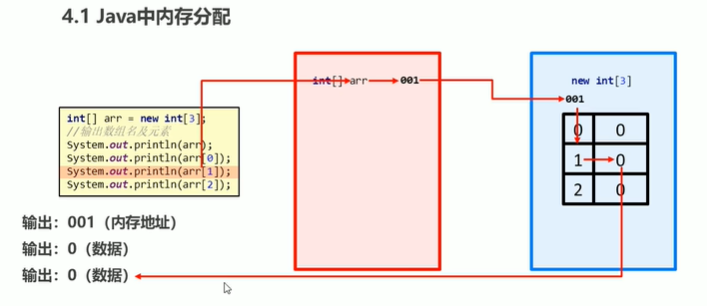

**栈内存：**存储局部变量

​				定义在方法中的变量，例如：arr

​				使用完毕，立即消失

**堆内存：**存储new出来的内容（**实体，对象**）

​				数组在初始化时，会为存储空间添加默认值

​										整数：0

​										浮点数：0.0

​										布尔：false

​										字符：**空字符**

​										引用的数据类型：null

​				**每**一个**new**出来的**东西**都有一个**地址值**；使用完毕，会在垃圾回收器**空闲时被回收**

**执行流程_图例2：**

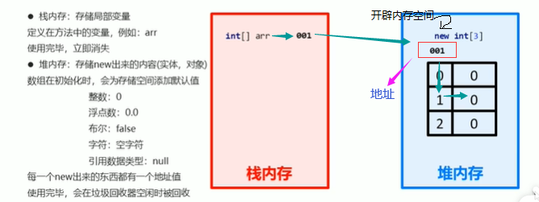

------

##### _1. 单个数组内存图

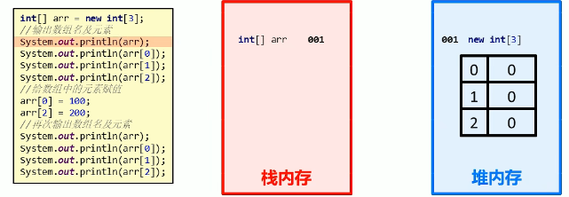

**重新赋值：**

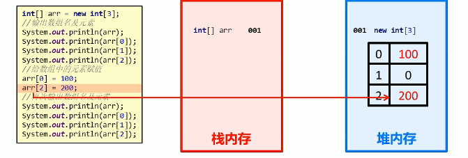

##### _2. 多个数组内存图

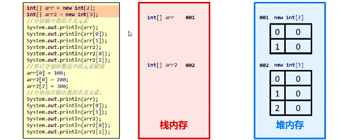

**重新赋值：**

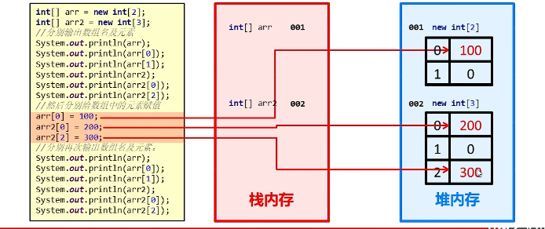

------

***作业：***

<u>源代码</u>

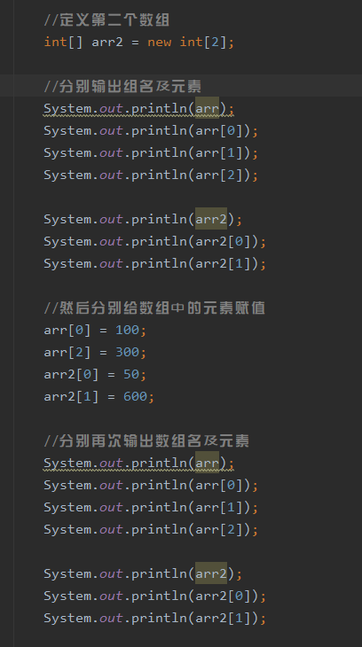

<u>***执行结果***</u>

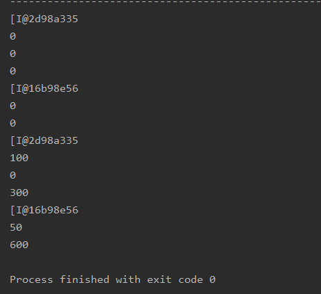

##### _3.数组内存图（多个数组指向相同）

```java
int [] arr =new int[3];
arr[0] = 100;
arr[1] = 100;
arr[2] = 100;
System.out.println(arr);
System.out.println(arr[0]);
System.out.println(arr[1]);
System.out.println(arr[2]);
//定义第二个数组只想第一个数组
int[] arr2 = arr;
arr2[0] = 111;
arr2[1] = 222;
arr2[2] = 333;
//输出两个数组的名及元素
System.out.println(arr);
System.out.println(arr[0]);
System.out.println(arr2);
System.out.println(arr2[0]);
```

**图例：**

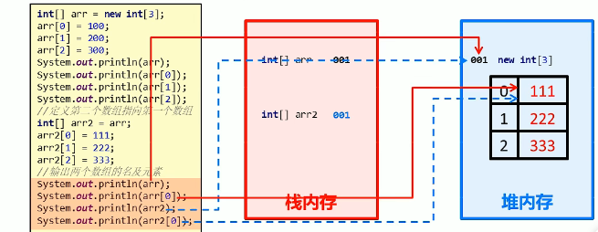

#### **5.数组初始化之静态初始化**

##### _1. 静态初始化

​		初始化时指定每个数组元素的初始值，由系统决定数组长度

​		格式：数据类型[ ] 变量名 = new 数据类型 [ ] {数据1、数据2、数据3……};

​		范例：     int[ ]      arr    =    new     int[ ]{1,2,3};

​		简化格式：数据类型[ ]  变量名  =  {数据1，数据2，数据3，……}；

​		范例：      int[ ] 	 	arr  =  {1,2,3};

```java
public class ceshi {
    public static void main(String[] args){
        //定义数组
        int[] arr ={1,2,3};

        //输出数组名
        System.out.println(arr);

        //输出数组中的元素
        System.out.println(arr[0]);
        System.out.println(arr[1]);
        System.out.println(arr[2]);
        
        //最后输出数组空间的地址值，并且依次输出数组的值0,1,2；
    }
}
```

#### **6. 数组操作的两个常见小问题**

- **索引越界**：访问了数组中不存在的索引对应的元素，造成索引越界问题。
- **空指针异常：**访问的数组已经不再指向堆内存的数据，造成空指针异常。
- **null:**空值，引用数据类型的默认值，表示不指向任何有效对象。

```java
public class ceshi {
    public static void main(String[] args){
      /*
            索引越界：访问了数组中不存在的索引对应的元素，造成索引越界问题
                    ArrayIndexOutOfBoundsException

            空指针异常：访问的数组已经不再指向堆内存的数据，造成空指针异常
                    NullPointerException

            null：空值，引用数据类型的默认值，表示不指向任何有效对象
     */
        //定义一个arr数组
        int[] arr = new int[3];

        //System.out.println(arr[3]);
        //System.out.println(arr[2]);

        //把null赋值给数组
        arr = null;
        System.out.println(arr[0]);

    }
}
```

**图片解析：**

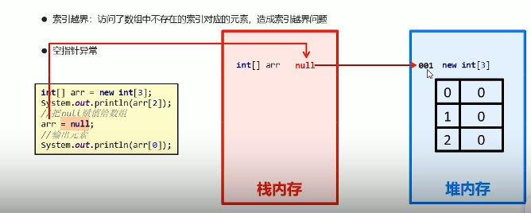

#### 7. 数组常见操作

##### _1. **遍历：**

##### 			简而言之，就是获取数组中的每一个值，在控制台输出。

```java
//数组的遍历
int[] arr = {11,22,33,44,55};
System.out.println(arr[0]);
System.out.println(arr[1]);
System.out.println(arr[2]);
System.out.println(arr[3]);
System.out.println(arr[4]);

//最后输出为：11,22,33,44,55；假如数据有1000万条呢？
```

*注意：可以采用循环来实现输出较多的数组；*

##### _2. **获取数组元素数量**:

- ​	**格式：**数组名.length       分析：数组中有多少数据，那么他就正常输出
- ​	**范例**：arr.length

```java
public class arrDemo{
    public static void main(String[] args){
     //定义一个数组
       int[] arr = {12,32,45,65,65,8,78,54,674,646,41};
        
        //使用通用的遍历格式
        for(int x=0;x<arr.length;x++){
            System.out.println(arr[x]);//对arr[x]进行输出操作
        }
        //最终依次输出数组中的数12,32,45,65,65,8,78,54,674,646,41
    }
}
```

##### _3. 获取最大/小值

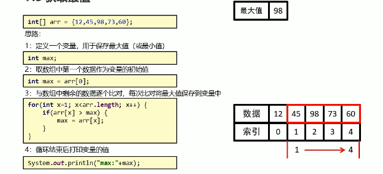

```java
public class ceshi {
    public static void main(String[] args){
        //定义一个数组
        int[] arr = {12,32,45,65,65,8,78,54,674,646,41};
/*-----------------------------输出最大值-------------------------------------*/        

        //定义一个变量来存储最大值
        //取数组中第一个数据作为变量的初始值
        int max = arr[0];

        //与数组中剩余的数据逐个比对，每次比对将最大值保存到变量中
        for(int x = 1;x<arr.length;x++){
            if(arr[x]>max){
                max = arr[x];
            }
        }
        //循环结束后打印变量的值
        System.out.println("最大值：" + max);
/*-----------------------------输出最小值-------------------------------------*/        

        //定义一个变量来存储最小值
        //取数组中第一个数据作为变量的初始值
        int min = arr[0];

        //与数组中剩余的数据逐个比对，每次比对将最小值保存到变量中
        for(int m = 1;m<arr.length;m++){
            if(arr[m]<min){
                min = arr[m];
            }
        }
        //循环结束后打印变量的值
        System.out.println("最小值：" + min);
    }
}
```

## 十七、 方法

#### 1. 方法概述

- **方法**（method）是将具有独立功能的代码块组织成为一个整体，使其具有特殊功能的**代码集**。

**注意：**

- 方法必须先创建才可以使用，该过程称为方法定义。
- 方法创建后并不是直接运行的，需要手动使用后才执行，该过程称为方法调用。

#### 2. 方法的定义和调用

##### _1. 方法定义

**格式：**

```java
public static void 方法名( ){
    //方法体
}
```

**范例：**

```java
public static void isEvenNumber(){
    //方法体
}
```

##### _2. 方法调用

**格式：		方法名();**
范例：		isEvenNumber();

```java
/*

    方法：是将具有独立功能的代码块组织成为一个整体，使其具有特殊功能的代码
    定义格式：
        public static void 方法名(){
            //方法体
        }

    调用格式：
        方法名();

*/
public class ceshi {
    public static void main(String[] args){
      //调用方法判断数据是否是偶数
        isEvenNumber();
    }
    //需求：定义一个方法，在方法中定义一个变量，判断该数据是否是偶数
    public static void isEvenNumber(){
        int num = 10;
        if(num % 2 == 0 ){
            System.out.println(true);
        }else{
            System.out.println(false);
        }
    }

}
```

**注意：**

- *方法必须先定义后调用，否则程序将报错。*

##### _3. 方法调用过程

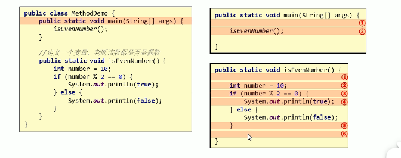

**流程：**main方法  **>**  调用"isEvenNumber()"方法  **>**  进入该方法后，自上而下依次执行，直到该方法结束  **>**  返回main方法，继续执行方法过后的下一条语句  **>**  自上而下依次执行  **>**  ……

##### _4. 方法练习

**需求：**设计一个方法用于打印两个数中的较大数

**思路：**

​		(1)定义一个方法，用于打印两个数字中的较大数

​		(2)方法中定义两个变量，用于保存两个数字

​		(3)使用分支语句分两种情况对两个数字的大小关系进行处理

​		(4)在main()方法中调用定义好的方法

```java
public class ceshi {
    public static void main(String[] args){
        //调用方法
        getMax();
    }
    
    //定义方法
    public static void getMax(){
        //定义两个变量
        int a = 10;
        int b = 20;

        //判断两个数哪个相对于大一些
        if(a>b){
            System.out.println("两数中最大数：" + a);
        }else{
            System.out.println("两数中最大数：" + b);
        }
    }
}
```


#### 3. 带参数方法的定义和调用

##### _1. 带参数方法定义

**格式：**

```java
public static void 方法名(参数){……}
```

**格式(单个参数)及范例：**

```java
public static void 方法名	(数据类型 变量名){……}
//范例
public static void isEvenNumber(int number){……}
```

**格式(多个参数)及范例：**

```java
public static void 方法名(数据类型 变量名1,数据类型 变量名2，……){……}
//范例
public static void getMax(int number1,int number2,……){……}
```

##### _2. 带参数方法调用

**格式：**

```java
方法名(参数)；
```

**格式(单个参数)及案例：**

```java
方法名(变量名/常量值)；

//案例
isEvenNumber(5);
```

**格式(多个参数)及案例：**

```java
方法名(变量名1/常量值1，变量名2/常量值2);
//范例
getMax(5,6);
```

***注意：***

​			**方法调用**时，参数的**数量**与**类型**必须与方法定义中的设置**相匹配**，否则程序将**报错**

**练习1（带参数的定义和调用）：**

```java
public class ceshi {
    public static void main(String[] args){
      //常量调用
        isEvenNumber(10);

        //变量的调用
        int number = 10;
        isEvenNumber(number);
    }
    //需求：定义一个方法，该方法接受一个参数，判断该数据是否是偶数
    public static void isEvenNumber(int number){
        if(number % 2 == 0 ){
            System.out.println(true);
        }else{
            System.out.println(false);
        }
    }
}
```

##### _3. 形参和实参

**形参：**方法定义中的参数

​			等同于变量定义格式， 例如：int number

**实参：**方法调用中的参数

​			等同于使用变量或常量，例如：10     number

总结：形参就是定义了一个变量不予以赋值，用于接收传送过来的值来进行运算，实参就是实实在在的一个数或者一个赋了初始值的变量

<u>**代码例子：**</u>

```Java
public class MethodDemo{
    public static void main(String[] args){
        
//-----------------------1.实参如同下面的 常量 和 数据定义的名称 ------------
        //直接传递常量
        isEvenNumber(10);
        //定义变量，传递
        int number = 10;
        isEvenNumber(number);
    }
//-----------------------2.形参如同下面的数据定义in number------------
    //接收一个变量，判断该数据是否是偶数
    public static void isEvenNumber(int number){
        if(number % 2 == 0){
            System.out.println(true);
        }else{
            Sysetem.out.println(false);
        }
    }
}
```


#### 4. 带返回值方法的定义和调用

##### _1. 定义格式及其范例：

```java
//格式：
public static 数据类型  方法名(参数){
		return 数据;
}

//范例1：
public static boolean isEvenNumber(int number){
		return true;
}

//范例2：
public static int getMax(int a,int b){
    	return 100;
}
```

**注意：**方法定义时return后面的返回值与方法定义上的数据类型要匹配，否则程序将报错。

##### **_2. 带返回值方法调用格式及其范例**

```java
//格式1：	方法名(参数);
//范例：	isEvenNumber(5);

//格式2：	数据类型 变量名 = 方法名(参数);
//范例：	boolean flag = isEvenNumber(5);

```

**注意：**方法的返回值通常会使用变量接受，否则该返回值将无意义。

```java
import java.util.Scanner;
public class ceshi {
    public static void main(String[] args){
        //创建一个名称为in的输入对象
        Scanner in = new Scanner(System.in);

        while(true) {
            //请输入您要判断的数
            System.out.println("请输入您要判断的数值：");
            int isnumber = in.nextInt();
            
            //定义一个变量来接受方法的返回值并输出
            boolean bool = isEvenNuber(isnumber);
            System.out.println(bool);
        }
    }
    //定义一个boolean类型的方法
   public static boolean isEvenNuber(int number){
        if(number % 2 == 0){
            return true;
        }else {
            return false;
        }
   }
}
```

##### _3. 带返回值方法练习

需求：设计一个方法可以获取两个数的较大值，数据来自参数

思路：（1）定义一个方法，用于获取两个数字中的较大数

​			（2）使用分支语句分两种情况对两个数字的大小关系进行处理

```java
import java.util.Scanner;
public class ceshi {
    public static void main(String[] args){
        //创建一个名称为in的输入对象
        Scanner in = new Scanner(System.in);

        while(true) {
            //请输入您要判断的数
            System.out.println("请输入您要判断的数值：");
            int isnumber = in.nextInt();
            int isnumber2 =in.nextInt();
            
            //调用方法实现求任意两个整数中最大的值
            int lin = isEvenNuber(isnumber,isnumber2);
            System.out.println("最大值为：" + lin);
        }
        
    }
    
    //定义一个整型的名为isEvenNuber的方法
   public static int isEvenNuber(int number,int number2 ){
        if(number > number2){
            return number;
        }else {
            return number2;
        }
   }
}
```

#### 5. 方法的注意事项 及 方法的通用格式

##### **_1. 方法的注意事项**

**A.** 方法不能嵌套定义


**B.** void 表示无返回值，可以省略return，也可以单独的书写return，后面不加数据


##### **_2. 方法的通用格式**

**A. 格式**

```java
//格式
public static 返回值类型 方法名(参数){
    	方法体;
    	return 数据;
}
```

public static：	修饰符，目前先记住这个格式	

返回值类型：		方法操作完毕后返回的数据的数据类型

​								如果方法操作完毕，没有数据返回，这里写void，而且方法体中一般不写return

方法名：			调用方法时候使用的标识

参数：				由数据类型和变量名组成，多个参数之间用逗号隔开

方法体：			完成功能的代码块

**B. 注意**

- 定义方法时，要做到两个明确：

​						明确返回值类型：主要是明确方法操作完毕之后是否有数据返回，如果没有，写void；如果有，写对应的数据类型

​						明确参数：主要是明确参数的类型和数量

- 调用方法时：

​						void类型的方法，直接调用即可

​						非void类型的方法，推荐使用变量接收调用

#### 6. 方法重载

##### _1. 方法重载概述

方法重载指同一个类中定义的多个方法之间的关系，满足下列条件的多个方法相互构成重载

- 多个方法在同一个类中
- 多个方法具有相同的方法名
- 多个方法的参数不相同，类型不同或者数量不同

##### _2. 方法重载概述

- 重载仅对应方法的定义，与方法的调用无关，调用方式参照标准格式
- 重载仅针对同一个类中方法的名称与参数进行识别，与返回值无关，换句话说不能通过返回值来判定两个方法是否相互构成重载

```java
//示例1：
//错误。应该参数或者类型不同
public class MethodDemo{
    public static void fn(int a ){
        //方法体
    }
    public static int fn(int a ){
        //方法体
    }
}

                                                        //示例2：
                                                        //正确。数据类型不同
                                                        public class MethodDemo{
                                                            public static void fn(int a ){
                                                                //方法体
                                                            }
                                                            public static int fn(double a ){
                                                                //方法体
                                                            }
                                                        }
----------------------------------------------------------------------------------------------------------
                                                        //示例3：
                                                        //正确。参数不同
                                                        public class MethodDemo{
                                                            public static float fn(int a ){
                                                                //方法体
                                                            }
                                                            public static int fn(int a, int b ){
                                                                //方法体
                                                            }
                                                        }

//示例4：
//错误。在不同的主方法中
  public class MethodDemo01{
      public static void fn(int a ){
          //方法体
       }
  }

 public class MethodDemo02{
      public static int fn(double a ){
         //方法体
      }
 }
```

示范：

```java
/*
    方法重载：
        多个方法在同一个类中
        多个方法具有相同的方法名
        多个方法的参数不同，类型不同或者数量不同
        
        与返回值无关
        在调用时候，java虚拟机会通过参数的不同来区分同名的方法

*/
public class MethodDemo {
    public static void main(String[] args) {
        /*int result = sum(10,20);
        System.out.println(result);*/
        
        //输出调用
        System.out.println(sum(10,20));

        double result2 = sum(10.0,20.0);
        System.out.println(result2);

        int result3 = sum(10,20,30);
        System.out.println(result3);
    }
    //需求1：求两个int类型数据和方法
    public static int sum(int a,int b){
        return a + b;
    }

    //需求2：求两个double类型数据和方法
    public static double sum(double a, double b){
        return a + b;
    }

    //需求3：求三个int类型数据和方法
    public static int sum(int a,int b, int c){
        return a + b + c;
    }
}
```

方法重载练习：

```java
public class MethodDemo {
    public static void main(String[] args) {
        //调用方法
        System.out.println(compare(10,20));// int类型的方法

        System.out.println(compare((byte)10,(byte)20));// byte类型的方法

        System.out.println(compare((short)10,(short)20));// short类型的方法

        System.out.println(compare(10l,20l));// long类型的方法

    }
    //int
   public static boolean compare(int a, int b){
       System.out.println("int:");
        return a == b;
   }

    //byte
    public static boolean compare(byte a, byte b){
        System.out.println("byte:");
        return a == b;
    }

    //short
    public static boolean compare(short a, short b){
        System.out.println("short:");
        return a == b;
    }

    //long
    public static boolean compare(long a, long b){
        System.out.println("long:");
        return a == b;
    }
}
```

#### 7. 方法的参数传递

##### _1. 方法参数传递（基本类型）

​		形参变化不会影响实际参数改变。

```java
public class MethodDemo {
    public static void main(String[] args) {
        int number = 100;
        System.out.println("调用change方法前：" + number);// 100

        change(number);
        System.out.println("调用change方法后：" + number);// 100
    }
    public static void change(int number){//形式参数用于参与运算，但并不改变实际参数的值
        number = 200;
    }
}
/*
	首次输出：100
	第二次输出：100
*/
```

##### _2. 方法参数传递（引用类型）

​		对于引用类型的参数，形式参数的改变，影响实际参数的值。

```java
public class MethodDemo {
    public static void main(String[] args) {
        int[] arr = {10,20,30};
        System.out.println("调用change方法前：" + arr[1]);

        change(arr);
        System.out.println("调用change方法后：" + arr[1]);
    }
    public static void change(int[] arr){//引用的是地址编号，所以形参改变，会直接影响实际参数的值
        arr[1] = 200;
    }
}
```

#### 8.  案例：数组遍历

**需求：**设计一个方法用于数组遍历，需求遍历的结果是在一行上的。例如：[11,22,33,44,55]

**思路：**

- 因为要求结果在一行上输出，所以这里需要在学习一个新的输出语句System.out.print("内容");

  ​				System.out.println("内容");输出内容并换行

  ​				System.out.prin("内容");输出内容不换行

  ​				System.out.println();起到换行的作用

- 定义一个数组，用静态初始化完成数组元素初始化

- 定义一个方法，用数组遍历通用格式对数组进行遍历

- 用新的输出语句修改遍历操作

- 调用遍历

```java
public class MethodDemo {
    public static void main(String[] args) {
        int[] arr = {11,22,33,44,55};

        printArray(arr);
        System.out.println( arr );

    }
    public static void printArray(int[] arr){
        System.out.print("[");
        for(int x = 0; x < arr.length;x++){
            if(x <4){
                System.out.print(arr[x] + ",");
            }else{
                System.out.print(arr[x]);
            }
        }
        System.out.print("]");
    }

}
```

**案例：数组最大值**

需求：设计一个方法用于获取数组中元素的最大值，调用方法并输出结果

思路：

1. 定义一个数组，用静态初始化完成数组元素初始化
2. 定义一个方法，用来获取数组中的最大值
3. 调用获取最大值方法，用变量接收返回结果
4. 把结果输出在控制台


## **十八、Debug**-案例

#### 1.Debug概述

Debug:是供程序员使用的程序调试工具，它可以用于查看程序的执行流程，也可以用于追踪程序执行过程来调试程序。

### 2.Debug操作流程

Debug调试，又被成为断点调试，断点其实是一个标记，告诉我们从哪里开始查看

- 如何加断点：选择要设置断点的代码行，在行号的区域后面单击鼠标左键即可。
- 如何运行加了断点的程序：在代码区域右键Debug执行。
- 看哪里：看Debug窗口
- 点哪里：点Step Into（F7）这个箭头，也可以直接按F7。
- 如何删除断点：选择要删除的断点，单击鼠标左键即可。

### 3.减肥活动-案例

思路：

- ​		键盘录入一个星期数，用一个变量接收
- 对星期数进行判断，这里用switch……case实现
- 再对应的语句控制中输出对应的减肥活动

```java
package DeBugTest20220622;

import java.util.Scanner;

public class JudgeJumpTest02 {
    public static void main(String[] args) {
        //创建输入对象in
        Scanner in = new Scanner(System.in);

        //创建一个输入对象a
        System.out.println("请输入星期数：");
        int a = in.nextInt();

        //通过case语句判断，进行输出
        switch (a) {
            case 1:
                System.out.println("跑步");
                break;
            case 2:
                System.out.println("游泳");
                break;
            case 3:
                System.out.println("慢走");
                break;
            case 4:
                System.out.println("动感单车");
                break;
            case 5:
                System.out.println("拳击");
                break;
            case 6:
                System.out.println("爬山");
                break;
            case 7:
                System.out.println("好好吃一顿");
                break;
            default:
                System.out.println("您输入的星期数不在有效范围内！");
                break;
        }
    }
}

```

### 4.逢七过-案例

需求：朋友聚会的时候可能会玩 一个游戏：逢七过。规则是：从任意一个数字开始报数，当你要报的数字包含7或者是7的倍数时都要说：过。为了帮助大家更好的玩这个游戏，这里我们直接在控制台打印出1-100之间的满足逢七必过规则的数据。

这样，大家将来玩这个游戏的时候，就知道哪些数据要说：过。

思路：

- ​	数据在1-100之间，用for循环实现数据的获取

- 根据规则，用if语句实现数据的判断：要么个位是7，要么十位是7，要么能够被7整除。

  x   %   10   ==   7 		x  /  10   %   10    ==   7				x  %  7     ==    0

- 在控制台中输出数据

```java
package DeBugTest20220622;

public class Test03 {
    public static void main(String[] args) {
        for (int i = 1; i < 100; i++) {
            if (i % 10 == 7 || i / 10 % 10 == 7 || i % 7 == 0) {
                System.out.println(i);
//                continue;
            }
//            else {
//                System.out.println(i);
//            }
        }

    }
}

```

#### 5.不死神兔-案例

需求：有一对兔子，从出生后第3个月起每个月都生一对兔子，小兔子长到第三个月后每个月又生一对兔子，假如兔子都不死，问第二十个月的兔子对数为多少？

找规律：

第一个月：1

第二个月：1

第三个月：2

第四个月：3

第五个月：5

第六个月：8

……

数据连起来：1，1，2，3，5，8……

```java
package DeBugTest20220622;

public class Test04 {
    public static void main(String[] args) {
        //定义一个arr的动态初始化数组
        int[] arr = new int[20];

        //因为第一个月与第二个月的兔子对数已知，用数组表示
        arr[0] = 1;
        arr[1] = 1;

        //用循环计算每个月兔子的对数
        for (int i = 2; i <arr.length ;i++){
            arr[i] = arr[i-2] + arr[i-1];

            /*
            * arr[2] = arr[0] + arr[1]   2
            * arr[3] = arr[1] + arr[2]   3
            * arr[4] = arr[2] + arr[3]   5
            * ……
            *
            *
            * */
        }

        //输出数组中最后一个元素的值，就是20个月的兔子的对数
        System.out.println(arr[19]);

    }
}

```

### 6.百钱百鸡-案例

需求：我国古代数学家张邱建在《算经》一书中提出的数学问题：公鸡一只5钱，鸡母一只3钱，小鸡3只1钱.百钱百鸡，问鸡公、鸡母、小鸡几何？

```java
package DeBugTest20220622;

/**
 * 百钱买百鸡
 * 公鸡5文钱1只
 * 母鸡3文钱1只
 * 小鸡1文钱3只
 * */
public class Test05 {
    public static void main(String[] args) {
        //第1层循环，用于表示公鸡的范围，初始化表达式的变量定义为x=0，判断条件是x<20
        for (int x = 0;x<20;x++){
            //第2层循环，用于表示鸡母的范围，初始化表达式的变量定义为y=0；判断条件是y<33
            for (int y = 0 ;y<33;y++){
                //这个时候，用于表示小鸡的变量z=100-x-y
                int z = 100-x-y;

                //判断表达式，z%3==0 和 表达式 5*x + 3*y + z/3 = 100是否同时成立
                if (z%3==0 && 5*x +3*y + z/3 == 100){
                    System.out.println(x + "," + y  + "," + z );
                }
            }
        }
    }
}

```

### 7.数组元素求和-案例

需求：有这样的一个数组，元素是{68，27，95，88，171，996，51，210}。求出该数组中满足条件的元素和，要求是：求和的元素个位和十位都不能是7，并且只能是偶数。

思路：

- 定义一个数组，用静态初始化完成数组元素的初始化

- 定义一个求和变量，初始值为0

- 遍历数组，获取到数组中的每一个元素

- 判断该元素是否满足条件，如果满足条件就累加

  arr[i]%10 != 7 				arr[i]/10%10 !=7					arr[i]%2 == 0

- 输出求和变量的值

```java
package DeBugTest20220622;

public class Test06 {
    public static void main(String[] args) {
        //定义一个数组，并且静态初始化数组
        int[] arr ={68,27,95,88,171,996,51,210};

        //定义一个求和变量sum，初始化值为0
        int sum = 0;

        //遍历数组
        for (int i =0;i<arr.length;i++){
            if(arr[i]%10 != 7 && arr[i]/10%10 !=7 && arr[i]%2 == 0){
                sum += arr[i];
            }

        }
        System.out.println(sum);
    }
}

```

### 8.数组内容相同-案例

需求：设计一个方法，用于比较两个数组的内容是否相同

思路：

- 定义两个数组，分别使用静态初始化完成数组元素的初始化

- 定义一个方法，用于比较两个数组的内容是否相同

  ​		返回值类型：boolean

  ​		参数：int[] arr,  int[] arr2

- 比较两个数组的内容是否相同，按照下面的步骤实现就可以了

  ​		首先比较数组长度，如果长度不相同，数组内容肯定不相同，返回false

  ​		其次遍历，比较两个数组中的每一个元素，只要有元素不相同，返回false

  ​		最后循环遍历结束后，返回true

```java
package DeBugTest20220622;

/**
 * 判断两个数组是否相等。
 * 1. 长度是否相等
 * 2. 数组中的值是否一一对象且相等
 *
 * 注意：就算是数组顺序不一样，其结果返回也不一样
 * */
public class Test07 {
    public static void main(String[] args) {
        //定义两个静态数组
        int[] arr = {1,2,3,4,5,6,7,8,9};
        int[] arr2 = {1,2,3,4,5,6,7,8,9};

        //调用方法
        boolean temp = compare(arr,arr2);
        System.out.println(temp);

    }
    public static boolean compare(int[] arr,int[] arr2){
        //首先比较数组的长度
        if (arr.length !=arr2.length){
            return false;
        }

        //遍历每一个数组元素是否依次相等
        for(int i = 0;i<arr.length;i++){
            if (arr[i] != arr2[i]){
                return false;
            }
        }
        return true;
    }
}

```

### 9.查找-案例

需求：已知一个数组arr={5,7,12,49,88,79,96}；键盘录入一个数据，查找该数据在数组中的索引，并在控制台输出找到的索引值。

思路：

- 定义一个数组，用静态初始化完成数组元素的初始化
- 键盘录入要查找的数据，用一个变量接收
- 定义一个索引变量，初始值位-1
- 遍历数组，获取到数组中的每一个元素
- 拿键盘录入的数据和数组中的每一个元素进行比较，如果相同，就把该值对应的索引赋值给索引变量，并结束循环
- 输出索引变量

```java
package DeBugTest20220622;
/**
 * 要求：
 *  输入一个整数，输出数组中对应索引的值，若索引超过过着不符合索引的相关规定则返回数值-1
 *  分析：
 *      1. //创建一个名为in的输入对象
 *      2. //自定义一个名为num的输入点
 *      3.  //定义一个名为 Indexes 的索引变量，初始值为-1
 *      4.  //自定义一个静态数组
 *      5. //遍历数组，获取到数组中的每一个元素。使用for循环进行对输入的常量与数组中的值进行比较，如果相等就输出数组索引值
 * */
import java.util.Scanner;

public class Test08 {
    public static void main(String[] args) {
        //创建一个名为in的输入对象
        Scanner in = new Scanner(System.in);

        System.out.print("num值为：");
        //自定义一个名为num的输入点
        int num = in.nextInt();

//        //定义一个名为 Indexes 的索引变量，初始值为-1
//        int Indexes = -1;
//
        //自定义一个静态数组
        int[] arr = {5,7,12,49,88,79,96};
//
//        //遍历数组，获取到数组中的每一个元素。使用for循环进行对输入的常量与数组中的值进行比较，如果相等就输出数组索引对应的数组值
//        for(int i=0;i<arr.length;i++){
//            if (arr[i]==num){
//                System.out.println("Indexes:" + (Indexes=i));
//            }
//        }
//        System.out.println("Indexes:" + Indexes);

        System.out.println(getIndexes(arr,num));

    }

    //查找指定的数据在数组中的索引
    /*两个明确：
    *       返回值类型：int
    *       参数：int[] arr,int number
    * */
    public static int getIndexes(int[] arr,int num){
        //定义一个名为 Indexes 的索引变量，初始值为-1
        int Indexes = -1;

        //遍历数组，获取到数组中的每一个元素。使用for循环进行对输入的常量与数组中的值进行比较，如果相等就输出数组索引对应的数组值
        for(int i=0;i<arr.length;i++){
            if (arr[i]==num){
                Indexes=i;
            }
        }
        //返回索引
        return Indexes;
    }
}

```

#### 10反转-案例

需求：已知一个数组arr={1, 2, 3, 4, 5, 6, 7, 8, 9}；用程序实现把数组中的元素值交换，交换后的数组arr={9，8，7，6，5，4，3，2，1}；并在控制台输出交换后的数组元素。

分析：

- 第1个元素和最后一个元素交换

- 第2个元素和倒数第二个元素交换

- 第3个元素和倒数第三个元素交换

  ……

  ```java
  package DeBugTest20220622;
  
  
  /**
   * 反转-案例
   * */
  public class Test09 {
      public static void main(String[] args) {
          //定义一个静态数组
          int[] arr = {1, 2, 3, 4, 5, 6, 7, 8, 9};
  
  //        //循环遍历交换位置-反转
  //        for(int start = 0,end = arr.length-1;start<=end;start++,end--){
  //            int temp = arr[start];
  //            arr[start] = arr[end];
  //            arr[end] = temp;
  //        }
  //
  //        //遍历数组
  //        System.out.print("[");
  //        for (int i =0;i<arr.length;i++){
  //            if(i == arr.length-1){
  //                System.out.print(arr[i]);
  //            }else{
  //                System.out.print(arr[i] + ",");
  //            }
  //        }
  //        System.out.println("]");
  //        System.out.println(arr.length);
  
  
          //调用方法实现--反转--
          reversal(arr);
          ergodic(arr);
      }
  
  
          /**
           * 方法区
           * */
          //循环遍历交换位置-反转
          public static void reversal (int[] arr){
              for (int start = 0, end = arr.length - 1; start <= end; start++, end--) {
                  int temp = arr[start];
                  arr[start] = arr[end];
                  arr[end] = temp;
              }
          }
  
          //遍历数组
          public static void ergodic ( int[] arr){
              System.out.print("[");
              for (int i = 0; i < arr.length; i++) {
                  if (i == arr.length - 1) {
                      System.out.print(arr[i]);
                  } else {
                      System.out.print(arr[i] + ",");
                  }
              }
              System.out.println("]");
              System.out.println(arr.length);
          }
      }
  
  
  ```

#### 11.评委打分-案例

需求：在编程竞赛中，有6个评委为参赛的选手打分，分数为0-100的整数分。选手的最后得分为：去掉一个最高分和一个最低分后的4个评委平均值（不考虑小数部分）

思路：

- 定义一个数组，用动态初始化完成数组元素的初始化，长度为6
- 键盘录入评委分数
- 由于是6个评委打分，所以，接收评委分数的操作，用循环改进
- 定义方法实现获取数组中的最高分（数组最大值），调用方法
- 定义方法实现获取数组中的最低分（数组最小值），调用方法
- 定义方法实现获取数组中的所有元素的和（数组元素求和），调用方法
- 按照计算规则进行计算得到平均分
- 输出平均分

```java
package DeBugTest20220622;

import java.util.Scanner;

/**
 * 评委打分
 * */
public class Test10 {
    public static void main(String[] args) {
        //定义一个数组，用动态初始化完成数组元素初始化，长度为6
        int[] arr = new int[6];

        //键盘录入评委分数
        Scanner in = new Scanner(System.in);

//        //录入六个评委的分数
//        System.out.println("请依次输入6位评委所打的分数：");
//        arr[0] = in.nextInt();
//        arr[1] = in.nextInt();
//        arr[2] = in.nextInt();
//        arr[3] = in.nextInt();
//        arr[4] = in.nextInt();
//        arr[5] = in.nextInt();

        //利用遍历的方式，构建输入评分
        bb:for (int i = 0;i<arr.length;i++){
            int n =i + 1;
            System.out.print("请第" + n + "位" + "评委打分：");
            arr[i] = in.nextInt();
            if(arr[i] >=0 && arr[i] <101){
                arr[i]=arr[i];
            }else{
                System.out.println("错误代码：00000001！");
                return;
            }
        }

        //调用方法求平均值
        double area = sumArray(arr);
        System.out.println("去掉最高分:" + getMax(arr) + "\n去掉最低分: "+ getMin(arr) + "\n最后平均分为：" + area);

    }
    /**
     * 方法区
     * */
    //获取数组中的最大值
    public static int getMax(int[] arr){
        int max = arr[0];
        for (int i = 1;i<arr.length;i++){
            if(max<arr[i]){
                max = arr[i];
            }
        }
        return max;
    }

    //获取数组中的最小值
    public static int getMin(int[] arr){
        int min = arr[0];
        for (int i = 1;i<arr.length;i++){
            if(min>arr[i]){
                min = arr[i];
            }
        }
        return min;
    }

    //获取数组中元素的总和,并计算出平均分
    public static int sumArray(int[] arr){
        int sum = 0;
        for (int i = 0; i<arr.length;i++){
            sum += arr[i];
        }
        return (sum-getMax(arr)-getMin(arr))/(arr.length-2);
    }


}

```


## 十九、面向对象基础

#### 1. 类和对象

##### _1. 对象：

​		万物皆对象，客观存在的事物皆为对象。

##### _2. 什么是对象？

​		对象就是一个物理上存在的东西，比如：手机，书……

##### _3. 什么是类？

​		类是现实生活中一类具有共同属性和行为的事物的抽象

类的特点：

- ​		类是对象的数据类型
- 类是具有相同属性和行为的一组对象的集合

##### _4. 什么是对象的属性？

​		属性：对象具有的各种特征，每个对象的每个属性都拥有特定的值	

| 属性 |     值      |
| :--: | :---------: |
| 品牌 | Oppo FindX3 |
| 价格 |    4500     |
| 内存 |    256G     |
|  ……  |             |

##### _5. 什么是对象的行为？

​		行为：对象能够执行的操作。简而言之就是对象能干什么。

eg：手机能 打电话 or 玩游戏 or 发短信……此类都是手机的行为。

##### _6. 类和对象的关系？

​		类：类是对现实生活中一类具有共同属性和行为的事物的抽象

​		对象：是能够看得到摸得着的真实存在的实体

注意：类是对象的抽象，对象是类的实体。

##### _7. 类的定义

类的重要性：是Java程序的基本组成单位。

类是什么：是对现实生活中一类具有共同属性和行为的事物的抽象，确定对象将会拥有的属性和行为

类的组成：属性和行为

- 属性：在类中通过成员变量来体现（类中方法外的变量）
- 行为：在类中通过成员方法来体现（和前面的方法相比去掉static关键字即可）

类的定义步骤：

- 定义类
- 编写类的成员变量
- 编写类的成员方法

```java
package ObjectOriented20220624.ClassDefinition;

/**
 * 类的定义
 *
 * 类的定义步骤：
 *      1. 定义类
 *      2. 编写类的成员变量
 *      3. 编写类的成员方法
 *
 *手机类：
 *   类名：
 *          手机（Phone）
 *
 *   成员变量：
 *          品牌（brand）
 *          价格（price）
 *
 *   成员方法：
 *          打电话（call）
 *          发短信（sendMessage）
 * */
public class Phone {
    //定义成员变量
    String brad;//品牌
    int price;//价格

    //定义成员方法
    public void call(){//打电话
        System.out.println("打电话……");
    }

    public void sendMessage(){//发短信
        System.out.println("发短信……");
    }

    public static void main(String[] args) {
        Phone phone = new Phone();
        System.out.println(phone);
    }

}

```

_8. 对象的使用

创建对象：

- 格式：类名   对象名   =   new  类名( );
- 范例：Phone p = new Phone( );

使用对象：

​		1:使用成员变量

- 格式：对象名.变量名
- 范例：p.brand

​		2:使用成员方法

- 格式：对象名.变量名
- 范例：p.call( );

```java
package ObjectOriented20220624.ClassDefinition;

public class PhoneDemo extends Phone{
    public static void main(String[] args) {
        Phone p = new Phone();
        Phone s = p;

        System.out.println(p==s);

        System.out.println(p.brad="幸幸");
        System.out.println(s.brad="溜溜");
        System.out.println();
        System.out.println(p.brad);
        System.out.println(s.brad);

    }
}

```

学生--案例：

```java
package ObjectOriented20220624.UseOfObjects;

public class Student {
    //成员变量
    String name;
    int age;

    //成员方法
    public void eat(){
        System.out.println("吃饭……");
    }

    public void sleep(){
        System.out.println("睡觉……");
    }

    public void study(){
        System.out.println("学习……");
    }
}


--------------------------------------------------------
package ObjectOriented20220624.UseOfObjects;

public class StudentDemo {
    public static void main(String[] args) {
        Student student = new Student();

        student.name = "公孙离";
        student.age = 21;

        System.out.println(student.name);
        System.out.println(student.age);

        student.eat();
        student.sleep();
        student.study();
    }
}


```

#### 2.对象内存图

##### _1. 单个对象内存图

​	例子：Student s = new Student();

​	分析：赋值符号（=）左边的Student s 进入栈内存，new Student()进入堆内存。

注意：程序都是从main()方法进入。


#### 3.成员变量和局部变量

##### _1. 什么是成员变量和局部变量

​		成员变量：类中方法外的变量

​		局部变量：方法中的变量

##### _2. 成员变量和局部变量区别


|      区别      |                  成员变量                  |                    局部变量                    |
| :------------: | :----------------------------------------: | :--------------------------------------------: |
|  类中位置不同  |                 类中方法外                 |               方法内或方法申明上               |
| 内存中位置不同 |                   堆内存                   |                     栈内存                     |
|  生命周期不同  | 随着对象的存在而存在，随着对象的消失而消失 | 随着方法的调用而存在，随着方法的调用完毕而消失 |
|  初始化值不同  |              有默认的初始化值              | 没有默认的初始化值，必须先定义，赋值，才能使用 |

#### 4.封装

##### _1. private关键字

- ​	是一个权限修饰符
- 可以修饰成员（成员变量和成员方法）
- 作用是保护成员不被别的类使用，被private修饰的成员只在本类中才能访问

​			针对private修饰的成员变量，如果需要被其他类使用，提供相应的操作

- 提供“get变量名( )”方法，用于获取成员变量的值，方法用public修饰
- 提供“set变量名( )”方法，用于设置成员变量的值，方法用public修饰

##### _2. private关键字的使用

一个标准类的编写：

- 把成员变量用private修饰
- 提供对应的getXxx()/setXxx()方法

```java
package ObjectOriented20220624.UseOfObjects;

public class Student {
   private String name;
   private int age;

   //get/set方法
    public void setName(String n){
        name = n;
    }

    public String getName(){
        return name;
    }

    public void setAge(int age){
        this.age = age;
    }

    public int getAge(){
        return age;
    }

    //成员方法
    public void eat(){
        System.out.println("吃饭……");
    }

    public void sleep(){
        System.out.println("睡觉……");
    }

    public void study(){
        System.out.println("学习……");
    }
}


---------------------------------------------------------
    package ObjectOriented20220624.UseOfObjects;

public class StudentDemo {
    public static void main(String[] args) {
        Student student = new Student();

        student.setName("公孙离");
        student.setAge(21);

        System.out.println(student.getName()  + "," + student.getAge());

        student.eat();
        student.sleep();
        student.study();
    }
}


```

##### _3. this关键字

​	（1）this修饰的变量用于指代成员变量

- 方法的形参如果与成员变量同名，不带this修饰的变量指的是形参，而不是成员变量
- 方法的形参没有与成员变量同名，不带this修饰的变量指的是成员变量

​	（2）什么时候使用this呢？

- 解决局部变量隐藏成员变量

​	（3）this：代表所在类的对象引用

- ​	记住：方法被哪个对象调用，this就代表哪个对象

##### _4. this内存原理

网址如下（构造+this+super+综合案例）：

​		[(4条消息) Java面向对象（十二）——构造方法（方法调用、内存图解）、this关键字（调用构造方法、原理图）、super关键字_kww_的博客-CSDN博客](https://blog.csdn.net/qq_40243295/article/details/111935391?ops_request_misc=&request_id=&biz_id=102&utm_term=java中this的内存原理&utm_medium=distribute.pc_search_result.none-task-blog-2~all~sobaiduweb~default-8-111935391.142^v21^control,157^v15^new_3&spm=1018.2226.3001.4187)


##### _5. 封装

​	（1）封装概述

​				是面向对象三大特征之一（封装、继承、多态）。是面向对象编程语言对客观世界的模拟，客观世界里成员变量都是隐藏在对象内部的，外界是无法直接操作的。

​	（2）封装原则

​				将类的某些信息隐藏在类内部，不允许外部程序直接访问，而是通过该类提供的方法来实现对隐藏信息的操作和访问。成员变量private，提供对应的getXxx()/setXxx()方法

​	（3）封装的好处

​				通过方法来控制成员变量的操作，提高了代码的安全性。

​				把代码用方法进行封装，提高了代码的复用性。

#### 5.构造方法

##### _1. 构造方法概述

构造方法是一种特殊的方法

作用：创建对象

```java
格式：
public class 类名{
    修饰符 类名(参数){
   		
    }
}

功能：主要是完成对象数据的初始化
    
-----------------------------------------------------------
public class Student{
    private String name;
    private int age;
    
    //构造方法
    public Student(){
        System.out.println("无参构造");
    }
    
    public void show(){
        System.out.println(name + "," + age);
    }
} 
   
 ----------------------------------------------------------
 public class StudentTest{
      public static void main(String[] args){
          //创建对象
     		Student s = new Student();
         	 s.show();
    }
 }
-------------------------------------------------------------
    输出结果：
    		无参构造
    		null，0
```

##### _2. 构造方法的注意事项

​	（1）构造方法的创建

- 如果没有定义构造方法，系统将给出一个默认的无参构造方法
- 如果定义了构造方法，系统将不再提供默认的构造

​	（2）构造方法的重载

- 如果自定义了带参构造方法，还是使用无参构造方法，就必须再写一个无参构造方法

​	（3）推荐的使用方式

- 无论是否使用，都手工书写无参构造方法

##### _3. 标准类制作

​	（1）成员变量

- ​		使用private修饰

​	（2）构造方法

- 提供一个无参构造方法
- 提供一个带多个参数的构造方法

​	（3）成员方法

- 提供每一个成员变量对应的setXxx()/getXxx()
- 提供一个显示对象信息的show()

​	（4）创建对象并为其成员变量赋值的两种方式

- 无参构造方法创建对象后使用setXxx()赋值
- 使用带参构造方法直接创建带有属性值的对象

## 二十、字符串

#### 1.API

##### 		_1. API概述

​						API（Application Programming Interface）:应用程序编程接口

​						编写一个机器人程序去控制机器人踢足球，程序需要向机器人发出向前跑、向后跑、射门、抢球等各种命令。

​						机器人厂商一定会提供一些用于控制机器人的接口类，这些类中定义好了操作机器人各种动作的方法。其实，这些接口类就是机器人厂商提供给应用程序编程的接口，大家把这些类成为API。

​		Java API：指的就是JDK中提供的各种功能的Java类。这些类将底层的实现封装了起来，我们不需要关心这些类是如何实现的，只需要学习这些类如何使用即可，我们可以通过帮助文档来学习这些API如何使用

#### 2.String

##### 			_1. String类

​					在java.lang包下，所以使用的时候不需要导包

​					String类代表字符串，Java程序中的所有字符串文字（例如"abc"）都被实现为此类的实例。也就是说，Java程序中所有的双引号字符串，都是String类的对象。

​		字符串的特点：

- 字符串不可变，它们的值在创建后不能被更改
- 虽然String的值是不可改变的，但是它们可以被共享
- 字符串效果上相当于字符数组（char[ ]），但是底层原理是字节数组（byte[ ]）

​			注意：JDK8及以前是字符数组，JDK9及以后是字节数

##### 			_2. String构造方法

|          方法名           |                   说明                    |
| :-----------------------: | :---------------------------------------: |
|      public String()      |  创建一个空白字符串对象，不含有任何内容   |
| public String(char[] chs) |   根据字符数组的内容，来创建字符串对象    |
| public String(byte[] bys) |   根据字节数组的内容，来创建字符串对象    |
|     String s = "abc";     | 直接赋值的方式创建字符串对象，内容就是abc |

代码演示：

```java
package characterString20220626;

/**
 * |      public String()      |  创建一个空白字符串对象，不含有任何内容   |
 * | :-----------------------: | :---------------------------------------: |
 * | public String(char[] chs) |   根据字符数组的内容，来创建字符串对象    |
 * | public String(byte[] bys) |   根据字节数组的内容，来创建字符串对象    |
 * |     String s = "abc";     | 直接赋值的方式创建字符串对象，内容就是abc |
 * */
public class StringDemo01 {
    public static void main(String[] args) {
        //public String()      |  创建一个空白字符串对象，不含有任何内容
        String s1 = new String();
        System.out.println("s1:" +s1);

        //public String(char[] chs) |   根据字符数组的内容，来创建字符串对象
        char[] chs ={'a','b','c'};
        String s2 = new String(chs);
        System.out.println("s2:" + s2);

        //public String(byte[] bys) |   根据字节数组的内容，来创建字符串对象
        byte[] bys = {97,98,99};
        String s3 = new String(bys);
        System.out.println("s3:" + s3);

        //String s = "abc";     | 直接赋值的方式创建字符串对象，内容就是abc
        String s4 = "abc";
        System.out.println("s4:" + s4);

    }
}

```

##### 			_3. String对象的特点

​			    			1）通过new创建的字符串对象，每一次new都会申请一个内存空间，虽然内容相同，但是地址值不同

```java
		char[] chs ={'a','b','c'};
        String s1 = new String(chs);
        String s2 = new String(chs);
```

​					上面的代码中，JVM会首先创建一个字符数组，然后每一次new的时候都会有一个新的地址，只不过s1和s2参考的字符串内容是相同的。

​						2）以""方式给出的字符串，只要字符序列相同（顺序和大小写），无论再程序代码中出现几次，JVM都只会建立一个String对象，并在字符串池中维护

```java
String s3 = "abc";
String s4 = "abc";
```

​					在上面的代码中，针对第一行代码，JVM会建立一个String对象放在字符串池中，并给s3参考；第二行则让s4直接参考字符串池中的String对象，也就是说它们本质上是同一个对象。

​			_4. 字符串的比较

​						使用 == 做比较

​									基本类型：比较的是数据值是否相同

​									引用类型：比较的是地址值是否相同


​						字符串是对象，它比较内容是否相同，是通过一个方法来实现的，这个方法叫：equals()

​									public boolean equals(Object anObject)：将此字符串与指定对象进行比较。由于我们比较的是字符串对象，所以参数直接传递一个字符串

#### 案例：

##### 1.用户登录

需求：已知用户名和密码，请用程序实现模拟用户登录。总共给三次机会，登录之后，给出相应的提示

思路：

- 已知用户名和密码，定义两个字符串表示即可
- 键盘录入要登录的用户名和密码，用Scanner实现
- 拿键盘录入的用户名、密码和已知的用户名、密码进行比较，给出相应的提示。字符串的内容比较，用equals()方法实现
- 用循环实现多次机会，这里的次数明确，采用for循环实现，并在登录成功的时候，使用break结束循环

代码演示：

```java
package characterString20220626;

/**
 * 需求：已知用户名和密码，请用程序实现模拟用户登录。总共给三次机会，登录之后，给出相应的提示
 * */

import java.util.Scanner;
public class UserLoginCases {
    public static void main(String[] args) {
        //创建一个名为in的输入对象
        Scanner in = new Scanner(System.in);

        for (int i = 0;i<3;i++) {
            //用键盘录入的方式实现用户名、密码
            System.out.print("用户名：");
            String username = in.nextLine();
            System.out.print("密码：");
            String password = in.nextLine();

            //判断
            if (username.equals("xgl") | password.equals("123")) {
                System.out.println("恭喜" + username + "登录成功");
                break;
            } else if (i==2){
                System.out.println("已经连续错误3次，静止当前操作5分钟！");
            }else{
                System.out.println("用户名或密码错误！你还有" + (3-(i+1)) + "次机会");
            }
        }
    }

}

```

##### 2.遍历字符串

需求：键盘录入一个字符串，使用程序实现在控制台遍历该字符串

思路：

- 键盘录入一个字符串，用Scanner实现
- 遍历字符串，首先要能获取到字符串中的每一个字符
  - public char charAt(int index)：返回指定索引处的char值，字符串的索引也是从0开始的
- 遍历字符串，其次要能够获取到字符串的长度
  - public int length():返回此类字符串的长度

代码演示：

```
package characterString20220626;

/**
 * 遍历字符串
 * */
import java.util.Scanner;
public class TraversalString {
    public static void main(String[] args) {
        //创建一个名为in的输入对象
        Scanner in = new Scanner(System.in);

        //键盘录入字符串
        System.out.print("请输入你要遍历的字符串：");
        String string = in.nextLine();

        //利用for循环遍历字符串
        for (int i = 0;i<string.length();i++){
            System.out.println(string.charAt(i));
        }
        System.out.println("字符串的长度为：" + string.length());

    }
}

```

##### 3.统计字符次数

需求：键盘录入一个字符串，统计该字符串中大写字母字符，小写字母字符，数字字符出现的次数（不考虑其他字符）

思路：

- 键盘录入一个字符串，用Scanner实现那

- 要统计三种类型的字符个数，需定义三个统计变量，初始值都为0

- 遍历字符串，得到每一个字符

- 判断该字符属于哪种类型，然后对应类型的统计变量+1

  ​			假如ch是一个字符，我要判断它属于大写字母，小写字母，还是数字，直接判断该字符是否在对应的范围即可

  - 大写字母：ch>='A' && ch<='Z'
  - 小写字母：ch>='a' && ch<='z'
  - 数字：ch>='0' && ch<='9'

- 输出三种类型的字符个数

代码演示：

```java
package characterString20220626;

import java.util.Scanner;

/**
 * 统计字符次数
 * */
public class CountTheNumberOfCharacters {
    public static void main(String[] args) {
        //创建一个名为in的输入对昂
        Scanner in = new Scanner(System.in);

        //键盘录入
        System.out.println("字符串：");
        String string = in.nextLine();

        //创建变量，用于保存值
        int bigcount = 0;
        int smallcount = 0;
        int numcount = 0;

        //遍历字符串
        for(int i = 0;i<string.length();i++){
            char ch = string.charAt(i);

            if (ch>='A' && ch<='Z'){
                bigcount++;
            }else if (ch>='a' && ch<='z'){
                smallcount++;
            }else if(ch>='0' && ch<='9'){
                numcount++;
            }
        }

        System.out.println("统计大写字母：" + bigcount + "个");
        System.out.println("统计小写字母：" + smallcount + "个");
        System.out.println("统计数字：" + numcount + "个");

    }
}

```

##### 4.拼接字符串

需求：定义一个方法，把int数组中的数据按照指定的格式拼接成一个字符串返回，调用该方法，并在控制台输出结果。例如，数组为int[] arr = {1,2,3}; 执行方法后的输出结果为：[1, 2, 3]

思路：

- 定义一个int类型的数组，用静态初始化完成数组元素的初始化
- 定义一个方法，用于把int数组中的数据按照指定格式拼接成一个字符串返回。返回类型String，参数列表int[] arr
- 在方法中遍历数组，按照要求进行拼接
- 调用方法，用一个变量接收结果
- 输出结果

代码演示：

```java
package characterString20220626;

/**
 * 拼接字符串
 * */
public class SpliceString {
    public static void main(String[] args) {
        //静态初始化数组
        int[] arr = {1,2,3,4,5,6,7};

        //调用方法
        String receive = spliceString(arr);

        System.out.println("s:" + receive);

    }
    /**
     * 方法区
     * */
    public static String spliceString(int[] arr){
        String s = "";

        s += "[";

        for (int i = 0; i<arr.length;i++){
            if(i == arr.length-1){
                s += arr[i];
            }else{
                s += arr[i];
                s += ", ";
            }
        }

        s += "]";


        return s;
    }
}

```

##### 5.字符串反转

需求：定义一个方法，实现字符串反转。键盘录入一个字符串，调用该方法后，在控制台输出结果。例如：键盘录入abc，输出结果cba

思路：

- 键盘录入一个字符串，用Scanner实现
- 定义一个方法，实现字符串反转。返回值类型String，参数String s
- 在方法中把字符串倒着遍历，然后把每一个得到的字符拼接成一个字符串并返回
- 调用方法，用一个变量接收结果
- 输出结果

代码演示：

```java
package characterString20220626;

/**
 * 字符串反转
 * */
import java.util.Scanner;
public class StringInversion {
    public static void main(String[] args) {
        //创建一个名为in输入对象
        Scanner in = new Scanner(System.in);

        //键盘录入字符串
        System.out.println("字符串：");
        String string = in.nextLine();


        String ss = ergodic(string);
        System.out.println("反转前：" + string);
        System.out.println("反转后：" + ss);


    }

    /**
     * 方法区
     */
    //反转-遍历字符串
    public static String ergodic(String string) {
        String s = "";

        s += "[";

        for (int i = string.length()-1; i >=0; i--) {
            if (i == string.length()-1) {
                s += string.charAt(i);
            }else{
                s += ", ";
                s += string.charAt(i);
            }
        }

        s += "]";
        return s;
    }
}

```

6.通过帮助文档查看String中的方法

|                 方法名                 |                       说明                       |
| :------------------------------------: | :----------------------------------------------: |
| public boolean equals(Object anObject) | 比较字符串的内容，严格区分大小写（用户名和密码） |
|     public char charAt(int index)      |              返回指定索引处的char值              |
|          public int length()           |                返回此字符串的长度                |

**链接：**[https://pan.baidu.com/s/1FKMSg-7xrvNms44W51vR6Q](https://pan.baidu.com/s/1FKMSg-7xrvNms44W51vR6Q#4yg4)

提取码：4yg4

#### 3.StringBuilder

##### _1.  StringBuilder概述

​		StringBuilder是一个可变的字符串类，我们可以把它看成是一个容器，这里的可变指的是StringBuilder对象中的内容是可变的

​		String 和 String Builder 的区别：

- String：内容是不可变的
- StringBuilder：内容是可变的

##### _2.  StringBuilder  构造方法

|              方法名              |                    说明                    |
| :------------------------------: | :----------------------------------------: |
|      public StringBuilder()      | 创建一个空白可变字符串对象，不含有任何内容 |
| public StringBuilder(String str) |   根据字符串的内容，来创建可变字符串对象   |

代码演示：

```java
package StringBulider20220628;

public class StringBuilderTest01 {
    public static void main(String[] args) {
//        String s1 = new String("abc");
//        System.out.println(s1);
//        System.out.println(s1.length());
//
//        String s2 = new String("abc");
//        System.out.println(s2);
//        System.out.println(s2.length());
//
//        System.out.println(s1.equals(s2));//true
//        System.out.println(s1==s2);//false

        StringBuilder sb = new StringBuilder();
        System.out.println("字符串为：" + sb);
        System.out.println("长度为：" + sb.length());

        System.out.println("----------------------");

        StringBuilder sb2 = new StringBuilder("abc");
        System.out.println("字符串为：" + sb2);
        System.out.println("长度为：" + sb2.length());

    }
}

```

##### _3. StringBuilder 的添加和反转方法

|                方法名                 |           说明           |
| :-----------------------------------: | :----------------------: |
| public StringBuilder append(任意类型) | 添加数据，并返回对象本身 |
|    public StringBuilder reverse()     |    返回相反的字符序列    |

代码演示：

```java
package StringBulider20220628;

public class StringBuilderDemo02 {
    public static void main(String[] args) {
        //创建对象
        StringBuilder sb = new StringBuilder();

        //public StringBuilder append(任意类型),添加数据，并返回对象本身
        StringBuilder sb2 = new StringBuilder("hellow");
        System.out.println("sb2:" + sb2);
        System.out.println("length():" + sb2.length());
        System.out.println(sb == sb2);

        System.out.println("------------------");

        //链式编程
        sb.append(01).append("+").append("张三").append("+").append("男");
        System.out.println("sb:" + sb);

        //public StringBuilder reverse()返回相反的字符序列
        sb.reverse();
        System.out.println(sb);//男+三张+1

        sb2.reverse();
        System.out.println(sb2);//wolleh
    }
}

```


##### _4. StringBuilder 和 String 相互转换

​		（1）StringBuilder转换为String

​				public String toString():通过toString()就可以实现把StringBuilder转换为String

​		（2）String转换为StringBuilder

​				public StringBuilder(String s):t哦那个过构造方法就可以实现把String转换为StringBuilder

代码演示：

```java
package StringBulider20220628;


/**
 * （1）StringBuilder转换为String
 *
 * ​				public String toString():通过toString()就可以实现把StringBuilder转换为String
 *
 * ​		（2）String转换为StringBuilder
 *  *
 * ​				public StringBuilder(String s):t哦那个过构造方法就可以实现把String转换为StringBuilder
 * */
public class StringBuilderDemo03 {
    public static void main(String[] args) {
        //（1）StringBuilder转换为String
        StringBuilder sb = new StringBuilder();
        sb.append("helloWorld");
        System.out.println(sb);

        //String s = sb;//这个是错误做法

        //public String toString():通过toString()就可以实现把StringBuilder转换为String
        String s =  sb.toString();
        System.out.println(s);

        //（2）String转换为StringBuilder
        //StringBuilder s1 = s;//这个是错误做法

        //public StringBuilder(String s):t哦那个过构造方法就可以实现把String转换为StringBuilder
        StringBuilder ss = new StringBuilder(s);
        ss.append(123).append(124);
        System.out.println(ss);


    }
}

```

#### 案例：

##### 1.拼接字符串

需求：定义一个方法，把int数组中的数据按照指定的格式拼接成一个字符串返回，调用该方法，并在控制台输出结果。例如，数组为int[] arr = {1,2,3};,在执行后的输出结果为：[1,2,3]

思路：

- ​		定义一个int类型的数组，用静态初始化完成数组元素的初始化
- 定义一个方法，用于把int数组中的数据按照指定格式拼接成一个字符串返回。返回值类型String，参数列表 int[] arr
- 在方法中用StringBuilder按照要求进行拼接，并把结果转换成String返回
- 调用方法，用一个变量接收结果
- 输出结果

代码演示：

```java
package StringBulider20220628;

/**
 * 案例-拼接字符串
 * - 定义一个int类型的数组，用静态初始化完成数组元素的初始化
 * - 定义一个方法，用于把int数组中的数据按照指定格式拼接成一个字符串返回。返回值类型String，参数列表 int[] arr
 * - 在方法中用StringBuilder按照要求进行拼接，并把结果转换成String返回
 * - 调用方法，用一个变量接收结果
 * - 输出结果
 */
public class CaseDemo01 {
    public static void main(String[] args) {
        //- 定义一个int类型的数组，用静态初始化完成数组元素的初始化
        int[] arr = {1, 2, 3, 4, 5, 6, 7, 8, 9};


        //- 调用方法，用一个变量接收结果
        String sss = arrayToString(arr);

        //- 输出结果
        System.out.println("sss:" + sss);

    }

    //- 定义一个方法，用于把int数组中的数据按照指定格式拼接成一个字符串返回。返回值类型String，参数列表 int[] arr
    public static String arrayToString(int[] arr) {
        //- 在方法中用StringBuilder按照要求进行拼接，并把结果转换成String返回
        StringBuilder sb = new StringBuilder();

        sb.append("[");

        for (int i = 0; i < arr.length; i++) {
            if (i == arr.length-1){
                sb.append(arr[i]);
            }else {
                sb.append(arr[i]).append(",");
            }

        }

        sb.append("]");

        String s = sb.toString();
        return s;
    }

}

```

##### 2.字符反转

需求：定义一个方法，实现字符串反转。键盘录入一个字符串，调用该方法后，在控制台输出结果。例如：键盘录入abc，输出结果cba

思路：

- 键盘录入一个字符串，用Scanner实现
- 定义一个方法，实现字符串反转。返回值类型String，参数String s
- 在方法中用StringBuilder实现字符串的反转，并把结果转成String返回
- 调用方法，用一个变量接收结果
- 输出结果

代码演示：

```java
package StringBulider20220628;

/**
 * 字符串反转
 * */
import java.util.Scanner;
public class CaseDemo02 {
    public static void main(String[] args) {
        //创建一个名为in的输入对象
        Scanner in = new Scanner(System.in);

        //键盘录入
        System.out.print("in:");
        String s = in.nextLine();


        String s1 = reversal(s);
        System.out.println("s1:" + s1);
    }
    //方法
    public static String reversal(String s){
//        StringBuilder sb = new StringBuilder();
//        sb.append(s);
//
//        sb.reverse();
//
//        String sss = sb.toString();
        return new StringBuilder(s).reverse().toString();
    }

}

```

##### 3.通过帮助文档查看StringBuilder中的方法

|                方法名                 |                        说明                         |
| :-----------------------------------: | :-------------------------------------------------: |
| public StringBuilder append(任意类型) |              添加数据，并返回对象本身               |
|    public StringBuilder reverse()     |                 返回相反的字符序列                  |
|       public String toString()        | 通过toString()就可以实现把StringBuilder转换为String |

## 二十一、集合基础

#### 1.集合基础

##### 		_1. 集合概述

​				集合类的特点：提供一种存储空间可变的存储模型，存储的数据容量可以发生改变

​				集合类有很多，目前我们先学习一个：ArrayList

​		ArrayList<E>：

- 可调整大小的数组实现
- <E>：是一种特殊的数据类型，泛型。

​		怎么用呢？

​			在出现 E 的地方我们使用引用数据类型替换即可

​			举例：ArrayList<String>,ArrayList<Student>

##### 		_2. ArrayList构造方法和添加方法

|                方法名                |                说明                |
| :----------------------------------: | :--------------------------------: |
|          public ArrayList()          |        创建一个空的集合对象        |
|       public boolean add(E e)        |   将指定的元素追加到此集合的末尾   |
| public void add(int index,E element) | 在此集合中的指定位置插入指定的元素 |

代码演示：

```Java
package SetBasis20220630;

import java.util.ArrayList;

/**
 * ArrayList构造方法
 *|          public ArrayList()          |        创建一个空的集合对象        |
 * | :----------------------------------: | :--------------------------------: |
 * |       public boolean add(E e)        |   将指定的元素追加到此集合的末尾   |
 * | public void add(int index,E element) | 在此集合中的指定位置插入指定的元素 |
 * */
public class ArrayListDemo01 {
    public static void main(String[] args) {
        //创建一个空的集合对象
        //ArrayList<String> arrayList = new ArrayList<>();

        ArrayList<String> arrayList = new ArrayList<String>();
        //System.out.println(arrayList.add("hellow"));

        arrayList.add("JavaSE");
        arrayList.add("JavaEE");
        arrayList.add("Python");

        //public void add(int index,E element) | 在此集合中的指定位置插入指定的元素
        //arrayList.add(1,"Java");//以前的元素往后移一位
        //arrayList.add(3,"C");

        //IndexOutOfBoundsException报错
        //arrayList.add(4,"C++");


        //输出集合
        System.out.println("ArrayList:" + arrayList);


    }
}

```

##### 		_3. ArrayList集合常用方法

|              方法名              |                  说明                  |
| :------------------------------: | :------------------------------------: |
| public boolean remove(Object o ) |    删除指定的元素，返回删除是否成功    |
|    public E remove(int index)    | 删除指定索引处的元素，返回被删除的元素 |
| public set(int index,E element)  | 修改指定索引处的元素，返回被修改的元素 |
|     public E get(int index)      |          返回指定索引处的元素          |
|        public int size()         |          返回集合中的元素个数          |

代码演示：

```java
package SetBasis20220630;

import java.util.ArrayList;

/**
 * | public boolean remove(Object o ) |    删除指定的元素，返回删除是否成功    |
 * | :------------------------------: | :------------------------------------: |
 * |    public E remove(int index)    | 删除指定索引处的元素，返回被删除的元素 |
 * | public set(int index,E element)  | 修改指定索引处的元素，返回被修改的元素 |
 * |     public E get(int index)      |          返回指定索引处的元素          |
 * |        public int size()         |          返回集合中的元素个数          |
 * */
public class ArrayListDemo02 {
    public static void main(String[] args) {
        //1. 创建一个空白的集合对象
        ArrayList<String> array = new ArrayList<String>();

        //2. 向集合中添加元素
        array.add("老王");
        array.add("男");
        array.add("21");
        array.add("程序员");

        //输出集合
        System.out.println(array + "\n");

        //3. public boolean remove(Object o ) |    删除指定的元素，返回删除是否成功
//        System.out.println("array.remove(21):" + array.remove("21"));//true
        System.out.println("array.remove(22):" + array.remove("22"));//false

        //4.public E remove(int index)    | 删除指定索引处的元素，返回被删除的元素
//        System.out.println("array.remove(3):"  + array.remove(3));//删除元素，并返回所删除索引的元素，返回：程序员

        //5. public set(int index,E element)  | 修改指定索引处的元素，返回被修改的元素
//        System.out.println("被修改的位置为：" + array.set(0,"隔壁老王"));//返回：老王

        //6. public E get(int index)      |          返回指定索引处的元素
//        System.out.println(array.get(0) + "," + array.get(3));//返回：老王，程序员
//        System.out.println(array.get(4));//报错：IndexOutOfBoundsException

        //7. public int size()         |          返回集合中的元素个数
        System.out.println("集合中的个数为：" + array.size() + "个");


    }
}

```

#### 案例：

##### 1.存储字符串并遍历

需求：创建一个存储字符串的集合，存储3个字符串元素，使用程序实现在控制台遍历该集合

代码演示：

```java
package SetBasis20220630;

import java.util.ArrayList;

/**
 * 存储字符串并遍历
 *
 * 需求：创建一个存储字符串的集合，存储3个字符串元素，使用程序实现在控制台遍历该集合
 * */
public class ArrayListDemo03 {
    public static void main(String[] args) {
        //1. 创建字符串集合
        ArrayList<String> array = new ArrayList<String>();

        //2.向字符串集合中添加3个字符串元素
        array.add("语文");
        array.add("数学");
        array.add("英语");

        //4..调用方法实现遍历字符串集合
        traversalArrayList(array);
    }
    //3.遍历方法
    public static void traversalArrayList(ArrayList<String> array){
        String str = "";
        //获取到字符串集合中的每一个元素
        for (int i = 0;i<array.size();i++){
//            System.out.println(array.get(i));
            str = array.get(i);
            System.out.println(str);
        }
    }
}

```

##### 2.存储学生对象并遍历

需求：创建一个存储学生对象的集合，存储3个学生对象，使用程序实现在控制台遍历该集合

思路：

- 定义学生类
- 创建集合对象
- 创建学生对象
- 添加学生对象到集合中
- 遍历集合，采用通用遍历格式实现

代码演示：

```java
package SetBasis20220630.ArrayListDemo04;

/**
 * 创建学生类
 * */
public class Student {
    private String name;//学生姓名
    private int age;//年龄

    //无参  与  有参构造
    public Student (){

    }


    public Student(String name,int age){
        this.name = name;
        this.age = age;
    }

    //get 与  set方法
    public String Getname(){
        return name;
    }

    public void Setname(String name){
        this.name = name;
    }

    public int getAge() {
        return age;
    }

    public void setAge(int age) {
        this.age = age;
    }
}


-----------------------------------------------------------
    package SetBasis20220630.ArrayListDemo04;

import java.util.ArrayList;

/**
 * 存储学生对象并遍历
 *
 * 需求：创建一个存储学生对象的集合，存储3个学生对象，使用程序实现在控制台遍历该集合
 *
 * 思路：
 * - 定义学生类
 * - 创建集合对象
 * - 创建学生对象
 * - 添加学生对象到集合中
 * - 遍历集合，采用通用遍历格式实现
 *
 * */
public class TestDemo04 {
    public static void main(String[] args) {
        //创建集合对象
        ArrayList<Student> array = new ArrayList<Student>();

        //创建学生对象
        Student s1 = new Student("CEO-老王",25);
        Student s2 = new Student("程序员-老王",27);
        Student s3 = new Student("项目经理-徐徐",40);


        //添加学生对象到集合中
        array.add(s1);
        array.add(s2);
        array.add(s3);

        //遍历集合，采用通用遍历格式实现
        for (int i = 0 ; i<array.size();i++){
            Student s = array.get(i);
            System.out.println(s.Getname() + ", " + s.getAge() + "岁");
        }

    }
}

```

##### 3.存储学生对象并遍历-升级版

需求：创建一个存储学生对象的集合，存储3个学生对象，使用程序实现在控制台遍历该集合。学生的姓名和年龄来自于键盘录入

思路：

- 定义学生类，为了键盘录入数据方便，把学生类中的成员变量都定义为String类型
- 创建集合对象
- 键盘录入学生对象所需要的数据
- 创建学生对象，把键盘录入的数据赋值给学生对象的成员变量
- 网集合中添加学生对象
- 遍历集合，采用通用遍历格式实现

代码演示：

```java
package SetBasis20220630.ArrayListDemo05;

/**
 * 学生类-升级版
 * */
public class Student1_1 {
    private String name;//学生姓名
    private String age;//年龄

    //无参  与  有参构造
    public Student1_1 (){

    }


    public Student1_1(String name,String age){
        this.name = name;
        this.age = age;
    }

    //get 与  set方法
    public String getName(){
        return name;
    }

    public void setName(String name){
        this.name = name;
    }

    public String getAge() {
        return age;
    }

    public void setAge(String age) {
        this.age = age;
    }
}


-----------------------------------------------------------
    package SetBasis20220630.ArrayListDemo05;

import java.util.ArrayList;
import java.util.Scanner;

/**
 * 存储学生对象并遍历-升级版
 *
 * 需求：创建一个存储学生对象的集合，存储3个学生对象，使用程序实现在控制台遍历该集合。学生的姓名和年龄来自于键盘录入
 *
 * 思路：
 *
 * - 定义学生类，为了键盘录入数据方便，把学生类中的成员变量都定义为String类型
 * - 创建集合对象
 * - 键盘录入学生对象所需要的数据
 * - 创建学生对象，把键盘录入的数据赋值给学生对象的成员变量
 * - 往集合中添加学生对象
 * - 遍历集合，采用通用遍历格式实现
 *
 * 代码演示：
 *  */
public class TestDemo05 {
    public static void main(String[] args) {
        //创建集合对象
        ArrayList<Student1_1> arrayList = new ArrayList<Student1_1>();

        //调用方法
        for (int i = 0;i<3;i++) {
            addStudent(arrayList);
        }

        //遍历集合，采用通用遍历格式实现
        for (int i =0;i<arrayList.size();i++){
            Student1_1 ss = arrayList.get(i);
            System.out.println(ss.getName() + ", " + ss.getAge());
        }


    }

    public static void addStudent(ArrayList<Student1_1> aa){
        //键盘录入学生对象所需要的数据
        Scanner in = new Scanner(System.in);

        //创建学生对象,把键盘录入的数据赋值给学生对象的成员变量
        Student1_1 s1 = new Student1_1();

        System.out.print("姓名：");
        String name = in.nextLine();
        s1.setName(name);

        System.out.print("年龄：");
        String age = in.nextLine();
        s1.setAge(age);

        //往集合中添加学生对象
        aa.add(s1);

    }
}

```

## 二十二、学生管理系统

#### 1.学生管理系统代码演示

##### 	_1. 类：Student

```java
package StudentManagementSystem;

/**
 * 学生基本信息
 * */
public class Student {
    //学生具备的属性
    private String studentNumber;//学号
    private String name;//学生姓名
    private String age;//学生年龄
    private String residentiaAddress;//学生居住地址

    //无参 与 有参 构造
    public Student(){}
    public Student(String studentNumber,String name,String age,String residentiaAddress){
        this.studentNumber = studentNumber;
        this.name = name;
        this.age = age;
        this.residentiaAddress = residentiaAddress;
    }

    //get与set方法
    public String getStudentNumber(){
        return studentNumber;
    }

    public void setStudentNumber(String setStudentNumber){
        this.studentNumber = setStudentNumber;
    }

    public String getName(){
        return name;
    }

    public void setName(String name){
        this.name = name;
    }

    public String getAge(){
        return age;
    }

    public void setAge(String age){
        this.age = age;
    }

    public String getResidentiaAddress() {
        return residentiaAddress;
    }

    public void setResidentiaAddress(String residentiaAddress) {
        this.residentiaAddress = residentiaAddress;
    }
}

```

##### 	_2. 类：StudentSystemApproach

```java
package StudentManagementSystem;

import java.util.ArrayList;
import java.util.Scanner;

/**
 * 学生管理系统方法区
 * 实现功能：
 * 1.对学生信息的添加
 * 2.对学生信息的删除
 * 3.对学生信息的修改
 * 4.退出系统
 */
public class StudentSystemApproach {
    /**
     * 程序入口
     */
    public static void main(String[] args) {
        //创建学生对象集合
        ArrayList<Student> array = new ArrayList<Student>();


        while (true) {
            //使用输出语句完成主界面的编写
            System.out.println("------学生信息管理系统------");
            System.out.println("1.添加学生信息");
            System.out.println("2.删除学生信息");
            System.out.println("3.修改学生信息");
            System.out.println("4.查看所有学生");
            System.out.println("5.退出系统");

            //输出对象
            Scanner in = new Scanner(System.in);
            System.out.println("请输入你的选择：");
            int num = in.nextInt();

            switch (num) {
                case 1:
//                    System.out.println("添加学生信息：");
                    addStudent(array);
                    break;
                case 2:
//                    System.out.println("删除学生信息");
                    dropStudent(array);
                    break;
                case 3:
//                    System.out.println("修改学生信息");
                    alterStudent(array);
                    break;
                case 4:
//                    System.out.println("查看所有学生信息");
                    findAllStudent(array);
                    break;
                case 5:
                    System.out.println("谢谢使用");
//                    break;
                    System.exit(0);//结束JVM虚拟机
                default:
                    System.out.println("超过服务范围，请重新输入！");
            }
        }


    }

    /**
     * 1.对学生信息的添加
     */
    public static void addStudent(ArrayList<Student> array) {
        //键盘录入学生信息
        Scanner in = new Scanner(System.in);
        System.out.println("添加学生信息");

        String stuNumber;
        while(true) {
            //键盘录入的方式获取到学生对象信息
            System.out.print("请输入学生学号：");
            stuNumber = in.nextLine();
            boolean flag = isUsed(array, stuNumber);
            if (flag ){
                System.out.println("你输入的学号已被使用，请重新输入！");
            }else{
                break;
            }
        }

        System.out.print("请输入学生姓名：");
        String name = in.nextLine();

        System.out.print("请输入学生年龄：");
        String age = in.nextLine();

        System.out.print("请输入学生居住地址：");
        String residentiaAddress = in.nextLine();

        //创建学生对象，并把键盘输入的值赋值给成员变量
        Student s = new Student();
        s.setStudentNumber(stuNumber);
        s.setName(name);
        s.setAge(age);
        s.setResidentiaAddress(residentiaAddress);

        array.add(s);

        //给出添加成功提示信息
        System.out.println("添加学生信息成功");
    }


    /**
     *添加学生信息时，判断学号是否重复。若重复，则重新输入学号
     * */
    public static boolean isUsed(ArrayList<Student> array,String stuNumber){
        //判断学号在学生管理系统中是否重复
        boolean flag = false;

        for(int i =0;i<array.size();i++){
            Student s = array.get(i);
            if (stuNumber.equals(s.getStudentNumber())){
                flag = true;
                break;
            }
        }
        return flag;
    }


    /**
     * 2.对学生信息的删除
     */
    public static void dropStudent(ArrayList<Student> array) {
        //键盘录入学生信息
        Scanner in = new Scanner(System.in);
        System.out.println("删除学生信息");

        //在学生管理系统初始化前没有信息时想要删除信息，判断提示无信息
        if (array.size() == 0) {
            System.out.println("学生管理系统中暂无信息，请先录入信息！");
            return;
        }


        System.out.print("将要删除学生（学号）:");
        String num = in.nextLine();

        //如果学生管理系统中没有改学生学号，进行提示，并要求重新输入学号
        int index = -1;//初始化索引值
        for (int i = 0; i < array.size(); i++) {
            Student s = array.get(i);
            if (num.equals(s.getStudentNumber())) {
                index = i;
                break;
            }
        }

        if (index == -1) {
            System.out.println("你输出的信息有误");
            return;
        } else {
            array.remove(index);
        }


        //给出删除成功提示
        System.out.println("删除学生成功");


    }


    /**
     * 3.对学生信息的修改
     */
    public static void alterStudent(ArrayList<Student> array) {
        //提示信息
        System.out.println("修改学生信息");

        if (array.size() == 0) {
            System.out.println("学生管理系统当中暂无学生信息，请先录入学生信息");
            return;
        }

        //键盘输入要修改学生的学号
        Scanner in = new Scanner(System.in);
        System.out.print("请输入所修改学生的学号：");
        String num = in.nextLine();

        //定义一个变量判断学生学号是否存在于学生管理系统当中
        int index = -1;
        //遍历学生集合
        for (int i = 0; i < array.size(); i++) {
            Student s = array.get(i);
            if (num.equals(s.getStudentNumber())) {
                index = i;
                break;
            }
        }

        if (index == -1) {
            System.out.println("您输入的学号 “" + num + "” 有误！请重新输入！");
            return;
        }


        //键盘录入的方式获取到学生对象信息
        System.out.print("请输入学生新学号：");
        String stuNumber = in.nextLine();

        System.out.print("请输入学生新姓名：");
        String name = in.nextLine();

        System.out.print("请输入学生新年龄：");
        String age = in.nextLine();

        System.out.print("请输入学生新居住地址：");
        String residentiaAddress = in.nextLine();

        //创建对象，并将修改的信息赋值给学生成员变量
        Student ss = new Student();
        ss.setStudentNumber(stuNumber);
        ss.setName(name);
        ss.setAge(age);
        ss.setResidentiaAddress(residentiaAddress);

        //遍历学生集合
        for (int i = 0;i<array.size();i++){
            Student s = array.get(i);
            if(num.equals(s.getStudentNumber())){
                array.set(i,ss);
            }else{
                System.out.println("您输入的学号 “"  + num + "” 有误！请重新输入！");
                return;
            }
        }

        //给出修改成功提示
        System.out.println("修改学生信息成功");

    }

    /**
     * 4.查看所有学生信息
     */
    public static void findAllStudent(ArrayList<Student> array) {
        //显示表头信息
        System.out.println("查看所有学生信息");

        if (array.size() == 0) {
            System.out.println("无信息，请先输入学生信息，在进行查询！");
            return;
        }

        System.out.println("学号\t\t\t姓名\t\t\t年龄\t\t\t居住地");


        //将集合中数据取出按照对应格式显示学生信息，年龄显示补充“岁”
        for (int i = 0; i < array.size(); i++) {
            Student s = array.get(i);
            System.out.println(s.getStudentNumber() + "\t\t" + s.getName() + "\t\t\t" + s.getAge() + "岁" + "\t\t\t" + s.getResidentiaAddress());

        }
    }

}

```

## 二十三、继承

#### 1.继承概述

##### _1. 概述

​	继承是面向对象三大特征之一。可以使用子类具有父类的属性和方法，还可以在子类中重新定义，追加属性和方法

​	继承格式：

- 格式：public class 子类名 extends 父类名{ }
- 范例：public class Zi extends Fu{ }
- Fu：是父类，也被称为基类、超类
- Zi：是子类，也被称为派生类

继承中子类的特点：

- 子类可以有父类的内容
- 子类还可以有自己特有的内容

##### _2. 继承的好处和弊端

继承好处：

- 提高了代码的复用性（多个类相同的成员可以放到同一个类中）
- 提高了代码的维护性（如果方法的代码需要修改，修改一处即可）

继承的弊端：

- 继承让类与类之间产生了关系，类真的耦合性增强了，当父类发生变化时子类实现也不得不跟着变化，削弱子类的独立性

什么时候使用继承？

- 继承体现的关系：is   a
- 假设法：我有两个类A和B，如果他们满足A是B的一种，或者B是A的一种，就说明他们存在继承关系，这个时候就可以考虑使用继承来体现，否则就不能滥用继承
- 举例：苹果和水果，猫和动物，猫和狗

##### _3. 继承中变量的访问特点

在子类方法中访问一个变量

- 子类局部范围找
- 子类成员范围找
- 父类成员范围找
- 如果都没有就报错（不考虑父亲的父亲……）

##### _4. Super

super 关键字的用法和this关键字的用法相似

- this：代表本类对象的引用
- super：代表父类存储空间的标识（可以理解为父类对象引用）

ps：this关键字指向调用该方法的对象，一般我们是在当前类中使用this关键字，所以我们常说this代表本类对象的引用。

| 关键字 |          访问成员变量          |       访问构造方法       |             访问成员              |
| :----: | :----------------------------: | :----------------------: | :-------------------------------: |
|  this  | this.成员变量访问本类成员变量  | this(…)访问本类构造方法  | this.成员方法(…)访问本类成员方法  |
| super  | super.成员变量访问父类成员变量 | super(…)访问父类构造方法 | super.成员方法(…)访问父类成员方法 |

##### _5. 继承中构造方法的访问特点

子类中所有的构造方法默认都会访问父类中无参的构造方法，为什么呢？

因为子类会继承父类中的数据，可能还会使用父类的数据。所以，子类初始化之前，一定要先完成父类数据的初始化

- 每一个子类构造方法的第一条语句默认都是：super()


如果父类中没有无参构造方法，只有带参构造方法，该怎么办呢？

- 通过使用super关键字去显示的调用父类的带参构造方法
- 在父类中自己提供一个无参构造方法

推荐：自己给出无参构造方法

##### _6. 继承中成员方法的访问特点

通过子类对象访问一个方法

- 子类成员范围找
- 父类成员范围找
- 如果都没有就报错（不考虑父亲的父亲…）

##### _7. super 内存图

自行从网上查……

##### _8. 方法重写

方法重写概述

- 子类中出现了和父类中一模一样的方法声明

方法重写的应用

- 当子类需要父亲的功能，而功能主体子类有自己特有内容时，可以重写父类中的方法，这样，即沿袭了父类的功能，又定义了子类特有的内容

- 练习：手机类和新手机

- ```java
  package Rewrite20220715;
  
  /**
   * 手机类
   * */
  public class Phone {
      public void call(String name){
          System.out.println("给" + name + "打电话");
      }
  }
  
  -----------------------------------------------------
  package Rewrite20220715;
  
  /**
   * 新手机
   * */
  public class NewPhone extends Phone{
      @Override
      public void call(String name){
          System.out.println("具有视频通话功能……");
          System.out.println("给" + name + "打电话");
      }
  }
  -----------------------------------------------------
  package Rewrite20220715;
  
  /**
   * 测试类
   * */
  public class PhoneDemo{
      public static void main(String[] args) {
          //创建对象
          Phone p = new Phone();
          p.call("刘备");
          System.out.println("------------");
  
          NewPhone np = new NewPhone();
          np.call("刘备");
      }
  
  
  }
  
  ```

  @Override

  - 是一个注解（注解后面会学到）
  - 可以帮我们检查重写方法的方法声明的正确性

##### _9. 方法重写注意事项

- 私有方法不能被重写（父类私有成员子类是不能继承的）
- 子类方法访问权限不能更低（public > 默认 >  私有）

##### _10. Java中继承的注意事项

- Java中类只支持单继承，不支持多继承
- Java中类支持多层继承

#### 2. 案例：

##### 1.老师和学生

需求：定义老师类和学生类，然后写代码测试；最后找到老师类和学会类当中的共性内容，抽取出一个父类，用继承的方法改写代码，并进行测试

思路：

（1）定义老师类（姓名、年龄、教书()）

（2）定义学生类（姓名、年龄、学习()）

（3）定义测试类，写代码测试

（4）共性抽取父类，定义人类（姓名，年龄）

（5）定义老师类，继承人类，并给出自己特有方法：教书()

（6）定义学生类，继承人类，并给出自己特有方法：学习()

（7）定义测试类，写代码测试

##### 2.猫和狗

需求：请采用继承的思路实现猫和狗的案例，并在测试类中进行测试

分析：

​	猫：

​			成员变量：姓名，年龄

​			构造方法：无参，带参

​			成员方法：get/set方法，抓老鼠()

​	狗：

​			成员变量：姓名，年龄

​			构造方法：无参，带参

​			成员方法：get/set方法，看门()

​	共性：

​			成员变量：姓名，年龄；

​			构造方法：无参，带参；

​			成员方法：get/set方法

思路：

（1）定义一个动物类（Animal）

​			成员变量：姓名，年龄

​			构造方法：无参，带参

​			成员方法：get/set方法

（2）定义猫类（Cat），继承动物类

​			构造方法：无参，带参

​			成员方法：抓老鼠()

（3）定义狗类（Dog），继承动物类

​			构造方法：无参，带参

​			成员方法：看门()

（4）定义测试类（AnimalDemo），写代码测试

## 二十四、修饰符

#### 1.包

##### _1. 包的概述和使用

​		其实就是文件夹。

​		作用：对类进行分类管理

包的定义格式：

- 格式：package 包名;（多级包用.分开）
- 范例：package com.information;

##### _2. 带包的Java类编译和执行

| 手动建包：                 |                                                |
| :------------------------- | :--------------------------------------------: |
| 按照以前的格式编译java文件 |             javac HelloWorld.java              |
| 手动创建包                 | 在E盘建立文件夹com，然后在com下建立文件夹ceshi |

| 自动建包：                 |                          |      |
| -------------------------- | ------------------------ | ---- |
| javac -d . HelloWorld.java | java com.cesi.HelloWorld |      |

#### 2.导包

##### _1. 导包的概述和使用

​		使用不同包下的类时，使用的时候要写类的全路径，写起来太麻烦了。为了简化带包的操作，Java就提供了导包的功能

导包的格式：

- 格式：import 包名;
- 范例：import packge20220717.Books.Books;

```java
package packge20220717.Student;
import packge20220717.Books.Books;

public class Student {
    public void student(){
        System.out.println("学生的基本信息！");
    }
    public static void main(String[] args) {
        Student ss = new Student();
        ss.student();

        //Books bk = new Books();//此方法错误，因为没有导包

        Books bk = new Books();
        bk.information();
    }
}
------------------------------------------------------------
package packge20220717.Books;

public class Books {
    public void information(){
        System.out.println("静下心来，好好学习!");
    }
}

```

#### 3.修饰符

##### _1. 修饰符的分类

- 权限修饰符
- 状态修饰符

##### _2. 权限修饰符

|              修饰符              | 同一个类中 | 同一个包中子类/无关类 | 不同包的子类 | 不同包无关类 |
| :------------------------------: | :--------: | :-------------------: | :----------: | :----------: |
|   private-(private void show1)   |     能     |                       |              |              |
|        默认-(void show2)         |     能     |          能           |              |              |
| protected-(protected void show3) |     能     |          能           |      能      |              |
|    public-(public void show4)    |     能     |          能           |      能      |      能      |

##### _3. 状态修饰符

- final(最终态)
- static(静态)

##### _4. final

​	final 关键字是最终的意思，可以修饰成员方法，成员变量，类

​	final 修饰的特点：

- 修饰方法：表明该方法是最终方法，**不能被重写**
- 修饰变量：表明该变量是常量，**不能再次被赋值**
- 修饰类：表明该类是最终类，**不能被继承**		

##### _5. final修饰局部变量

- 变量是基本类型：final 修饰指的是基本类型的**数据值**不能发生改变
- 变量是引用类型：final修饰指的是引用类型的**地址值**不能发生改变，但是地址里面的内容是可以发生改变的

##### _6. static

​	static 关键字是静态的意思，可以修饰成员方法，成员变量

​	static  修饰的特点

- 被类的所有对象共享

  ​		这也是我们判断是否使用静态关键字的条件

- 可以通过类名调用

  ​		当然，也可以通过对象名调用

  ​		推荐使用类名调用（类名.公共静态变量名 = "XXX"）

##### _7. static访问特点

（1）非静态的成员方法

- 能访问静态的成员变量
- 能访问非静态的成员变量
- 能访问静态的成员方法
- 能访问非静态的成员方法

（2）静态的成员方法

- 能访问静态的成员变量
- 能访问静态的成员方法

​	总结成一句话就是：静态成员方法只能访问静态成员

## 二十五、多态

#### 1.多态

##### _1. 多态概述

同一个对象，在不同时刻表现出来的不同形态

举例：猫

我们可以说猫是猫：猫 cat = new 猫();

我们也可以说猫是动物：动物 animal = new 猫();

这里猫在不同的时刻表现出来了不同的形态，这就是多态

**多态的前提和体现：**

- 有继承/实现关系
- 有方法重写
- 有父类引用指向子类对象

```java
1.动物类
    
package polymorphic_duotai20220717.polymorphic_cat;

public class Animal {
    public void eat(){
        System.out.println("这是一个动物吃东西的动作……");
    }
}

-----------------------------------------------------------
 2.猫类
    
package polymorphic_duotai20220717.polymorphic_cat;

public class Cat extends Animal{
    @Override
    public void eat() {
        System.out.println("猫吃鱼……");
    }
}

------------------------------------------------------------
 3.测试类
    
package polymorphic_duotai20220717.polymorphic_cat;

public class AnimalDemo {
    public static void main(String[] args) {
        //猫是一个动物
        Animal cat = new Cat();
        cat.eat();

        //访问动物里的eat方法
        cat = new Animal();
        cat.eat();
    }
}

```


##### _2. 多态中成员访问特点

- **成员变量**：编译看左边，执行看左边
- **成员方法**：编译看左边，执行看右边

​	**分析：为什么成员变量和成员方法的访问不一样呢？**

- 因为成员方法有重写，而成员变量没有

##### _3. 多态的好处和弊端

- 多态的好处：提高了程序的扩展性

  ​		具体体现：定义方法的时候，使用父类型作为参数，将来在使用的时候，使用具体的子类型参与操作

- 多态的弊端：不能使用子类的特有功能

```java
1.创建父类

package polymorphic_duotai20220717.polymorphic_LiAndBi;

public class Animal {
    public void eat(){
        System.out.println("动物吃东西……");
    }
}

------------------------------------------------------------
2.创建动物操作类
    
package polymorphic_duotai20220717.polymorphic_LiAndBi;

/**
 * 动物操作类
 * */
public class AnimalOperator {
    public void eat(Animal a){
        a.eat();
    }
}

------------------------------------------------------------
3.创建一只小猫，并重写父类方法
    
package polymorphic_duotai20220717.polymorphic_LiAndBi;

public class Cat extends Animal{
    @Override
    public void eat() {
        System.out.println("猫吃鱼！");
    }
}

------------------------------------------------------------
4.创建一只小狗，并重写父类方法
    
package polymorphic_duotai20220717.polymorphic_LiAndBi;

public class Dog extends Animal{
    @Override
    public void eat() {
        System.out.println("狗看门！");
    }
}

------------------------------------------------------------
5.演示结果
    
package polymorphic_duotai20220717.polymorphic_LiAndBi;

public class AnimalDemo {
    public static void main(String[] args) {
        //创建动物操作类对象(AnimalOperator)
        AnimalOperator ao = new AnimalOperator();

        //猫
        Animal cat = new Cat();
        ao.eat(cat);

        //狗
        Animal dog = new Dog();
        ao.eat(dog);
    }
}

```

##### _4. 多态中的转型

- 向上转型

  ​		从子到父

  ​		父类引用指向子类对象

- 向下转型

  ​		从父到子

  ​		父类引用转为子类对象

```java
1.创建父类
    
package polymorphic_duotai20220717.polymorphic_cat;

public class Animal {
    public void eat(){
        System.out.println("这是一个动物吃东西的动作……");
    }
}

------------------------------------------------------------
2. 创建猫猫类，并继承老汉儿
    
package polymorphic_duotai20220717.polymorphic_cat;

public class Cat extends Animal{
    @Override
    public void eat() {
        System.out.println("猫吃鱼……");
    }

    public void active(){
        System.out.println("猫抓老鼠！");
    }
}

------------------------------------------------------------
3.转型测试类
    
package polymorphic_duotai20220717.polymorphic_cat;

public class AnimalDemo {
    public static void main(String[] args) {
        //向上转型
        Animal cat = new Cat();
        cat.eat();

        System.out.println("----------------");

        //向下转型
        Cat c = (Cat)cat;
        c.eat();
        c.active();
    }
}

```

##### _5. 多态转型内存图解

自行在网上查找……

#### 2.案例

##### _1. 猫狗案例-多态

```java
1.多态-定义动物类

package polymorphic_duotai20220717.ceshishi;

/**
 * 多态-定义动物类
 * */
public class Animal {
    //成员变量
    private String name;
    private int age;

    //构造方法：无参，有参
    public Animal(){}

    public Animal(String name,int age){
        this.name = name;
        this.age = age;
    }

    //成员方法：get/set方法，吃饭()
    public String getName(){
        return name;
    }

    public void setName(String name){
        this.name = name;
    }

    public int getAge(){
        return age;
    }

    public void setAge(int age){
        this.age = age;
    }

    //吃饭的方法
    public void eat(){
        System.out.println("动物具有吃的行为！");
    }
}

------------------------------------------------------------
 2.多态-定义猫类
    
package polymorphic_duotai20220717.ceshishi;

/**
 * 多态-定义猫类
 * */
public class Cat extends Animal{
    //构造方法：无参，有参
    public Cat(){}

    public Cat(String name,int age){
//        super.setName(name);
//        super.setAge(age);
        super(name,age);
    }

    @Override
    public void eat() {
        System.out.println("猫吃鱼！");
    }
}

------------------------------------------------------------
3.多态-狗
    
package polymorphic_duotai20220717.ceshishi;

/**
 * 多态-狗
 */
public class Dog extends Animal {
    //构造方法：无参，有参
    public Dog() {
    }

    public Dog(String name, int age) {
//        super.setName(name);
//        super.setAge(age);
        super(name, age);
    }

    @Override
    public void eat() {
        System.out.println("狗吃骨头！");
    }


}

------------------------------------------------------------
4.多态-测试类
    
package polymorphic_duotai20220717.ceshishi;

/**
 * 多态-测试类
 * */
public class AnimalDemo {
    public static void main(String[] args) {
        //创建猫对象进行测试
        Animal a = new Cat();
        a.setName("汤姆");
        a.setAge(19);
        System.out.println(a.getName() + "," + a.getAge() + "岁");
        a.eat();

        a = new Cat("杰瑞",23);
        System.out.println(a.getName() + "," + a.getAge() + "岁");
        a.eat();
    }
}

```

## 二十六、抽象类

#### 1.抽象类的概述

在Java中，一个没有方法体的方法应该定义为抽象方法，而类中如果有抽象方法，该类必须定义为抽象类。

```java
public abstract class Animal{
	/*
	public void eat(){
		System.out.println("吃东西");
	}
	*/
	
	public abstract void eat();
}
```

#### 2.抽象类的特点

- 抽象类和抽象方法必须使用abstract关键字修饰

  ​		public **abstract** class 类名 {}

  ​		public **abstract** void eat();

- 抽象类中不一定有抽象方法，有抽象方法的类一定是抽象类

- 抽象类不能实例化

  ​		抽象类如何实例化呢？参照多态的方式，通过子类对象实例化，这叫抽象类多态

- 抽象类的子类

  ​		要么重写抽象类中的所有抽象方法

  ​		要么是抽象类

```
/*
	抽象类
*/
public abstract class Animal{
	//抽象方法
	public abstract void eat();
	
	public void sleep(){
		System.out.println("睡觉");
	}
}

---------------------------------------------
/**
 * 多态-定义猫类
 * */
public class Cat extends Animal{

    @Override
    public void eat() {
        System.out.println("猫吃鱼！");
    }
}


/*
	测试类
*/
public class AnimalDemo{
	public static void main(String[] args){
		Animal a = new Cat();
		a.eat();
        a.sleep();
	}
}
```

#### 3.抽象类的成员特点

- 成员变量

  ​		可以是变量

  ​		也可以是常量

- 构造方法

  ​		有构造方法，但是不能实例化

  ​		那么，构造方法的作用是什么呢？用于子类访问父类数据的初始化

- 成员方法

  ​		可以有抽象方法：限定子类必须完成某些动作

  ​		也可以有非抽象方法：提高代码复用性

#### 4.案例-猫和狗

需求：请采用抽象类的思想实现猫和狗的案例，并在测试类中进行测试

思路：

（1）定义动物类（Animal）

​					成员变量：姓名，年龄

​					构造方法：无参，带参

​					成员方法：get/set方法，吃饭();

（2）定义猫类（Cat），继承动物类

​					构造方法：无参，带参

​					成员方法：重写吃饭(){…}

（3）定义狗类（Dog），继承动物类

​					构造方法：无参，带参

​					成员方法：重写吃饭(){…}

（4）定义测试类（AnimalDemo），写代码测试

```java
（1）定义动物类（Animal）

package Abstract20220719.Abstact002;

public abstract class Animal {
    //成员变量
    private String name;
    private int age;

    //无参  有参  构造方法
    public Animal(){}
    public Animal(String name,int age){
        this.name = name;
        this.age = age;
    }

    //成员方法
    public String getName(){
        return name;
    }

    public void setName(String name){
        this.name = name;
    }

    public int getAge(){
        return age;
    }

    public void setAge(int age){
        this.age = age;
    }

    //定义吃饭方法
    public abstract void eat();

    public void catActive(){
        System.out.println("猫抓老鼠！");
    }

    public void dogActive(){
        System.out.println("狗会跑！");
    }
}

---------------------------------------------
（2）定义猫类（Cat），继承动物类

package Abstract20220719.Abstact002;

public class Cat extends Animal{
    //无参  有参  构造方法
    public Cat(){}
    public Cat(String name,int age){
        super(name,age);
    }

    @Override
    public void eat() {
        System.out.println("猫吃鱼……");
    }
}

--------------------------------------------
（3）定义狗类（Dog），继承动物类

package Abstract20220719.Abstact002;

public class Dog extends Animal{
    //无参  有参  构造方法
    public Dog(){}
    public Dog(String name,int age){
        super(name,age);
    }

    @Override
    public void eat() {
        System.out.println("狗吃骨头……");
    }
}


--------------------------------------------
（4）定义测试类（AnimalDemo），写代码测试

package Abstract20220719.Abstact002;

public class AnimalDemo {
    public static void main(String[] args) {
        //利用-多态-实现抽象类实例化-猫
        Animal a = new Cat();
        a.eat();
        a.catActive();

        System.out.println("----------------------");

        //利用-多态-实现抽象类实例化-狗
        a = new Dog();
        a.eat();
        a.dogActive();
    }
}

```

## 二十七、接口

#### 1.接口概述

接口就是一种**公共的规范标准**，只要符合规范标准，大家都可以通用Java中的接口更多的体现在**对行为的抽象**

#### 2.接口的特点

- 接口用关键字interface修饰

  ​		public interface 接口名{}

- 类实现接口用implementsbi表示

  ​		public class 类名 implements 接口名{}

- 接口不能实例化

  ​		接口如何实例化？参照多态的方式，通过实现类对象实例化，这叫接口多态。

  ​		多态的形式：具体类多态，抽象类多态，接口多态。

  ​		多态的前提：有继承或者实现关系；有方法重写；有父(类/接口)引用指向(子/实现)类对象

- 接口的实现类

  ​		要么重写接口中的所有抽象方法

  ​		要么是抽象类

```java
1.接口-具有跳高和吃饭的行为

package Interface20220720.Interface001;

/**
 * 具有跳高的行为+吃饭
 * */
public interface Jumping {
    //跳高的抽象方法
    public abstract void jumping();

    //吃的抽象方法
    public abstract void eat();
}

---------------------------------------------------------
2.猫类
    
package Interface20220720.Interface001;

public class Cat implements Jumping{
    @Override
    public void jumping() {
        System.out.println("猫猫能跳很高的哟！");
    }

    @Override
    public void eat() {
        System.out.println("猫吃鱼！");
    }
}

---------------------------------------------------------
3.狗类
    
package Interface20220720.Interface001;

public class Dog implements Jumping{
    @Override
    public void jumping() {
        System.out.println("狗能跳的很高！");
    }

    @Override
    public void eat() {
        System.out.println("狗吃骨头");
    }
}

---------------------------------------------------------
4.测试类
    
package Interface20220720.Interface001;

public class InterfaceDemo {
    public static void main(String[] args) {
//        Jumping jp = new Jumping();

        //狗
        Jumping jp = new Dog();
        jp.jumping();
        jp.eat();

        //猫
        jp = new Cat();
        jp.jumping();
        jp.eat();

    }
}

```

#### 3.接口的成员特点

- 成员变量

  ​		只能是常量

  ​		默认修饰符：**public static final**

- 构造方法

  ​		接口没有构造方法，因为接口主要是对行为进行抽象的，是没有具体存在一个类，如果没有父类，默认继承自Object类

- 成员方法

  ​		只能是抽象方法

  ​		默认修饰符：public abstract

  ​		关于接口中的方法，JDK8和JDK9中有一些新特性

#### 4.案例-猫和狗

需求：对猫和狗进行训练，他们就可以跳高了，这里加入了跳高功能。请采用抽象类和接口来实现猫狗案例，并在测试类中进行测试。

思路：

1. 定义接口（Jumpping）
   1. 成员方法：跳高()
2. 定义抽象动物类（Animal）
   1. 成员变量：姓名，年龄
   2. 构造方法：无参，有参
   3. 成员方法：get/set方法，吃饭()
3. 定义具体猫类（Cat），继承动物类，实现跳高接口
   1. 构造方法：无参，有参
   2. 成员方法：重写吃饭(){…}，重写跳高方法(){…}
4. 定义测试类（AnimalDemo），写代码测试

```java
1.定义接口
package Interface20220720.Interface002;

/**
 * 跳高
 * */
public interface Jumping {
    //跳高的动作
    public abstract void jumping();
}

------------------------------------------------------------
2.定义抽象动物类
package Interface20220720.Interface002;

/**
 * 动物类
 * */
public abstract class Animal {
    private String name;
    private int age;

    public Animal() {
    }

    public Animal(String name, int age) {
        this.name = name;
        this.age = age;
    }

    public String getName() {
        return name;
    }

    public void setName(String name) {
        this.name = name;
    }

    public int getAge() {
        return age;
    }

    public void setAge(int age) {
        this.age = age;
    }

    //吃的方法
    public abstract void eat();
}

------------------------------------------------------------
3.定义具体猫类（Cat）
package Interface20220720.Interface002;

public class Cat extends Animal implements Jumping{
    public Cat() {
    }

    public Cat(String name, int age) {
        super(name, age);
    }

    @Override
    public void jumping() {
        System.out.println("猫可以跳的很高！");
    }

    @Override
    public void eat() {
        System.out.println("猫吃鱼！");
    }
}

------------------------------------------------------------
4.测试类
package Interface20220720.Interface002;

public class Interface002Demo {
    public static void main(String[] args) {
        Animal a = new Cat();
        a.eat();

        Jumping jp = new Cat();
        jp.jumping();

        System.out.println("--------------------------");

        Cat cat = new Cat("Tom猫", 12);
        System.out.println(cat.getName() + "-" + cat.getAge());
        cat.eat();
        cat.jumping();
    }
}

```

#### 5.类和接口的关系

- 类和类的关系

  ​		继承关系，只能单继承，但是可以多层继承

- 类和接口的关系

  ​		实现关系，可以单实现，也可以多实现，还可以在继承一个类的同时实现多个接口

- 接口和接口的关系

  ​		继承关系，可以单继承，也可以多继承

```java
1.继承父类并实现多个接口
public class Temo extends Father implements Inter03{…}

2.接口继承多个接口
public interface Inter03 extends Inter01,Inter02{…}
```

#### 6.抽象类和接口的区别

- 成员区别

  ​	抽象类					变量，常量；有构造方法；有抽象方法；也有非抽象方法

  ​	接口						常量；抽象方法

- 关系区别

  ​	类与类					继承，单继承

  ​	类与接口				实现，可以单实现，也可以多实现

  ​	接口与接口			继承，单继承，多继承

- 设计理念区别

  ​	抽象类					对类的抽象，包括属性、行为

  ​	接口						对行为的抽象，主要是行为

例子：

```java
	1. 门默认就有open与close的行为
	1. 有些门拥有报警功能，有些门不具备报警功能
	1. 所以报警这个功能我们通过接口来实现
```

#### 7.案例-运动员和教练（接口）

需求：我们现在有乒乓球运动员和篮球运动员，乒乓球教练和篮球教练。为了出国交流，跟乒乓球相关的人员都需要学习英语。请用所有知识分析，这个案例中有哪些具体类，哪些抽象类，哪些接口，并用代码实现

思路：

1. 定义说英语接口

   成员方法：说英语()

2. 定义抽象人类

   成员变量：姓名，年龄；

   构造方法：无参，带参；

   成员方法：get/set方法，吃饭();

3. 定义抽象教练类，继承人类  

   构造方法：无参，带参；

   成员方法：教()

4. 定义抽象类运动员类，继承人类

   构造方法：无参，带参；

   成员方法：学习()

5. 定义具体篮球教练类，继承教练类

   构造方法：无参，带参；

   成员方法：重写吃饭(){…}、重写教(){…}

6. 定义具体乒乓球教练类，继承教练类，实现说英语接口

   构造方法：无参，带参

   成员方法：重写吃饭(){…}、重写学习(){…}、重写说英语(){…}

7. 定义具体篮球运动员类，继承运动员类

   构造方法：无参，带参

   成员方法：重写吃饭(){…}、重写学习(){…}

8. 定义具体乒乓球运动员类，继承运动员，实现说英语接口

   构造方法：无参，带参；

   成员方法：重写吃饭(){…}、重写学习(){…}、重写说英语(){…}

9. 定义测试类，写代码测试

##### _1.定义说英语接口

```java
package Interface20220720.AthletesAndCoaches;

/**
 * 说英语
 * */
public interface Language {
    public abstract void speakEnglish();
}
```

##### _2.定义抽象人类

```java
package Interface20220720.AthletesAndCoaches;

/**
 * 人类
 */
public abstract class Person {
    //成员变量
    private String name;
    private int age;

    //构造方法
    public Person() {
    }

    public Person(String name, int age) {
        this.name = name;
        this.age = age;
    }

    //成员方法

    public String getName() {
        return name;
    }

    public void setName(String name) {
        this.name = name;
    }

    public int getAge() {
        return age;
    }

    public void setAge(int age) {
        this.age = age;
    }

    //吃饭的方法
    public abstract void eat();
}

```

##### _3.定义抽象教练类，继承人类 

```java
package Interface20220720.AthletesAndCoaches;

/**
 * 教练
 */
public abstract class Coach extends Person {
    //构造方法

    public Coach() {
    }

    public Coach(String name, int age) {
        super(name, age);
    }

    //成员方法-教
    public abstract void teach();
}
```

##### _4.定义抽象类运动员类，继承人类

```java
package Interface20220720.AthletesAndCoaches;

/**
 * 运动员
 */
public abstract class Athletes extends Person {
    //构造方法

    public Athletes() {
    }

    public Athletes(String name, int age) {
        super(name, age);
    }

    //成员方法-学
    public abstract void study();
}
```

##### _5.定义具体篮球教练类，继承教练类

```java
package Interface20220720.AthletesAndCoaches;

/**
 * DongCheng教练员
 */
public class BasketballCoach extends Coach {
    //构造方法

    public BasketballCoach() {
    }

    public BasketballCoach(String name, int age) {
        super(name, age);
    }

    @Override
    public void teach() {
        System.out.println("教学打篮球！");
    }

    @Override
    public void eat() {
        System.out.println("篮球教练吃大餐……");
    }
}
```

##### _6.定义具体乒乓球教练类，继承教练类，实现说英语接口

```java
package Interface20220720.AthletesAndCoaches;

/**
 * 乒乓教练
 */
public class TableTennisCoach extends Coach implements Language {
    //构造方法

    public TableTennisCoach() {
    }

    public TableTennisCoach(String name, int age) {
        super(name, age);
    }

    @Override
    public void teach() {
        System.out.println("乒乓教练教学拉球！");
    }

    @Override
    public void eat() {
        System.out.println("乒乓教练多吃蔬菜、水果……");
    }

    @Override
    public void speakEnglish() {
        System.out.println("乒乓教练会说英语！");
    }
}
```

##### _7.定义具体篮球运动员类，继承运动员类

```java
package Interface20220720.AthletesAndCoaches;

/**
 * 篮球运动员
 */
public class BasketballAthletes extends Athletes {
    //构造方法
    public BasketballAthletes() {
    }

    public BasketballAthletes(String name, int age) {
        super(name, age);
    }

    @Override
    public void study() {
        System.out.println("学习打篮球！");
    }

    @Override
    public void eat() {
        System.out.println("篮球运动员多吃蛋白粉……");
    }
}
```

##### _8.定义具体乒乓球运动员类，继承运动员，实现说英语接口

```java
package Interface20220720.AthletesAndCoaches;

/**
 * 乒乓球运动员-刘翔
 */
public class PingPangAthletes extends Athletes implements Language {
    //构造方法
    public PingPangAthletes() {
    }

    public PingPangAthletes(String name, int age) {
        super(name, age);
    }

    @Override
    public void study() {
        System.out.println("学习打乒乓球！");
    }

    @Override
    public void eat() {
        System.out.println("乒乓球运动员多吃香蕉……");
    }

    @Override
    public void speakEnglish() {
        System.out.println("乒乓球运动员-刘翔会说英语！");
    }
}
```

##### _9.定义测试类，写代码测试

```java
 package Interface20220720.AthletesAndCoaches;

/**
 * 测试类
 * */
public class AthletesACoachesDemo {
    public static void main(String[] args) {
        BasketballCoach d = new BasketballCoach("公孙离",26);
        System.out.println(d.getName() + d.getAge() + "岁");
        d.teach();
        d.eat();

        System.out.println("--------------");

        BasketballAthletes k = new BasketballAthletes("科比",22);
        System.out.println(k.getName() + k.getAge() + "岁");
        k.study();
        k.eat();

        System.out.println("--------------------------");

        TableTennisCoach z = new TableTennisCoach("张继科",27);
        System.out.println(z.getName() + z.getAge() + "岁");
        z.teach();
        z.speakEnglish();
        z.eat();

        System.out.println("--------------");
        PingPangAthletes l = new PingPangAthletes("刘翔",25);
        System.out.println(l.getName() + l.getAge() + "岁");
        l.study();
        l.speakEnglish();
        l.eat();


    }
}
```

## 二十八、形参和返回值

#### 1.类名作为形参和返回值

- 方法的形参是类名，其实需要的是该类的对象
- 方法的返回值是类名，其实返回的是该类的对象


#### 2.抽象类名作为形参和返回值

- 方法的形参是抽象类名，其实需要的是该抽象类的子类对象
- 方法的返回值是抽象类名，其实返回的是该抽象类的子类对象

#### 3.接口名作为形参和返回值

- 方法的形参是接口名，其实需要的是该接口的实现类对象
- 方法的返回值是接口名，其实返回的是该接口的实现类对象

## 二十九、内部类

#### 1.内部类概述

内部类：就是在一个类中定义一个类。

举例：在一个类A的内部定义一个B，类B就被称为内部类

**内部类的定义格式：**

- 格式：

  ​		

  ```java
  public class 类名{
  	修饰符 class 类名{
  	
  	}
  }
  ```

- 范例：

  ​		

  ```java
  public class Outer{
      public class Inner{
          
      }
  }
  ```

**内部类访问特点：**

​			内部类可以直接访问外部类的成员，包括私有

​			外部类要访问内部类的成员，必须创建对象

```java
package InnerClass20220723.InnerClass01;

/**
 * 格式：
 * public class 类名{
 * 	 修饰符 class 类名
 * }
 * }
 *
 * **内部类访问特点：**
 *
 * ​			内部类可以直接访问外部类的成员，包括私有
 *
 * ​			外部类要访问内部类的成员，必须创建对象
 * */
public class Outer {
    private int num = 10;

    public class Inner{
        public void show(){
            System.out.println(num);
        }
    }

    public void method(){
        Inner in = new Inner();
        in.show();
    }

}

```

#### 2.成员内部类

按照内部类在类中定义的位置不同，可以分为如下两种形式

- 在类的成员位置：成员内部类
- 在类的局部位置：局部内部类

成员内部类，外界如何创建对象使用呢？

- 格式：外部类名.内部类名 对象名 = 外部类对象.内部类对象;
- 范例：Outer.Inner oi = new Outer().new Inner();

```java
package InnerClass20220723.InnerClass01;

/**
 * 格式：
 * public class 类名{
 * 	 修饰符 class 类名
 * }
 * }
 *
 * **内部类访问特点：**
 *
 * ​			内部类可以直接访问外部类的成员，包括私有
 *
 * ​			外部类要访问内部类的成员，必须创建对象
 * */
public class Outer {
    private int num = 10;

    public class Inner{
        public void show(){
            System.out.println(num);
        }
    }

    public void method(){
        Inner in = new Inner();
        in.show();
    }

    public static void main(String[] args) {
        Outer.Inner object = new Outer().new Inner();
        object.show();
    }

}

```

#### 3.局部内部类

局部内部类是在方法中定义的类，所以外界是无法直接使用，需要在方法内部创建对象并使用该类可以直接访问外部类的成员，也可以访问方法内的局部变量

```java
package InnerClass20220723.InnerClass02;

public class Outer {
    private int num = 1001;

    public void method(){
        class Inner{
            int num2 = 100101;
            public void show(){
                System.out.println(num);
                System.out.println(num2);
            }
        }

        Inner i = new Inner();
        i.show();
    }
}


----------------------------------------------------
package InnerClass20220723.InnerClass02;

/**
 * 测试类
 * */
public class OuterDemo {
    public static void main(String[] args) {
        Outer o = new Outer();
        o.method();
    }
}

```

#### 4.匿名内部类

前提：存在一个类或者接口，这里的类可以是具体类也可以是抽象类

- 格式：

  ```java
  new 类名或者接口名(){
  	重写方法
  }；
  ```

- 范例：

  ```java
  new Inter(){
      public void show(){
      }
  }
  ```

  **本质：是一个继承了该类或者实现了该接口的子类匿名对象**

**代码演示：**

```java
1.接口
    
package InnerClass20220723.InnerClass03;

public interface Inter {
    public abstract void show();
}

-----------------------------------------------------
2. Outer类
    
package InnerClass20220723.InnerClass03;

/**
* 前提：
 *      存在一个类或者接口
 *      这里的类可以是具体类也可以是抽象类
 *格式：
 *      new 类名或者接口名(){
 * 	        重写方法
 *      };
 *
 *      本质：是一个继承了该类或者实现了该接口的子类匿名对象
* */
public class Outer {
    public void method(){
        /*new Inter(){
            @Override
            public void show() {
                System.out.println("这是一个匿名内部类！");
            }
        }.show();*/

        Inter i = new Inter() {
            @Override
            public void show() {
                System.out.println("这是一个匿名内部类！");
            }
        };

        i.show();
        i.show();
    }
}

-----------------------------------------------------
3.测试类
    
package InnerClass20220723.InnerClass03;

public class OuterDemo {
    public static void main(String[] args) {
        Outer o = new Outer();
        o.method();

    }
}
```

#### 5.匿名内部类在开发中的使用

需求：

- ```java
  package InnerClass20220723.InnerClass04;
  /**
   * 跳高接口
   * */
  public interface Jumpping {
      public abstract void jump();
  }
  
  ```

- ```java
  package InnerClass20220723.InnerClass04;
  
  /**
   * 接口操作类，里面有一个方法，方法的参数是接口名
   * */
  public class JumppingOperator {
      public void method(Jumpping j){
          j.jump();
      }
  
  }
  
  ```

- ```java
  package InnerClass20220723.InnerClass04;
  /**
   * 测试类
   * */
  public class JumppingDemo {
      public static void main(String[] args) {
          //需求：创建接口操作类对象，调用method方法
      }
  ```

**代码演示：**

1.跳高接口

```java
package InnerClass20220723.InnerClass04;
/**
 * 跳高接口
 * */
public interface Jumpping {
    public abstract void jump();
}

```

2.接口操作类，里面有一个方法，方法的参数是接口名

```java
package InnerClass20220723.InnerClass04;

/**
 * 接口操作类，里面有一个方法，方法的参数是接口名
 * */
public class JumppingOperator {
    public void method(Jumpping j){
        j.jump();
    }

}

```

3.测试类

```java
  package InnerClass20220723.InnerClass04;
/**
 * 测试类
 * */
public class JumppingDemo {
    public static void main(String[] args) {
        //需求：创建接口操作类对象，调用method方法
        JumppingOperator jo = new JumppingOperator();
        Jumpping c = new Cat();
        jo.method(c);

        Jumpping d = new Dog();
        jo.method(d);

        System.out.println("--------------------------------------");

        //采用匿名内部类的方式创建对象
        jo.method(new Jumpping() {
            @Override
            public void jump() {
                System.out.println("猫会跳高了耶！");
            }
        });

        jo.method(new Jumpping() {
            @Override
            public void jump() {
                System.out.println("狗也会跳高了耶！");
            }
        });
    }
}
```

## 三十、常用API

#### 1.Math

##### _1. Math类概述

​		Math包含执行基本数字运算的方法

​		**没有构造方法，如何使用类中的成员呢？**

​		看类的成员是否都是静态的，如果是，通过类名就可以直接调用

##### _2. Math类的常用方法

|                    方法名                     |                      说明                      |
| :-------------------------------------------: | :--------------------------------------------: |
|         public static int abs(int a)          |                返回参数的绝对值                |
|      public static double ceil(double a)      | 返回大于或等于参数的最小double值，等于一个整数 |
|     public static double floor(double a)      | 返回小于或等于参数的最大double值，等于一个整数 |
|       public static int round(float a)        |        按照四舍五入返回最接近参数的int         |
|     public static int max(int a , int b)      |            返回两个int值中的较大值             |
|     public static int min (int a, int b)      |            返回两个int值中的较小值             |
| public static double pow(double a , double b) |                返回a的b次幂的值                |
|         public static double random()         |      返回值为double的正值，[ 0.0 , 1.0 )       |

**代码演示：**

```java
package Math20220724;

public class MathDemo01 {
    public static void main(String[] args) {
//        1. public static int abs ( int a)返回参数的绝对值
        System.out.println(Math.abs(3));//3
        System.out.println(Math.abs(-3));//3

//        2. public static double ceil ( double a)返回大于或等于参数的最小double值，等于一个整数
        System.out.println(Math.ceil(13.1));//14.0
        System.out.println(Math.ceil(13.56));//14.0
        System.out.println(Math.ceil(13.0));//13.0

//        3. public static double floor ( double a)返回小于或等于参数的最大double值，等于一个整数
        System.out.println(Math.floor(13.1));//13.0
        System.out.println(Math.floor(13.56));//13.0
        System.out.println(Math.floor(13.0));//13.0

//        4. public static int round ( float a)按照四舍五入返回最接近参数的int
        System.out.println(Math.round(13.4));//13
        System.out.println(Math.round(13.5));//14

//        5. public static int max ( int a, int b)返回两个int值中的较大值
        System.out.println(Math.max(12,13));//13
        System.out.println(Math.max(13.1,14.2));//14.2
        System.out.println(Math.max(-3.5,-2.1));//-2.1

//        6. public static int min ( int a, int b)返回两个int值中的较小值
        System.out.println(Math.min(12,13));//12
        System.out.println(Math.min(13.1,14.2));//13.1
        System.out.println(Math.min(-3.5,-2.1));//-3.5

//        7. public static double pow ( double a, double b)返回a的b次幂的值
        System.out.println(Math.pow(2,4));//16
        System.out.println(Math.pow(3,3));//27

//        8. public static double random () 返回值为double的正值，[0.0, 1.0 )
        System.out.println(Math.random());

        for (int i =0; i<5;i++) {
            System.out.println(Math.ceil(Math.random() * 10 * 10));
        }
    }
}
```

#### 2.System

##### _1. System 类概述

​		System 包含几个有用的类字段和方法，它不能被实例化

##### _2. System 类的常用方法

​		

|                 方法名                 |                    说明                    |
| :------------------------------------: | :----------------------------------------: |
|  public static void exit(int status)   | 终止当前运行的Java虚拟机，非零表示异常终止 |
| public static long currentTimeMillis() |         返回当前时间(以毫秒为单位)         |

**代码演示：**

```java
package System20220724;

/**
 * System类的常用方法
 *
 * |                 方法名                 |                    说明                    |
 * | :------------------------------------: | :----------------------------------------: |
 * |  public static void exit(int status)   | 终止当前运行的Java虚拟机，非零表示异常终止 |
 * | public static long currentTimeMillis() |         返回当前时间(以毫秒为单位)         |
 */
public class SystemDemo01 {
    public static void main(String[] args) {
       /* System.out.println("开始");
//        public static void exit ( int status)终止当前运行的Java虚拟机，非零表示异常终止
        System.exit(0);
        System.out.println("结束");*/

//        public static long currentTimeMillis () 返回当前时间(以毫秒为单位)
        System.out.println( System.currentTimeMillis()*1.0/1000/60/60/24/365.5);

        //计算for循环的耗时
        //记录开始时间
        long start = System.currentTimeMillis();
        for(int i = 0;i<1000;i++){
            System.out.println(i);
        }

        //记录结束时间
        long end = System.currentTimeMillis();

        //用了多少时间
        System.out.println("for循环总计用时：" + (end - start) + "ss");
    }
}

```

#### 3.Object

##### _1. Object 类概述

​		Object 是类层次结构的根，每个类都可以将Object作为超类。所有类都直接或者间接的继承自该类

构造方法：public Object()

​		回想面向对象中，为什么说子类的构造方法默认访问的是父类的无参构造方法？

​		因为它们的顶级父类只有无参构造方法

##### _2. toString()方法

**代码演示：**

```java
1.学生类
package Object20220724;

public class ToString_Student {
    private String name;
    private int age;

    public ToString_Student() {
    }

    public ToString_Student(String name, int age) {
        this.name = name;
        this.age = age;
    }

    public String getName() {
        return name;
    }

    public void setName(String name) {
        this.name = name;
    }

    public int getAge() {
        return age;
    }

    public void setAge(int age) {
        this.age = age;
    }

    @Override
    public String toString() {
        return "姓名：" + getName() +
                "\n" + "年龄：" + getAge() + "岁";
    }
}

------------------------------------------------------

2.测试类

package Object20220724;

public class ToStringDemo {
    public static void main(String[] args) {
        ToString_Student ts = new ToString_Student("也小林",23);
        System.out.println(ts);
    }

}

```

##### _3. equals()方法

|              方法名               |                            说明                            |
| :-------------------------------: | :--------------------------------------------------------: |
|     public String toString()      | 返回对象的字符串表示形式。建议所有子类重写该方法，自动生成 |
| public boolean equals(Object obj) | 比较对象是否相等。默认比较地址，重写可以比较内容，自动生成 |

代码演示

```java
1.重写equals方法
@Override
    public boolean equals(Object o) {
        /*
        * this -- s1
        * o    -- s2
        * */
        //比较地址是否相同，如果相同，直接返回true
        if (this == o) return true;

        //判断参数是否为null
        //判断两个对象是否来自同一个类
        if (o == null || getClass() != o.getClass()) return false;

        //向下转型
        ToString_Student that = (ToString_Student) o;

        return age == that.age &&
                Objects.equals(name, that.name);
    }

2.演示-不重写
public class ToStringDemo {
    public static void main(String[] args) {
        ToString_Student ts = new ToString_Student("也小林",23);
        ToString_Student ts2 = new ToString_Student("小小",12);
        System.out.println(ts);
        System.out.println(ts2);

        ToString_Student ts3 = new ToString_Student("小小",12);
        
        System.out.println(ts.equals(ts2));//false
        System.out.println(ts2.equals(ts3));//false
    }
        
3.演示-重写
public class ToStringDemo {
    public static void main(String[] args) {
        ToString_Student ts = new ToString_Student("也小林",23);
        ToString_Student ts2 = new ToString_Student("小小",12);
        System.out.println(ts);
        System.out.println(ts2);

        ToString_Student ts3 = new ToString_Student("小小",12);
        
        System.out.println(ts.equals(ts2));//false
        System.out.println(ts2.equals(ts3));//true
    }
```

#### 4.Arrays

##### _1. 冒泡排序原理

​		排序：将一组数据按照固定的规则进行排序

​		冒泡排序：一种排序的方式，对要进行排序的数据中相邻的数据进行两两比较，将较大的数据放在后面，依次对所有的数据进行操作，直至所有数据按要求完成排序

​	**特点：**

- 如果有n个数据进行排序，总共需要比较n-1次
- 每一次比较完毕，下一次的比较就会少一个数据参与

​	例如：

​		a = 10; b = 4; c = 15; d = 90; e = 7

​		第一次排序：b=4, a=10, c=15 ,e=7, d=90

​		第二次排序：b=4, a=10, e=7,c=15

​		第三次排序：b=4, e=7, a=10

​		第四次排序：b=4, e=7

​		总结：b=4, e=7，a=10，c=15，d=90 ；每进行拉通比较1次，最大的那个数值，在下一轮比较中不参与比较，所以要比较n-1次

**冒泡排序代码实现：**

```java
package Array20220725;

/**
 * 冒泡排序
 * - 如果有n个数据进行排序，总共需要比较n-1次
 * - 每一次比较完毕，下一次的比较就会少一个数据参与
 */
public class ArrayDemo01 {
    public static void main(String[] args) {
        int[] arr = {24, 69, 80, 57, 13};

        System.out.println("冒泡排序前：" + arrayToString(arr));

        for (int x = 0; x < arr.length-1; x++) {
            for (int i = 0; i < arr.length-1-x; i++) {
                if (arr[i] > arr[i+1]) {
                    int temp = arr[i];
                    arr[i] = arr[i+1];
                    arr[i+1] = temp;
                }
            }
        }

        System.out.println("冒泡排序后：" + arrayToString(arr));

    }

    //把数组中的元素按照指定规则组成一个字符串，{元素1，元素2，……}
    public static String arrayToString(int[] arr) {
        StringBuilder sb = new StringBuilder();
        sb.append("[");
        for (int i = 0; i < arr.length; i++) {
            if (i == arr.length - 1) {
                sb.append(arr[i]);
            } else {
                sb.append(arr[i]).append(", ");
            }
        }

        sb.append("]");

        String s = sb.toString();
        return s;

    }
}

```

_2. Arrays 类的概述和常用方法

Arrays 类包含用于操作数组的各种方法

|                 方法名                 |                说明                |
| :------------------------------------: | :--------------------------------: |
| public static String toString(int[] a) | 返回指定数组的内容的字符串表示形式 |
|    public static void sort(int[] a)    |     按照数字顺序排列指定的数组     |

工具类的设计思想：

- 构造方法用 private 修饰
- 成员用 public static 修饰

#### 5.基本类型包装类

##### _1. 基本类型包装类概述

​		将基本数据类型封装成对象的好处在于可以在于可以在对象中定义更多的功能方法操作该数据

​		常用的操作之一：用于基本数据类型与字符串之间的转换

​		

| 基本数据类型 |  包装类   |
| :----------: | :-------: |
|     byte     |   Byte    |
|    short     |   Short   |
|     int      |  Integer  |
|     long     |   Long    |
|    float     |   Float   |
|    double    |  Double   |
|     char     | Character |
|   boolean    |  Boolean  |

##### _2. Integer 类的概述和使用

Integer：包装一个对象中的原始类型 int 的值

|                 方法名                  |                   说明                   |
| :-------------------------------------: | :--------------------------------------: |
|        public Integer(int value)        |   根据 int 值创建 Integer 对象（过时）   |
|        public Integer(String s)         | 根据 String 值创建 Integer 对象（过时）  |
|  public static Integer valueOf(int i)   |   返回表示指定的 int 值的 Integer 实例   |
| public static Integer valueOf(String s) | 返回一个保存指定值的 Integer 对象 String |

Integer 代码演示：

```java
package Integer;

/**
 * |        public Integer(int value)        |   根据 int 值创建 Integer 对象（过时）   |
 * | :-------------------------------------: | :--------------------------------------: |
 * |        public Integer(String s)         | 根据 String 值创建 Integer 对象（过时）  |
 * |  public static Integer valueOf(int i)   |   返回表示指定的 int 值的 Integer 实例   |
 * | public static Integer valueOf(String s) | 返回一个保存指定值的 Integer 对象 String |
 * */

public class IntegerDemo {
    public static void main(String[] args) {
        //过时Interger
//        Integer i1 = new Integer(100);
//        System.out.println(i1);

        //过时Interger
//        Integer i2 = new Integer(100);
//        System.out.println(i2);

        //过时Interger
//        Integer i3 = new Integer("abc");//NumberFormatException
//        System.out.println(i3);

        //1. public static Integer valueOf(int i)   |   返回表示指定的 int 值的 Integer 实例   |
        System.out.println(Integer.valueOf(100));

        //2. public static Integer valueOf(String s) | 返回一个保存指定值的 Integer 对象 String |
        System.out.println(Integer.valueOf('a'));//97

        Integer i1 = Integer.valueOf('A');
        System.out.println(i1);

        Integer i2 = Integer.valueOf(100);
        System.out.println(i2);
    }
}

```

##### _3. int 和 String 的相互转换

基本类型包装类的最常见操作就是：用于基本类型和字符串之间的相互转换

 	1. int 转换为 String

​		public static String valueOf( int i )：返回 int 参数的字符串表示形式。该方法是String 类中的方法

2. String 转换为 int 

​		public static int parslnt( String s)：将字符串解析为 int 类型。该方法是 Integer 类中的方法

代码演示：

```java
package Integer;

/**
 * int 和 String 的相互转换
 * */
public class IntegerDemo02 {
    public static void main(String[] args) {
        //int ---String
        int number = 100;
        //方式1
        String s1 = "" + number;
        System.out.println(s1);//这种方法不专业

        //方式2
        //public static String valueOf( int i )
        String s2 = String.valueOf(number);
        System.out.println(s2);
        System.out.println("--------");


        //String ---int
        String s = "100";
        //方式1
        //String --- Integer --- int
        Integer i = Integer.valueOf(s);
        //public int inValue()
        int x = i.intValue();
        System.out.println(x);//Integer 作为桥梁转换成int类型的数值

        //方式2
        //public static int parsInt (String s)
        int y = Integer.parseInt(s);
        System.out.println(y);

    }
}
```

##### 案例：

###### 1.字符串中数据排序

需求：有一个字符串：“91 27 46 38 50” ， 请写程序实现最终输出结果是：“ 27 38 46 50 91 ”

思路：

1.定义一个字符串

2.把字符串中的数字数据存储到一个int类型的数组中

- ​		得到字符串中每一个数字数据？
  ​		public String[] split(String regex)；

- ​		定义一个int数组，把String[] 数组中的每一个元素存储到int数组中

  ​		public static int parselnt(String s)；

3.对 int 数组进行排序

4.把排序后int数组中的元素进行拼接得到一个字符串，这里拼接采用StringBuilder来实现

5.输出结果

代码演示：

```java
package Integer;

import java.util.Arrays;

/**
 * 案例：字符串中数据排序
 * */
public class IntegerDemo03 {
    public static void main(String[] args) {
        //1.定义一个字符串
        String s = "91 27 46 38 50";

        //2.把字符串中的数字数据存储到一个int类型的数组中
            //得到字符串中每一个数字数据？
                //public String[] split(String regex)
                String[] strArray = s.split(" ");

                /*//遍历
                for(int i = 0;i<strArray.length;i++){
                    System.out.println(strArray[i]);
                }*/

            //定义一个int数组，把String[] 数组中的每一个元素存储到int数组中
                //public static int parselnt(String s)
                int[] arr = new int[strArray.length];

                for(int i =0 ;i<arr.length;i++){
                    arr[i] = Integer.parseInt(strArray[i]);
                }

                //遍历(测试)
                for(int i = 0;i < arr.length;i++){
                    System.out.println(arr[i]);
                }

        //3.对 int 数组进行排序
        Arrays.sort(arr);

        //4.把排序后int数组中的元素进行拼接得到一个字符串，这里拼接采用StringBuilder来实现
        StringBuilder sb = new StringBuilder();
        for (int i = 0;i<arr.length;i++){
            if (i == arr.length-1){
                sb.append(arr[i]);
            }else{
                sb.append(arr[i]).append(" ");
            }
        }

        String result = sb.toString();

        //5.输出结果
        System.out.println("result:" + result );
    }
}
```

###### 2.自动装箱和拆箱

- 装箱：把基本数据类型转换为对应的包装类类型
- 拆箱：把包装类类型转换为对应的基本数据类型

```java
Integer i = 100;	//自动装箱
i += 200;			// i = i + 200;   i + 200 自动拆箱；  i  = i + 200;  是自动装箱
```

**注意：**在使用包装类类型的时候，如果做操作，最好先判断是否为 null

​			我们推荐的是，**只要是对象，在使用前就必须进行不为 null 的判断**

代码演示：

```java
package Integer;

/**
 *自动装箱和拆箱
 * - 装箱：把基本数据类型转换为对应的包装类类型
 * - 拆箱：把包装类类型转换为对应的基本数据类型
 * */
public class IntegerDemo04 {
    public static void main(String[] args) {
        //装箱：把基本数据类型转换为对应的包装类类型
        Integer i = Integer.valueOf(100);
        Integer ii = 100; //自动装箱

        //拆箱：把包装类类型转换为对应的基本数据类型
        // ii += 200;
//        ii =  ii.intValue() + 200;

        ii += 200; //自动拆箱
        System.out.println(ii);

        Integer iii = null;
        iii += 300;
        if(iii != null) {
            System.out.println(iii);  //NullPointerException
        }

    }
}
```


#### 6.日期类

##### _1. Date 类概述和构造方法

Date 代表了一个特定的时间，精确到毫秒。

|         方法名         |                             说明                             |
| :--------------------: | :----------------------------------------------------------: |
|     public Date()      | 分配一个Date对象，并初始化，以便它代表他被分配的时间，精确到毫秒 |
| public Date(long date) | 分配一个Date对象，并将其初始化为表示从标准时间起指定的毫秒数 |

代码演示：

```java
package DateDemo;

import java.util.Date;

/**
 * |     public Date()      | 分配一个Date对象，并初始化，以便它代表他被分配的时间，精确到毫秒 |
 * | :--------------------: | :----------------------------------------------------------: |
 * | public Date(long date) | 分配一个Date对象，并将其初始化为表示从标准时间起指定的毫秒数 |
 * */
public class DateDemo01 {
    public static void main(String[] args) {
        //1. public Date()      | 分配一个Date对象，并初始化，以便它代表他被分配的时间，精确到毫秒
        Date d1 = new Date();
        System.out.println(d1); //Tue Aug 23 10:09:14 GMT+08:00 2022

        //2. public Date(long date) | 分配一个Date对象，并将其初始化为表示从标准时间起指定的毫秒数 |
        long date = 1000*60*60;
        Date d2 = new Date(date);
        System.out.println(d2); //Thu Jan 01 09:00:00 GMT+08:00 1970
    }
}

```

##### _2. Date 类的常用方法

|             方法名             |                        说明                        |
| :----------------------------: | :------------------------------------------------: |
|     public long getTime()      | 获取的日期对象从1970年1月1日00：00：00到现在的毫秒 |
| public void setTime(long time) |               设置时间，给的是毫秒值               |

代码演示：

```java
package com.cache;

import java.util.Date;

public class First {

    public static void main(String[] args) {
        //创建日期对象
        Date d = new Date();

        //public long getTime():获取的是日期对象从1970年1月1日 00：00：00到现在的毫秒值
//        System.out.println(d.getTime());
//        System.out.println(d.getTime() *1.0/1000/60/60/24/365 + "年");

        //public void setTime(long time):设置时间，给的是毫秒值
//        long time = 1000*60*60;//从1970年开始
        long time = System.currentTimeMillis();//获取当前系统的时间
        d.setTime(time);

        System.out.println(d);
    }
}

```

##### _3. SimpleDateFormat 类概述

​	SimpleDateFormat 是一个具体的类，用于以区域设置敏感的方式格式化和解析日期。我们重点掌握的是日期格式和解析。

​	日期和时间格式由日期时间模式字符串指定，在日期和时间模式字符串中，从 'A' 到 'Z' 以及从 'a'  到  'z' 引号的字母被解释为表示日期或时间字符串的组件的模式字母

​	简单来说，就是格式化日期。通过字母来表示年(y)、月(M)、日(d)、时(H)、分(m)、秒(s)。

（1）格式化（从Date 到 String）

​		public final String format(Date date)：将日期格式化成 日期/时间字符串

（2）解析（从String 到 Date）

​		public Date parse(String source)：从给定字符串的开始解析文本以生成日期

代码演示：

```java
package com.cache;

import java.text.ParseException;
import java.text.SimpleDateFormat;
import java.util.Date;

public class SimpleDateFormatDemo {
    public static void main(String[] args) throws Exception {
        //new一个日期对象
        Date d = new Date();

        /**
         * 从Date 到 String
         * */
//        SimpleDateFormat sdf = new SimpleDateFormat();
//        String s = sdf.format(d);
//        System.out.println(s);//22-9-5 下午12:20

//        SimpleDateFormat sdf = new SimpleDateFormat("yy年MM月dd日 HH:mm:ss");
//        String s = sdf.format(d);
//        System.out.println(s);//22年09月05日 12:20:25


        /**
         * 从 String 到 Date
         * */
//        String ss = "2022/9/5 12:28:49";
//        SimpleDateFormat sdf = new SimpleDateFormat("yy年MM月dd日 HH:mm:ss");
//         Date ee = sdf.parse(ss);
//        System.out.println(ee);//报错：ParseException异常

        String ss = "2022/9/5 12:28:49";
        SimpleDateFormat sdf = new SimpleDateFormat("yy/MM/dd HH:mm:ss");
        Date ee = sdf.parse(ss);
        System.out.println(ee);//Mon Sep 05 12:28:49 GMT+08:00 2022
    }
}

```

##### _4. 案例-日期工具类

​		通过方法，实现日期格式自由转换

代码展示：

```java
package com.cache.Date02;

import java.text.ParseException;
import java.text.SimpleDateFormat;
import java.util.Date;

public class DateDemo {
    public static void main(String[] args) throws ParseException {
        Date dd = new Date();

        String s1 = dateToString(dd,"yyyy年MM月dd日 HH:mm:ss");
        System.out.println(s1);

        String aa = "2022年09月05日 12:51:33";
        Date s2 = StringToDate(aa,"yyyy年MM月dd日 HH:mm:ss");
        System.out.println(s2);

        String s3 = dateToString(s2,"yyyy年MM月dd日 HH:mm:ss");
        System.out.println(s3);

    }

    /**
     * 方法区域
     * */
    //将日期格式化为String
    public static String dateToString(Date date, String format){
        SimpleDateFormat adf = new SimpleDateFormat(format);
        String aa = adf.format(date);
        return aa;
    }

    //将日期格式化为Date
    public static Date StringToDate(String s ,String format) throws ParseException {
        SimpleDateFormat sdf = new SimpleDateFormat(format);
        Date date = sdf.parse(s);
        return date;
    }
}

```

##### _5.Calendar常用方法

|                       方法名                       |                          说明                          |
| :------------------------------------------------: | :----------------------------------------------------: |
|             public int get(int field)              |                  返回给定日历字段的值                  |
|   public abstract void add(int field,int amount)   | 根据日历的规则，将指定的时间量添加或减去给定的日历字段 |
| public final void set(int year,int month,int date) |                  设置当前日历的年月日                  |

代码演示：

```java
package com.cache;

import java.util.Calendar;

public class CalendarDemo {
    public static void main(String[] args) {
        //获取对象
        Calendar c = Calendar.getInstance();
        System.out.println(c);

        //public int get (int field)
        int year = c.get(Calendar.YEAR);
        int month = c.get(Calendar.MONTH) +1;
        int date = c.get(Calendar.DATE);
        System.out.println(year + "年" + month + "月" + date + "日");

    }
}

```

##### _6.案例-二月天

需求：获取任意一年的二月天

思路：

- ​	键盘 录入任意的年份
- 设置日历对象的年、月、日
  - 年：来自于键盘录入
  - 月：设置为3月，月份是从0开始的，所设置的值是2
  - 日：设置为1日
- 3月1日往前推一天，就是2月的最后一天
- 获取这一天输出即可

代码演示：

```java
package com.cache;

import java.util.Calendar;
import java.util.Scanner;

public class CalendarTest {
    public static void main(String[] args) {
        Scanner in = new Scanner(System.in);
        System.out.println("请输入年：");
        int year = in.nextInt();

        //设置日历对象的年、月、日
        Calendar c = Calendar.getInstance();
        c.set(year,2,1);//一月份用0表示

        //3月1日往前推一天，就是2月的最后一天
        c.add(Calendar.DATE,-1);

        //获取这一天输出即可
        int date = c.get(Calendar.DATE);

        System.out.println(year + "年的2月分" +  date + "天");
    }
}

```

## 三十一、异常

#### 1.异常概述

##### _1. 异常

异常：就是程序出现了不正常的情况

异常体系：

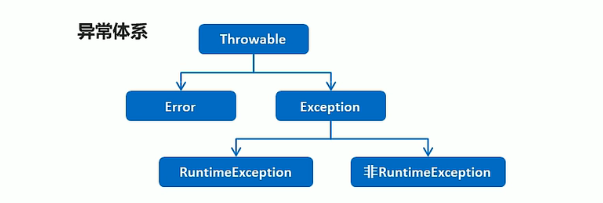

Error：严重问题，不需要处理

Exception：称为异常类，他表示程序本身可以处理的问题

##### _2.JVM的默认处理方案

如果程序出现了问题，我们没有做任何处理，最终JVM会做默认的处理

- 把异常的名称，异常原因及异常出现的位置等信息输出在了控制台
- 程序停止执行

如果程序出现了问题，我们需要自己来处理，有两种方案：

1. try … catch…
2. throws

##### _3. 异常处理-try…catch…

格式：

```java
try{
	可能出现异常的代码
}catch(异常类名 变量名){
	异常的处理代码;
}
```

执行流程：

1. 程序从try里面的代码开始执行
2. 出现异常，会自动生成一个异常类对象，该异常对象将被提交给Java运行时系统
3. 当Java运行时系统接收到异常对象时，会到catch中去找匹配的异常类，找到后进行异常的处理
4. 执行完毕后，程序还可以继续往下执行

##### _4. Throwable 的成员方法

|            方法名             |               说明               |
| :---------------------------: | :------------------------------: |
|  public String getMessage()   | 返回此 throwable的详细消息字符串 |
|   public String toString()    |      返回此可抛出的简短描述      |
| public void printStackTrace() |   把异常的错误信息输出在控制台   |

##### _5. 编译时异常和运行时异常的区别

Java中的一场被分为两大类：编译时异常和运行时异常，也被称为受检异常和非受检异常

所有的RuntimeException 类及其子类被称为运行时异常，其他的异常都是编译时异常

- 编译时异常：必须显示处理，否则程序就会发生错误，无法通过编译
- 运行时常：无需显示处理，也可以和编译时异常一样处理

##### _6. 异常处理-throws…

虽然我们通过try…catch…可以对异常进行处理，但是并不是所有的情况我们都有权限进行异常的处理。

也就是说，有些时候可能出现的异常是我们处理不了的，这个时候怎么办呢？？

针对这种情况，Java提供了 throws 的处理方案

**格式：**

  

```java
    throws 异常类名;
```

  注意：这个格式是跟在方法的括号后面的

- 编译时异常必须要进行处理，两种处理方案：try…catch…或者throws，如果采用throws这种方案，将来谁调用谁处理
- 运行时异常可以不处理，出现问题后，需要我们回来修改代码

##### _7. 自定义异常

**格式：**

```java
public class 异常类名 extends Exception{
    无参构造
    带参构造
}
```

**范例：**

```java
package DemoExveption;

public class scoreException extends Exception {
    public scoreException(){}

    public scoreException(String message){
        super(message);
    }
}
```

**代码演示：**

```java
package DemoExveption;

import java.util.Scanner;

/**
 * 1.自己写一个类，必须继承Exception 或者 RuntimeException
 * 2.重写构造方法
 *
 *
 *
 * 继承Exception(是编译异常的父类)，即是编译异常，就是必须处理
 */
//自定义一个异常类，MyException
class MyException extends Exception {
    public MyException() {
    }

    public MyException(String Message) {
        super(Message);
    }
}

//老师检查学生成绩是否正确
class Teacher {
    public void checkScore(int score) {
        if (score < 0 || score > 100){
            try {
                throw new MyException("输入的成绩不正确……");
            } catch (MyException e) {
                e.printStackTrace();
            }
        }else{
            System.out.println("录入成绩符合要求……");
        }
    }
}


public class DemoException3 {
    public static void main(String[] args) {
        Scanner in = new Scanner(System.in);
        System.out.print("输入成绩：");
        int score = in.nextInt();

        Teacher teacher = new Teacher();
        teacher.checkScore(score);

        StringBuilder sb = new StringBuilder();

        sb.append("123").append("nihao ");
        System.out.println(sb);

        StringBuilder sbb = new StringBuilder();
        sbb.append(45);
        System.out.println(sbb);

    }
}

```


##### _8. throws 和 throw 的区别

**throws：**

- 用在方法声明后面，跟的是异常类名
- 表示抛出异常，由该方法的调用者来处理
- 表示出现异常的一种可能性，并不一定会发生这些异常

**throw：**

- 用在方法体内，跟的是异常对象名
- 表示抛出异常，由方法体内的语句处理
- 执行 throw 一定抛出了某种异常


## 三十二、集合进阶(Collection单列)

#### 1.Collection(接口)集合

##### _1. 知识回顾

集合类的特点：提供了一种存储空间 可变的存储模型，存储的数据容量可以随时发生改变


##### _2. 集合类-体系结构

如图：

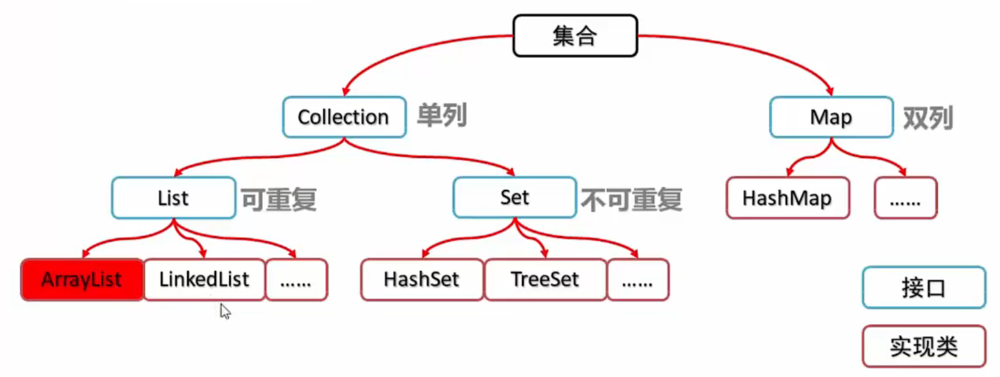


##### _3. Collection 集合概述和使用

Collection集合概述

- 是单例集合的顶层接口，它表示一组对象，这些对象也称为Collection的元素
- JDK不提供此接口的任何直接实现，它提供更具体的子接口（如Set 和 List）实现

创建 Collection 集合的对象

- 多态的方式
- 具体的实现类ArrayList

代码演示：

```java
   public static void main(String[] args) {
        //创建Collection集合的对象（单列集合对象）
        Collection<String> c = new ArrayList<String>();

        //添加元素：Boolean add (E e )
        c.add("Hello");
        c.add("my");
        c.add("编程世界！");

        //输出集合对象
        System.out.println(c);
       //输出结果展示：[Hello,my,编程世界]
```


##### _4. Collection 集合常用方法

|            方法             |                                    |
| :-------------------------: | :--------------------------------: |
|      boolean add(E e)       |              添加元素              |
|  boolean remove(Object o)   |       从集合中移除指定的元素       |
|        void clear()         |          清空集合中的元素          |
| boolean contains(Object o ) |    判断集合中是否存在指定的元素    |
|      boolean isEmpty()      |          判断集合是否为空          |
|         int size()          | 集合的长度，也就是集合中元素的个数 |


##### _5. Collection 集合的遍历

Itetator：迭代器，集合的专用遍历方式

- Iterator<E> iterator():返回此集合中元素的迭代器，通过集合的iterator()方法得到
- 迭代器是通过集合的iterator()方法得到的，所以我们说它是依赖于集合而存在的

Iterator中的常用方法

- E next()：返回迭代中的下一个元素
- Boolean hasNext()：如果迭代具有元素，则返回true，否则false

##### _6. 集合的使用步骤

1. 创建集合对象		
2. 添加元素              
3. 通过迭代器对象遍历      
4. 通过迭代器对象的hasNext()方法判断是否还有元素 
5. 通过对象的next()方法获取下一个元素 

```java
Collection<String> c = new ArrayList<String>();
c.add("hello");
Iterator<String> it = c.iterator();
while(c.hasNext()){
    String s = it.next();
    System.out.println(s);
}
```

##### 案例：Collection集合存储学生对象并遍历 

案例：Collection 集合存储学生对象并遍历

需求：创建一个存储学生对象的集合，存储3个学生对象，使用册灰姑娘徐实现在控制台遍历该集合

思路：

 * 1、定义学生类
 * 2、创建Collection集合对象
 * 3、创建学生对象
 * 4、把学生添加到集合
 * 5、遍历集合（迭代器方式）

```java
package Collection;

import java.util.ArrayList;
import java.util.Collection;
import java.util.Iterator;

/**
 * 案例：Collection 集合存储学生对象并遍历
 * 需求：创建一个存储学生对象的集合，存储3个学生对象，使用册灰姑娘徐实现在控制台遍历该集合
 * 思路：
 * 1、定义学生类
 * 2、创建Collection集合对象
 * 3、创建学生对象
 * 4、把学生添加到集合
 * 5、遍历集合（迭代器方式）
 */
public class IteratorEgDemo {

    //定义学生类
    static class Student {
        //成员变量
        private int id; //学号
        private String name; //姓名

        //构造方法
        public Student() {
        }

        public Student(int id, String name) {
            this.id = id;
            this.name = name;
        }

        //get 和 set 方法

        public int getId() {
            return id;
        }

        public void setId(int id) {
            this.id = id;
        }

        public String getName() {
            return name;
        }

        public void setName(String name) {
            this.name = name;
        }
    }

    //测试类
    public static void main(String[] args) {
        //创建Collection集合对象
        Collection c = new ArrayList<Student>();

        //创建学生对象
        Student s1 = new Student(2112010214, "张三");
        Student s2 = new Student(2112010214, "lisi");
        Student s3 = new Student(2112010214, "wangwu");
        Student s4 = new Student(2112010214, "haha");

        c.add(s1);
        c.add(s2);
        c.add(s3);
        c.add(s4);

        //遍历集合（迭代器方式）
        Iterator<Student> it = c.iterator();
        while (it.hasNext()) {
            Student s = it.next();
            System.out.println(s.getId() + " " + s.getName() );
        }

    }

}
```

#### 2.List集合(接口-可重复)

##### _1. List 集合概述和特点

List集合概述

- 有序集合（也称为序列），用户可以精确控制列表中每个元素的插入位置。用户可以通过整数索引访问元素，并搜索列表中的元素
- 与Set 集合不同，列表通常允许重复的元素

List集合特点：

- 有序：存储和取出的元素顺序一致
- 可重复：存储的元素可以重复

```java
package Collection.List;

import java.util.ArrayList;
import java.util.Iterator;
import java.util.List;

public class ListDemo01 {
    public static void main(String[] args) {
        //创建集合对象
        List<String> list = new ArrayList<String>();

        //添加元素
        list.add("你好");
        list.add("我的");
        list.add("世界");
        list.add("你好");

        //迭代器的方式遍历
        Iterator<String> it = list.iterator();
        while (it.hasNext()){
            String n = it.next();
            System.out.println(n);
        }
    }
}

```


##### _2. List 集合特有方法

|              方法               |                  说明                  |
| :-----------------------------: | :------------------------------------: |
| void add(int index , E element) |   在此集合中的指定位置插入指定的元素   |
|       E remove(int index)       | 删除指定索引处的元素，返回被删除的元素 |
|  E set(int index , E element)   | 修改指定索引处的元素，返回被修改的元素 |
|        E get(int index)         |          返回指定索引处的元素          |

**代码演示：**

```java
  /**
     * 1.void add(int index , E element)
     * 在此集合中的指定位置插入指定的元素
     * */
    @Test
    public void test01(){
        //创建list集合
        List list1 = new ArrayList();
        //新增元素
        list1.add("a");
        list1.add("c");
        list1.add("b");

        System.out.println(list1);//插入前：[a, c, b]

        list1.add(1,"wo ");

        System.out.println(list1);//插入后：[a, wo , c, b]

        //迭代器遍历
        System.out.println("迭代器遍历:");
        Iterator it = list1.iterator();
        while (it.hasNext()){
            Object obj = it.next();
            String s = (String)obj;
            System.out.println(s);
        }
    }

-----------------------------------------------------------------------------------------

/**
 * boolean addAll​(int index,Collection<? extends E> c)
 * 将指定集合中的所有元素插入到此列表中的指定位置（可选操作）。
 * */
@Test
    public void test02(){
    //创建list集合
    List list1 = new ArrayList();
    //新增元素
    list1.add("a");
    list1.add("c");
    list1.add("b");

    List list2 = new ArrayList();
    list2.add("叮叮");
    list2.add("铛铛");
    list2.add("世界");

    System.out.println("插入前：");
    System.out.println(list1);//[a, c, b]

    list1.addAll(1,list2);
    System.out.println("插入后：");
    System.out.println(list1);//[a, 叮叮, 铛铛, 世界, c, b]
}


-----------------------------------------------------------------------------------------
/**
 * boolean remove​(Object o)
 * 从列表中删除指定元素的第一个出现（如果存在）（可选操作）。
 * */
    @Test
    public void test03(){
        //创建list集合
        List list1 = new ArrayList();
        //新增元素
        list1.add("a");
        list1.add("c");
        list1.add("b");

        System.out.println("删除前：");
        System.out.println(list1);

        Object r = list1.remove(1);
        System.out.println("删除的值为：" + r);

        System.out.println("删除后：");
        System.out.println(list1);

        List list2 = new ArrayList();
        list2.add("叮叮");
        list2.add("铛铛");
        list2.add("世界");

    }


-----------------------------------------------------------------------------------------
/**
 * boolean removeAll​(Collection<?> c)
 * 从此列表中删除包含在指定集合中的所有元素（可选操作）。
 * */
    @Test
    public void test04(){
        //创建list集合
        List list1 = new ArrayList();
        //新增元素
        list1.add("a");
        list1.add("c");
        list1.add("b");

        List list2 = new ArrayList();
        list2.add("c");
        list2.add("a");

        System.out.println("删除前list1集合：");
        System.out.println(list1);
        System.out.println("删除前list2集合：");
        System.out.println(list2);

        list1.removeAll(list2);

        System.out.println("list1 减去 list2 后：");
        System.out.println(list1);
    }


-----------------------------------------------------------------------------------------
    /**
     * E set​(int index,E element)
     * 用指定的元素（可选操作）替换此列表中指定位置的元素。
     * */
    @Test
    public void test05(){
        //创建list集合
        List list1 = new ArrayList();
        //新增元素
        list1.add("a");
        list1.add("c");
        list1.add("b");

        System.out.println("修改前：");
        System.out.println(list1);

        Object a = list1.set(0, "a已经被替换");
        System.out.println("进行修改的元素为：" + a);

        System.out.println("修改后：");
        System.out.println(list1);
    }


-----------------------------------------------------------------------------------------

    /**
     * E get​(int index)
     * 返回此列表中指定位置的元素。
     * */
    @Test
    public void test06(){
        //创建list集合
        List list1 = new ArrayList();
        //新增元素
        list1.add("a");
        list1.add("c");
        list1.add("b");

        System.out.print("集合：");
        System.out.println(list1);

        Object s = li	st1.get(1);
        System.out.println("提取元素：" + s);
    }
```


##### _3. 案例：List集合存储学生对象并遍历

需求：创建一个存储学生对象的集合，存储3个学生对象，使用程序在控制台遍历该集合

思路：

1. 定义学生类
2. 创建List集合对象
3. 创建学生对象
4. 把学生添加到集合
5. 遍历集合（迭代器方式、for循环方式）

```java
@Test
    public void stuDemo(){
        //创建List集合
        List<Stu> list = new ArrayList();

        Stu s1 = new Stu("公孙",19);
        Stu s2 = new Stu("晓狸",20);
        Stu s3 = new Stu("菲菲",21);

        list.add(s1);
        list.add(s2);
        list.add(s3);

        //遍历集合（迭代器方式）
        Iterator<Stu> it = list.iterator();
        while(it.hasNext()){
           Stu ss= it.next();
            System.out.println(ss.getName() + "%%%" + ss.getAge());
        }

        System.out.println("----------------");

        //遍历集合（for循环）
        for (int i = 0;i<list.size();i++){
            Stu ss = list.get(i);
            System.out.println(ss.getName() + "%%%" + ss.getAge());
        }
    }
```

##### _4. 并发修改异常

并发修改异常

- ConcurrentModificationException

产生原因

- 迭代器遍历的过程中，通过集合对象修改了集合中元素的长度，造成了迭代器获取元素中判断预期修改值和实际修改值和实际修改值不一致

解决方案

- 用for循环遍历，然后用集合对象做对应的操作即可

##### _5. ListIterator列表迭代器

**ListIterator：列表迭代器**

- 通过List集合的listIterator()方法得到，所以它是List集合特有的迭代器
- 用于允许程序员沿任一方向遍历列表的列表迭代器，在迭代期间修改列表，并获取列表中迭代器的当前位置

**ListIterator中的常用方法**

- void add(E e) :将指定的元素插入列表（可选操作）。  
- boolean hasNext(): 如果此列表迭代器在向前方向遍历列表时具有更多元素，则返回 true 。  
- boolean hasPrevious(): 如果此列表迭代器在相反方向遍历列表时具有更多元素，则返回 true 。  
- E next() :返回列表中的下一个元素，并且前进光标位置。  
- int nextIndex() :返回由后续调用返回的元素的索引 next() 。  
- E previous() :返回列表中的上一个元素，并向后移动光标位置。  
- int previousIndex() :返回由后续调用返回的元素的索引 previous() 。  
- void remove() :从列表中删除 next()或 previous() （可选操作）返回的最后一个元素。  
- void set(E e) :用指定的元素（可选操作）替换 next()或 previous()返回的最后一个元素。  

**代码演示：**

```java
package Collection.List;

import org.junit.Test;

import java.util.ArrayList;
import java.util.Iterator;
import java.util.List;
import java.util.ListIterator;

/**
 * void add(E e) 将指定的元素插入列表（可选操作）。
 * boolean hasNext() 如果此列表迭代器在向前方向遍历列表时具有更多元素，则返回 true 。
 * boolean hasPrevious() 如果此列表迭代器在相反方向遍历列表时具有更多元素，则返回 true 。
 * E next() 返回列表中的下一个元素，并且前进光标位置。
 * int nextIndex() 返回由后续调用返回的元素的索引 next() 。
 * E previous() 返回列表中的上一个元素，并向后移动光标位置。
 * int previousIndex() 返回由后续调用返回的元素的索引 previous() 。
 * void remove() 从列表中删除 next()或 previous() （可选操作）返回的最后一个元素。
 * void set(E e) 用指定的元素（可选操作）替换 next()或 previous()返回的最后一个元素。
 * */
public class ListIteratorDemo {

    @Test
    public void ListIterator01(){
        List list = new ArrayList();
        list.add("Hello");
        list.add("Java");
        list.add("World");

        //使用迭代器（正向）遍历
//        ListIterator<String> litr1 = list.listIterator();
//        System.out.println("--------正向遍历：--------");
//        while(litr1.hasNext()){
//            String s = litr1.next();
//            System.out.println(s);
//        }
//
//        //使用迭代器（反向）遍历
//        System.out.println("--------反向遍历：--------");
//        while(litr1.hasPrevious()){
//            String s = litr1.previous();
//            System.out.println(s);
//        }

        //获取列表迭代器
        ListIterator<String> lit = list.listIterator();
        while(lit.hasNext()){
            String s = lit.next();
            if (s.equals("Hello")){
                lit.add("C++");//Hello 后面添加一个C++,并把之前的数据依次往后挤
            }
        }
        System.out.println(list);
    }
}

```

##### _6. 增强for循环

增强for：简化数组和Collection集合的遍历

- 实现Iterable接口的类允许其对象成为增强型 for 语句的目标
- 它是JDK5之后出现的，其内部原理是一个Iterator迭代器

增强for的格式

- 格式

  for（元素数据类型 变量名：数组或者Collection集合）{

  ​	//在此处使用变量即可，该变量就是元素

  }

- 范例

  ```java
  int[] arr = {1,2,3,4,5}
  
  for(int i : arr){
  
  	System.out.println(i);
  
  }
  ```


代码演示：

```java
package Collection.List;


import org.junit.Test;

import java.util.ArrayList;
import java.util.List;

/**
 * 增强for循环Demo
 * */
public class BoostFor {

    @Test
    public void Test01(){
        int[] arr = {77,25,36,84,97};

        for (int i : arr){
            System.out.println(i);
        }

    }

    @Test
    public void Test02(){
        List<String> c = new ArrayList();

        c.add("hello");
        c.add("wode ");
        c.add("女孩");

        //增强for循环内部原理：其实就是一个Iterator迭代器
        for (String s :c){
            if (s.equals("女孩")){
                c.add("范晓芹");
            }
            System.out.println(s);//checkForComodification
        }
    }
}

```

##### _7. 案例：List集合存储学生对象用三种方式遍历

需求：创建一个存储学生对象的集合，存储3个学生对象，使用三中方式进行遍历

思路：

1. 定义学生类
2. 创建List集合对象
3. 创建学生对象
4. 把学生添加到集合
5. 遍历集合
   1. 迭代器：集合特有的遍历方式
   2. 普通for：带有索引的遍历方式
   3. 增强for：最方便的遍历方式

代码演示：

```java
package Collection.List;

import org.junit.Test;

import java.util.ArrayList;
import java.util.Iterator;
import java.util.List;

/**
 * 遍历
 * 1.迭代器遍历
 * 2.普通for
 * 3.增强for
 * */
public class BianLi {
    /**
     * 学生类
     * */
    class Student{
        //成员变量
        private String name;
        private int age;

        //构造方法
        public Student() {
        }
        public Student(String name, int age) {
            this.name = name;
            this.age = age;
        }

        //get set 方法
        public String getName() {
            return name;
        }

        public void setName(String name) {
            this.name = name;
        }

        public int getAge() {
            return age;
        }

        public void setAge(int age) {
            this.age = age;
        }
    }

    //迭代器遍历
    @Test
    public void StudentDemo1(){
        System.out.println("迭代器遍历");
        
        //创建学生对象
        Student s1 = new Student("甘雨",19);
        Student s2 = new Student("莫娜",14);
        Student s3 = new Student("钟离",22);

        //新建集合对象 并 将学生对象添加到List集合当中
        List list = new ArrayList();
        list.add(s1);
        list.add(s2);
        list.add(s3);

        //使用迭代器进行遍历
        Iterator<Student> itr = list.iterator();

        while(itr.hasNext()){
            Student ss = itr.next();
            System.out.println(ss.getName() + "-0-0-" + ss.getAge() + "岁");
        }
    }

    //普通for遍历
    @Test
    public void StudentDemo2(){
        System.out.println("普通for遍历");
        
        //创建学生对象
        Student s1 = new Student("甘雨",19);
        Student s2 = new Student("莫娜",14);
        Student s3 = new Student("钟离",22);

        //新建集合对象 并 将学生对象添加到List集合当中
        List<Student> list = new ArrayList();
        list.add(s1);
        list.add(s2);
        list.add(s3);

        //普通for循环遍历
        for (int i = 0; i<list.size();i++){
            Student ss = list.get(i);
            System.out.println(ss.getName() + "-0-0-" + ss.getAge() + "岁");
        }

    }

    //增强for遍历
    @Test
    public void StudentDemo3(){
        System.out.println("增强for遍历");
        
        //创建学生对象
        Student s1 = new Student("甘雨",19);
        Student s2 = new Student("莫娜",14);
        Student s3 = new Student("钟离",22);

        //新建集合对象 并 将学生对象添加到List集合当中
        List<Student> list = new ArrayList();
        list.add(s1);
        list.add(s2);
        list.add(s3);

       //增强for循环遍历
        for (Student ss: list){
            System.out.println(ss.getName() + "-0-0-" + ss.getAge() + "岁");
        }

    }
}
```

##### _8. 数据结构之栈和队列

数据结构是计算机存储、组织数据的方式。是指相互之间存在一种或多种特定关系的数据元素的集合。通常情况下，精心选择的数据结构可以带来更高的运行或者存储效率

（1）常见数据结构-栈

​			**<  栈是一种先进后出的模型。>**

数据进入栈模型的过程称为：压/进栈

数据离开栈模型的过程称为：弹/出栈

​	数据A、数据B、数据C、数据D

```java
进：A  B  C  D  
出：D  C  B  A


			 *							 *
栈顶元素	  *			数据D				 *
			*							 *
			*			数据C				*
			*							 *
			*			数据B				*
			*							 *
栈底元素	 *			数据A			     *
			*							 *
			******************************
```

（2）常见数据结构-队列

​			**<  队列是一种先进先出的模型。>**

数据从后端进入队列模型的过程称为：入队列

数据从前端离开队列模型的过程称为：出队列

数据A、数据B、数据C、数据D

```java
进：A  B  C  D  
出：A  B  C  D

						入口-入队列（后端）

			*							 *
			*			数据D				*
			*							 *
			*			数据C				*
			*							 *
			*			数据B				*
			*							 *
			*			数据A			    *
			*							 *
			
						出口-出队列（前端）
			
```

##### _9. 数据结构之数组和链表

（1）常见数据结构-数组

数组是一种**查询快，增删慢**的模型

查询数据通过索引定位，查询任意数据耗时相同，**查询效率高**

删除数据时，要将原始数据删除，同时后面每个数据前移，**删除效率低**

添加数据时，添加位置后的每个数据后移，再添加元素，**添加效率极低**

（2）常见数据结构-链表

结构图例：

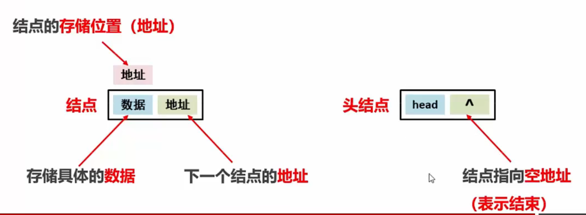

链表逻辑分析：

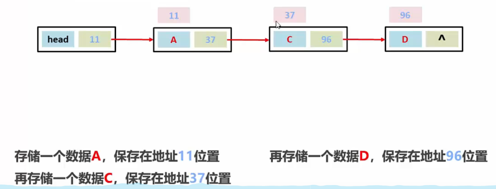

添加：

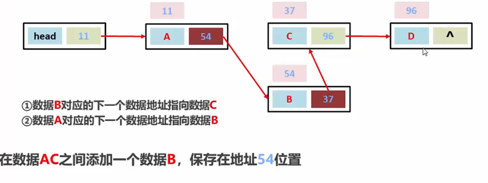

​		链表是一种增删快的模型（对比数组）

​		链表是一种查询慢的模型（对比数组）

查询数据D是否存在，必须从头（head）开始查询

查询第3个数据，必须从头（head）开始查询


##### _10. List集合子类的特点

List集合常用子类：ArrayList、LinkedList

- ArrayList：底层数据结构是数组，查询快，增删慢
- LinkedList：底层数据结构是链表，查询慢，增删快

**练习：**

分别使用ArrayList 和 LinkedList 完成存储字符串并遍历

```java
package Collection.List;

import org.junit.Test;

import java.util.ArrayList;
import java.util.Iterator;
import java.util.LinkedList;
import java.util.List;

/***
 * 使用3中遍历方式对字符串进行遍历
 * 要求：
 *  使用ArrayList和 LinkedList
 * */
public class ThreeBianLi {
    public static void main(String[] args) {
        /***
         * 采用ArrayList的方式遍历
         * */
        //创建数组
        List<String> list = new ArrayList<>();
        list.add("你好");
        list.add("世界");
        list.add("欢迎");

        //增强for遍历
        System.out.println("增强for遍历");
        for (String ll : list){
            System.out.println(ll);
        }

        System.out.println("---迭代器遍历----");
        //迭代器遍历
        Iterator<String> iterator = list.iterator();
        while (iterator.hasNext()){
            System.out.println(iterator.next());
        }

        System.out.println("--普通for循环遍历-----");
        //普通for循环遍历
        for (int i = 0 ; i<list.size();i++){
            String ss = list.get(i);
            System.out.println(ss);
        }
    }

    /***
     * 采用LinkedList的方式遍历
     * */
    @Test
    public void TestDemo(){
        //创建LinkedList数组
        LinkedList<String> linkedList = new LinkedList<>();
        linkedList.add("你好");
        linkedList.add("世界");
        linkedList.add("欢迎");

        //增强for遍历
        System.out.println("增强for遍历");
        for (String s :linkedList){
            System.out.println(s);
        }


        System.out.println("---迭代器遍历----");
        //迭代器遍历
        Iterator<String> itr = linkedList.iterator();

        while (itr.hasNext()){
            String ss = itr.next();
            System.out.println(ss);
        }

        System.out.println("--普通for循环遍历-----");
        //普通for循环遍历
        for (int i = 0; i<linkedList.size();i++){
            String ss = linkedList.get(i);
            System.out.println(ss);
        }
    }
}

```

##### _11. LinkedList集合的特有功能

|           方法名           |               说明               |
| :------------------------: | :------------------------------: |
| public void addFirst(E e ) |    再该列表开头插入指定的元素    |
| public void addLast(E e )  |  将指定的元素追加到此列表的末尾  |
|    public E getFirst()     |      返回列表中的第一个元素      |
|     public E getLast()     |      返回列表中最后一个元素      |
|   public E removeFirst()   |  从此列表中删除并返回第一个元素  |
|   public E removeLast()    | 从此列表中删除并返回最后一个元素 |


#### 3. Set集合(接口-不可重复)

##### _1. Set 集合特点

​		不包含重复元素的集合、无序

​		没有带索引的方法，所以不能使用普通for循环遍历

​	HashSet：对集合的迭代顺序不作任何保证

##### _2. 哈希值

​		是JDK根据对象的 **地址** 或者 **字符串** 或者 **数字** 算出来的 int 类型的树值

​	Object类中有一个方法可以获取对象的哈希码值

​		public int hashCode();  返回对象的哈希码值

**对象的哈希值特点：**

- 同一个对象多次调用hashCode( )方法返回的哈希值是相同的
- 默认情况下，不同对象的哈希值是不相同的
- 通过方法重写，可以实现不同对象的哈希值是相同的

##### _3. HashSet集合概述和特点

HashSet集合特点

- 底层数据结构是哈希表
- 对集合的迭代顺序不作任何保证，也就是说不保证存储和取出的元素顺序一致
- 没有带索引的方法，所以不能使用普通for循环遍历
- 由于Set集合，所以是不包含重复元素的集合

**HashSet集合练习：**

```java
package Collection.HashSet;

import java.util.HashSet;
import java.util.Iterator;
import java.util.Set;

public class HashSetDemo01 {
    public static void main(String[] args) {
        //创建集合对象
        Set<String> hashSet = new HashSet<>();
        hashSet.add("hello");
        hashSet.add("My");
        hashSet.add("world");

        //迭代器遍历
        System.out.println("迭代器遍历：");
        Iterator<String> itr = hashSet.iterator();
        while(itr.hasNext()){
            String ss = itr.next();
            System.out.println(ss);
        }

        System.out.println("--------");
        System.out.println("增强for循环：");
        //增强for循环遍历
        for (String ss : hashSet){
            System.out.println(ss);
        }
    }
}

```

##### _4. HashSet集合保证元素唯一性源码分析

HashSet集合添加一个元素的过程：

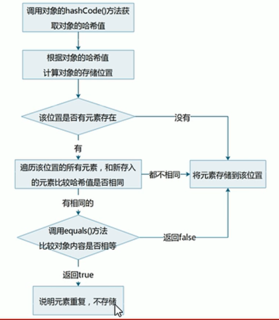

HashSet集合存储元素：

- 要保证元素唯一性，需要重写**hashCode()** 和 **equals()**

##### _5. 常见数据结构-哈希表

哈希表：

​		JDK8之前，底层采用数组+ 链表实现，可以说是一个元素为链表的数组

​		JDK8之后，在长度比较长的时候，底层实现了优化

```java
"hello"  99162322      %   16  =2
"world"  11318802      %   16  =2
"Java"   32541384      %   16  =2
"world"  113318802     %   16  =2
"通话"    1179395      %   16  =3
"重地"    1179395      %   16  =3
    
    
存储示意图：
  0		1		2			3			4…………15
 			 hello		   通话
    		 world		   重地
    		 Java
    
    
```

##### _6. 案例：HashSet集合存储学生对象并遍历

需求：创建一个存储学生对象的集合，存储多个学生对象，使用程序实现在控制台遍历该集合

​	要求：学生对象的成员变量值相同，我们就认为是同一个对象

思路：

1. 定义学生类
2. 创建HashSet集合对象
3. 创建学生对象
4. 把学生添加到集合中
5. 遍历集合（增强for）
6. 在学生类中重写两个方法
   1. hashCode() 和 equals()
   2. 自动生成即可

代码演示：

```java
package Collection.HashSet;

import java.util.HashSet;
import java.util.Objects;

/**
 * 需求：创建一个存储学生对象的集合，存储多个学生对象，使用程序实现在控制台遍历该集合
 *
 * 	要求：学生对象的成员变量值相同，我们就认为是同一个对象
 *
 * 思路：
 *
 * 1. 定义学生类
 * 2. 创建HashSet集合对象
 * 3. 创建学生对象
 * 4. 把学生添加到集合中
 * 5. 遍历集合（增强for）
 * */
public class HashSetDemo02 {

    //1. 定义学生类
     static class Student {
        //成员变量
        private String name;
        private int age;

        //构造方法
        public Student() {
        }
        public Student(String name, int age) {
            this.name = name;
            this.age = age;
        }

        //get set 方法
        public String getName() {
            return name;
        }

        public void setName(String name) {
            this.name = name;
        }

        public int getAge() {
            return age;
        }

        public void setAge(int age) {
            this.age = age;
        }

        /**
         * 方法重写区域
         * */
        @Override
        public boolean equals(Object o) {
            if (this == o) return true;
            if (o == null || getClass() != o.getClass()) return false;
            Student student = (Student) o;
            return age == student.age && Objects.equals(name, student.name);
        }
        @Override
        public int hashCode() {
            return Objects.hash(name, age);
        }
    }

    //Demo
    public static void main(String[] args) {
        //2. 创建HashSet集合对象
        HashSet<Student> hashSet = new HashSet();

        //3. 创建学生对象
        Student s1 = new Student("范范",20);
        Student s2 = new Student("晓晓",19);
        Student s3= new Student("芹芹",20);

        Student s4 = new Student("晓晓",19);

        //4. 把学生添加到集合中
        hashSet.add(s1);
        hashSet.add(s2);
        hashSet.add(s3);
        hashSet.add(s4);

        //5. 遍历集合（增强for）
        for (Student s : hashSet){
            System.out.println(s.getName() + " @@ " + s.getAge());
        }
    }

}
```

##### _7. LinkedHashSet集合概述和特点

LinkedHashSet集合特点

- 哈希表和链表实现的Set接口，具有可预测的迭代次序
- 由链表保证元素有序，也就是说元素的存储和取出顺序是一致的
- 由哈希表保证元素唯一，也就是说没有重复的元素

LinkedHashSet集合练习：

- 存储字符串并遍历

```Java
package Collection.HashSet;

import java.util.LinkedHashSet;

/**
 * LinkedHashSet集合特点
 *
 * - 哈希表和链表实现的Set接口，具有可预测的迭代次序
 * - 由链表保证元素有序，也就是说元素的存储和取出顺序是一致的
 * - 由哈希表保证元素唯一，也就是说没有重复的元素
 * */
public class LinkedHashSetDemo {
    public static void main(String[] args) {
        //创建集合对象
        LinkedHashSet<String> lhs = new LinkedHashSet();

        //将字符串放入集合
        lhs.add("hello");
        lhs.add("world");
        lhs.add("Java");

        lhs.add("world");

        //遍历字符串
        for (String s :lhs){
            System.out.println(s);
        }
    }
}
```

##### _8. TreeSet集合概述和特点

TreeSet集合特点

- 元素有序，这里的顺序不是指存储和取出的顺序，而是按照一定规则进行排序，具体排序方式取决于构造方法

  ​		TreeSet()：根据其元素的自然排序进行排序

  ​		TreeSet(Comparator)：根据指定的比较器进行排序

- 没有带索引的方法，所以不能使用普通for循环遍历

- 由于是Set集合，所以不包含重复元素的集合

TreeSet集合练习：

```java
package Collection.TreeSet;

import java.util.TreeSet;

public class TreeSetDemo {
    public static void main(String[] args) {
        //新建集合
        TreeSet<Integer> trs = new TreeSet<>();

        //添加集合对象
        trs.add(10);
        trs.add(30);
        trs.add(120);
        trs.add(40);
        trs.add(60);

        trs.add(120);//不添加，特点决定，不包含重复元素

        for (Integer i :trs){
            System.out.println(i);
        }
        //输出：10、30、40、60、120 并且包含自然排序
    }
}
```

##### _9. 自然排序Comparable的使用

- 存储学生对象并遍历，创建TreeSet集合使用无参构造方法
- 要求：按照年龄从小到大排序，年龄相同时，按照姓名的字母顺序排序

结论：

- 用TreeSet集合存储自定义对象，无参构造方法使用的是自然排序对元素进行排序的
- 自然排序，就是让元素所属的类实现Comparable接口，重写compareTo(To)方法
- 重写方法时，一定要注意排序规则必须按照要求的主要条件和次要条件来写

```java
package Collection.TreeSet;

import org.junit.Test;

import java.util.TreeSet;

/***
 * - 存储学生对象并遍历，创建TreeSet集合使用无参构造方法
 * - 要求：按照年龄从小到大排序，年龄相同时，按照姓名的字母顺序排序
 *
 * 结论：
 *
 * - 用TreeSet集合存储自定义对象，无参构造方法使用的是自然排序对元素进行排序的
 * - 自然排序，就是让元素所属的类实现Comparable接口，重写compareTo(To)方法
 * - 重写方法时，一定要注意排序规则必须按照要求的主要条件和次要条件来写
 * */
public class TreeSetDemo02 {
    class Student implements Comparable<Student> {//
        //成员变量
        private String name;
        private int age;

        //构造方法
        public Student() {
        }
        public Student(String name, int age) {
            this.name = name;
            this.age = age;
        }

        //get set 方法
        public String getName() {
            return name;
        }

        public void setName(String name) {
            this.name = name;
        }

        public int getAge() {
            return age;
        }

        public void setAge(int age) {
            this.age = age;
        }

        /**
         * 重写方法区域
         * */
        @Override
        public int compareTo(Student s) {
            //只输出一个：yangyuhuan @ 29
//            return 0;
            /*按照添加顺序输出：yangyuhuan @ 29 、 diaochan @ 30 、 xishi @ 33 、 wangzhaojun @ 27*/
//            return 1;
            /*按照添加顺序(逆向)输出：wangzhaojun @ 27  、 xishi @ 33  、 diaochan @ 30  、 yangyuhuan @ 29*/
//            return -1;

            //按照年龄从小到达排序
            int num = this.age - s.age;

            //年龄相同时，按照姓名字母排序
            int num2 =  num==0 ? this.name.compareTo(s.name) : num;
            return num2;
        }

    }

    @Test
    public void  comparableDemo(){
        //创建集合对象
        TreeSet<Student> trs = new TreeSet<Student>();

        //创建学生对象
        Student s1 = new Student("yangyuhuan",29);
        Student s2 = new Student("diaochan",30);
        Student s3 = new Student("xishi",33);
        Student s4 = new Student("wangzhaojun",27);

        Student s5 = new Student("dadadada",33);

        //将学生对象添加到集合当中
        trs.add(s1);
        trs.add(s2);
        trs.add(s3);
        trs.add(s4);
        trs.add(s5);


        for (Student s :trs){
            System.out.println(s.getName() + " @ " + s.getAge());
        }


    }
}

```

##### _10. 比较器排序Comparator的使用

- 存储学生对象并遍历，创建TreeSet集合使用**带参构造方法**
- 要求：按照年龄从小到大排序，年龄相同时，按照姓名的字母顺序排序

结论：

- ​	用TreeSet集合存储自定义对象，带参构造方法使用的是**比较器排序**对元素进行排序的
- 比较器排序，就是**让集合构造方法接受Comparator的实现类对象**，重写compare(T o1, T o2)方法
- 重写方法时，一定要注意排序规则必须按照要求的主要条件和次要条件来写

代码演示：

```java
@Test
    public void TestComparatorDemo(){
        //创建集合对象
        TreeSet<Student> trs = new TreeSet<>(new Comparator<Student>() {
            @Override
            public int compare(Student s1, Student s2) {
                int num = s1.getAge() - s2.getAge();
                int num2 = num == 0 ?s1.getName().compareTo(s2.getName()) : num;
                return num2;
            }
        });

        //创建学生对象
        Student s1 = new Student("范范",29);
        Student s2 = new Student("晓晓",30);
        Student s3 = new Student("晓晓",30);

        //学生添加到集合
        trs.add(s1);
        trs.add(s2);
        trs.add(s3);

        //遍历
        for (Student s : trs){
            System.out.println(s.getName() + " @ " + s.getAge());
        }

    }
```

##### _11. 案例：成绩排序

需求：用TreeSet集合存储多个学生信息（姓名，语文成绩，数学成绩），并遍历该集合

​		要求：按照总分从高到低出现

```java
package Collection.TreeSet;

import org.junit.Test;

import java.util.Comparator;
import java.util.TreeSet;

/**
 * 需求：用TreeSet集合存储多个学生信息（姓名，语文成绩，数学成绩），并遍历该集合
 *
 * 	要求：按照总分从高到低出现
 * */
public class TreeSetDemo03 {
    class Student{
        //成员变量
        private String name;//学生姓名
        private int chinese;//语文成绩
        private int macth;//数学成绩
        private int sum;//总分

        //构造方法
        public Student() {
        }
        public Student(String name, int chinese, int macth) {
            this.name = name;
            this.chinese = chinese;
            this.macth = macth;
        }

        //get set 方法
        public String getName() {
            return name;
        }

        public void setName(String name) {
            this.name = name;
        }

        public int getChinese() {
            return chinese;
        }

        public void setChinese(int chinese) {
            this.chinese = chinese;
        }

        public int getMacth() {
            return macth;
        }

        public void setMacth(int macth) {
            this.macth = macth;
        }

        public int getSum() {
            return sum = this.chinese + this.macth;
        }

        public void setSum(int sum) {
            this.sum = sum;
        }

        @Override
        public String toString() {
            return "Student{" +
                    "name='" + name + '\'' +
                    ", chinese=" + chinese +
                    ", macth=" + macth +
                    '}';
        }
    }

    @Test
    public void PaiXuDemo(){
        //创建集合对象
        TreeSet<Student> trs = new TreeSet<Student>(new Comparator<Student>() {
            @Override
            public int compare(Student s1, Student s2) {
                //主要条件
                int sum = s2.getSum() - s1.getSum();
                //次要条件
                int num1 = sum == 0 ?  s2.chinese - s1.chinese:sum;
                //次要条件 
                int num2 = num1 == 0 ? s2.getName().compareTo(s1.getName()) : num1;
                return num2;
            }
        });

        //创建学生对象
        Student s1 = new Student("貂蝉" ,9,8);
        Student s2 = new Student("吕布" ,7,9);
        Student s3 = new Student("黄盖" ,4,6);
        Student s4 = new Student("叶问" ,5,5);
        Student s5 = new Student("成龙" ,3,7);

        //向集合中添加对象
        trs.add(s1);
        trs.add(s2);
        trs.add(s3);
        trs.add(s4);
        trs.add(s5);

        //遍历输出集合
        for (Student s : trs){
            System.out.println(s);
        }
    }
}
```

##### _12. 案例：不重复的随机数

需求：编写一个程序，获取10个1-20之间的随机数，要求随机数不能重复，并在控制台输出

思路：

1. 创建Set集合对象

2. 创建随机数对象

3. 判断集合的长度是不是小于10

   ​    是：产生一个随机数，添加到集合

   ​    回到3继续

4. 遍历集合

**代码演示：**

```java
package Collection.TreeSet;

import java.util.*;

/**
 * 需求：编写一个程序，获取10个1-20之间的随机数，要求随机数不能重复，并在控制台输出
 *
 * 思路：
 * 1. 创建Set集合对象
 * 2. 创建随机数对象
 * 3. 判断集合的长度是不是小于10
 *       是：产生一个随机数，添加到集合
 *       回到3继续
 * 4. 遍历集合
 * */
public class TreeSetRandomDemo {

    public static void main(String[] args) {
        //创建Set集合对象
//        Set<Integer> set = new HashSet<Integer>();
        Set<Integer> set = new TreeSet<Integer>();

        //创建随机数对象
        Random random = new Random();

        //判断集合的长度是不是小于10
            while (set.size() < 20) {
                int num = random.nextInt(20) + 1;
                System.out.println(num);
                set.add(num);
            }

        System.out.println("Set集合的元素为：" + set);

        //遍历集合
        for(Integer i : set){
            System.out.print(i + "  ");
        }
    }

}
```

## 三十三、泛型

#### 1.泛型概述和好处

##### _1. 泛型概述

**泛型**：是JDK5中引入的特性，它提供了编译 时类型安全检测机制，该机制允许再编译时检测到非法的类型

​		它的本质是**参数化类型**，也就是说操作的数据类型被指定为一个参数

**一提到参数**，最熟悉的就是定义方法时有形参，然后带哦用方法时传递实参。那么参数化类型怎么理解呢？

​		顾名思义，就是**将类型由原来的具体的类型参数化，然后在使用/调用时传入具体的类型**

这种参数类型可以用在类、方法和接口中，分别被称为泛类型、泛型方法、泛型接口

**泛型定义格式：**

- <类型>：指定一种类型的格式。这里的类型可以看成是形参
- <类型1, 类型2…>：指定多种类型的格式，多种类型之间用逗号隔开。这里的类型可以看成是形参
- 将来具体调用时侯给定的类可以看成是实参，并且实惨的类型只能是引用数据类型

##### _2. 泛型的好处

- 把运行时期的问题提前到了编译期间
- 避免了强制类型转换

#### 2.泛型类

泛型类的定义格式：

- 格式：修饰符 class 类名<类型>{  }

- 范例：public class Generic<T>{  }

  ​            此处 T 可以随便写任意标识，常见的如 **T 、E、K、V** 等形式的参数常用于表示泛型

代码演示：

```java
package Collection.GenericDemo;

import com.sun.org.apache.xpath.internal.operations.Bool;
import org.junit.Test;

/**
 * 泛型类的定义格式：
 *
 * - 格式：修饰符 class 类名<类型>{  }
 *
 * - 范例：public class Generic<T>{  }
 *
 *              此处 T 可以随便写任意标识，常见的如 **T 、E、K、V** 等形式的参数常用于表示泛型
 * */
public class GenericDemo01 {
    /**
     * 定义泛型类
     * */
    class Generic<T>{
        //成员变量
        private T t;

        //get set 方法
        public T getT() {
            return t;
        }
        public void setT(T t) {
            this.t = t;
        }

    }

    /**
     * 定义老师类
     * */
    class Teacher{
        //成员变量
        private String name;
        private int age;

        //get set 方法
        public String getName() {
            return name;
        }

        public void setName(String name) {
            this.name = name;
        }

        public int getAge() {
            return age;
        }

        public void setAge(int age) {
            this.age = age;
        }
    }

    /**
     * 定义学生类
     * */
    class Student{
        //成员变量
        private String name;
        private int age;

        //get  set 方法
        public String getName() {
            return name;
        }

        public void setName(String name) {
            this.name = name;
        }

        public int getAge() {
            return age;
        }

        public void setAge(int age) {
            this.age = age;
        }
    }

    /**
     * Generic测试类
     * */
    @Test
    public void GenericDemo(){
        Student s = new Student();
        s.setName("阿里");
        System.out.println(s.getName());

        Teacher t = new Teacher();
        t.setAge(30);
        System.out.println(t.getAge());
        System.out.println("-----------");

        Generic<String> g1 = new Generic<String>();
        g1.setT("阿里i");
        System.out.println(g1.getT());

        Generic<Integer> g2 = new Generic<Integer>();
        g2.setT(20);
        System.out.println(g2.getT());

        Generic<Boolean> g3 = new Generic<Boolean>();
        g3.setT(true);
        System.out.println(g3.getT());


    }

}
```

#### 3.泛型方法

泛型方法的定义格式：

- 格式：修饰符<类型>  返回值类型 方法名(类型 变量名)
- 范例：public <T>  void show(T t){  }

代码演示：

```java
package Collection.GenericDemo;


public class GenericDemo02 {
    /**
     * 泛型方法定义
     * */
    public static class ShowDemo {
        public  <T> void show(T t) {
            System.out.println(t);
        }

    }

    /**
     * 泛型方法使用
     * */
    public static void main(String[] args) {
        ShowDemo s1 = new ShowDemo();

        s1.show("晓晓");
        s1.show(21);
        s1.show(true);
        s1.show(12.34);
    }
}

```

#### 4.泛型接口

泛型接口的定义格式：

- 格式：修饰符 interface 接口名 <类型>{  }
- 范例：public interface Generi<T>{  }

代码演示：

```java
--------------------- Interface 类 --------------------
package Collection.GenericDemo;

/**
 * 泛型接口的定义格式：
 *
 * - 格式：修饰符 interface 接口名 <类型>{  }
 * - 范例：public interface Generi<T>{  }
 * */
public interface GenericDemo03<T> {
    void show(T t);//抽象方法的定义
}

---------------------- 接口实现类 -----------------
    package Collection.GenericDemo;

import org.junit.Test;

public class GenericDemo03Test {
    class Genericlmpl implements GenericDemo03{//实现接口
        //重写接口里面的方法
        @Override
        public void show(Object o) {
            System.out.println(o);
        }
    }

    ------------------- 单元 测试类 ---------------
    @Test
    public void TestDemo(){
        //
        GenericDemo03<String> g1 = new Genericlmpl();
        g1.show("晓晓晓");

        GenericDemo03<Integer> g2 = new Genericlmpl();
        g2.show(18);
    }
}
```

#### 5.类型通配符

为了表示各种泛型 List 的父类，可以使用类型通配符

- 类型通配符：**<?>**
- List<?>：表示元素类型未知的List，它的元素可以匹配**任何的类型**
- 这种带通配符的List仅表示它是各种泛型List的父类，并不能把元素添加到其中

如果说我们不希望List<?>是任何泛型List的父类，只希望它代表某一类泛型List的父类，可以使用类型通配符的上线

- 类型通配符上线：**<? extends 类型>**
- List<? extends Number>：它表示的类型是**Number或者其子类型**

除了可以指定类型通配符的上线，我们也可以指定类型通配符的下线

- 类型通配符下限：**<? super 类型>**
- List<? super Number>：它表示的类型是**Number或者其父类型**

代码演示：

```java
package Collection.GenericDemo;

import java.util.ArrayList;
import java.util.List;

/**
 *为了表示各种泛型 List 的父类，可以使用类型通配符
 *
 * - 类型通配符：**<?>**
 * - List<?>：表示元素类型未知的List，它的元素可以匹配**任何的类型**
 * - 这种带通配符的List仅表示它是各种泛型List的父类，并不能把元素添加到其中
 *
 * 如果说我们不希望List<?>是任何泛型List的父类，只希望它代表某一类泛型List的父类，可以使用类型通配符的上线
 *
 * - 类型通配符上线：**<? extends 类型>**
 * - List<? extends Number>：它表示的类型是**Number或者其子类型**
 *
 * 除了可以指定类型通配符的上线，我们也可以指定类型通配符的下线
 *
 * - 类型通配符下限：**<? super 类型>**
 * - List<? super Number>：它表示的类型是**Number或者其父类型**
 * */
public class GenericDemo04 {
    public static void main(String[] args) {
        //类型通配符：<?>
        List<?> list1 = new ArrayList<Object>();
        List<?> list2 = new ArrayList<Number>();
        List<?> list3 = new ArrayList<Integer>();
        System.out.println("-----------");

        //类型通配符上限：<? extends 类型>
//        List<? extends Number> list4 = new ArrayList<Object>();//类型不兼容
        List<? extends Number> list5 = new ArrayList<Number>();
        List<? extends Number> list6 = new ArrayList<Integer>();
        System.out.println("-----------");


        //类型通配符下限：<? super 类型>
        List<? super Number> list7 = new ArrayList<Object>();
        List<? super Number> list8 = new ArrayList<Number>();
//        List<? super Number> list9 = new ArrayList<Integer>();//类型不兼容


    }
}
```

#### 6.可变参数

可变参数又称参数个数可变，用作方法的形参出现，那么方法参数个数就是可变的了

- 格式：修饰符 返回值类型 方法名(数据类型... 变量名)
- 范例：public static int sum(int... a){  }

可变参数注意事项

- 这里的变量其实是一个数组
- 如果一个方法有多个参数，包含可变参数，**可变参数要放在最后**

代码演示：

```java
package Collection.ArgsDemo;

import org.junit.Test;

public class ArgsDemo01 {
    @Test
    public void function1() {
        System.out.println(sum(10,20));
        System.out.println(sum(10,20,30));
        System.out.println(sum(10,20,30,40));
    }

    /**
     * 方法区域
     * */
    public static int sum(int... a ) {
        int sum =0;
        for (int i : a){
            sum +=i;
        }
        return sum;
    }


//    public static int sum(int a, int b) {
//        return a + b;
//    }
//
//    public static int sum(int a, int b, int c) {
//        return a + b + c;
//    }
//
//    public static int sum(int a, int b, int c, int d) {
//        return a + b + c + d;
//    }
}
```

#### 7.可变参数的使用

Arrays工具类中有一个静态方法：

- public static <T> List <T> asList(T... a)：返回由指定数组支持的固定大小的列表
- 返回的集合不能做增删操作，可以做修改操作

List接口中有一个静态方法：

- public static <E> List <E> of(E... elements)：返回包含任意数量元素的不可变列表
- 返回的集合不能做增删改操作

Set接口中有一个静态方法：

- public static <E> Set <E> of(E... elements)：返回一个包含任意数量元素的不可变集合
- 在给元素的时候，不能给重复的元素
- 返回的集合不能做增删操作，没有修改的方法

```java
package Collection.ArgsDemo;

import java.util.ArrayList;
import java.util.Arrays;
import java.util.List;
import java.util.Set;


/**
 * Arrays工具类中有一个静态方法：
 *
 * - public static <T> List <T> asList(T... a)：返回由指定数组支持的固定大小的列表
 *
 * List接口中有一个静态方法：
 *
 * - public static <E> List <E> of(E... elements)：返回包含任意数量元素的不可变列表
 *
 * Set接口中有一个静态方法：
 *
 * - public static <E> Set <E> of(E... elements)：返回一个包含任意数量元素的不可变集合
 * */
public class ArgsDemo02 {
    public static void main(String[] args) {
        //1. public static <T> List <T> asList(T... a)：返回由指定数组支持的固定大小的列表
//        List<String> list = Arrays.asList("hello","world","java");

//        list.add("javaee");//UnsupportedOperationException
//        list.remove(1);//UnsupportedOperationException
//        list.set(1,"javaee");

//        System.out.println(list);

//        //2. public static <E> List <E> of(E... elements)：返回包含任意数量元素的不可变列表
//         List<String> list = List.of("hello","world","java","world");
//
////         list.add("javaee");//UnsupportedOperationException
////        list.remove("java");//UnsupportedOperationException
////        list.set(1,"WW");//UnsupportedOperationException
//
//        System.out.println(list);

        //3. public static <E> Set <E> of(E... elements)：返回一个包含任意数量元素的不可变集合
//        Set<String> set = Set.of("hello", "world", "java","world");//IllegalArgumentException
        Set<String> set = Set.of("hello", "world", "java");

//        set.add("hello");//UnsupportedOperationException
//        set.remove("world");//UnsupportedOperationException


        System.out.println(set);
    }
}
```

## 三十四、集合进阶(Map双列)

#### 1.Map集合概述和使用

Map集合概述

- Interface Map< K , V >		K：键的类型； 	V：值的类型

- 将键映射到值的对象；不能包含重复的键；每个键可以映射到最多一个值

- 举例：学生的学号和姓名

  ​		linlin001			范范

  ​		linlin002			晓晓

  ​		linlin003			芹芹

创建Map集合的对象

- 多态的方式
- 具体的实现类HashMap

**代码演示：**

```java
package Collection.Map;

import java.util.HashMap;
import java.util.Map;

/**
 * Map集合概述
 *
 * - Interface Map< K , V >		K：键的类型； 	V：值的类型
 *
 * - 将键映射到值的对象；不能包含重复的键；每个键可以映射到最多一个值
 *
 * - 举例：学生的学号和姓名
 *
 *   		linlin001			范范
 *
 *   		linlin002			晓晓
 *
 *   		linlin003			芹芹
 *
 * 创建Map集合的对象
 *
 * - 多态的方式
 * - 具体的实现类HashMap
 * */
public class MapDemo01 {
    public static void main(String[] args) {
        //创建集合对象
        Map<String,String> map = new HashMap<String , String >();

        //为Map集合增加对象
        map.put("linlin001","范sisi");
        map.put("linlin002","晓晓");
        map.put("linlin003","芹qin");

        System.out.println(map);
    }
}
```

#### 2.Map集合的基本功能

|               方法名                |                 说明                 |
| :---------------------------------: | :----------------------------------: |
|      V  put( K key , V value )      |               添加元素               |
|       V  remove(Object  key)        |         根据键删除键值对元素         |
|            void clear( )            |         移除所有的键值对元素         |
| boolean  containsKey ( Object key ) |       判断集合是否包含指定的键       |
| boolean containsValue(Object value) |       判断集合是否包含指定的值       |
|         boolean isEmpty( )          |           判断集合是否为空           |
|             int size( )             | 集合的长度，也就是集合中键值对的个数 |

代码演示：

```java
package Collection.Map;

import java.util.HashMap;
import java.util.Map;

/**
 * |      V  put( K key , V value )      |         添加元素         |
 * | :---------------------------------: | :----------------------: |
 * |       V  remove(Object  key)        |   根据键删除键值对元素   |
 * |            void clear( )            |   移除所有的键值对元素   |
 * | boolean  containsKey ( Object key ) | 判断集合是否包含指定的键 |
 * | boolean containsValue(Object value) | 判断集合是否包含指定的值 |
 * |         boolean isEmpty( )          |     判断集合是否为空     |
 * */
public class MapDemo02 {
    public static void main(String[] args) {
        //创建 Map 集合对象
        Map<String,String> map = new HashMap<String, String>();

        //1.V  put( K key , V value )添加元素
        map.put("linlin001","fan");
        map.put("linlin002","xiao");
        map.put("linlin003","qin");
//        System.out.println(map);//{linlin001=fan, linlin003=qin, linlin002=xiao}

        //2.V  remove(Object  key)根据键删除键值对元素
//        System.out.println(map.remove("linlin003"));//qin
//        System.out.println(map);//{linlin001=fan, linlin002=xiao}

        //3.void clear( )移除所有的键值对元素
//        map.clear();
//        System.out.println(map);//{}

        //4.boolean  containsKey ( Object key ) | 判断集合是否包含指定的键
//        System.out.println(map.containsKey("linlin001"));//true
//        System.out.println(map);//{linlin001=fan, linlin003=qin, linlin002=xiao}
//        //清除所有的元素
//        map.clear();
//        System.out.println(map.containsKey("linlin001"));//false
//        System.out.println(map);//{}

        //5.boolean containsValue(Object value) | 判断集合是否包含指定的值
//        System.out.println(map.containsValue("xiao"));
//        System.out.println(map);//{linlin001=fan, linlin003=qin, linlin002=xiao}

        //6.boolean isEmpty( )  |  判断集合是否为空
        System.out.println(map.isEmpty());//false
        System.out.println(map);//{linlin001=fan, linlin003=qin, linlin002=xiao}
    }
}

```

#### 3.Map集合的获取功能

|               方法名               |             说明             |
| :--------------------------------: | :--------------------------: |
|        V  get(Object  key)         |         根据键获取值         |
|         Set< K > KeySet()          |       获取所有键的集合       |
|       Collection<V> values()       |       获取所有值的集合       |
| **Set<Map.Entry<K,V>> entrySet()** | **获取所有键值对对象的集合** |

代码演示：

```java
package Collection.Map;

import java.util.Collection;
import java.util.HashMap;
import java.util.Map;
import java.util.Set;

/**
 *1.V  get(Object  key)根据键获取值
 *2.Set< K > KeySet()获取所有键的集合   
 *3.Collection<V> values() 获取所有值的集合
 *4.Set<Map.Entry<K,V>> entrySet()获取所有键值对对象的集合
 * */
public class MapDemo03 {
    public static void main(String[] args) {
        //创建 Map 集合对象
        Map<String,String> map = new HashMap<String, String>();

        //1.V  put( K key , V value )添加元素
        map.put("linlin001","范fan");
        map.put("linlin002","晓xiao");
        map.put("linlin003","芹qin");

        //1.V  get(Object  key) 根据键获取值
        String linlin001 = map.get("linlin001");
        System.out.println(linlin001);
        //2.Set< K > keySet()获取所有键的集合
        Set<String> strings = map.keySet();
        System.out.println(strings);
        //3.Collection<V> values()获取所有值的集合
        Collection<String> values = map.values();
        System.out.println(values);
        //4.Set<Map.Entry<K,V>> entrySet()获取所有键值对对象的集合
        Set<Map.Entry<String, String>> entries = map.entrySet();
        System.out.println(entries);
    }
}
```

#### 4.Map集合的遍历(方式1)

我们刚才存储的元素都是成对出现的，所以我们把Map看成是一个夫妻对的集合

遍历思路：

- 把所有的丈夫给集中起来
- 遍历丈夫的集合，获取到每一个丈夫
- 根据丈夫去寻找对应的妻子

转换为Map集合中的操作：

- 获取所有键的集合。用keySet()方法实现
- 遍历键的集合。获取到每一个键。用增强for实现
- 根据键去找值。用get(Object key)方法实现

代码演示：

```java
/**
     * Map 集合遍历方式1
     * */
@Test
    public void MapDemo01(){
        //创建 Map 集合对象
        Map<String,String> map = new HashMap<String, String>();

        //1.V  put( K key , V value )添加元素
        map.put("linlin001","范fan");
        map.put("linlin002","晓xiao");
        map.put("linlin003","芹qin");

        //1.获取到所有键的集合。用keySet()方法实现
        Set<String> keySet = map.keySet();
        //2.遍历键的集合。获取到每一个键。用增强for实现
        for (String key : keySet){
            //3.根据键去找值。用get(Object key)方法实现
            String value = map.get(key);
            System.out.println(key + " , " + value);
        }
    }
```

#### 5.Map集合的遍历(方式2)

我们刚才存储的元素都是成对出现的，所以我们把Map看成是一个夫妻对的集合

遍历思路

- 获取所有结婚证的集合
- 遍历结婚证的集合，得到每一个结婚证
- 根据结婚证获取丈夫和妻子

转换为Map集合中的操作：

- 获取所有键值对对象的集合

  ​		Set<Map.Entry<K,V>> entrySet() ：获取所有键值对对象的集合

- 遍历键值对对象的集合，得到每一个键值对对象

  ​		用增强for实现，得到每一个Map.Entry

- 更具键值对对象获取键和值

  ​		用getKey()得到键

  ​		用getValue得到值

代码演示：

```java
  /**
     * Map 集合遍历方式2
     * */
    @Test
    public void MapDemo02(){
        //创建Map集合
        Map<String ,String > map = new HashMap<String ,String >();

        //添加元素
        map.put("张无忌","赵敏");
        map.put("郭靖","黄蓉");
        map.put("杨过","小龙女");

        //获取所有键值对对象的集合
        Set<Map.Entry<String,String>> entrySet = map.entrySet();

        //遍历键值对对象的集合，得到么一个键值对对象
        for (Map.Entry<String,String> me : entrySet){
            //根据键值对对象获取键和值
            String key = me.getKey();
            String value = me.getValue();
            System.out.println(key + " , " + value);

        }
    }
```

6.案例：HashMap集合存储学生对象并遍历

需求：创建一个HashMap集合，键是学号(String)，值是学生对象（Student）。存储三个键值对元素，并遍历

思路：

1. 定义学生类
2. 创建HashMap集合对象
3. 创建学生对象
4. 把学生添加到集合
5. 遍历集合
   1. 方式一：键找值
   2. 方式二：键值对对象找键和值

代码演示：

```java
package Collection.Map;

import org.junit.Test;

import java.util.HashMap;
import java.util.Map;
import java.util.Set;

/**
 * 案例演示：使用HashMap集合对象存储学生对象，并实现遍历
 * */
public class HashMapDemoEg {
    class Student {
        //成员变量
        private String name;
        private int age;

        //构造方法
        public Student() {
        }
        public Student(String name, int age) {
            this.name = name;
            this.age = age;
        }

        //get set 方法
        public String getName() {
            return name;
        }

        public void setName(String name) {
            this.name = name;
        }

        public int getAge() {
            return age;
        }

        public void setAge(int age) {
            this.age = age;
        }
    }

    @Test
    public void Eg01(){
        //创建Map集合对象
        Map<String , Student > map = new HashMap<String , Student>();

        //创建学生对象
        Student s1 = new Student("杨过",30);
        Student s2 = new Student("郭靖",29);
        Student s3 = new Student("张无忌",32);

        //向集合中添加元素
        map.put("linlin01",s1);
        map.put("linlin02",s2);
        map.put("linlin03",s3);

        /**
         *遍历Map集合（方式一）
         */
        //获取键值对对象的键
        Set<String> keySet = map.keySet();

        for (String key :keySet){
            Student value = map.get(key);
            System.out.println("学号：" + key + "-"+ "姓名："+ value.getName() + "-" + "性别：" + value.getAge());
        }

        System.out.println("----------------------------");

        /**
         *遍历Map集合（方式er）
         */
        //获取键值对对象
        Set<Map.Entry<String , Student>> entrySet = map.entrySet();

        for (Map.Entry<String,Student> entry : entrySet){
            String key = entry.getKey();
            Student student = entry.getValue();
            System.out.println("学号：" + key + "-"+ "姓名："+ student.getName() + "-" + "性别：" + student.getAge());
        }
    }
}
```

#### 6.HashMap集合存储学生对象并遍历

需求：创建一个HashMap集合，键是学生对象(Student)，值是居住地（String）。存储多个键值对元素，并遍历。

​	要求保证键的唯一性：**如果学生对象的成员变量相同，我们就认为是同一个对象**

代码演示：

```java
package Collection.Map;
import org.junit.Test;

import java.util.HashMap;
import java.util.Map;
import java.util.Objects;
import java.util.Set;

/**
 * 案例演示：使用HashMap集合对象存储学生对象，并实现遍历
 * */
public class HashMapDemoEg02 {
    class Student {
        //成员变量
        private String name;
        private int age;

        //构造方法
        public Student() {
        }
        public Student(String name, int age) {
            this.name = name;
            this.age = age;
        }

        //get set 方法
        public String getName() {
            return name;
        }

        public void setName(String name) {
            this.name = name;
        }

        public int getAge() {
            return age;
        }

        public void setAge(int age) {
            this.age = age;
        }

        /**
         * 重写方法区
         * */
        @Override
        public boolean equals(Object o) {
            if (this == o) return true;
            if (o == null || getClass() != o.getClass()) return false;
            Student student = (Student) o;
            return age == student.age && Objects.equals(name, student.name);
        }

        @Override
        public int hashCode() {
            return Objects.hash(name, age);
        }
    }

    @Test
    public void Eg01(){
        //创建Map集合对象
        Map<Student ,  String> map = new HashMap<Student ,  String>();

        //创建学生对象
        Student s1 = new Student("杨过",30);
        Student s2 = new Student("郭靖",29);
        Student s3 = new Student("张无忌",32);

        Student s4 = new Student("张无忌",32);

        //向集合中添加元素
        map.put(s1,"四川");
        map.put(s2,"黑龙江");
        map.put(s3,"云南");
        map.put(s4,"湘西");

        System.out.println(map);

        /**
         *遍历Map集合（方式一）
         */
        //获取键值对对象的键
        Set<Student> keySet = map.keySet();

        for (Student key :keySet){
            String value = map.get(key);
            System.out.println("name:" + key.getName() + "sex:" + key.getAge() + "家乡:" + value);
        }

        System.out.println("----------------------------");

        /**
         *遍历Map集合（方式er）
         */
        //获取键值对对象
        Set<Map.Entry<Student , String>> entrySet = map.entrySet();

        for (Map.Entry<Student , String> entry : entrySet){
            Student key = entry.getKey();
            String value = entry.getValue();
            System.out.println("name:" + key.getName() + "sex:" + key.getAge() + "家乡:" + value);
        }
    }
}
```

#### 7.集合嵌套之ArrayList嵌套HashMap

案例：ArrayList集合存储HashMap元素并遍历

需求：创建ArrayList集合，存储三个元素，每一个元素都是HashMap，每一个HashMap的键和值都是String，并遍历

思路：

1. 创建ArrayList集合
2. 创建HashMap集合，并添加键值对元素
3. 把HashMap作为元素添加到ArrayList集合
4. 遍历ArrayList集合

```java
package Collection.Map;

import java.util.*;

/**
 * 案例：ArrayList集合存储HashMap元素并遍历
 * 需求：创建ArrayList集合，存储三个元素，每一个元素都是HashMap，每一个HashMap的键和值都是String，并遍历
 * 思路：
 * 1. 创建ArrayList集合
 * 2. 创建HashMap集合，并添加键值对元素
 * 3. 把HashMap作为元素添加到ArrayList集合
 * 4. 遍历ArrayList集合
 * */
public class ArrayListIncludeHashMapDemo {
    public static void main(String[] args) {
        //1. 创建ArrayList集合
        ArrayList<HashMap<String,String>> list = new ArrayList<HashMap<String,String>>();

        //2. 创建HashMap集合，并添加键值对元素
        HashMap<String,String> map1 = new HashMap<String,String>();
        HashMap<String,String> map2 = new HashMap<String,String>();
        HashMap<String,String> map3 = new HashMap<String,String>();

        map1.put("孙策","大乔");
        map1.put("周瑜","小乔");

        map2.put("郭靖","黄蓉");
        map2.put("杨过","小龙女");

        map3.put("令狐冲","任盈盈");
        map3.put("林平之","岳灵珊");

        //3. 把HashMap作为元素添加到ArrayList集合
        list.add(map1);
        list.add(map2);
        list.add(map3);

        System.out.println(list);

        //4. 遍历ArrayList集合
        for (HashMap<String,String> hm : list){
            Set<String> keySet = hm.keySet();
            for (String key:keySet){
                String value = hm.get(key);
                System.out.println(key + "," + value);
            }
        }
    }
}
```

#### 8.集合嵌套之HashMap嵌套ArrayList

需求：创建一个HashMap集合，存储三个键值对元素，每一个键值对元素的键是String，值是ArrayList，每一个ArrayList的元素是String，并遍历

思路：

1. 创建HashMap集合
2. 创建ArrayList集合，并添加元素
3. 把ArayList作为元素添加到HashMap集合
4. 遍历HashMap集合

代码演示：

```java
package Collection.Map;

import java.util.*;

/**
 * 需求：创建一个HashMap集合，存储三个键值对元素，每
 * 一个键值对元素的键是String，值是ArrayList，每一个ArrayList的
 * 元素是String，并遍历
 *
 * 思路：
 *
 * 1. 创建HashMap集合
 * 2. 创建ArrayList集合，并添加元素
 * 3. 把ArayList作为元素添加到HashMap集合
 * 4. 遍历HashMap集合
 * */
public class HashMapIncludeArrayListDemo {
    public static void main(String[] args) {
        //1. 创建HashMap集合
        Map<String,ArrayList<String>> map = new HashMap<String,ArrayList<String>>();
        //2. 创建ArrayList集合，并添加元素
        ArrayList<String> alist1 = new ArrayList<String>();
        ArrayList<String> alist2 = new ArrayList<String>();
        ArrayList<String> alist3 = new ArrayList<String>();

        alist1.add("杨过");
        alist1.add("小龙女");

        alist2.add("孙策");
        alist2.add("大乔");

        alist3.add("周瑜");
        alist3.add("小乔");

        //3. 把ArayList作为元素添加到HashMap集合
        map.put("linlin01",alist1);
        map.put("linlin02",alist2);
        map.put("linlin03",alist3);

        //4. 遍历HashMap集合
        Set<String> keySet = map.keySet();
        for (String key : keySet){
            System.out.println(key + ":");
            ArrayList<String> values = map.get(key);
            for (String ren : values){
                System.out.println("\t" + ren);
            }
        }
    }
}
```

#### 9.案例：统计字符串中每个字符出现的次数

需求：键盘录入一个字符串，要求统计字符串中每个字符出现的次数。

​	举例：键盘录入  "aababcabcde"		

​				在控制台输出："a(5)b(4)c(3)d(2)e(1)"

分析：

1. 我们可以把结果分成几个部分来看：a(5),b(4),c(3),d(2),e(1)
2. 每一个部门可以看成：字符和字符对应的次数组成
3. 这样的数据，我们可以通过HashMap集合来存储，键是字符，值是字符出现的次数
   1. 注意：键是字符，类型应该是Character；值是字符出现的次数，类型应该是Integer

思路：

1. 键盘录入一个字符串
2. 创建HashMap集合，键是Character ，值是Integer
3. 遍历字符串，得到每一个字符
4. 拿得到的每一个字符作为键到HashMap集合中去找对应的值，看其返回值
   1. 如果返回值是null：说明该字符在HashMap集合中不存在，就把该字符作为键，1作为值存储
      1. 如果返回值不是null：说明该字符在HashMap集合中存在，把该值加1，然后重新存储该字符和对应的值
5. 遍历HashMap集合，得到键和值，按照要求进行拼接
6. 输出结果

代码演示：

```java
package Collection.Map;

import java.util.*;

/**
 *9.案例：统计字符串中每个字符出现的次数
 *
 * 需求：键盘录入一个字符串，要求统计字符串中每个字符出现的次数。
 *
 * 	举例：键盘录入  "acbadacbdaacbbe"
 *
 * 				在控制台输出："a(5)b(4)c(3)d(2)e(1)"
 *
 * 分析：
 *
 * 1. 我们可以把结果分成几个部分来看：a(5),b(4),c(3),d(2),e(1)
 * 2. 每一个部门可以看成：字符和字符对应的次数组成
 * 3. 这样的数据，我们可以通过HashMap集合来存储，键是字符，值是字符出现的次数
 *    1. 注意：键是字符，类型应该是Character；值是字符出现的次数，类型应该是Integer
 *
 * 思路：
 *
 * 1. 键盘录入一个字符串
 * 2. 创建HashMap集合，键是Character ，值是Integer
 * 3. 遍历字符串，得到每一个字符
 * 4. 拿得到的每一个字符作为键到HashMap集合中去找对应的值，看其返回值
 *    1. 如果返回值是null：说明该字符在HashMap集合中不存在，就把该字符作为键，1作为值存储
 *       1. 如果返回值不是null：说明该字符在HashMap集合中存在，把该值加1，然后重新存储该字符和对应的值
 * 5. 遍历HashMap集合，得到键和值，按照要求进行拼接
 * 6. 输出结果
 * */
public class StatisticsStringEg {
    public static void main(String[] args) {
        //1. 键盘录入一个字符串
        Scanner sc = new Scanner(System.in);
        System.out.print("请键入一个英文字符串：");
        String line = sc.nextLine();

        //2. 创建HashMap集合，键是Character ，值是Integer
        //HashMap<Character,Integer> hm = new HashMap<Character,Integer>();
        TreeMap<Character,Integer> hm = new TreeMap<Character,Integer>();

        //3. 遍历字符串，得到每一个字符
        for (int i =0 ;i<line.length();i++){
            char key = line.charAt(i);
//            System.out.println(key);

            //4. 拿得到的每一个字符作为键到HashMap集合中去找对应的值，看其返回值
            //拿到的么一个字符做为键到HashMap集合中去找对的值，看其返回值
            Integer value = hm.get(key);
            if (value == null){
                //如果返回值不是null，说明该字符在HashMap集合中不存在，就把该字符作为键，1作为值存储
                hm.put(key,1);
            }else{
                //如果返回值不是null：说明该字符在HashMap集合中存在，把该值加1，然后重新存储该字符和对应的键
                value++;
                hm.put(key,value);
            }
        }

        //5. 遍历HashMap集合，得到键和值，按照要求进行拼接
        //用于字符串格式拼接
        StringBuilder sb = new StringBuilder();
        //entrySet() 方法返回映射中包含的映射的 Set 视图。
        // Set 视图意思是 HashMap 中所有的键值对都被看作是一个 set 集合。
        Set<Map.Entry<Character, Integer>> entries = hm.entrySet();
        for (Map.Entry<Character, Integer> entry : entries){
            Character key = entry.getKey();
            Integer value = entry.getValue();

            //字符串拼接过程
            sb.append(key).append("(").append(value).append(")");
        }
        //进行一个数据类型的转换
        String s = sb.toString();
        System.out.println(s);
    }
}
```

#### 10.Collections概述和使用

- 是针对集合操作的工具类

Collections类的常用方法

- public static <T extends Comparable<? super T>> void sort(List<T> list)：将指定的列表按照升序排序
- public static void reverse(List<?> list)：反转指定列表元素的顺序
- public static void shuffle(List<?> list)：使用默认的随机源随机排列指定的列表

代码演示：

```java
package Collection.Collections;
import org.junit.Test;

import java.util.ArrayList;
import java.util.Collections;
import java.util.Comparator;


public class CollectionsDemoEg {
    /**
     * 学生实体类
     * */
        class Student{
            //成员变量
            private String name;//学生姓名
            private int age;//年龄

            //构造方法
            public Student() {
            }

            public Student(String name, int age) {
                this.name = name;
                this.age = age;
            }

            //get set 方法


            public String getName() {
                return name;
            }

            public void setName(String name) {
                this.name = name;
            }

            public int getAge() {
                return age;
            }

            public void setAge(int age) {
                this.age = age;
            }

            @Override
            public String toString() {
                return "Student{" +
                        "name='" + name + '\'' +
                        ", age=" + age +
                        '}';
            }
        }

        @Test
        public void PaiXuDemo(){
            //创建集合对象
            ArrayList<Student> list = new ArrayList<Student>();

            //创建学生对象
            Student s1 = new Student("lubu",22);
            Student s2 = new Student("diaochan",19);
            Student s3 = new Student("zhouyu",26);
            Student s4 = new Student("xiaoqiao",26);

            //向集合中添加对象
            list.add(s1);
            list.add(s2);
            list.add(s3);
            list.add(s4);

            //使用Collections 对ArrayList集合排序
            Collections.sort(list, new Comparator<Student>() {
                @Override
                public int compare(Student s1, Student s2) {
                    int num = s1.getAge() - s2.getAge();
                    int num2 = num == 0 ?s1.getName().compareTo(s2.getName()): num;
                    return num2;
                }
            });

            //遍历输出集合
            for (Student ss : list){
                System.out.println(ss.getName() + "," + ss.getAge());
            }
    }
}
```

#### 11.模拟斗地主

需求：通过程序实现斗地主过程中的洗牌，发牌和看牌

思路：

1. 创建一个排盒，也就也是定义一个集合对象，用ArrayList集合实现
2. 往牌盒里面装牌
3. 洗牌，也就是把牌打散，用Collections的shuffle( )方法实现
4. 发牌，也就是遍历集合，给三个玩家发牌
5. 看牌，也就是三个玩家分别遍历自己的牌

**代码演示：**

```java
package Collection.Collections;

import java.util.*;

public class DouDiZhuDemoEg {
    public static void main(String[] args) {
        //创建一个牌盒，也就是定义一个集合对象，用ArrayList集合实现
        ArrayList<String> array = new ArrayList<String>();

        //往牌盒里面装牌
        /*
         * ♦2，♦3，♦4，♦5……♦K，♦A
         * ♣2，……
         * ♥2，……
         * ♠2，……
         * 小王，大王
         * */
        //定义花色数组
        String[] colors = {"♦", "♣", "♥", "♠"};
        //定义点数数组
        String[] numbers = {"2", "3", "4", "5", "6", "7", "8", "9", "10", "J", "Q", "K", "A"};
        for (String color : colors) {
            for (String number : numbers) {
                array.add(color + number);
            }
        }
        array.add("大王");
        array.add("小王");
        System.out.println(array);
        System.out.println(array.size());

        //洗牌，用Collections的shuffle()方法实现
        Collections.shuffle(array);

        //发牌
        ArrayList<String> dcArray = new ArrayList<String>();
        ArrayList<String> lbArray = new ArrayList<String>();
        ArrayList<String> xqArray = new ArrayList<String>();
        ArrayList<String> dpArray = new ArrayList<String>();

        for (int i = 0; i < array.size(); i++) {
            String poker = array.get(i);

            if (i >= array.size() - 3) {
                dpArray.add(poker);
            } else if (i % 3 == 0) {
                dcArray.add(poker);
            } else if (i % 3 == 1) {
                lbArray.add(poker);
            } else if (i % 3 == 2) {
                xqArray.add(poker);
            }
        }

        //看牌，遍历3个人的牌
        puke("底牌" , dpArray);
        puke("貂蝉" , dcArray);
        puke("吕布" , lbArray);
        puke("小巧" , xqArray);
    }

    /**
     * 遍历扑克牌方法
     * */
    public static void puke(String name , ArrayList<String> pai){
        Set<String> set = new TreeSet<String>();
        for (String ss : pai){
            set.add(ss);
        }
        System.out.println(name + ":" + set);
    }
}
```

#### 12.模拟斗地主-升级版

需求：通过程序实现斗地主过程中洗牌，发牌和看牌。要求：对牌进行排序

思路：

1. 创建HashMap，键是编号，值是牌
2. 创建ArrayList，存储编号
3. 创建花色数组和点数数组
4. 从0开始往HashMap里面存储编号，并存储对应的牌。同时往ArrayList里面存储编号
5. 洗牌(洗的是编号)，用Collections的shuffle()方法实现
6. 发牌(发的也是编号，为了保证编号是排序的，创建TreeSet集合接收)

代码演示：

```java
package Collection.Collections;

import java.util.*;

/**
 * 需求：通过程序实现斗地主过程中洗牌，发牌和看牌。要求：对牌进行排序
 * <p>
 * 思路：
 * <p>
 * 1. 创建HashMap，键是编号，值是牌
 * 2. 创建ArrayList，存储编号
 * 3. 创建花色数组和点数数组
 * 4. 从0开始往HashMap里面存储编号，并存储对应的牌。同时往ArrayList里面存储编号
 * 5. 洗牌(洗的是编号)，用Collections的shuffle()方法实现
 * 6. 发牌(发的也是编号，为了保证编号是排序的，创建TreeSet集合接收)
 */
public class DouDiZhuDemoEg02 {
    public static void main(String[] args) {
        //1. 创建HashMap，键是编号，值是牌
        HashMap<Integer, String> hmp = new HashMap<Integer, String>();
        //2. 创建ArrayList，存储编号
        ArrayList<Integer> arrayId = new ArrayList<Integer>();

        //3. 创建花色数组和点数数组
        //定义花色数组和定义点数数组
        String[] colors = {"♦", "♣", "♥", "♠"};
        String[] numbers = {"3", "4", "5", "6", "7", "8", "9", "10", "J", "Q", "K", "A", "2"};

        //4. 从0开始往HashMap里面存储编号，并存储对应的牌。同时往ArrayList里面存储编号
        int index = 0;
        for (String number : numbers) {
            for (String color : colors) {
                //让花色数 和 点数进行拼接
                hmp.put(index, color + number);
                //每循环一次那么我们就记录一次数值，用作索引
                arrayId.add(index);
                index++;
            }
        }
        hmp.put(index, "小王");
        arrayId.add(index);
        index++;
        hmp.put(index, "大王");
        arrayId.add(index);

        //5. 洗牌(洗的是编号)，用Collections的shuffle()方法实现
        Collections.shuffle(arrayId);

        //6. 发牌(发的也是编号，为了保证编号是排序的，创建TreeSet集合接收)
        TreeSet<Integer> lbSet = new TreeSet<Integer>();
        TreeSet<Integer> dcSet = new TreeSet<Integer>();
        TreeSet<Integer> xqSet = new TreeSet<Integer>();
        TreeSet<Integer> dpSet = new TreeSet<Integer>();

        for (int i = 0; i < arrayId.size(); i++) {
            int x = arrayId.get(i);
            if (i >= arrayId.size() - 3) {
                dpSet.add(x);
            } else if (i % 3 == 0) {
                lbSet.add(x);
            } else if (i % 3 == 1) {
                dcSet.add(x);
            } else if (i % 3 == 2) {
                xqSet.add(x);
            }
        }

        //8.调用看牌方法
        lookPuke("貂蝉", dcSet, hmp);
        lookPuke("吕布", lbSet, hmp);
        lookPuke("小乔", xqSet, hmp);
        lookPuke("底牌", dpSet, hmp);
    }

    /**
     * 7.定义方法看牌(遍历TreeSet集合，获取编号，到HashMap集合找对应的牌)
     */
    public static void lookPuke(String name, TreeSet<Integer> ts, HashMap<Integer, String> hm) {
        System.out.print(name + "的牌是：");
        for (Integer key : ts) {
            String poKer = hm.get(key);
            System.out.print(poKer + " ");
        }
        System.out.println();
    }
}
```

## 三十五、IO流

#### 1.File

##### _1. File类概述和构造方法

File：它是文件和目录路径名的抽象表示

- 文件和目录是可以通过File封装成对象的

- 对于File而言，其封装的并不是一个真正存在的文件，仅仅是一个路径名而已。它可以是存在的，也可以是不存在的。将来是要通过具体的操作把这个路径的内容转换为具体存在的

  |              方法名              | 说明                                                       |
  | :------------------------------: | :--------------------------------------------------------- |
  |      File(String pathname)       | 通过将给定的路径名字符串转换为抽象路径名来创建新的File实例 |
  | File(String parent,String child) | 从父路径名字符串和子路径名字符串创建新的File实例           |
  |  File(File parent,String child)  | 从父抽象路径名和子路径名字符串创建新的File实例             |

代码演示：

```java
package IOFlow;

import java.io.File;

/**
 * File：它是文件和目录路径名的抽象表示
 *
 * - 文件和目录是可以通过File封装成对象的
 *
 * - 对于File而言，其封装的并不是一个真正存在的文件，仅仅是一个路径名而已。它可以是存在的，也可以是不存在的。将来是要通过具体的操作把这个路径的内容转换为具体存在的
 *  1. File(String pathname)  通过将给定的路径名字符串转换为抽象路径名来创建新的File实例 
 *  2. File(String parent,String child)从父路径名字符串和子路径名字符串创建新的File实例  
 *  3. File(File parent,String child)从父抽象路径名和子路径名字符串创建新的File实例
 * */
public class FileDemo01 {
    public static void main(String[] args) {
        //1. File(String pathname)  通过将给定的路径名字符串转换为抽象路径名来创建新的File实例
        File f1 = new File("E://Java//jdk//aaa.java");
        System.out.println(f1);

        //2. File(String parent,String child)  从父路径名字符串和子路径名字符串创建新的File实例
        File f2 = new File("E://Java//jdk//","aaa.java");
        System.out.println(f2);

        //3. File(File parent,String child)   从父抽象路径名和子路径名字符串创建新的File实例
        File f3 = new File("E://Java//jdk//");
        File f4 = new File(f3,"aaa.java");
        System.out.println(f4);

    }
}

```

##### 	_2. File类创建功能

| 方法名                         | 说明                                                         |
| :----------------------------- | :----------------------------------------------------------- |
| public boolean createNewFile() | 当具有该名称的文件不存在时，创建一个由该抽象路径命名的新空文件 |
| public boolean mkdir()         | 创建由此抽象路径名的目录                                     |
| public boolean mkdirs()        | 创建由此抽象路径名命名目录，包含任何必须但不存在的父目录     |

代码演示：

```java
package IOFlow;

import java.io.File;
import java.io.IOException;

/**  |
 * 1. public boolean createNewFile() 当具有该名称的文件不存在时，创建一个由该抽象路径命名的新空文件
 * 2. public boolean mkdir()创建由此抽象路径名的目录
 * 3. public boolean mkdirs()创建由此抽象路径名命名目录，包含任何必须但不存在的父目录
 * */
public class FileDemo02 {
    public static void main(String[] args) throws IOException {
        //1. public boolean createNewFile() 当具有该名称的文件不存在时，创建一个由该抽象路径命名的新空文件
        File f1 = new File("E:\\chengxu.java");
        File f2 = new File("E:\\chengxu.docx");
        System.out.println(f1.createNewFile());
        System.out.println(f2.createNewFile());

        //2. public boolean mkdir()创建由此抽象路径名的目录
        File f3 = new File("E:\\chengxu001");
        System.out.println(f3.mkdir());
        File f4 = new File("E:\\chengxu002\\cc.txt");
        System.out.println(f4.mkdir());//false 执行不了

        //3. public boolean mkdirs()创建由此抽象路径名命名目录，包含任何必须但不存在的父目录
        File f5 = new File("E:\\chengxu002\\cc.txt");
        System.out.println(f5.mkdirs());//true能执行，但是cc.txt属于文件目录
    }
}

```

##### _3. File类判断和获取功能

| 方法名                           | 说明                                                     |
| -------------------------------- | -------------------------------------------------------- |
| public boolean isDirectory( )    | 测试此抽象路径名表示的File是否为目录                     |
| public boolean isFile( )         | 测试此抽象路径名表示的File是否为文件                     |
| public boolean exists( )         | 测试此抽象路径名表示的File是否存在                       |
| public String getAbsolutePath( ) | 返回此抽象路径名的绝对路径名字符串                       |
| public String getPath( )         | 将此抽象路径名转换为路径名字符串                         |
| public String getName( )         | 返回此抽象路径名表示的文件或目录的名称                   |
| public String[ ] list( )         | 返回此抽象路径名表示的目录中的文件和目录的名称字符串数组 |
| public File[ ] listFiles( )      | 返回此抽象路径名表示的目录中的文件和目录的File对象数组   |

代码演示：

```java
package IOFlow;

import java.io.File;
import java.io.IOException;

/**
 * 1.public boolean isDirectory( ) 测试此抽象路径名表示的File是否为目录
 * 2.public boolean isFile( )  测试此抽象路径名表示的File是否为文件
 * 3.public boolean exists( )   测试此抽象路径名表示的File是否存在
 * 4.public String getAbsolutePath( )返回此抽象路径名的绝对路径名字符串
 * 5.public String getPath( )将此抽象路径名转换为路径名字符串
 * 6.public String getName( ) 返回此抽象路径名表示的文件或目录的名称
 * 7.public String[ ] list( )  返回此抽象路径名表示的目录中的文件和目录的名称字符串数组
 * 8.public File[ ] listFiles( ) 返回此抽象路径名表示的目录中的文件和目录的 File 对象数组
 * */
public class FileDemo03 {
    public static void main(String[] args) throws IOException {
        //创建File对象
        System.out.println("创建File对象：");
        File file1 = new File("E:\\ChengXu.java");
        System.out.println(file1.createNewFile());//执行的时候需要抛出异常IOException
        System.out.println("--------------------");

        File file2 = new File("E:\\Chengxu");
        System.out.println(file2.mkdir());
        System.out.println("--------------------");

        //1.public boolean isDirectory( ) 测试此抽象路径名表示的File是否为目录
        System.out.println("演示isDirectory:");
        boolean directory = file1.isDirectory();
        System.out.println(directory);//false
        boolean directory1 = file2.isDirectory();
        System.out.println(directory1);//true
        System.out.println("--------------------");

        //2.public boolean isFile( )  测试此抽象路径名表示的File是否为文件
        System.out.println("演示isFile：");
        boolean f1 = file1.isFile();
        System.out.println(f1);//true
        boolean f2 = file2.isFile();
        System.out.println(f2);//false
        System.out.println("--------------------");

        //3.public boolean exists( )   测试此抽象路径名表示的File是否存在
        System.out.println("演示exists:");
        boolean exists = file1.exists();
        System.out.println(exists);//true
        boolean exists1 = file2.exists();
        System.out.println(exists1);//true
        System.out.println("--------------------");

        //4.public String getAbsolutePath( )返回此抽象路径名的绝对路径名字符串
        System.out.println("演示getAbsolutePath：");
        String absolutePath = file1.getAbsolutePath();
        System.out.println(absolutePath);//E:\ChengXu.java
        String absolutePath1 = file2.getAbsolutePath();
        System.out.println(absolutePath1);//E:\Chengxu
        System.out.println("--------------------");

        //5.public String getPath( )将此抽象路径名转换为路径名字符串
        System.out.println("演示getPath：");
        String path = file1.getPath();
        System.out.println(path);//E:\ChengXu.java
        String path1 = file2.getPath();
        System.out.println(path1);//E:\Chengxu
        System.out.println("--------------------");

        //6.public String getName( ) 返回此抽象路径名表示的文件或目录的名称
        System.out.println("演示getName：");
        String name = file1.getName();
        System.out.println(name);//ChengXu.java
        String name1 = file2.getName();
        System.out.println(name1);//Chengxu
        System.out.println("--------------------");

        //7.public String[ ] list( )  返回此抽象路径名表示的目录中的文件和目录的名称字符串数组
        System.out.println("演示list：");
        String[] list = file1.list();
//        for (String l1 : list){//NullPointerException，list通俗的说是针对文件夹的操作
//            System.out.println(l1);
//        }
        String[] list1 = file2.list();
        for (String l2 :list1){
            System.out.println(l2);
        }
        System.out.println("--------------------");

        //8.public File[ ] listFiles( ) 返回此抽象路径名表示的目录中的文件和目录的 File 对象数组
        System.out.println("演示listFiles：");
        File[] files = file1.listFiles();
        System.out.println(files);//null
        File[] files1 = file2.listFiles();
//        System.out.println(files1);//地址值
        for (File file : files1){
            System.out.println(file);
            //输出如下：
            /*E:\Chengxu\sdf.xlsx
            E:\Chengxu\新建文件夹
            E:\Chengxu\新建文本文档.txt*/
        }
    }
}

```

##### _4. File类删除功能

| 方法名                  | 说明                               |
| ----------------------- | ---------------------------------- |
| public boolean delete() | 删除由此抽象路径名表示的文件或目录 |

绝对路径和相对路径的区别：

- 绝对路径：**完整的路径名**，不需要任何信息就可以定位它所表示的文件。例如：**E:\\\ChengXu\\\java.txt**
- 相对路径：必须使用取自其他路径名的信息进行解释。例如：**myFile\\\java.txt**

删除目录时的注意事项：

- 如果一个目录中有内容(目录，文件)，不能直接删除。应该先删除目录中的内容，最后才能删除目录。

代码演示：

```java
package IOFlow;

import java.io.File;
import java.io.IOException;

/**
 * 删除抽象路径名表示的文件或者目录（文件夹）
 *
 * public boolean delete()删除由此抽象路径名表示的文件或目录
 * */
public class FileDemo04 {
    public static void main(String[] args) throws IOException {
        //创建File对象
//        System.out.println("创建File对象：");
//        File file1 = new File("E:\\ChengXu.java");
//        System.out.println(file1.createNewFile());//执行的时候需要抛出异常IOException
//        System.out.println("--------------------");

//        //public boolean delete()删除由此抽象路径名表示的文件或目录
//        boolean delete = file1.delete();
//        System.out.println(delete);//true，表示删除成功

//        File file2 = new File("E:\\Chengxu");
//        System.out.println(file2.mkdir());
//        System.out.println("--------------------");
//        boolean delete1 = file2.delete();
//        System.out.println(delete1);//删除目标文件夹下面包含了文件或文件夹，则不能进行删除

        File file3 = new File("E:\\Chengxu01");
        System.out.println(file3.mkdir());
        System.out.println("--------------------");

        boolean delete = file3.delete();
        System.out.println(delete);//true。注意：只能删除空文件夹
    }
}

```

##### _5. 递归

​		老和尚给小和尚讲故事，故事是：从前有……老和尚给小和尚讲故事，故事是：……

递归概述：以编程的角度来看，递归指的是方法定义中调用方法本身的现象

**递归解决问题的思路：**

​		把一个复杂的问题层层转化为一个**与原问题相似的规模较小**的问题来求解

​		递归策略只需**少量的程序**就可描述出解题过程所需要的多少次重复计算

递归解决问题要找到两个内容：

- 递归出口：否则会出现内存溢出
- 递归规则：与原问题相似的规模较小的问题

代码演示：

```java
package IOFlow;

/**
 * 递归概述：以编程的角度来看，递归指的是方法定义中调用方法本身的现象
 */
public class DiGuiDemo {
    public static void main(String[] args) {
        //回顾不死神兔问题，求第20个月兔子的对数
        //每个月的兔子对数是，1，1，2，3，5，……
        int[] arr = new int[20];

        arr[0] = 1;
        arr[1] = 1;

        for (int i = 2; i < arr.length; i++) {
            arr[i] = arr[i - 1] + arr[i - 2];
        }
        System.out.println(arr[19]);

        /**
         * 递归的方式，实现不死神兔的案例
         * */
        int f = f(20);
        System.out.println(f);

    }

    public static int f(int n) {
        if (n == 1 || n == 2) {
            return 1;
        } else {
            return f(n - 1) + f(n - 2);//StackOverflowError
        }
    }
}

```

##### _6. 递归求阶乘

需求：用递归求5的阶乘，并把结果在控制台输出

分析：

1. 阶乘：一个正整数的阶乘是所有小于及等于该数的正整数的积，自然数n的阶乘写作n！
   1. 5！=5 * 4 * 3 * 2 * 1
2. 递归出口：1！ = 1
3. 递归规则：n! = n * (n-1)
   1. 5! = 5 * 4!

思路：

1. 定义一个方法，用于递归求阶乘，参数为一个int类型的变量
2. 在方法内部判断该变量的值是否是1
   1. 是：返回1
   2. 不是：返回n * (n-1)!
3. 调用方法
4. 输出结果

代码演示：

```java
package IOFlow;

/**
 * 需求：用递归求5的阶乘，并把结果在控制台输出
 * <p>
 * 思路：
 * <p>
 * 1. 定义一个方法，用于递归求阶乘，参数为一个int类型的变量
 * 2. 在方法内部判断该变量的值是否是1
 * 1. 是：返回1
 * 2. 不是：返回n * (n-1)!
 * 3. 调用方法
 * 4. 输出结果
 */
public class DiGuiEgJieChen {
    public static void main(String[] args) {
        //调用方法
        int f = f(4);
        //输出结果
        System.out.println("4!:" + f);
    }

    //1. 定义一个方法，用于递归求阶乘，参数为一个int类型的变量
    public static int f(int n) {
        if (n == 1) {
            //是：返回1
            return 1;
        } else {
            //不是：返回n * (n - 1)
            return n * f(n - 1);
        }
    }
}

```

**内存进出原理分析：**

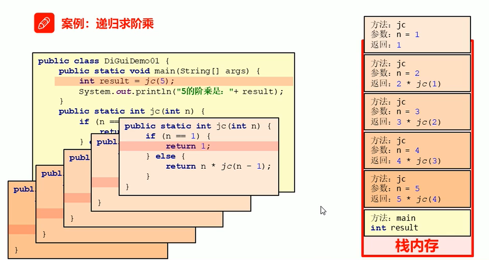

##### _7. 遍历目录

需求：给定一个路径(E:\\\ChengXu)，请通过递归完成遍历该目录下的所有内容，并把所有文件的绝对路径输出在控制台

思路：

1. 根据给定的路径创建一个File对象
2. 定义一个方法，用于获取给定目录下的所有的内容，参数为第1步创建的File对象
3. 获取给定的File目录下所有的文件或者目录的File数组
4. 遍历该File数组，得到每一个File对象
5. 判断该File对象是否是目录
   1. 是：递归调用
   2. 不是：获取绝对路径输出在控制台
6. 调用方法
7. 输出结果

代码演示：

```java
package IOFlow;

import java.io.File;

/**
 * 需求：给定一个路径(E:\\\ChengXu)，请通过递归完成遍历该目录下的所有内容，并把所有文件的绝对路径输出在控制台
 * <p>
 * 思路：
 * <p>
 * 1. 根据给定的路径创建一个File对象
 * 2. 定义一个方法，用于获取给定目录下的所有的内容，参数为第1步创建的File对象
 * 3. 获取给定的File目录下所有的文件或者目录的File数组
 * 4. 遍历该File数组，得到每一个File对象
 * 5. 判断该File对象是否是目录
 * 1. 是：递归调用
 * 2. 不是：获取绝对路径输出在控制台
 * 6. 调用方法
 * 7. 输出结果
 */
public class DiGuiDemo02 {
    public static void main(String[] args) {
        //1. 根据给定的路径创建一个File对象
        File srcFile = new File("E:\\ChengXu");

        //6.调用方法
        getAllFilePath(srcFile);

    }

    //2. 定义一个方法，用于获取给定目录下的所有的内容，参数为第1步创建的File对象
    public static void getAllFilePath(File srcFile) {
        //3. 获取给定的File目录下所有的文件或者目录的File数组
        File[] fileArray = srcFile.listFiles();
        //4. 遍历该File数组，得到每一个File对象
        if (fileArray != null) {
            for (File file : fileArray) {
                if (file.isDirectory()){
                    //如果是：那么就进行递归
                    getAllFilePath(file);
                }else{
                    //如果不是：我们直接输出目标文件的绝对路径
                    String absolutePath = file.getAbsolutePath();
                    System.out.println(absolutePath);
                }
            }
        }
    }
}

```

#### 2.IO流-字节流

##### _1. IO流概述和分类

**IO流概述：**

- IO：输入/输出(Input/Output)

- 流：是一种抽象概念，是对数据传输的总称，也就是说数据在设备间的传输称为流，流的本质是数据传输

- IO流就是用来处理设备间数据传输问题的

  ​		常见的应用：文件复制；文件上传；文件下载

**IO流分类：**

- 按照数据的流向

  ​		输入流：读数据

  ​		输出流：写数据

- 按照数据类型来分

  ​		字节流：

  ​				字节输入流；字节输出流

  ​		字符流：

  ​				字符输入流；字符输出流

  一般来说，我们说IO流的分类是按照 **数据类型** 来分的

  那么这两种流都在什么情况下使用呢？

- 如果数据通过Windows自带的记事本软件打开，我们还可以 **读懂里面的内容**，就使用字符流，否则使用字节流。如果你不知道该使用哪种类型的流，就使用字节流。因为字节流是万能的。

##### _2. 字节流写数据

字节流抽象基类

- InputStream：这个抽象类是表示字节输入流的所有类的超类
- OutputStream：这个抽象类是表示字节输出流的所有类的超类
- 子类名特点：子类名称都是以其父类名作为子类名的后缀

​			FileOutputStream：文件输出流用于将数据写入File

- FileOutputStream(String name)：创建文件输出流以指定的名称写入文件


​			使用字节输出流写数据的步骤：

- 创建字节输出流对象(调用系统功能创建了文件，创建字节输出流对象，让字节输出流对象指向文件)
- 调用字节输出流对象的写数据方法
- 释放资源(关闭此文件输出流并释放与此相关联的任何系统资源)

代码演示：

```java
package IOFlow;

import java.io.FileNotFoundException;
import java.io.FileOutputStream;
import java.io.IOException;

/**
 * FileOutputStream:文件输出流用于将数据写入File
 *      FileOutputStream(String name )：创建文件输出流以指定的名称写入文件
 * */
public class FileOutputStreamDemo01 {
    public static void main(String[] args) throws IOException {
        //创建字节输出流对象
        //FileOutputStream(String name )：创建文件输出流以指定的名称写入文件
        FileOutputStream fos = new FileOutputStream("src\\fos.txt");
        /*
            做了三件事情：
                A：调用系统功能创建了文件
                B：创建了字节输出流对象
                C:让字节输出流对象指向创建好的文件
        */

        //void write(int b):将指定的字节写入此文件输出流
        fos.write(97);

        //最后都要释放资源
        //void close();关闭此文件输出流并释放与此流相关联的任何系统资源
        fos.close();
    }
}

```

##### _3. 字节流写数据的3种方式

| 方法名                                | 说明                                                         |
| ------------------------------------- | ------------------------------------------------------------ |
| void write(int b)                     | 将指定的字节写入此文件输出流<br />一次写一个字节数据         |
| void write(byte[] b)                  | 将b.length字节从指定的字节数组写入此文件输出流<br />一次写一个字节数组数据 |
| void write(byte[] b ,int off,int len) | 将len字节从指定的字节数组开始，从偏移量off开始写入到此文件输出流<br />一次写一个字节数组的部分数据 |

代码演示：

```java
package IOFlow;

import java.io.FileNotFoundException;
import java.io.FileOutputStream;
import java.io.IOException;
import java.nio.charset.StandardCharsets;

/**
 * 1.void write(int b)将指定的字节写入此文件输出流<br />一次写一个字节数据
 * 2.void write(byte[] b)将b.length字节从指定的字节数组写入此文件输出流<br />一次写一个字节数组数据
 * 3.void write(byte[] b ,int off,int len)将len字节从指定的字节数组开始，从偏移量off开始写入到此文件输出流<br />一次写一个字节数组的部分数据
 * */
public class FileOutputStreamDemo02 {
    public static void main(String[] args) throws IOException {
        //创建字节输出流对象
        //FileOutputStream(String name )：创建文件输出流以指定的名称写入文件
        FileOutputStream fos02 = new FileOutputStream("src\\IOFlow\\fos02.txt");

        //1.void write(int b)将指定的字节写入此文件输出流<br />一次写一个字节数据
//        int i = 97;
//        fos02.write(i);//a

        //2.void write(byte[] b)将b.length字节从指定的字节数组写入此文件输出流<br />一次写一个字节数组数据
//        byte[] b ={97,98,99,100,101};
//        fos02.write(b);//abcde

        //3.void write(byte[] b ,int off,int len)将len字节从指定的字节数组开始，从偏移量off开始写入到此文件输出流<br />一次写一个字节数组的部分数据
        byte[] b2 = "abcde".getBytes();
        fos02.write(b2,1,3);//bcd
        
        //释放资源
        fos02.close();
    }
}

```

##### _4. 字节流写数据的两个小问题

字节流写数据如何实现换行呢？

- 写完数据后，加换行符

  ​		windows：\r\n

  ​		linux：\n

  ​		mac：\r

字节流写数据如何实现追加写入呢？

- public FileOutputStream(String name,boolean,append)
- 创建文件输出流以指定的名称写入文件。如果第二个参数为true，则字节将写入文件的末尾而不是开头

##### _5. 字节流写数据加异常处理

finally：在异常处理时提供finally块来执行所有清除操作。比如果IO流中的释放资源

特点：被finally控制的语句一定会执行，除非JVM退出

```java
格式：
    try{
        可能出现异常的代码;
    }catch(异常类名 变量名){
        异常的处理代码;
    }finally{
        执行所有清除操作;
    }
```

代码演示：

```java
package IOFlow;

import java.io.FileOutputStream;
import java.io.IOException;

/**
 * finally：在异常处理时提供finally块来执行所有清除操作。比如果IO流中的释放资源
 *
 * 特点：被finally控制的语句一定会执行，除非JVM退出
 *
 * 格式：
 *     try{
 *         可能出现异常的代码;
 *     }catch(异常类名 变量名){
 *         异常的处理代码;
 *     }finally{
 *         执行所有清除操作;
 *     }
 * */
public class FileOutputStreamDemo03 {
    public static void main(String[] args) {
        //加入finally来实现释放资源
        FileOutputStream fos = null;
        try {
            fos = new FileOutputStream("src\\IOFlow\\fos03.txt");
            fos.write("abcc".getBytes());
        } catch (IOException e) {
            e.printStackTrace();
        }finally{
            if (fos!=null) {
                try {
                    fos.close();
                }catch (IOException e){
                    e.printStackTrace();
                }
            }
        }
    }
}

```

##### _6. 字节流读数据(一次读一个字节数据)

需求：把文件fos.txt中的内容读取出来在控制台输出

FileInputStream：从文件系统中的文件获取输入字节

- FileInputStream(String name )：通过打开与实际文件的连接来创建一个FileInputStream，该文件由文件系统中的路径名 name命名

使用字节输入流读数据的步骤：

1. 创建字节输入流对象
2. 调用字节输入流对象的读数据方法
3. 释放资源

代码演示：

```java
package IOFlow;

import java.io.FileInputStream;
import java.io.FileNotFoundException;
import java.io.IOException;

/**
 * 需求：把文件fos.txt中的内容读取出来在控制台输出
 *
 * FileInputStream：从文件系统中的文件获取输入字节
 *
 * - FileInputStream(String name )：通过打开与实际文件的连接来创建一个FileInputStream，
 * 该文件由文件系统中的路径名 name命名
 *
 * 使用字节输入流读数据的步骤：
 *
 * 1. 创建字节输入流对象
 * 2. 调用字节输入流对象的读数据方法
 * 3. 释放资源
 * */
public class FileInputStreamDemo01 {
    public static void main(String[] args) throws IOException {
        //1. 创建字节输入流对象
        FileInputStream redfos = new FileInputStream("src\\IOFlow\\fos02.txt");

//        //2. 调用字节输入流对象的读数据方法
//        //第一次读取数据
//        System.out.println("第一次读取数据：");
//        int read = redfos.read();
//        System.out.println(read);
//        System.out.println((char)read);
//
//        System.out.println("第二次读取数据：");
//        read = redfos.read();
//        System.out.println(read);
//        System.out.println((char)read);
//
//        //再多读取两次
//        System.out.println("再多读取两次:");
//        read = redfos.read();
//        System.out.println(read);
//        read = redfos.read();
//        System.out.println(read);//-1

//        //使用循环改进
//        int read = redfos.read();
//        while(read !=-1){
//            System.out.print((char)read);
//            read = redfos.read();
//        }

        //循环优化
        int read;
        while((read = redfos.read()) != -1){
            System.out.print((char)read);
        }

        //3. 释放资源
        redfos.close();

    }
}

```

##### _7. 字节流复制文本文件

需求：把“E:\\\ChengXu\\\aa.txt” 复制到模块目录下的"fos03.txt"

思路：

1. 根据数据源创建字节输入流对象
2. 根据目的地创建字节输入流对象
3. 读写数据，复制文本文件(一次读取一个字节，一次写入一个字节)
4. 释放资源

代码演示：

```java
package IOFlow;

import java.io.FileInputStream;
import java.io.FileNotFoundException;
import java.io.FileOutputStream;
import java.io.IOException;

/**
 * 需求：把“E:\\\ChengXu\\\aa.txt” 复制到模块目录下的"fos03.txt"
 * <p>
 * 思路：
 * <p>
 * 1. 根据数据源创建字节输入流对象
 * 2. 根据目的地创建字节输入流对象
 * 3. 读写数据，复制文本文件(一次读取一个字节，一次写入一个字节)
 * 4. 释放资源
 */
public class CopyTxtDemo01 {
    public static void main(String[] args) throws IOException {
        //1. 根据数据源创建字节输入流对象
        FileInputStream fis = new FileInputStream("E:\\ChengXu\\ff.txt");

        //2. 根据目的地创建字节输入流对象
        FileOutputStream fos = new FileOutputStream("src\\IOFlow\\ff.txt");

        //3. 读写数据，复制文本文件(一次读取一个字节，一次写入一个字节)
        int by;//获取数据源当中的数据
        while ((by = fis.read()) != -1) {
            fos.write(by);//将数据源中的数据写入到fos中(先执行创建-再写入)
        }

        //4. 释放资源
        fis.close();
        fos.close();
    }
}

```

##### _8. 字节流读数据(一次读一个字节数组数据)

需求：把文件fos.txt中的内容读取出来在控制台输出

使用字节输入流读数据的步骤：

1. 创建字节输入流对象
2. 调用字节输入流对象的读数据方法
3. 释放资源

代码演示：

```java
package IOFlow;

import java.io.FileInputStream;
import java.io.FileNotFoundException;
import java.io.IOException;

/**
 * 需求：把文件fos.txt中的内容读取出来在控制台输出
 * <p>
 * 使用字节输入流读数据的步骤：
 * <p>
 * 1. 创建字节输入流对象
 * 2. 调用字节输入流对象的读数据方法
 * 3. 释放资源
 */
public class FileInputStreamDemo02 {
    public static void main(String[] args) throws IOException {
        //1. 创建字节输入流对象
        FileInputStream fos = new FileInputStream("src\\IOFlow\\fos03.txt");

        //2. 调用字节输入流对象的读数据方法
        byte[] bytes = new byte[1024];
        int len;
        while ((len = fos.read(bytes)) != -1) {
            System.out.print(new String(bytes, 0, len));
        }

        //3. 释放资源
        fos.close();
    }
}

```

##### _9. 字节流复制图片

需求：把"E:\\\ChengXu\\\mn.jpg" 复制到模块目录下的"mn.jpg"

思路：

1. 根据数据源创建字节输入流对象
2. 根据目的地创建字节输入流对象
3. 读写数据，复制图片(一次读取一个字节数组，一次写入一个字节数组)
4. 释放资源

代码演示：

```java
package IOFlow;

import java.io.*;

/**
 * 需求：把"E:\\\ChengXu\\\mn.jpg" 复制到模块目录下的"mn.jpg"
 * <p>
 * 思路：
 * <p>
 * 1. 根据数据源创建字节输入流对象
 * 2. 根据目的地创建字节输入流对象
 * 3. 读写数据，复制图片(一次读取一个字节数组，一次写入一个字节数组)
 * 4. 释放资源
 */
public class CopyImgDemo01 {
    public static void main(String[] args) throws IOException {
        //1. 根据数据源创建字节输入流对象
        FileInputStream srcImg = new FileInputStream("E:\\ChengXu\\mn.jpg");

        //2. 根据目的地创建字节输入流对象
        FileOutputStream aimImg = new FileOutputStream("src\\IOFlow\\mn.jpg");

        //3. 读写数据，复制图片(一次读取一个字节数组，一次写入一个字节数组)
        byte[] bys = new byte[1024];
        int len;
        while ((len = srcImg.read(bys)) != -1) {
            aimImg.write(bys,0,len);
        }

        //4. 释放资源
        aimImg.close();
        srcImg.close();
    }
}

```

##### _10. 字节缓冲流

字节缓冲流：

- BufferOutputStream：该类实现缓冲输出流。通过设置这样的输出流，应用程序可以向底层输出流写入字节，而不必为写入的每个字节导致底层系统的调用
- BufferedInputStream：创建BufferedInputStream将创建一个内部缓冲区数组。当从流中读取或跳过字节时，内部缓冲区将根据需要从所包含的输入流中重新填充，一次很多字节

构造方法：

- 字节缓冲输出流：BufferedOutputStream(OutputStream out)
- 字节缓冲输入流：BufferedInputStream(InputStream in)

为什么构造方法需要的是字节流，而不是更具体的文件或者路径呢？

- 字节缓冲流**仅仅提供缓冲区**，二真正读写数据还得依靠基本的字节流对象进行操作

代码演示：

```java
package IOFlow;

import java.io.*;

/**
 * 字节缓冲流：
 * <p>
 * - BufferOutputStream：
 * <p>
 * 该类实现缓冲输出流。通过设置这样的输出流，
 * 应用程序可以向底层输出流写入字节，而不必为写入的每个字节导致底层系统的调用
 * <p>
 * - BufferedInputStream：
 * <p>
 * 创建BufferedInputStream将创建一个内部缓冲区数组。
 * 当从流中读取或跳过字节时，内部缓冲区将根据需要从所包含的输入流中重新填充，一次很多字节
 * <p>
 * 构造方法：
 * <p>
 * - 字节缓冲输出流：BufferedOutputStream(OutputStream out)
 * - 字节缓冲输入流：BufferedInputStream(InputStream in)
 */
public class BufferStreamDemo01 {
    public static void main(String[] args) throws IOException {
        /*//1.创建一个字节输出流
//        FileOutputStream fos = new FileOutputStream("src\\IOFlow\\buffer.txt");

        //2.创建一个字节缓冲输出流
//        BufferedOutputStream bos = new BufferedOutputStream(fos);
        BufferedOutputStream bos = new BufferedOutputStream(new FileOutputStream("src\\IOFlow\\buffer.txt"));

        //3.向字节缓冲输出流中写入数据
        bos.write("你好啊！\r\n".getBytes());
        bos.write("我的编程世界！\r\n".getBytes());

        //释放资源
        bos.close();*/

        //字节缓冲输入流：BufferedInputStream(InputStream in)
        BufferedInputStream bis = new BufferedInputStream(new FileInputStream("src\\IOFlow\\buffer.txt"));

       /* //读数据：方法1（一次读取一个数据）
        int by;
        while((by = bis.read()) != -1){
            System.out.print((char)by);
        }
        //释放资源
        bis.close();*/

        //读数据：方法2（一次读取一个字节数组）
        byte[] bys = new byte[1024];
        int len;
        while ((len = bis.read(bys)) != -1) {
            System.out.println(new String(bys,0,len));
        }
        //释放资源
        bis.close();
    }
}

```

##### _11. 字节流复制视频

需求：把"E:\\ChengXu\\字节流复制视频.mp4" 复制到模块目录下的"字节流复制视频.mp4"

思路：

1. 根据数据源创建字节输入流对象
2. 根据目的地创建自己输出流对象
3. 读写数据，复制视频
4. 释放资源

代码演示：

```java
package IOFlow;

import java.io.*;

/**
 * 需求：把"E:\\ChengXu\\字节流复制视频.mp4" 复制到模块目录下的"字节流复制视频.mp4"
 * <p>
 * 思路：
 * <p>
 * 1. 根据数据源创建字节输入流对象
 * 2. 根据目的地创建自己输出流对象
 * 3. 读写数据，复制视频
 * 4. 释放资源
 * <p>
 * 四种方式实现复制视频，并记录每种方式复制视频的时间
 * 1.基本字节流一次读写一个字节             复制视频总耗时：6778毫秒
 * 2.基本字节流一次读写一个字节数组           复制视频总耗时：11毫秒
 * 3.字节缓冲流一次读写一个字节              复制视频总耗时：43毫秒
 * 4.字节缓冲流一次读写一个字节数组            复制视频总耗时：4毫秒(推荐使用)
 */
public class CopyMp4Demo01 {
    public static void main(String[] args) throws IOException {
        //步骤1：记录程序开始时间
        long startTime = System.currentTimeMillis();

        //步骤2：复制视频方法调用
//        method1();//复制视频总耗时：6778毫秒
//        method2();//复制视频总耗时：11毫秒
//        method3();//复制视频总耗时：43毫秒
        method4();//复制视频总耗时：4毫秒

        //步骤3：记录程序结束时间
        long endTime = System.currentTimeMillis();

        //输出执行程序总耗时
        System.out.println("复制视频总耗时：" + (endTime - startTime) + "毫秒");
    }

    /**
     * 四种方法编写区域
     */
    //1.基本字节流一次读写一个字节
    public static void method1() throws IOException {
        //1. 根据数据源创建字节输入流对象
        FileInputStream srcBIS = new FileInputStream("E:\\ChengXu\\字节流复制视频.mp4");
        //2. 根据目的地创建自己输出流对象
        FileOutputStream dBOS = new FileOutputStream("src\\IOFlow\\字节流复制视频.mp4");
        //3. 读写数据，复制视频
        int by;
        while ((by = srcBIS.read()) != -1) {
            dBOS.write(by);
        }
        //4. 释放资源
        dBOS.close();
        srcBIS.close();

        //复制视频总耗时：6778毫秒
    }

    //2.基本字节流一次读写一个字节数组
    public static void method2() throws IOException {
        //1. 根据数据源创建字节输入流对象
        FileInputStream srcBIS = new FileInputStream("E:\\ChengXu\\字节流复制视频.mp4");
        //2. 根据目的地创建自己输出流对象
        FileOutputStream dBOS = new FileOutputStream("src\\IOFlow\\字节流复制视频.mp4");
        //3. 读写数据，复制视频
        byte[] bys = new byte[1024];
        int len;
        while ((len = srcBIS.read(bys)) != -1) {
            dBOS.write(bys, 0, len);
        }
        //4. 释放资源
        dBOS.close();
        srcBIS.close();
        
        //复制视频总耗时：11毫秒
    }

    //3.字节缓冲流一次读写一个字节
    public static void method3() throws IOException {
        //1. 根据数据源创建字节输入流对象
        BufferedInputStream srcBIS = new BufferedInputStream(new FileInputStream(
                "E:\\ChengXu\\字节流复制视频.mp4"));
        //2. 根据目的地创建自己输出流对象
        BufferedOutputStream dBOS = new BufferedOutputStream(new FileOutputStream(
                "src\\IOFlow\\字节流复制视频.mp4"));
        //3. 读写数据，复制视频
        int by;
        while ((by = srcBIS.read()) != -1) {
            dBOS.write(by);
        }
        //4. 释放资源
        dBOS.close();
        srcBIS.close();

        //复制视频总耗时：43毫秒
    }

    //4.字节缓冲流一次读写一个字节数组
    public static void method4() throws IOException {
        //1. 根据数据源创建字节输入流对象
        BufferedInputStream srcBIS = new BufferedInputStream(new FileInputStream(
                "E:\\ChengXu\\字节流复制视频.mp4"));

        //2. 根据目的地创建自己输出流对象
        BufferedOutputStream dBos = new BufferedOutputStream(new FileOutputStream(
                "src\\IOFlow\\字节流复制视频.mp4"));

        //3. 读写数据，复制视频
        byte[] bys = new byte[1024];
        int len;
        while ((len = srcBIS.read(bys)) != -1) {//读数据，存在数组和len这个变量中
//            System.out.print(new String(bys,0,len));
            //将每次读出来的字节数组存储到dBos中
            dBos.write(bys, 0, len);
        }

        //4. 释放资源
        dBos.close();
        srcBIS.close();
        
        //复制视频总耗时：4毫秒
    }
}

```

#### 3.IO流-字符流

##### _1. 为什么会出现字符流

由于字符流操作中文不是特别的方便，所以Java就提供字符流

- 字符流 = 字节流 + 编码表

用字节流复制文本文件时，文本文件也会有中文，但是没有问题，原因是最终底层操作会自动进行字节拼接成中文，如何识别是中文的呢？

- 汉字在存储的时候，无论选择那种编码存储，第一个字节都是负数

##### _2. 编码表

基础知识：

- 计算机中存储的信息都是二进制数表示的；我们在屏幕上看到的英文、汉字等字符是二进制数转换之后的结果

- 按照某种规则，将字符存储到计算机中，称为**编码**。反之，将存储在计算机中的二进制数按照某种规则解析显示出来，称为解码。这里强调一下：按照A编码存储，必须按照A编码解析，这样才能显示正确的文本符号。否则就会导致乱码现象

  ​		字符编码：就是一套自然语言的字符与二进制数之间的对应规则(A,65)

字符集：

- 是一个系统支持的所有字符的集合，包括各国家文字、标点符号、图形符号、数字等

- 计算机要准确的存储和识别各种字符集符号，就需要进行字符编码，一套字符集必然至少有一套字符编码。

  常见字符集有ASCII字符集、GBXXX字符集、Unicode字符集等

ASCII字符集：

- ASCII(American Standard Code for Information Interchange，美国信息交换标准代码)：是基于拉丁字母的一套电脑编码系统，用于显示现代英语，主要包括控制字符(回车键、退格、换行键等)和可显示字符(英文大小写字符、阿拉伯数字和西文符号)
- 基本的ASCII字符集，使用7位表示一个字符，共128字符。ASCII的扩展字符集使用8为表示一个字符，共256字符，方便支持欧洲常用字符。是一个系统支持的所有字符的集合，包括国家文字、标点符号、图形符号、数字等

GBXXX字符集：

- GB2312：简体中文码表。一个小于127的字符的意义与原来相同，但两个大于127的字符连在一起时，就表示一个汉字，这样大约可以组合了包含7000多个简体汉字，此外数学符号、罗马希腊的字母、日文的假名等都编进去了，连在ASCII里本来就有的数字、标点、字母都统统重新编了两个字节长的编码，这就是常说的"全角"字符，而原来在127号一下的那些就叫"半角"字符了
- GBK：最常用的中文码表。是GB2312标准基础上的扩展规范，使用了双字节编码方案，共收录了21003个汉字，完全兼容GB2312标准，同时支持繁体汉字以及日韩汉字等
- GB18030：最新的中文码表。收录汉字70244个，采用多字节编码，每个字可以由1个、2个或者4个字节组成。支持中国国内少数民族的文字，同时支持繁体汉字以及日韩汉字等

Unicode(万国码)字符集：

- 为了表达任意语言的任意字符而设计，是业界的一种标准，也称为统一码、标准万国码。它最多使用4个字节的数字来表达每个字母、符号、或者文字。有三种编码方案，UTF-8、UTF-16和UTF-32.最为常用的UTF-8编码

- UTF-8编码：可以用来表示Unicode标准中任意字符，它是电子邮件、网页及其他存储或传送文字的应用中，优先采用的编码。互联网工程小组(IETF)要求所欲互联网协议都必须支持UTF-8编码。它使用一至四个字节为每个字符编码

  ​	编码规则：

  ​			128个US-ASCII字符，只需一个字节编码

  ​			拉丁文等字符，需要二个字节编码

  ​			大部分常用字(含中文)，使用三个字节编码

  ​			其他极少使用的Unicode辅助字符，使用四字节编码

  

  **小结：采用何种规则的编码，就要采用对应规则解码，否则就会出现乱码**		

##### _3. 字符串中的编码解码问题

**编码：**

- ```java
  byte[] getBytes()：使用平台的默认字符集将该 String编码为一系列字节，将结果存储到新的字节数组中
  ```

- ```java
  byte[] getBytes(String charsetName)：使用指定的字符集将该String编码为一系列字节，将结构存储到新的字节数组中
  ```

**解码：**

- ```java
  String(byte[] bytes)：通过使用平台的默认字符集解码指定的字节数组来构造新的String
  ```

- ```java
  String(byte[] bytes,String charsetName)：通过指定的字符解码指定的字节数组来构造新的String
  ```

代码演示：

```java
package IOFlow.StringFlow;

import java.io.UnsupportedEncodingException;
import java.lang.reflect.Array;
import java.util.Arrays;

/**
 * **1. 编码：
 *
 *   byte[] getBytes()：使用平台的默认字符集将该 String编码为一系列字节，将结果存储到新的字节数组中
 *
 *   byte[] getBytes(String charsetName)：使用指定的字符集将该String编码为一系列字节，将结构存储到新的字节数组中
 *
 * **2. 解码：
 *
 *   String(byte[] bytes)：通过使用平台的默认字符集解码指定的字节数组来构造新的String

 *   String(byte[] bytes,String charsetName)：通过指定的字符解码指定的字节数组来构造新的String
 * */
public class StringFlowDemo01 {
    public static void main(String[] args) throws UnsupportedEncodingException {
        //新建字符串
        String s = "中国";

        //1.编码：
        //byte[] getBytes()：使用平台的默认字符集将该 String编码为一系列字节，将结果存储到新的字节数组中
        byte[] bys = s.getBytes();//[-28, -72, -83, -27, -101, -67]
        //byte[] getBytes(String charsetName)：使用指定的字符集将该String编码为一系列字节，将结构存储到新的字节数组中
//        byte[] bys = s.getBytes("UTF-8");//[-28, -72, -83, -27, -101, -67]
//        byte[] bys = s.getBytes("GBK");//[-42, -48, -71, -6]
//        System.out.println(Arrays.toString(bys));
        
        //2.解码：
        //String(byte[] bytes)：通过使用平台的默认字符集解码指定的字节数组来构造新的String
        String s1 = new String(bys);
        System.out.println(s1);//中国
        //String(byte[] bytes,String charsetName)：通过指定的字符解码指定的字节数组来构造新的String
        String s2 = new String(bys, "GBK");
        System.out.println(s2);//涓浗
    }
}

```

##### _4. 字符流中的编码解码问题

字符流抽象基类

- Reader：字符输入流的抽象类
- Writer：字符输出流的抽象类

字符流中和编码解码问题相关的两个类：

- InputStreamReader
- OutputStreamWriter

```java
Writer：字符输出流的抽象类：
	1. OutputStreamWriter(OutputStream out) 创建一个使用默认字符编码的OutputStreamWriter。
	2. OutputStreamWriter(OutputStream out, String charsetName) 创建一个使用命名字符集的OutputStreamWriter。

Reader：字符输入流的抽象类
	1. InputStreamReader(InputStream in) 创建一个使用默认字符集的InputStreamReader。
	2. InputStreamReader(InputStream in, String charsetName) 创建一个使用命名字符集的InputStreamReader。
```

代码演示：

```java
package IOFlow.StringFlow;

import java.io.*;

public class ConversionStreamDemo01 {
    public static void main(String[] args) throws IOException {
        //1. OutputStreamWriter(OutputStream out) 创建一个使用默认字符编码的OutputStreamWriter。
//        OutputStreamWriter osw = new OutputStreamWriter(new FileOutputStream(
//                "src\\IOFlow\\StringFlow\\osw01.txt"));
//        String s = "中国";
//        osw.write(s);
//        osw.close();

        //2. OutputStreamWriter(OutputStream out, String charsetName) 创建一个使用命名字符集的OutputStreamWriter。
        OutputStreamWriter osw = new OutputStreamWriter(new FileOutputStream(
                "src\\IOFlow\\StringFlow\\osw01.txt"),"GBK");
        String s = "中国";
        osw.write(s);
        osw.close();

        //3. InputStreamReader(InputStream in) 创建一个使用默认字符集的InputStreamReader。
//        InputStreamReader isr = new InputStreamReader(new FileInputStream(
//                "src\\IOFlow\\StringFlow\\osw01.txt"));
//        int ch;
//        while((ch=isr.read())!=-1){
//            System.out.print((char)ch);//�й�
//        }

        //4. InputStreamReader(InputStream in, String charsetName) 创建一个使用命名字符集的InputStreamReader。
        InputStreamReader isr = new InputStreamReader(new FileInputStream(
                "src\\IOFlow\\StringFlow\\osw01.txt"),"GBK");
        int ch;
        while((ch=isr.read())!=-1){
            System.out.print((char)ch);//中国
        }
    }
}

```

##### _5. 字符流写数据的5中方式

| 方法名                                      | 说明                 |
| ------------------------------------------- | -------------------- |
| void write(int c)                           | 写一个字符           |
| void write(char[] cbuf)                     | 写入一个字符数组     |
| void write(char[] cbuf , int off , int len) | 写入字符数组的一部分 |
| void write(String str)                      | 写一个字符串         |
| void write(String str , int off , int len)  | 写一个字符串的一部分 |

| 方法名  | 说明                                                         |
| :------ | :----------------------------------------------------------- |
| flush() | 刷新流，还可以继续写数据                                     |
| close() | 关闭流，释放资源，但是在关闭之前会先刷新流。一旦关闭，就不能再写数据 |

代码演示：

```java
package IOFlow.StringFlow;

import java.io.FileOutputStream;
import java.io.IOException;
import java.io.OutputStreamWriter;

/**
   1. void write(int c)                            写一个字符
   2. void write(char[] cbuf)                      写入一个字符数组
   3. void write(char[] cbuf , int off , int len)  写入字符数组的一部分
   4. void write(String str)                       写一个字符串
   5. void write(String str , int off , int len)   写一个字符串的一部分

 补充：
       flush()  刷新流，还可以继续写数据
       close()  关闭流，释放资源，但是在关闭之前会先刷新流。一旦关闭，就不能再写数据
 * */
public class OutputStreamWriterDemo01 {
    public static void main(String[] args) throws IOException {
        //1. void write(int c) 写一个字符
        /*OutputStreamWriter osw = new OutputStreamWriter(new FileOutputStream(
                "src\\IOFlow\\StringFlow\\oswd01.txt"));
        char c ='a';
        osw.write(c);
        osw.flush();//作用是刷新流，使其内容存文件里面*/
        
        //2. void write(char[] cbuf) 写入一个字符数组
        /*OutputStreamWriter osw = new OutputStreamWriter(new FileOutputStream(
                "src\\IOFlow\\StringFlow\\oswd01.txt"));
        char[] s = {'a','b','c','d','e'};
        osw.write(s);
        osw.flush();*/

        //3. void write(char[] cbuf , int off , int len)  写入字符数组的一部分
        /*OutputStreamWriter osw = new OutputStreamWriter(new FileOutputStream(
                "src\\IOFlow\\StringFlow\\oswd01.txt"));
        char[] s = {'a','b','c','d','e'};
//        osw.write(s,0,s.length);
        osw.write(s,1,3);//bcd
        osw.flush();*/

        //4. void write(String str) 写一个字符串
        /*OutputStreamWriter osw = new OutputStreamWriter(new FileOutputStream(
                "src\\IOFlow\\StringFlow\\oswd01.txt"));
        String s = "abcde";
//        osw.write(s,0,s.length());
        osw.write(s,1,2);//bc
        osw.flush();*/

        //5. void write(String str , int off , int len) 写一个字符串的一部分
        OutputStreamWriter osw = new OutputStreamWriter(new FileOutputStream(
                "src\\IOFlow\\StringFlow\\oswd01.txt"));
        String s = "abcde";
//        osw.write(s,0,s.length());
        osw.write("abcde",2,1);//c
        osw.flush();
    }
}

```

##### _6. 字符流读数据的2种方式

| 方法名                | 说明                   |
| --------------------- | ---------------------- |
| int read()            | 一次读一个字符数据     |
| int read(char[] cbuf) | 一次读一个字符数组数据 |

代码演示：

```java
package IOFlow.StringFlow;

import java.io.FileInputStream;
import java.io.FileNotFoundException;
import java.io.IOException;
import java.io.InputStreamReader;

/**
 * 1. int read()  一次读一个字符数据
 * 2. int read(char[] cbuf) 一次读一个字符数组数据
 */
public class InputStreamReaderDemo01 {
    public static void main(String[] args) throws IOException {
        //1. int read()  一次读一个字符数据
       /* InputStreamReader isrd01 = new InputStreamReader(new FileInputStream(
                "src\\IOFlow\\StringFlow\\oswd01.txt"));
        int ch;
        while ((ch = isrd01.read()) != -1) {
            System.out.print((char)ch);
        }*/

        //2. int read(char[] cbuf) 一次读一个字符数组数据
        InputStreamReader isrd01 = new InputStreamReader(new FileInputStream(
                "src\\IOFlow\\StringFlow\\oswd01.txt"));
        char[] chs = new char[1024];
        int len;
        while((len = isrd01.read(chs))!=-1){
            System.out.println(new String(chs,0,len));
        }

        //释放资源
        isrd01.close();
    }
}

```

##### _7. 字符流复制Java文件

需求：把模块目录下的"InputStreamReaderDemo01.java" 复制到模块目录下的"Copy.txt"

思路：

1. 根据数据源创建字符输入流对象
2. 根据目的地创建字符输出流对象
3. 读写数据，复制文件
4. 释放资源

代码演示：

```java
package IOFlow.StringFlow;

import java.io.*;

/**
 * 需求：把模块目录下的"InputStreamReaderDemo01.java" 复制到模块目录下的"Copy.txt"
 *
 * 思路：
 *
 * 1. 根据数据源创建字符输入流对象
 * 2. 根据目的地创建字符输入流对象
 * 3. 读写数据，复制文件
 * 4. 释放资源
 * */
public class CopyJavaFilesDemo01 {
    public static void main(String[] args) throws IOException {
        //1. 根据数据源创建字符输入流对象
        InputStreamReader srcJava = new InputStreamReader(new FileInputStream(
                "src\\IOFlow\\StringFlow\\InputStreamReaderDemo01.java"));

        //2. 根据目的地创建字符输入流对象
        OutputStreamWriter dJava = new OutputStreamWriter(new FileOutputStream(
                "src\\IOFlow\\StringFlow\\Copy.txt"));

        //3. 读写数据，复制文件
        //方式一
//        char[] chs = new char[1024];
//        int len;
//        while((len = srcJava.read(chs))!=-1){
//            dJava.write(chs,0,len);
//        }

        //方式二
        int chr;
        while((chr = srcJava.read())!=-1){
            dJava.write(chr);
        }

        //4. 释放资源
        dJava.close();
        srcJava.close();
    }
}

```

##### _8. 复制Java文件(改进版)

需求：把模块目录下的"InputStreamReaderDemo01.java" 复制到模块目录下的"Copy.txt"

分析：

1. 转换流的名字比较长，而我们常见的操作都是按照本地默认编码实现的，所以，为了简化书写，转化流提供了对应的子类

2. FileReader：用于读取字符文件的便捷类

   ​		FileReader(String fileName)

3. FileWriter：用于写入字符文件的便捷类

   ​		FileWriter(String fileName)

4. 数据源和目的地的分析

   ​		数据源：src\\IOFlow\\StringFlow\\InputStreamReaderDemo01.java -- -读数据 --- Reader --- InputStreamReader --- FileReader

   ​		目的地：src\\IOFlow\\StringFlow\\Copy.txt --- 写数据 --- Writer  --- OutputStreamWriter --- FileWriter

思路：

1. 根据数据源创建字符输入流对象
2. 根据目的地创建字符输出流对象
3. 读写数据，复制文件
4. 释放资源

代码演示：

```java
package IOFlow.StringFlow;

import java.io.*;

/**
 * 思路：
 *
 * 1. 根据数据源创建字符输入流对象
 * 2. 根据目的地创建字符输入流对象
 * 3. 读写数据，复制文件
 * 4. 释放资源
 * */
public class CopyJavaFilesDemo02 {
    public static void main(String[] args) throws IOException {
        //1. 根据数据源创建字符输入流对象
        FileReader srcfr = new FileReader(
                "src\\IOFlow\\StringFlow\\InputStreamReaderDemo01.java");

        //2. 根据目的地创建字符输入流对象
        FileWriter dfwJava = new FileWriter(
                "src\\IOFlow\\StringFlow\\Copy02.txt");

        //3. 读写数据，复制文件
        //方式一
//        char[] chs = new char[1024];
//        int len;
//        while((len = srcJava.read(chs))!=-1){
//            dJava.write(chs,0,len);
//        }

        //方式二
        int chr;
        while((chr = srcfr.read())!=-1){
            dfwJava.write(chr);
        }

        //4. 释放资源
        dfwJava.close();
        srcfr.close();
    }
}

```

##### _9. 字符缓冲流

字符缓冲流：

- BufferedWriter：将文本写入字符输出流，缓冲字符，数组和字符串的高效写入，可以指定缓冲区大小，或者可以接受默认大小。默认值足够大，可用于大多数用途
- BufferedReader：从字符输入流读取文本，缓冲字符，以提供字符，数组和行的 高效读取，可以指定缓冲区大小，或者可以使用默认大小。默认值足够大，可用于大多数用途

构造方法：

- BufferedWriter(Writer out)
- BufferedReader(Reader in)

代码演示：

```java
package IOFlow.StringFlow;

import java.io.*;

/**
 * 字符缓冲流：
 *
 * - BufferedWriter：将文本写入字符输出流，缓冲字符，数组和字符串的高效写入，可以指定缓冲区大小，或者可以接受默认大小。默认值足够大，可用于大多数用途
 * - BufferedReader：从字符输入流读取文本，缓冲字符，以提供字符，数组和行的 高效读取，可以指定缓冲区大小，或者可以使用默认大小。默认值足够大，可用于大多数用途
 *
 * 构造方法：
 *
 * - BufferedWriter(Writer out)
 * - BufferedReader(Reader in)
 * */
public class BufferedStreamDemo01 {
    public static void main(String[] args) throws IOException {
        //1. BufferedWriter(Writer out)
//        FileWriter fw = new FileWriter(
//                "src\\IOFlow\\StringFlow\\bw01.txt");
//        BufferedWriter bw = new BufferedWriter(fw);

       /* BufferedWriter bw = new BufferedWriter(new FileWriter(
                "src\\IOFlow\\StringFlow\\bw01.txt"));
        bw.write("hello\r\n");
        bw.write("world\r\n");
        bw.write("java");

        //释放连接
        bw.close();*/

        //2. BufferedReader(Reader in)
        BufferedReader br = new BufferedReader(new FileReader(
                "src\\IOFlow\\StringFlow\\bw01.txt"));

        //方法一：
        /* int ch;
        while((ch = br.read())!=-1){
            System.out.print((char)ch);
        }*/

        //方法二：
        char[] chs = new char[1024];
        int len;
        while ((len = br.read(chs))!=-1) {
            System.out.println(new String(chs,0,len));
        }

    }
}

```

##### _10. 复制Java文件(字符缓冲流改进版)

需求：把模块目录下的"InputStreamReaderDemo01.java" 复制到模块目录下的"Copy.txt"

思路：

1. 根据数据源创建字符缓冲输入流对象
2. 根据目的地创建字符缓冲输出流对象
3. 读写数据，复制文件
4. 释放资源

代码演示：

```java
package IOFlow.StringFlow;

import java.io.*;

/**
 * 字符缓冲流-复制Java文件改进版
 * */
public class CopyJavaFilesDemo03 {
    public static void main(String[] args) throws IOException {
        //1. 根据数据源创建字符缓冲输入流对象
        BufferedReader srcbr = new BufferedReader(new FileReader(
                "src\\IOFlow\\StringFlow\\InputStreamReaderDemo01.java"));

        //2. 根据目的地创建字符输入流对象
        BufferedWriter dbw = new BufferedWriter(new FileWriter(
                "src\\IOFlow\\StringFlow\\Copy03.txt"));

        //3. 读写数据，复制文件
        //方式一
        char[] chs = new char[1024];
        int len;
        while((len = srcbr.read(chs))!=-1){
            dbw.write(chs,0,len);
        }

//        //方式二
//        int chr;
//        while((chr = srcJava.read())!=-1){
//            dJava.write(chr);
//        }

        //4. 释放资源
        dbw.close();
        srcbr.close();
    }
}

```

##### _11. 字符缓冲流特有功能

BufferedWriter:

- void newLine()：写一行行分隔符，行分隔符字符由系统属性定义

BufferedReader：

- public String readLine()：读一行文字。结果包含行的内容的字符串，不包括任何行终止字符，如果流的结尾已经到达，则为null

代码演示：

```java
package IOFlow.StringFlow;

import java.io.*;

/**
 * BufferedWriter:
 *
 * - void newLine()：写一行行分隔符，行分隔符字符由系统属性定义
 *
 * BufferedReader：
 *
 * - public String readLine()：读一行文字。结果包含行的内容的字符串，不包括任何行终止字符，如果流的结尾已经到达，则为null
 * */
public class BufferedStreamDemo02 {
    public static void main(String[] args) throws IOException {
        //void newLine()：写一行行分隔符，行分隔符字符由系统属性定义
        /*BufferedWriter bw = new BufferedWriter(new FileWriter(
                "src\\IOFlow\\StringFlow\\Copy04.txt"));
        for (int i =0;i<10;i++){
            bw.write("hello" + i);
            bw.newLine();
            bw.flush();

        }
        //释放资源
        bw.close();*/

        //public String readLine()：读一行文字。结果包含行的内容的字符串，不包括任何行终止字符，如果流的结尾已经到达，则为null
        BufferedReader br = new BufferedReader(new FileReader("src\\IOFlow\\StringFlow\\Copy04.txt"));

        /*//读数据
        String line1 = br.readLine();
        System.out.println(line1);
        String line2 = br.readLine();
        System.out.println(line2);

        //多读取两次
        String line3 = br.readLine();
        System.out.println(line3);
        String line4 = br.readLine();
        System.out.println(line4);*/

        String line;
        while((line = br.readLine())!=null){
            System.out.println(line);//注意：readLine()方法只读数据，不读换行符等字符
        }
    }
}

```

##### _12. 复制Java文件(字符缓冲流特有功能改进版)

需求：把模块目录下的"InputStreamReaderDemo01.java" 复制到模块目录下的"Copy.txt"

思路：

1. 根据数据源创建字符缓冲输入流对象

2. 根据目的地创建字符缓冲输出流对象

3. 读写数据，复制文件

   ​		使用字符缓冲特有功能实现

4. 释放资源

代码演示：

```java
package IOFlow.StringFlow;

import java.io.*;

/**
 * 需求：把模块目录下的"InputStreamReaderDemo01.java" 复制到模块目录下的"Copy.txt"
 * <p>
 * 思路：
 * <p>
 * 1. 根据数据源创建字符缓冲输入流对象
 * <p>
 * 2. 根据目的地创建字符缓冲输出流对象
 * <p>
 * 3. 读写数据，复制文件
 * <p>
 * 使用字符缓冲特有功能实现
 * <p>
 * 4. 释放资源
 */
public class CopyJavaFilesDemo04 {
    public static void main(String[] args) throws IOException {
        //1. 根据数据源创建字符缓冲输入流对象
        BufferedReader srcbr = new BufferedReader(new FileReader(
                "src\\IOFlow\\StringFlow\\Copy04.txt"));

        //2. 根据目的地创建字符输出流对象
        BufferedWriter dbw = new BufferedWriter(new FileWriter(
                "src\\IOFlow\\StringFlow\\Copy03.1.txt"));

        //3. 读写数据，复制文件
        String line;
        while ((line = srcbr.readLine()) != null) {
            dbw.write(line);
            dbw.newLine();
            dbw.flush();
        }

        //4. 释放资源
        dbw.close();
        srcbr.close();
    }
}

```

##### _13. IO流小结

**字节流：**

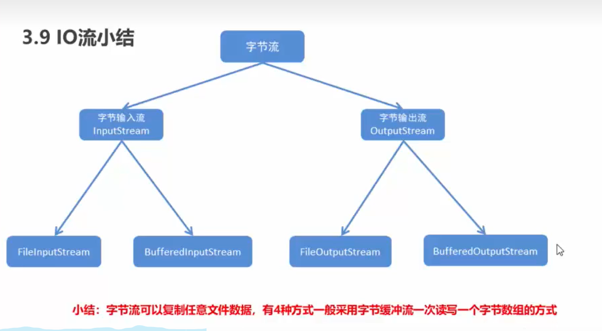

小结(字节流)：字节流可以复制任意文件数据，有4种方式一般 采用字节缓冲流一次读写一个字节数组的方式

**字符流：**

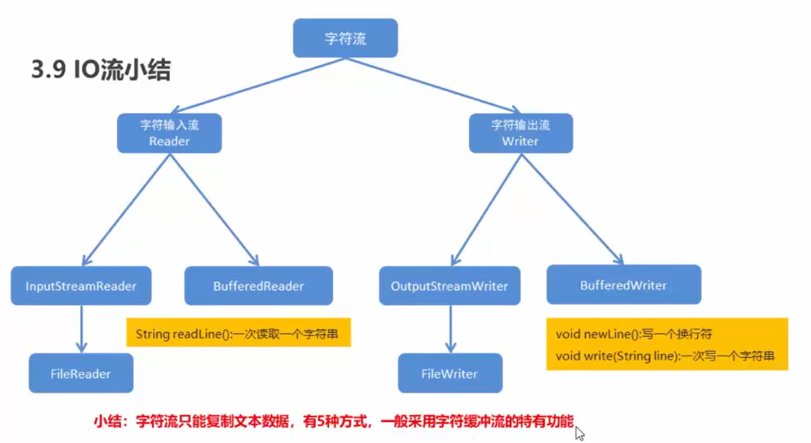

小结(字符流)：字符流只能复制文本数据，有5中方式，一般采用字符缓冲流的特有功能

##### _14. 案例：集合到文件

需求：把ArrayList集合中的字符串数据写入到文本文件。

要求：每一个字符串元素作为文件中的一行数据

思路：

1. 创建ArrayList集合
2. 往集合中存储字符串元素
3. 创建字符缓冲输出流对象
4. 遍历集合，得到每一个字符串数据
5. 调用字符缓冲输出流对象的方法写数据
6. 释放资源

代码演示：

```java
package IOFlow.StringFlow.StringFlowEg;

import java.io.BufferedWriter;
import java.io.FileWriter;
import java.io.IOException;
import java.util.ArrayList;

/**
 * 需求：把ArrayList集合中的字符串数据写入到文本文件。
 *
 * 要求：每一个字符串元素作为文件中的一行数据
 *
 * 思路：
 *
 * 1. 创建ArrayList集合
 * 2. 往集合中存储字符串元素
 * 3. 创建字符缓冲输出流对象
 * 4. 遍历集合，得到每一个字符串数据
 * 5. 调用字符缓冲输出流对象的方法写数据
 * 6. 释放资源
 * */
public class ArrayListToTxtDemo {
    public static void main(String[] args) throws IOException {
        //1. 创建ArrayList集合
        ArrayList<String> arrayList = new ArrayList<String>();

        //2. 往集合中存储字符串元素
        arrayList.add("hello");
        arrayList.add("world");
        arrayList.add("java");

        //3. 创建字符缓冲输出流对象
        BufferedWriter bw = new BufferedWriter(new FileWriter(
                "src\\IOFlow\\StringFlow\\StringFlowEg\\ArrayListToTxtDemo.txt"));

        //4. 遍历集合，得到每一个字符串数据
        for (String s : arrayList){
            //5. 调用字符缓冲输出流对象的方法写数据
            bw.write(s);
            bw.newLine();
            bw.flush();
        }

        //6. 释放资源
        bw.close();
    }
}

```

##### _15. 案例：文件到集合

需求：把文本文件中的数据读取到集合中，并遍历集合。

要求：文件中每一行数据是一个集合元素

思路：

1. 创建字符缓冲输入流对象
2. 创建ArrayList集合对象
3. 调用字符缓冲输入流对象的方法读数据
4. 把读取到的字符串数据存储到集合中
5. 释放资源
6. 遍历集合

代码演示：

```java
package IOFlow.StringFlow.StringFlowEg;

import java.io.*;
import java.util.ArrayList;

/**
 * 需求：把文本文件中的数据读取到集合中，并遍历集合。
 * <p>
 * 要求：文件中每一行数据是一个集合元素
 * <p>
 * 思路：
 * <p>
 * 1. 创建字符缓冲输入流对象
 * 2. 创建ArrayList集合对象
 * 3. 调用字符缓冲输入流对象的方法读数据
 * 4. 把读取到的字符串数据存储到集合中
 * 5. 释放资源
 * 6. 遍历集合
 */
public class TxtToArrayListDemo {
    public static void main(String[] args) throws IOException {
        //1. 创建字符缓冲输入流对象
        BufferedReader br = new BufferedReader(new FileReader(
                "src\\IOFlow\\StringFlow\\StringFlowEg\\ArrayListToTxtDemo.txt"));

        //2. 创建ArrayList集合对象
        ArrayList<String> arrayList = new ArrayList<>();

        //3. 调用字符缓冲输入流对象的方法读数据
        String line;
        while ((line = br.readLine()) != null) {
            //4. 把读取到的字符串数据存储到集合中
            arrayList.add(line);
        }

        //5. 释放资源
        br.close();

        //6. 遍历集合
        for (String s : arrayList){
            System.out.println(s);
        }
    }
}

```

##### _16. 案例：点名器

需求：我有一个文件里面存储了班级同学的姓名，每一个姓名占一行，要求通过程序实现随机点名器

思路：

1. 创建字符缓冲输入流
2. 创建ArrayList集合对象
3. 调用字符缓冲输入流对象的方法读数据
4. 把读取到的字符串数据存储到集合中
5. 释放资源
6. 使用Random产生一个随机数，随机数的范围再：[ 0，集合的长度)
7. 把第6步产生的随机数作为索引到ArrayList集合中获取值
8. 把第7步得到的数据输出在控制台

代码演示：

```java
package IOFlow.StringFlow.StringFlowEg;

import java.io.BufferedReader;
import java.io.FileNotFoundException;
import java.io.FileReader;
import java.io.IOException;
import java.util.ArrayList;
import java.util.Random;

/**
 * 需求：我有一个文件里面存储了班级同学的姓名，每一个姓名占一行，要求通过程序实现随机点名器
 *
 * 思路：
 *
 * 1. 创建字符缓冲输入流
 * 2. 创建ArrayList集合对象
 * 3. 调用字符缓冲输入流对象的方法读数据
 * 4. 把读取到的字符串数据存储到集合中
 * 5. 释放资源
 * 6. 使用Random产生一个随机数，随机数的范围再：[ 0，集合的长度)
 * 7. 把第6步产生的随机数作为索引到ArrayList集合中获取值
 * 8. 把第7步得到的数据输出在控制台
 * */
public class CallNameDemo {
    public static void main(String[] args) throws IOException {
        //1. 创建字符缓冲输入流
        BufferedReader br = new BufferedReader(new FileReader(
                "src\\IOFlow\\StringFlow\\StringFlowEg\\CallNameDemo.txt"));

        //2. 创建ArrayList集合对象
        ArrayList<String> arraylist = new ArrayList<String>();

        //3. 调用字符缓冲输入流对象的方法读数据
        String line;
        while((line = br.readLine()) !=null){
            //4. 把读取到的字符串数据存储到集合中
            arraylist.add(line);
        }

        //5. 释放资源
        br.close();

        //6. 使用Random产生一个随机数，随机数的范围再：[ 0，集合的长度)
        Random random = new Random();
        int index = random.nextInt(arraylist.size());

        //7. 把第6步产生的随机数作为索引到ArrayList集合中获取值
        String name = arraylist.get(index);

        //8. 把第7步得到的数据输出在控制台
        System.out.println("抽中了：" + name);
    }
}

```

##### _17. 案例：集合到文件(改进版)

需求：把ArrayList集合中的学生数据写入到文本文件。

要求：每一个学生对象的数据作为文件中的一行数据

​	格式：学号，姓名，年龄，居住地			举例：linlin001，刘邦，23，四川

思路：

1. 定义学生类
2. 创建ArrayList集合
3. 创建学生对象
4. 把学生对象添加到集合中
5. 创建字符缓冲输出流对象
6. 遍历集合，得到每一个学生对象
7. 把学生对象的数据拼接成指定格式的字符串
8. 调用字符缓冲输出流对象的方法写数据
9. 释放资源

代码演示：

```java
package IOFlow.StringFlow.StringFlowEg;

import java.io.BufferedWriter;
import java.io.FileWriter;
import java.io.IOException;
import java.util.ArrayList;

/**
 * 需求：把ArrayList集合中的学生数据写入到文本文件。
 * <p>
 * 要求：每一个学生对象的数据作为文件中的一行数据
 * <p>
 * 格式：学号，姓名，年龄，居住地			举例：linlin001，刘邦，23，四川
 * <p>
 * 思路：
 * <p>
 * 1. 定义学生类
 * 2. 创建ArrayList集合
 * 3. 创建学生对象
 * 4. 把学生对象添加到集合中
 * 5. 创建字符缓冲输出流对象
 * 6. 遍历集合，得到每一个学生对象
 * 7. 把学生对象的数据拼接成指定格式的字符串
 * 8. 调用字符缓冲输出流对象的方法写数据
 * 9. 释放资源
 */
public class ArrayListToFile {
    //1. 定义学生类
    static class Student {
        //成员变量
        private String sid;
        private String name;
        private int age;
        private String address;

        //构造方法
        public Student() {
        }

        public Student(String sid, String name, int age, String address) {
            this.sid = sid;
            this.name = name;
            this.age = age;
            this.address = address;
        }

        //get 和 set 方法
        public String getSid() {
            return sid;
        }

        public void setSid(String sid) {
            this.sid = sid;
        }

        public String getName() {
            return name;
        }

        public void setName(String name) {
            this.name = name;
        }

        public int getAge() {
            return age;
        }

        public void setAge(int age) {
            this.age = age;
        }

        public String getAddress() {
            return address;
        }

        public void setAddress(String address) {
            this.address = address;
        }
    }

    /**
     * 测试类
     */
    public static void main(String[] args) throws IOException {
        //2. 创建ArrayList集合
        ArrayList<Student> arrayList = new ArrayList<Student>();

        //3. 创建学生对象
        Student s1 = new Student("linlin001", "小乔", 23, "安徽潜山");
        Student s2 = new Student("linlin002", "周瑜", 25, "庐江舒县");
        Student s3 = new Student("linlin003", "大乔", 29, "安徽潜山");
        Student s4 = new Student("linlin004", "孙策", 34, "浙江杭州");

        //4. 把学生对象添加到集合中
        arrayList.add(s1);
        arrayList.add(s2);
        arrayList.add(s3);
        arrayList.add(s4);

        //5. 创建字符缓冲输出流对象
        BufferedWriter bw = new BufferedWriter(new FileWriter(
                "src\\IOFlow\\StringFlow\\StringFlowEg\\StudentMessage.txt"));

        //6. 遍历集合，得到每一个学生对象

        for (Student s : arrayList) {
            //创建字符串拼接对象
            StringBuilder sb = new StringBuilder();

//            //获取到学生的信息
//            String sid = s.getSid();
//            String name = s.getName();
//            int age = s.getAge();
//            String address = s.getAddress();
//
//
//            //7. 把学生对象的数据拼接成指定格式的字符串
//            sb.append(sid + ", ").append(name + ", ").append(age
//                    + ", ").append(address).append("\n");

            //7. 把学生对象的数据拼接成指定格式的字符串
            sb.append(s.getSid() + ", ").append(s.getName() + ", ").append(s.getAge()
                    + ", ").append(s.getAddress()).append("\n");

            //8. 调用字符缓冲输出流对象的方法写数据
            bw.write(sb.toString());
            bw.newLine();
            bw.flush();

        }

        //9. 释放资源
        bw.close();
    }
}

```

##### _18. 案例：文件到集合(改进版)

需求：把文本文件中的数据读取到集合中，并遍历集合。

要求：文件中每一行数据是一个学生对象的成员变量值

举例：linlin001,小乔，23，安徽潜山

思路：

1. 定义学生类
2. 创建字符缓冲输入流对象
3. 创建ArrayList集合对象
4. 调用字符缓冲输入流对象的方法读取数据
5. 把读取到的字符串数据用split()进行分割，得到一个字符串数组
6. 创建学生对象
7. 把字符串数组中的每一个元素取出来对应的赋值给学生对象的成员变量值
8. 把学生对象添加到集合
9. 释放资源
10. 遍历集合

代码演示：

```java
package IOFlow.StringFlow.StringFlowEg;

import java.io.*;
import java.util.ArrayList;

/**
 * 思路：
 * <p>
 * 1. 定义学生类
 * 2. 创建字符缓冲输入流对象
 * 3. 创建ArrayList集合对象
 * 4. 调用字符缓冲输入流对象的方法读取数据
 * 5. 把读取到的字符串数据用split()进行分割，得到一个字符串数组
 * 6. 创建学生对象
 * 7. 把字符串数组中的每一个元素取出来对应的赋值给学生对象的成员变量值
 * 8. 把学生对象添加到集合
 * 9. 释放资源
 * 10. 遍历集合
 */
public class FileToArrayList {
    //1. 定义学生类
    static class Student {
        //成员变量
        private String sid;
        private String name;
        private int age;
        private String address;

        //构造方法
        public Student() {
        }

        public Student(String sid, String name, int age, String address) {
            this.sid = sid;
            this.name = name;
            this.age = age;
            this.address = address;
        }

        //get 和 set 方法
        public String getSid() {
            return sid;
        }

        public void setSid(String sid) {
            this.sid = sid;
        }

        public String getName() {
            return name;
        }

        public void setName(String name) {
            this.name = name;
        }

        public int getAge() {
            return age;
        }

        public void setAge(int age) {
            this.age = age;
        }

        public String getAddress() {
            return address;
        }

        public void setAddress(String address) {
            this.address = address;
        }
    }

    /**
     * 测试类
     */
    public static void main(String[] args) throws IOException {
        //2. 创建字符缓冲输入流对象
        BufferedReader br = new BufferedReader(new FileReader(
                "src\\IOFlow\\StringFlow\\StringFlowEg\\StudentMessage.txt"));

        //3. 创建ArrayList集合对象
        ArrayList<Student> arraylist = new ArrayList<Student>();

        //4. 调用字符缓冲输入流对象的方法读取数据
        String line;
        while ((line = br.readLine()) != null) {
            //5. 把读取到的字符串数据用split()进行分割，得到一个字符串数组
            String[] strArray = line.split(", ");

            //6. 创建学生对象
            Student s = new Student();
            //7. 把字符串数组中的每一个元素取出来对应的赋值给学生对象的成员变量值
            s.setSid(strArray[0]);
            s.setName(strArray[1]);
            s.setAge(Integer.parseInt(strArray[2]));//使用 Integer.parseInt()方法把int类型的数据进行转换
            s.setAddress(strArray[3]);

            //8. 把学生对象添加到集合
            arraylist.add(s);

        }

        //9. 释放资源
        br.close();

        //10. 遍历集合
        for (Student s : arraylist){
            StringBuilder sb = new StringBuilder();
            sb.append(s.getSid() + ", ").append(s.getName() + ", ").append(s.getAge()
                    + ", ").append(s.getAddress());
            System.out.println(sb.toString());
        }
    }
}

```

##### _19. 案例：集合到文件(数据排序改进版)

需求：键盘录入5个学生信息(姓名，语文成绩，数学成绩，英语成绩)。要求按照成绩总分从高到低写入文本文件

​		格式：姓名，语文成绩，数学成绩，英语成绩			举例：小乔，87，90，96

思路：

1. 定义学生类
2. 创建TreeSet集合，通过比较器进行排序
3. 键盘录入学生数据
4. 创建学生对象，把键盘录入的数据对应赋值给学生对象的成员变量
5. 把学生对象添加到TreeSet集合
6. 创建字符缓冲输出流对象
7. 把学生对象的数据拼接成指定格式的字符串
8. 调用字符缓冲输出流对象的方法写数据
9. 释放资源

代码演示：

```java
package IOFlow.StringFlow.StringFlowEg;

import java.io.BufferedWriter;
import java.io.FileWriter;
import java.io.IOException;
import java.util.Comparator;
import java.util.Scanner;
import java.util.TreeSet;

/**
 * 需求：键盘录入5个学生信息(姓名，语文成绩，数学成绩，英语成绩)。要求按照成绩总分从高到低写入文本文件
 * <p>
 * 格式：姓名，语文成绩，数学成绩，英语成绩			举例：小乔，87，90，96
 * <p>
 * 思路：
 * <p>
 * 1. 定义学生类
 * 2. 创建TreeSet集合，通过比较器进行排序
 * 3. 键盘录入学生数据
 * 4. 创建学生对象，把键盘录入的数据对应赋值给学生对象的成员变量
 * 5. 把学生对象添加到TreeSet集合
 * 6. 创建字符缓冲输出流对象
 * 7. 把学生对象的数据拼接成指定格式的字符串
 * 8. 调用字符缓冲输出流对象的方法写数据
 * 9. 释放资源
 */
public class TreeSetToFile {
    //1. 定义学生类
    static class Student {
        //成员变量
        private String name;
        private int chinese;
        private int maths;
        private int english;

        //构造方法
        public Student() {
        }

        public Student(String name, int chinese, int maths, int english) {
            this.name = name;
            this.chinese = chinese;
            this.maths = maths;
            this.english = english;
        }

        //get 和 set 方法
        public String getName() {
            return name;
        }

        public void setName(String name) {
            this.name = name;
        }

        public int getChinese() {
            return chinese;
        }

        public void setChinese(int chinese) {
            this.chinese = chinese;
        }

        public int getMaths() {
            return maths;
        }

        public void setMaths(int maths) {
            this.maths = maths;
        }

        public int getEnglish() {
            return english;
        }

        public void setEnglish(int english) {
            this.english = english;
        }

        public int getSum() {
            return this.chinese + this.maths + this.english;
        }

    }

    /**
     * 测试类
     */
    public static void main(String[] args) throws IOException {
        //2. 创建TreeSet集合，通过比较器进行排序
        TreeSet<Student> treeSet = new TreeSet<>(new Comparator<Student>() {
            @Override
            public int compare(Student s1, Student s2) {
                //成绩总分从高到低
                int num = s2.getSum() - s1.getSum();
                //次要条件
                int num2 = num == 0 ? s1.getChinese() - s2.getChinese() : num;
                int num3 = num2 == 0 ? s1.getMaths() - s2.getMaths() : num2;
                int num4 = num3 == 0 ? s1.getEnglish() - s2.getEnglish() : num3;
                return num4;
            }
        });


        int n = 1;
        for (int i = 0; i < 2; i++) {
            //3. 键盘录入学生数据
            Scanner sc = new Scanner(System.in);
            //4. 创建学生对象
            Student s = new Student();
            System.out.println("请输入第" + n + "个人的信息");
            System.out.print("姓名：");
            String name = sc.nextLine();
            System.out.print("语文成绩：");
            int chinese = sc.nextInt();
            System.out.print("数学成绩：");
            int maths = sc.nextInt();
            System.out.print("英语成绩：");
            int english = sc.nextInt();

            //把键盘录入的数据对应赋值给学生对象的成员变量
            s.setName(name);
            s.setChinese(chinese);
            s.setMaths(maths);
            s.setEnglish(english);
//            s.setSum(chinese+maths+english);

            //5. 把学生对象添加到TreeSet集合
            treeSet.add(s);

            n++;
        }

        //6. 创建字符缓冲输出流对象
        BufferedWriter bw = new BufferedWriter(new FileWriter(
                "src\\IOFlow\\StringFlow\\StringFlowEg\\TreeSetToFile.txt"));

        //7. 遍历集合，把学生对象的数据拼接成指定格式的字符串
        for (Student ss : treeSet) {
            StringBuilder sb = new StringBuilder();
            sb.append(ss.getName() + ",").append(ss.getChinese() + ",").append(ss.getMaths()
                    + ",").append(ss.getEnglish()).append("  总分：").append(ss.getSum());

            //8. 调用字符缓冲输出流对象的方法写数据
            bw.write(sb.toString());
            bw.newLine();
            bw.flush();
        }

        //9. 释放资源
        bw.close();
    }
}

```

##### _20. 案例：复制单级文件夹

需求：把"E:\\\ChengXu\\\itcast" 这个文件夹复制到模块目录下

思路：

1. 创建数据源目录File对象，路径是E:\\\ChengXu\\\itcast

2. 获取数据源目录File对象的名称(itcast)

3. 创建目的地目录File对象，路径名是模块名 + itcast组成(src\\\IOFlow\\\StringFlow\\\StringFlowEg\\\itcast)

4. 判断目录的地目录对应的File是否存在，如果不存在，就创建

5. 获取数据源目录下所有文件的File数组

6. 遍历File数组，得到每一个File

7. 对象，该File对象，其实就是数据源文件

   ​	数据源文件：E:\\\ChengXu\\\itcast\\\mn.jpg

8. 获取数据源文件File对象的名称(mn.jpg)

9. 创建目的地文件File对象，路径名是目的地目录 + mn.jpg 组成(myCharStream\\\itcast\\\mn.jpg)

10. 复制文件

    ​		由于文件不仅仅是文本文件，还有图片，视频等文件，所以采用字节流复制文件

代码演示：

```java
package IOFlow.StringFlow.StringFlowEg;

import java.io.*;

/**
 * 需求：把"E:\\\ChengXu\\\itcast" 这个文件夹复制到模块目录下
 *
 * 思路：
 * 1. 创建数据源目录File对象，路径是E:\\\ChengXu\\\itcast
 * 2. 获取数据源目录File对象的名称(itcast)
 * 3. 创建目的地目录File对象，路径名是模块名 + itcast组成(src\\\IOFlow\\\StringFlow\\\StringFlowEg\\\itcast)
 * 4. 判断目录的地目录对应的File是否存在，如果不存在，就创建
 * * 5. 获取数据源目录下所有文件的File数组
 * 6. 遍历File数组，得到每一个File对象，该File对象，其实就是数据源文件
 *    	数据源文件：E:\\\ChengXu\\\itcast\\\mn.jpg
 * 7. 获取数据源文件File对象的名称(mn.jpg)
 * 8. 创建目的地文件File对象，路径名是目的地目录 + mn.jpg 组成(myCharStream\\\itcast\\\mn.jpg)
 * 9. 复制文件
 *    		由于文件不仅仅是文本文件，还有图片，视频等文件，所以采用字节流复制文件
 * */
public class CopyFolderDemo01 {
    public static void main(String[] args) throws IOException {
        //1. 创建数据源目录File对象，路径是E:\\ChengXu\\itcast
        File srcFolder = new File("E:\\ChengXu\\itcast");

        //2. 获取数据源目录File对象的名称(itcast)
        String srcFolderName = srcFolder.getName();
        System.out.println(srcFolderName);//itcast

        //3. 创建目的地目录File对象，路径名是模块名 + itcast组成(src\\\IOFlow\\\StringFlow\\\StringFlowEg\\\itcast)
        File destFolder = new File("src\\IOFlow\\StringFlow\\StringFlowEg",srcFolderName);
        System.out.println(destFolder);//src\IOFlow\StringFlow\StringFlowEg\itcast

        //4. 判断目的地目录对应的File是否存在，如果不存在，就创建
        if (!destFolder.exists()){
            destFolder.mkdir();
        }

        //5. 获取数据源目录下所有文件的File数组
        //public File[] listFiles()返回一个抽象路径名数组，表示由该抽象路径名表示的目录中的文件。
        File[] listFiles = srcFolder.listFiles();
        System.out.println(listFiles);//地址值：[Ljava.io.File;@b4c966a

        //6. 遍历File数组，得到每一个File对象，该File对象，其实就是数据源文件
        for (File srcFile :listFiles){
            //数据源文件：E:\\ChengXu\\itcast\\mn.jpg
            //7. 获取数据源文件File对象的名称(mn.jpg)
            String srcfileName = srcFile.getName();
//            System.out.println("mingzi:"+ srcfileName);//mn.jpg
            //8. 创建目的地文件File对象，路径名是目的地目录 + mn.jpg 组成(myCharStream\\itcast\\mn.jpg)
            File destFile = new File(destFolder,srcfileName);

            //9. 复制文件
            copyFile(srcFile,destFile);

        }
    }
    //由于文件不仅仅是文本文件，还有图片，视频等文件，所以采用字节流复制文件
    private static void copyFile(File srcFile, File destFile) throws IOException {
        BufferedInputStream bis = new BufferedInputStream(new FileInputStream(srcFile));
        BufferedOutputStream bos = new BufferedOutputStream(new FileOutputStream(destFile));

        byte[] bys = new byte[1024];
        int len;
        while((len = bis.read(bys))!=-1){
            bos.write(bys,0,len);
        }

        bos.close();
        bis.close();
    }
}

```

##### _21. （未解决Bug）案例：复制多级文件夹

需求：把"E:\\\Notepad++" 复制到D盘目录下

思路：

1. 创建数据源File对象，路径是E:\\\Notepad++

2. 创建目的地File对象，路径是D:\\\

3. 写方法实现文件夹的复制，参数为数据源File对象和目的地File对象

4. 判断数据源File是否是目录

   ​	是：

   ​				A：在目的地下创建和数据源File名称一样的目录

   ​				B：获取数据源File下所有文件或者目录的File数组

   ​				C：遍历该File数组，得到每一个File对象

   ​				D：把该File作为数据源File对象，递归调用复制文件夹的方法

   ​	不是：说明是文件，直接复制，用字节流

（未解决Bug）代码演示：

```java
package IOFlow.StringFlow.StringFlowEg;

import java.io.*;

/**
 * 需求：把"E:\\\notepad" 复制到D盘目录下
 * <p>
 * 思路：
 * <p>
 * 1. 创建数据源File对象，路径是E:\\\notepad
 * <p>
 * 2. 创建目的地File对象，路径是D:\\\
 * <p>
 * 3. 写方法实现文件夹的复制，参数为数据源File对象和目的地File对象
 * <p>
 * 4. 判断数据源File是否是目录
 * <p>
 * 是：
 * A：在目的地下创建和数据源File名称一样的目录
 * <p>
 * B：获取数据源File下所有文件或者目录的File数组
 * <p>
 * C：遍历该File数组，得到每一个File对象
 * <p>
 * D：把该File作为数据源File对象，递归调用复制文件夹的方法
 * <p>
 * 不是：说明是文件，直接复制，用字节流
 */
public class CopyFoldersDemo01 {
    public static void main(String[] args) throws IOException {
        //1. 创建数据源File对象，路径是E:\\Notepad++
        File srcFile = new File("E:\\notepad");

        //2. 创建目的地File对象，路径是D:\\
        File destFile = new File("D:\\");

        //3. 写方法实现文件夹的复制，参数为数据源File对象和目的地File对象
        copyFolder(srcFile, destFile);

    }

    /**
     * 方法-复制文件夹
     */
    private static void copyFolder(File srcFile, File destFile) throws IOException {
        //4. 判断数据源File是否是目录
        if (srcFile.isDirectory()) {
            //A：在目的地下创建和数据源File名称一样的目录
            String srcFileName = srcFile.getName();
            File newFolder = new File(destFile, srcFileName);

            System.out.println("经过了文件夹判断：" + newFolder);

            if (newFolder.exists()) {
                newFolder.mkdir();
            }

            //B：获取数据源File下所有文件或者目录的File数组
            File[] fileArray = srcFile.listFiles();

            //C：遍历该File数组，得到每一个File对象
            for (File file : fileArray) {
                //D：把该File作为数据源File对象，递归调用复制文件夹的方法
                System.out.println("经过了递归：" + file);
                copyFolder(file,newFolder);
            }
        }else {
            File newFile = new File(destFile,srcFile.getName());
            copyFile(srcFile,newFile);
        }
    }

    /**
     * 方法-字节缓冲流复制文件
     */
    private static void copyFile(File srcFile, File destFile) throws IOException {
        BufferedInputStream bis = new BufferedInputStream(new FileInputStream(srcFile));
        BufferedOutputStream bos = new BufferedOutputStream(new FileOutputStream(destFile));

        byte[] bys = new byte[1024];
        int len;
        while ((len = bis.read(bys)) != -1) {
            bos.write(bys,0, len);
        }

        bos.close();
        bis.close();
    }
}

```

##### _22. 复制文件的异常处理

代码演示：

```java
/**
     * 临时-方法演示（与本程序无关）
     * */
    //JDK9的改进方案
    public static void method4() throws IOException {
        FileReader fr = new FileReader("fr.txt");
        FileWriter fw = new FileWriter("fw.txt");
        try(fr;fw){
            char[] chs = new char[1024];
            int len;
            while((len = fr.read())!=-1){
                fw.write(chs,0,len);
            }
        }catch(IOException e){
            e.printStackTrace();
        }
    }
    
    //JDK7的改进方案
    public static void method3(){
        try(FileReader fr = new FileReader("fr.txt");
            FileWriter fw = new FileWriter("fw.txt");){
            char[] chs = new char[1024];
            int len;
            while((len = fr.read())!=-1){
                fw.write(chs,0,len);
            }
        }catch(IOException e){
            e.printStackTrace();
        }
    }


    //标准流程：try……catch……finally
    public static void method2(){
        FileReader fr=null;
        FileWriter fw=null;
        try {
            fr = new FileReader("fr.txt");
            fw = new FileWriter("fw.txt");

            char[] chs = new char[1024];
            int len;
            while ((len = fr.read()) != -1) {
                fw.write(chs, 0, len);
            }
        }catch (IOException e){
            e.printStackTrace();
        }finally {
            try {
                fw.close();
                fr.close();
            }catch (IOException e){
                e.printStackTrace();
            }
        }
    }

    //抛出处理
    public static void method1() throws IOException {
        FileReader fr = new FileReader("fr.txt");
        FileWriter fw = new FileWriter("fw.txt");

        char[] chs = new char[1024];
        int len;
        while((len = fr.read())!=-1){
            fw.write(chs,0,len);
        }
    }
```

#### 4. 特殊操作流-标准输入输出流

##### _1. 标准输入输出流

System类中有两个静态的成员变量：

- public static final InputStream in：标准输入流。通常该流对应于键盘输入或由主机环境或用户指定的另一个输入源
- public static final PrintStream out：标准输出流。通常该流对应于显示输出或由主机环境或用户指定的另一个输出目标

自己实现键盘录入数据：

- BufferedReader br = new BufferedReader(new InputStreamReader(System.in));

写起来太麻烦，Java就提供了一个类实现键盘录入

- Scanner sc = new Scanner(System.in);

------

输出语句的本质：是一个标准的输出流

- PrintStream ps = System.out;
- PrintStream类有的方法，System.out都可以使用

##### _2. 打印流

打印流分类：

- 字节打印流：PrintStream
- 字符打印流：PrintWriter

打印流的特点：

- 只负责输出数据，不负责读取数据
- 有自己的特有方法

字节打印流

- PrintStream(String fileName)：使用指定的文件名创建新的打印流
- 使用继承父类的方法写数据，查看的时候会转码；使用自己的特有方法写数据，查看的数据原样输出

字符打印流PrintWriter的构造方法：

| 方法名                                    | 说明                                                         |
| ----------------------------------------- | ------------------------------------------------------------ |
| PrintWrite(String fileName)               | 使用指定的文件名创建一个新的PrintWriter，而不需要自动执行刷新 |
| PrintWriter(Writer out,boolean autoFlush) | 创建一个新的PrintWriter<br />out：字符输出流<br />autoFlush：一个布尔值，如果为真，则println，printf，或format方法将刷新输出缓冲区<br /> |
|                                           |                                                              |

##### _3. 案例：复制Java文件(打印流改进版)

需求：把模块目录下的CallNameDemo.java 复制到模块目录下的Copy.java

思路：

1. 根据数据源创建字符输入流对象
2. 根据目的地创建字符输出流对象
3. 读写数据，复制文件
4. 释放资源

代码演示：

```java
package IOFlow.StringFlow.StringFlowEg;

import java.io.*;

/**
 * 需求：把模块目录下的CallNameDemo.java 复制到模块目录下的Copy.java
 *
 * 思路：
 *
 * 1. 根据数据源创建字符输入流对象
 * 2. 根据目的地创建字符输出流对象
 * 3. 读写数据，复制文件
 * 4. 释放资源
 * */
public class CopyJavaDemo01 {
    public static void main(String[] args) throws IOException {
//        //1. 根据数据源创建字符输入流对象
//        BufferedReader br = new BufferedReader(new FileReader(
//                "src\\IOFlow\\StringFlow\\StringFlowEg\\CallNameDemo.java"));
//        //2. 根据目的地创建字符输出流对象
//        BufferedWriter bw = new BufferedWriter(new FileWriter(
//                "src\\IOFlow\\StringFlow\\StringFlowEg\\Java.txt"));
//        //3. 读写数据，复制文件
//        String line;
//        while((line = br.readLine())!=null){
//            bw.write(line);
//            bw.newLine();
//            bw.flush();
//        }
//        //4. 释放资源
//        bw.close();

        //1. 根据数据源创建字符输入流对象
        BufferedReader br = new BufferedReader(new FileReader(
                "src\\IOFlow\\StringFlow\\StringFlowEg\\CallNameDemo.java"));
        //2. 根据目的地创建字符输出流对象
        PrintWriter pw = new PrintWriter(new FileWriter(
                "src\\IOFlow\\StringFlow\\StringFlowEg\\Java.txt"));
        //3. 读写数据，复制文件
        String line;
        while((line = br.readLine())!=null){
            pw.println(line);
        }
        //4. 释放资源
        pw.close();
    }
}

```

#### 5. 特殊操作流-对象序列化流

对象序列化：就是将对象保存到磁盘中，或者在网络中传输对象
这种机制就是使用了一个字节序列表示一个对象，该字节序列包含：对象的类型、对象的数据和对象中存储的属性等信息
字节序列写到文件之后，相当于文件中持久保存了一个对象的信息
反之，该字节序列还可以从文件中读取回来，重构对象，对它进行反序列化

要实现序列化和反序列化就要使用**对象序列化流**和**对象反序列化流**

- 对象序列化流：ObjectOutputStream
- 对象反序列化流：ObjectInputStream

#####  **_1. 对象序列化流：ObjectOutputStream**

- 将Java对象的原始数据类型和图形写入OutputStream。可以使用ObjectInputStream读取(重构)对象。可以通过使用流的文件夹来实现对象的持久存储。如果流是网络套接字流，则可以在另一个主机上或另一个进程中重构对象

构造方法：

- ObjectOutputStream(OutputStream out)：创建一个写入指定的OutputStream的ObjectOutputStream

序列化对象的方法：

- void writeObject(Object obj)：将指定的对象写入ObjectOutputStream

注意：

- 一个对象想被序列化，该对象所属的类必须实现 Serializable 接口
- Serializable 是一个**标记接口**，实现该接口，不需要重写任何方法

代码演示：

```java
package IOFlow.ObjectStream;

import java.io.FileOutputStream;
import java.io.IOException;
import java.io.ObjectOutputStream;
import java.io.Serializable;

/**
 * 对象序列化流：
 *
 * 构造方法：
 *
 * - ObjectOutputStream(OutputStream out)：创建一个写入指定的OutputStream的ObjectOutputStream
 *
 * 序列化对象的方法：
 *
 * - void writeObject(Object obj)：将指定的对象写入ObjectOutputStream
 *
 * 拓展：
 * FileNotFoundException：
 *      此异常将被抛出FileInputStream ， FileOutputStream ，并RandomAccessFile构造函数用指定的路径名的文件不存在。
 *      如果文件确实存在但由于某种原因存在，这些构造函数也将被抛出，例如当尝试打开只读文件进行写入时。
 *
 * NotSerializableException：
 *      抛出一个实例需要一个Serializable接口。 序列化运行时或实例的类可能会抛出此异常。 参数应该是类的名称。
 *
 * Serializable接口：
 *      类的序列化由实现java.io.Serializable接口的类启用。 不实现此接口的类将不会使任何状态序列化或反序列化。 可序列化类的所有子类型都是可序列化的。 序列化接口没有方法或字段，仅用于标识可串行化的语义。
 * */
public class ObjectOutputStreamDemo01 {
    public static void main(String[] args) throws IOException {
        //ObjectOutputStream(OutputStream out)：创建一个写入指定的OutputStream的ObjectOutputStream
        ObjectOutputStream oos = new ObjectOutputStream(new FileOutputStream(
                "src\\IOFlow\\ObjectStream\\txtFiles\\ObjectOutputStreamDemo01.txt"));

        //创建对象
        Student s = new Student("小乔", 23);

        //void writeObject(Object obj)：将指定的对象写入ObjectOutputStream
        oos.writeObject(s);

        //释放资源
        oos.close();

    }

    /**
     * 学生对象
     * */
    static class Student implements Serializable {
        //成员变量
        private String name;
        private int age;

        //构造方法
        public Student() {
        }
        public Student(String name, int age) {
            this.name = name;
            this.age = age;
        }

        //get 和 set 方法
        public String getName() {
            return name;
        }

        public void setName(String name) {
            this.name = name;
        }

        public int getAge() {
            return age;
        }

        public void setAge(int age) {
            this.age = age;
        }
    }
}

```

**拓展知识：**

  1. FileNotFoundException：
     * 此异常将被抛出FileInputStream ， FileOutputStream ，并RandomAccessFile构造函数用指定的路径名的文件不存在。
     * 如果文件确实存在但由于某种原因存在，这些构造函数也将被抛出，例如当尝试打开只读文件进行写入时。

  2. NotSerializableException：
     * 抛出一个实例需要一个Serializable接口。 序列化运行时或实例的类可能会抛出此异常。 参数应该是类的名称。

  3. Serializable接口：
     * 类的序列化由实现java.io.Serializable接口的类启用。 不实现此接口的类将不会使任何状态序列化或反序列化。 可序列化类的所有子类型都是可序列化的。 序列化接口没有方法或字段，仅用于标识可串行化的语义。

##### **_2. 对象反序列化流**

对象反序列化流：ObjectInputStream

- ObjectInputStream反序列化先前使用ObjectOutputStream编写的原始数据和对象

构造方法：

- ObjectInputStream(InputStream in)：创建从指定的InputStream读取的ObjectInputStream

反序列化对象的方法：

- Object readObject()：从ObjectInputStream读取一个对象

代码演示：

```java
package IOFlow.ObjectStream;

import java.io.FileInputStream;
import java.io.IOException;
import java.io.ObjectInputStream;

/**
 * 对象反序列化流：ObjectInputStream
 * <p>
 * - ObjectInputStream反序列化先前使用ObjectOutputStream编写的原始数据和对象
 * <p>
 * 构造方法：
 * <p>
 * - ObjectInputStream(InputStream in)：创建从指定的InputStream读取的ObjectInputStream
 * <p>
 * 反序列化对象的方法：
 * <p>
 * - Object readObject()：从ObjectInputStream读取一个对象
 */
public class ObjectInputStreamDemo01 {
    public static void main(String[] args) throws IOException, ClassNotFoundException {
        //ObjectInputStream反序列化先前使用ObjectOutputStream编写的原始数据和对象
        ObjectInputStream ois = new ObjectInputStream(new FileInputStream(
                "src\\IOFlow\\ObjectStream\\txtFiles\\ObjectOutputStreamDemo01.txt"));

        //Object readObject()：从ObjectInputStream读取一个对象
        Object obj = ois.readObject();

        ObjectOutputStreamDemo01.Student s = (ObjectOutputStreamDemo01.Student)obj;
        System.out.println(s.getName() + "," + s.getAge());
        ois.close();
    }

}

```

##### **_3. 对象序列化流-3个问题**

用对象序列化流序列化了一个对象后，加入我们修改了对象所属的类文件，读取数据会不会出问题呢？

- 会出问题，抛出**InvalidClassException**异常

如果出问题了，如何解决呢？

- 给对象所属的类加一个**serialVersionUID**

  ​	private static final long serialVersionUID = 33L;(注意："33L"是可变的)

如果一个对象中的某个成员变量的值不想被序列化，又该如何实现呢？

- 给该成员变量加**transient**关键字修饰，该关键字标记的成员变量不参与序列化过程

#### 6. 特殊操作流-Properties

##### _1. Properties概述

- 是一个Map体系的集合类
- Properties可以保存到流中或从流中加载

练习：Properties作为Map集合的使用

代码演示：

```java
package IOFlow.Properties;

import java.util.Properties;
import java.util.Set;

/**
 * Properties概述：
 *
 * - 是一个Map体系的集合类
 * - Properties可以保存到流中或从流中加载
 * */
public class PropertiesDemo01 {
    public static void main(String[] args) {
        //创建集合对象
//        Properties<String,String> prop = new Properties<String,String>();//错误。Properties没有泛型
        Properties prop = new Properties();

        //存储元素
        prop.put("linlin01","小乔");
        prop.put("linlin02","周瑜");
        prop.put("linlin03","大乔");

        //遍历集合
        Set<Object> keySet = prop.keySet();
        for (Object key : keySet){
            Object value = prop.get(key);
            System.out.println(key + "," + value);
        }
    }
}

```

##### _2. Properties作为集合的特有方法

| 方法名                                        | 说明                                                         |
| --------------------------------------------- | ------------------------------------------------------------ |
| Object setProperty(String key , String value) | 设置集合的键和值，都是String类型，底层调用Hashtable方法 put  |
| String getProperty(String key)                | 使用此属性列表中指定的键搜索属性                             |
| Set<String> stringPropertyNames()             | 从该属性列表中返回一个不可修改的键集，其中键及对应的值是字符串 |

代码演示：

```java
package IOFlow.Properties;

import java.util.Properties;
import java.util.Set;

/**
 * 1. Object setProperty(String key , String value)设置集合的键和值，都是String类型，底层调用Hashtable方法 put
 * 2. String getProperty(String key)使用此属性列表中指定的键搜索属性
 * 3. Set<String> StringPropertyNames()从该属性列表中返回一个不可修改的键集，其中键及对应的值是字符串
 * */
public class PropertiesDemo02 {
    public static void main(String[] args) {
        //新建集合对象，Properties底层调用的是Hashtable方法的put方法
        Properties prop = new Properties();

        //1. Object setProperty(String key , String value)设置集合的键和值，都是String类型，底层调用Hashtable方法 put
        prop.setProperty("linlin01","小乔");
        prop.setProperty("linlin02","大乔");
        prop.setProperty("linlin03","周瑜");

        System.out.println(prop);//{linlin01=小乔, linlin03=周瑜, linlin02=大乔}

        //2. String getProperty(String key)使用此属性列表中指定的键搜索属性
        String value = prop.getProperty("linlin01");
        System.out.println(value);//小乔
        String value2 = prop.getProperty("linlin04");
        System.out.println(value2);//null
        System.out.println("---------------");

        //3. Set<String> stringPropertyNames()从该属性列表中返回一个不可修改的键集，其中键及对应的值是字符串
        Set<String> keys = prop.stringPropertyNames();
//        System.out.println(keys);
        for (String key : keys){
            String val = prop.getProperty(key);
            System.out.println(key+ "," + val);
        }
    }
}

```

##### _3. Properties和IO流结合的方法：

| 方法名                                        | 说明                                                         |
| --------------------------------------------- | ------------------------------------------------------------ |
| void load(InputStream inStream)               | 从输入字节流读取属性列表(键和元素对)                         |
| **void load(Reader reader)**                  | **从输入字符流读取属性列表(键和元素对)**                     |
| void store(OutputStream out, String comments) | 将此属性列表(键和元素对)写入此Properties表中，以适合于使用load(InputStream)方法的格式写入输出字节流 |
| **void store(Writer writer,String comments)** | **将此属性列表(键和元素对)写入此Properties表中，以适合使用load(Reader)方法的格式写入输出字符流** |

代码演示：

```java
package IOFlow.Properties;

import java.io.FileNotFoundException;
import java.io.FileReader;
import java.io.FileWriter;
import java.io.IOException;
import java.util.Properties;
import java.util.Set;

/**
 * Properties和IO流结合的方法：
 * 1. void load(Reader reader)
 * 从输入字符流读取属性列表(键和元素对)
 * <p>
 * 2. void store(Writer writer,String comments)
 * 将此属性列表(键和元素对)写入此Properties表中，以适合使用load(Reader)方法的格式写入输出字符流
 */
public class PropertiesDemo03 {
    public static void main(String[] args) throws IOException {
        //把集合中的数据保存到文件
//        myStore();
        //把文件中的数据加载到集合
        myLoad();
    }

    private static void myLoad() throws IOException {
        //创建集合对象，用于保存文件即将加载到集合中数据
        Properties prop = new Properties();

        //void load(Reader reader)
        // 从输入字符流读取属性列表(键和元素对)
        FileReader fr = new FileReader(
                "src\\IOFlow\\Properties\\PropertiesFiles\\PropertiesDemo03.txt");
        prop.load(fr);
        System.out.println(prop);

        //遍历集合
        Set<Object> keySet = prop.keySet();
        for (Object key : keySet) {
            String value = prop.getProperty((String) key);
            System.out.println(key + "," + value);
        }

    }

    private static void myStore() throws IOException {
        //创建集合对象，并添加元素
        Properties prop = new Properties();

        prop.setProperty("linlin01", "小乔");
        prop.setProperty("linlin02", "孙策");
        prop.setProperty("linlin03", "大乔");

        //void store(Writer writer,String comments)
        // 将此属性列表(键和元素对)写入此Properties表中，以适合使用load(Reader)方法的格式写入输出字符流
        FileWriter fw = new FileWriter(
                "src\\IOFlow\\Properties\\PropertiesFiles\\PropertiesDemo03.txt");
        prop.store(fw, null);

        //释放资源
        prop.clear();
    }
}

```

##### _4. 案例：游戏次数(猜数字)

需求：请写程序实现猜数字小游戏只能试玩3次，如果还想玩，提示：游戏试玩结束，想玩请充值(www.baidu.com)

思路：

1. 写一个游戏类，里卖弄又一个猜数字的小游戏
2. 写一个测试类，测试类中又main()方法，main()方法中按照下面步骤完成:
   1. 从文件中读取数据到Properties集合，用load()方法实现
      1. 文件已经存在：game.txt
      2. 里面有一个数据值：count=0;
   2. 通过Properties集合获取玩游戏的次数
   3. 判断次数是否到3次了
      1. 如果到了，给出提示：游戏试玩结束，想玩请充值(www.baidu.com)
      2. 如果不到3此：
         1. 玩游戏
         2. 次数+1，重新写回文件，用Properties的store()方法实现

代码演示：

步骤一：自行准备计数文件(game.txt)

```java
//文件内容(从第二行开始)
#Tue Oct 04 16:35:34 GMT+08:00 2022
count=0

```

步骤二：编写猜数字游戏

```java
package IOFlow.Properties.GuessNumbers;

import java.util.Random;
import java.util.Scanner;

/**
 * 猜数字游戏实现
 */
public class Game {
    public static void startGame() {
        System.out.println("---猜数字游戏开始---");
        //产生随机数
        Random rdnum = new Random();
        int num = rdnum.nextInt(100) + 1;
//        System.out.println(num);

        //手动键入一个[0,100]的整数
        Scanner sc = new Scanner(System.in);
        while (true) {
            System.out.print("请输入数字：");
            int in = sc.nextInt();

            //判断输入的数字与随机产生的数是否相等
            if (in < 0 | in > 100) {
                System.out.println("错误警告：您输入的内容不在有效范围内！(请输入[0,100]的有效数字)");
            } else if (in < num) {
                System.out.println("您猜的数字小了！");
            } else if (in > num) {
                System.out.println("您猜的数字大了!");
            } else {
                System.out.println("恭喜你猜中了！");
                System.out.println("---游戏结束---");
                return;
            }
        }
    }
}

```

步骤三：游戏测试类实现

```java
package IOFlow.Properties.GuessNumbers;

import java.io.FileReader;
import java.io.FileWriter;
import java.io.IOException;
import java.util.Properties;

/**
 * 需求：请写程序实现猜数字小游戏只能试玩3次，如果还想玩，提示：游戏试玩结束，想玩请充值(www.baidu.com)
 * <p>
 * 思路：
 * <p>
 * 1. 写一个游戏类，里卖弄又一个猜数字的小游戏
 * 2. 写一个测试类，测试类中又main()方法，main()方法中按照下面步骤完成:
 * 1. 从文件中读取数据到Properties集合，用load()方法实现
 * 1. 文件已经存在：game.txt
 * 2. 里面有一个数据值：count=0;
 * 2. 通过Properties集合获取玩游戏的次数
 * 3. 判断次数是否到3次了
 * 1. 如果到了，给出提示：游戏试玩结束，想玩请充值(www.baidu.com)
 * 2. 如果不到3此：
 * 1. 玩游戏
 * 2. 次数+1，重新写回文件，用Properties的store()方法实现
 */
public class GameDemo {
    public static void main(String[] args) throws IOException {
        //从文件中读取数据到Properties集合，用load()方法实现.前提：game.txt(文件已经存在)
        FileReader fr = new FileReader(
                "src\\IOFlow\\Properties\\PropertiesFiles\\game.txt");

        //创建一个集合，用于存储后面要从文件中读取到的数据
        Properties prop = new Properties();
        //把文件中的数据加载到集合
        prop.load(fr);
//        System.out.println(prop);//{count=0}

        String count = prop.getProperty("count");
//        System.out.println(count);//执行程序第一次：0
        int num = Integer.parseInt(count);
        if (num >=3){
            System.out.println("游戏试玩结束，想玩请充值(www.baidu.com)");
        }else{
            //调用-猜数字游戏
            Game.startGame();
            num++;

            prop.setProperty("count",String.valueOf(num));

            FileWriter fw = new FileWriter(
                    "src\\IOFlow\\Properties\\PropertiesFiles\\game.txt");

            prop.store(fw,null);

            //释放资源
            fw.close();
        }
        fr.close();
    }
}

```

## **三十六、进程和线程**

#### 1.实现多线程

##### _1. 进程

​			**进程：是正在运行的程序**

- 是系统进行资源分配和调用的独立单位
- 每一个进程都有它自己的内存空间和系统资源

##### _2. 线程

​			线程：是进程中的单个顺序控制流，是一条执行路径

- 单线程：一个进程如果只有一条执行路径，则称为单线程程序
- 多线程：一个进程如果有多条执行路径，则称为多线程程序

​			举例：

- 记事本程序
- 扫雷程序

##### _3. 多线程的实现方式

方式1：继承Thread类

- 定义一个类MyThread继承Thread类
- 在MyThread类中重写run()方法
- 创建MyThread类的对象
- 启动线程

两个小问题：

- 为什么要重写run()方法？

  ​	因为run()是用来封装被线程执行的代码

- run()方法和start()方法的区别？

  ​	run()：封装线程执行代码，直接调用，相当于普通方法的调用

  ​	start()：启动线程，然后由JVM调用此线程的run()方法

代码演示：

MyThread类：

```java
package ProcessesAndThreads.ProcessesAndThreadsDemo01;
/**
 * 定义一个类MyThread继承Thread类
 * */
public class MyThread extends Thread{
    //在MyThread类中重写run()方法
    @Override
    public void run() {
        for (int i =0;i<100;i++){
            System.out.println(i);
        }
    }
}

```

MyThreadDemo类：

```java
package ProcessesAndThreads.ProcessesAndThreadsDemo01;

/**
 * 方式1：继承Thread类
 *
 * - 定义一个类MyThread继承Thread类
 * - 在MyThread类中重写run()方法
 * - 创建MyThread类的对象
 * - 启动线程
 * */
public class MyThreadDemo {
    public static void main(String[] args) {
        //创建MyThread类的对象
        MyThread mt1 = new MyThread();
        MyThread mt2 = new MyThread();

        //采用多线程的方式运行程序
        //start()：启动线程，然后由JVM调用此线程的run()方法
        mt1.start();
        mt2.start();

        //调用MyThread中重写的run方法(这种方法只是常用的方法调用，并没有启用多线程)
        //run()：封装线程执行代码，直接调用，相当于普通方法的调用
//        mt1.run();
//        mt2.run();

    }
}

```

##### _4. 设置和获取线程名称

Thread类中设置和获取线程名称的方法

- void setName(String name)：将此线程的名称更改为等于参数name
- String getName()：返回此线程的名称
- 通过构造方法也可以设置线程名称

如何获取main()方法所在的线程名称？

- public static Thread currentThread()：返回对当前正在执行的线程对象的引用

  ​		eg：System.out.println(Thread.currentThread().getName());

代码演示：

```java
//第一部分：

package ProcessesAndThreads.ProcessesAndThreadsDemo01;
/**
 * 定义一个类MyThread继承Thread类
 * */
public class MyThread extends Thread{
    public MyThread(){
    }
    public MyThread(String name){
        super(name);
    }

    //在MyThread类中重写run()方法
    @Override
    public void run() {
        for (int i =0;i<100;i++){
            System.out.println(getName() + i);
        }
    }
}


--------------------------------------------
//第二部分：
    
public static void main(String[] args) {
        //1.1版本
        /**
         * 采用构造方法实现命名线程
         * */
        //创建MyThread类的对象
        MyThread mt1 = new MyThread("飞飞：");
        MyThread mt2 = new MyThread("跑跑：");

        //采用多线程的方式运行程序
        //start()：启动线程，然后由JVM调用此线程的run()方法
        mt1.start();
        mt2.start();

        /**
         * 采用setName的方法设置线程名称
         * */
//        //创建MyThread类的对象
//        MyThread mt1 = new MyThread();
//        MyThread mt2 = new MyThread();
//
//        //- void setName(String name)：将此线程的名称更改为等于参数name
//        mt1.setName("飞飞-：");
//        mt2.setName("跑跑-：");
//
//        //采用多线程的方式运行程序
//        //start()：启动线程，然后由JVM调用此线程的run()方法
//        mt1.start();
//        mt2.start();
}

```

##### _5. 线程调度

线程由两种调度模型

- 分时调度模型：所有线程轮流使用CPU的使用权，平均分配每个线程占用CPU的时间片
- 抢占调度模式：优先让优先级高的线程使用CPU，如果线程的优先级相同，那么会随机选择一个，优先级高的线程获取的CPU时间片相对多一些

Java使用的是抢占式调度模型

加入计算机只有一个CPU，那么CPU在某一个时刻只能执行一条指令，线程只有得到CPU时间片，也就是使用权，才可以执行指令。所以说多线程程序是有**随机性**，因为谁抢到CPU的使用权是不一样的

Thread类中设置和获取线程优先级的方法

- public final int getPriority()：返回此线程的优先级

- public final void setPriority(int newPriority)：更改此线程的优先级

  ​		线程默认优先级是**5**；线程优先级的范围是：**1-10**

  ​		线程优先级高仅仅表示线程获取的CPU时间片的几率高，但是要在次数比较多，或者多次运行的时候才能看到你想要的效果

代码演示：

```java
package ProcessesAndThreads.ProcessesAndThreadsDemo03;
/**
 * 定义一个类MyThread继承Thread类
 * */
public class MyThread03 extends Thread{
    public MyThread03(){
    }
    public MyThread03(String name){
        super(name);
    }

    //在MyThread类中重写run()方法
    @Override
    public void run() {
        for (int i =0;i<100;i++){
            System.out.println(getName() + i);
        }
    }
}


----------------------------------------------
    
    package ProcessesAndThreads.ProcessesAndThreadsDemo03;

/**
 *Thread类中设置和获取线程优先级的方法
 *
 * - public final int getPriority()：返回此线程的优先级
 * - public final void setPriority(int newPriority)：更改此线程的优先级
 * */
public class MyThreadDemo03 {
    public static void main(String[] args) {
        /**
         * 采用构造方法实现命名线程
         * */
        //创建MyThread类的对象
        MyThread03 mt1 = new MyThread03("飞飞：");
        MyThread03 mt2 = new MyThread03("跑跑：");
        MyThread03 mt3 = new MyThread03("游游：");

        mt1.setPriority(10);
        mt2.setPriority(2);
        mt3.setPriority(6);

        System.out.println("飞飞：" + mt1.getPriority());
        System.out.println("跑跑：" + mt2.getPriority());
        System.out.println("游游：" + mt3.getPriority());

        //采用多线程的方式运行程序
        //start()：启动线程，然后由JVM调用此线程的run()方法
        mt1.start();
        mt2.start();
        mt3.start();
    }
}

```

##### _6. 线程控制

| 方法名                         | 说明                                                         |
| ------------------------------ | ------------------------------------------------------------ |
| static void sleep(long millis) | 使当前正在执行的线程停留(暂停执行)指定的毫秒数               |
| void join()                    | 等待这个线程死亡                                             |
| void setDaemon(boolean on)     | 将此线程标记为守护线程，当运行的线程都是守护线程时，Java虚拟机将退出 |

代码演示：

```java
第一部分：

package ProcessesAndThreads.ProcessesAndThreadsDemo04;
/**
 * 定义一个类MyThread继承Thread类
 * */
public class MyThread04 extends Thread{
    public MyThread04(){
    }
    public MyThread04(String name){
        super(name);
    }

    //在MyThread类中重写run()方法
    @Override
    public void run() {
        for (int i =0;i<100;i++){
            System.out.println(getName() + i);


//            //1. static void sleep(long millis) 使当前正在执行的线程停留(暂停执行)指定的毫秒数
//            try {
//                sleep(1000);
//            } catch (InterruptedException e) {
//                e.printStackTrace();
//            }

        }
    }
}


----------------------------------------------------
第二部分：
    
package ProcessesAndThreads.ProcessesAndThreadsDemo04;

/**
 * 1. static void sleep(long millis) 使当前正在执行的线程停留(暂停执行)指定的毫秒数
 *
 * 2. void join()  等待这个线程死亡
 *
 * 3. void setDaemon(boolean on)  将此线程标记为守护线程，当运行的线程都是守护线程时，Java虚拟机将退出
 * */
public class MyThreadDemo04 {
    public static void main(String[] args) {
        /**
         * 采用构造方法实现命名线程
         * */
        //创建MyThread类的对象
        MyThread04 mt1 = new MyThread04("飞飞：");
        MyThread04 mt2 = new MyThread04("跑跑：");
        MyThread04 mt3 = new MyThread04("游游：");

        //采用多线程的方式运行程序
        //start()：启动线程，然后由JVM调用此线程的run()方法
//        mt1.start();
//        //2. void join()  等待这个线程死亡
//        try {
//            mt1.join();
//        } catch (InterruptedException e) {
//            e.printStackTrace();
//        }
        //3. void setDaemon(boolean on)  将此线程标记为守护线程，当运行的线程都是守护线程时，Java虚拟机将退出
        Thread.currentThread().setName("主公：");//设置主线程
        mt1.setDaemon(true);
        mt2.setDaemon(true);
        mt3.setDaemon(true);

        mt1.start();
        mt2.start();
        mt3.start();

        for (int i= 0;i<10;i++){
            System.out.println(Thread.currentThread().getName() + i);
        }
    }
}
 
```

##### _7. 线程生命周期

如图：

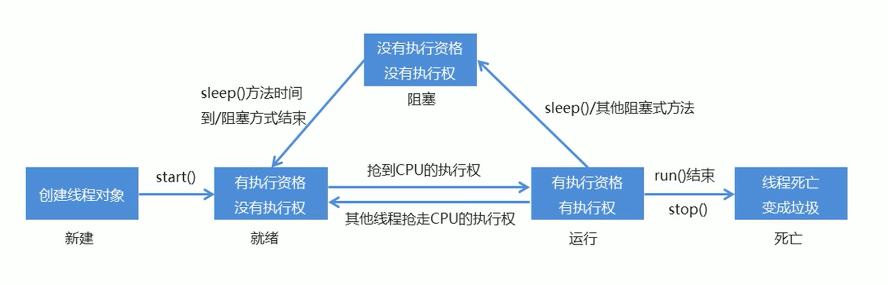

##### _8. 多线程的实现方式

方式2：实现Runnable接口

- 定义一个类MyRunnable实现Runnable接口
- 在MyRunnable类中重写run()方法
- 创建MyRunnable类的对象
- 创建Thread类的对象，把MyRunnable对象作为构造方法的参数
- 启动线程

多线程的实现方案有两种

- 继承Thread类
- 实现Runnable接口

相比继承Thread类，实现Runnable接口的好处

- 避免了Java单继承的局限性
- 适合多个相同程序的代码去处理同一个资源的情况，把线程和程序的代码、数据有效分离，较好的体现了面向对象的设计思想

代码演示：

```java
第一部分：
    package ProcessesAndThreads.RunnableDemo;

/**
 * 定义一个类MyRunnable实现Runnable接口
 * */
public class MyRunnable implements Runnable{

    //在MyRunnable类中重写run()方法
    @Override
    public void run() {
        for (int i = 1;i<100;i++){
            System.out.println(Thread.currentThread().getName() + "：" + i);
        }
    }
}


-----------------------------------------------------------
    
第二部分：
    package ProcessesAndThreads.RunnableDemo;

/**
 * 方式2：实现Runnable接口
 *
 * - 定义一个类MyRunnable实现Runnable接口
 * - 在MyRunnable类中重写run()方法
 * - 创建MyRunnable类的对象
 * - 创建Thread类的对象，把MyRunnable对象作为构造方法的参数
 * - 启动线程
 * */
public class RunnableDemo {
    public static void main(String[] args) {

        //创建MyRunnable类的对象
        MyRunnable my1 = new MyRunnable();
        MyRunnable my2 = new MyRunnable();

        //创建Thread类的对象，把MyRunnable对象作为构造方法的参数
        Thread t1 = new Thread(my1,"叶叶：");
        Thread t2 = new Thread(my2,"哈哈：");

        t1.start();
        t2.start();

    }
}

```

#### 2. 线程同步

##### _1. 案例：卖票

需求：某电影院目前正在上映国产大片，共有100张票，而它有3个窗口卖票，请设计一个程序模拟该电影院卖票

思路：

1. 定义一个类SellTicket实现Runnable接口，里面定义一个成员变量：private int tickets = 100;
2. 在SellTicket类中重写run()方法实现卖票，代码步骤如下
   1. 判断票数大于0，就卖票，并告知是哪个窗口卖的
   2. 卖了票之后，总票数要减1
   3. 票没有了，也可能有人来问，所以这里用死循环让卖票的动作一致执行
3. 定义一个测试类SellTicketDemo,里面又main方法，代码步骤如下
   1. 创建SellTicket类对象
   2. 创建三个Thread类的对象，把SellTicket对象作为构造方法的参数，并给出对应的窗口名称
   3. 启动线程

代码演示：

```java
步骤一：
    package ProcessesAndThreads.ThreadSynchronization.ThreadSynchronizationDemo01;

/**
 * 1. 定义一个类SellTicket实现Runnable接口，里面定义一个成员变量：private int tickets = 100;
 */
public class SellTicket implements Runnable {
    private int tickets = 100;

    //2. 在SellTicket类中重写run()方法实现卖票，代码步骤如下
    @Override
    public void run() {
        //3. 票没有了，也可能有人来问，所以这里用死循环让卖票的动作一致执行
        while (true) {
            //1. 判断票数大于0，就卖票，并告知是哪个窗口卖的
            if (tickets > 0) {
                System.out.println(Thread.currentThread().getName() + ":" + "正在出售第" + tickets + "张票");
                //2. 卖了票之后，总票数要减1
                tickets--;
            }
        }
    }
}


---------------------------------------------------------
    
步骤二：
package ProcessesAndThreads.ThreadSynchronization.ThreadSynchronizationDemo01;

/**
 * 需求：某电影院目前正在上映国产大片，共有100张票，而它有3个窗口卖票，请设计一个程序模拟该电影院卖票
 *
 * 思路：
 *
 * 1. 定义一个类SellTicket实现Runnable接口，里面定义一个成员变量：private int tickets = 100;
 * 2. 在SellTicket类中重写run()方法实现卖票，代码步骤如下
 *    1. 判断票数大于0，就卖票，并告知是哪个窗口卖的
 *    2. 卖了票之后，总票数要减1
 *    3. 票没有了，也可能有人来问，所以这里用死循环让卖票的动作一致执行
 * 3. 定义一个测试类SellTicketDemo,里面又main方法，代码步骤如下
 *    1. 创建SellTicket类对象
 *    2. 创建三个Thread类的对象，把SellTicket对象作为构造方法的参数，并给出对应的窗口名称
 *    3. 启动线程
 * */
public class SellTicketDemo {
    public static void main(String[] args) {
        //1. 创建SellTicket类对象
        SellTicket sellTicket = new SellTicket();

        //2. 创建三个Thread类的对象，把SellTicket对象作为构造方法的参数，并给出对应的窗口名称
        Thread t1 = new Thread(sellTicket,"Windows1");
        Thread t2 = new Thread(sellTicket,"Windows2");
        Thread t3 = new Thread(sellTicket,"Windows3");

        //3. 启动线程
        t1.start();
        t2.start();
        t3.start();
    }
}

```

##### _2. 卖票案例思考

刚才讲解的电影院卖票程序，好像没有什么问题。但是在实际生活中，售票时出票也是需要时间的，所以，在出售第一张票的时候，需要一点时间的延迟，接下来我们去修改卖票程序中卖票的动作：每次出票时间100毫秒，用sleep()方法实现

卖票出现了问题

- 相同的票出现了多次
- 出现了负数的票

问题原因：

- 线程执行的随机性导致的

##### _3. 数据安全问题的解决

为什么出现问题？(这也是我们判断多线程程序是否会有数据安全问题的标准)

- 是否是多线程环境
- 是否有共享数据
- 是否有多条语句操作共享数据

符合解决多线程安全问题？

- 把多条语句操作共享数据的代码给锁起来，让任意时刻只能有一个线程执行即可
- Java提供了同步代码块的方式来解决

##### _4. 同步代码块解决数据安全问题

锁多条语句操作共享数据，可以使用同步代码块实现

- 格式：

  ​	synchronized(任意对象){

  ​			多条语句操作共享数据的代码

  ​	}

- synchronized(任意对象)：就相当于给代码块加锁了，任意对象就可以看成是一把锁

同步的好处和弊端

- 好处：解决了多线程的数据安全问题
- 弊端：当线程很多时，因为每个线程都会去判断同步上锁，这是很耗费资源的，无形中会降低程序的运行效率

代码演示：

```java
第一部分：
package ProcessesAndThreads.ThreadSynchronization.ThreadSynchronizationDemo02;

/**
 * 1. 定义一个类SellTicket实现Runnable接口，里面定义一个成员变量：private int tickets = 100;
 */
public class SellTicket02 implements Runnable {
    private int tickets = 100;
    private Object obj = new Object();

    //2. 在SellTicket类中重写run()方法实现卖票，代码步骤如下
    @Override
    public void run() {
        //3. 票没有了，也可能有人来问，所以这里用死循环让卖票的动作一致执行
        while (true) {
            synchronized (obj) {
                //1. 判断票数大于0，就卖票，并告知是哪个窗口卖的
                if (tickets > 0) {
                    try {
                    Thread.sleep(300);
                } catch (InterruptedException e) {
                    e.printStackTrace();
                }

                    
                    System.out.println(Thread.currentThread().getName() + ":" + "正在出售第" + tickets + "张票");
                    //2. 卖了票之后，总票数要减1
                    tickets--;
                }
            }
        }
    }
}

-------------------------------------------------
    第二部分：
    package ProcessesAndThreads.ThreadSynchronization.ThreadSynchronizationDemo02;

/**
 *
 * */
public class SellTicketDemo02 {
    public static void main(String[] args) {
        //1. 创建SellTicket类对象
        SellTicket02 sellTicket = new SellTicket02();

        //2. 创建三个Thread类的对象，把SellTicket对象作为构造方法的参数，并给出对应的窗口名称
        Thread t1 = new Thread(sellTicket,"Windows1");
        Thread t2 = new Thread(sellTicket,"Windows2");
        Thread t3 = new Thread(sellTicket,"Windows3");

        //3. 启动线程
        t1.start();
        t2.start();
        t3.start();
    }
}

```

##### _5. 同步方法解决数据安全问题

同步方法：就是把synchronized关键字加到方法上

- 格式：

  ​	修饰符 synchronized 返回值类型 方法名(方法参数){	}

同步方法的锁对象是什么呢？

- this

同步静态方法：就是把synchronized关键字加到静态方法上

- 格式：

  ​	修饰符 static synchronized 返回值类型 方法名(方法参数){	}

同步静态方法的锁对象是什么呢？

- 类名.class

代码演示：

```java
第一部分：
    package ProcessesAndThreads.ThreadSynchronization.ThreadSynchronizationDemo03;

/**
 * 1. 定义一个类SellTicket实现Runnable接口，里面定义一个成员变量：private int tickets = 100;
 */
public class SellTicket03 implements Runnable {
    private static int tickets = 100;
    private Object obj = new Object();

    //2. 在SellTicket类中重写run()方法实现卖票，代码步骤如下
    int x = 0;
    @Override
    public void run() {
        //3. 票没有了，也可能有人来问，所以这里用死循环让卖票的动作一致执行
        while (true) {
            if (x % 2 == 0) {
//                synchronized (obj) {
//                synchronized (this) {//同步方法的锁是：this
                synchronized (SellTicket03.class) {//同步静态锁：类名.class
                    //1. 判断票数大于0，就卖票，并告知是哪个窗口卖的
                    if (tickets > 0) {
                        try {
                            Thread.sleep(100);
                        } catch (InterruptedException e) {
                            e.printStackTrace();
                        }

                        System.out.println(Thread.currentThread().getName() + ":" + "正在出售第" + tickets + "张票");
                        //2. 卖了票之后，总票数要减1
                        tickets--;
                    }
                }
            } else {
//                synchronized (obj) {
//                    //1. 判断票数大于0，就卖票，并告知是哪个窗口卖的
//                    if (tickets > 0) {
//                        try {
//                            Thread.sleep(100);
//                        } catch (InterruptedException e) {
//                            e.printStackTrace();
//                        }
//
//                        System.out.println(Thread.currentThread().getName() + ":" + "正在出售第" + tickets + "张票");
//                        //2. 卖了票之后，总票数要减1
//                        tickets--;
//                    }
//                }

                sellTicket();
            }
            x++;
        }
    }

//    private void sellTicket() {
//        synchronized (obj) {
//            //1. 判断票数大于0，就卖票，并告知是哪个窗口卖的
//            if (tickets > 0) {
//                try {
//                    Thread.sleep(100);
//                } catch (InterruptedException e) {
//                    e.printStackTrace();
//                }
//
//                System.out.println(Thread.currentThread().getName() + ":" + "正在出售第" + tickets + "张票");
//                //2. 卖了票之后，总票数要减1
//                tickets--;
//            }
//        }
//    }

    /**
     * //同步方法的锁是：this
     * */
//    private synchronized void sellTicket() {
//        //1. 判断票数大于0，就卖票，并告知是哪个窗口卖的
//        if (tickets > 0) {
//            try {
//                Thread.sleep(100);
//            } catch (InterruptedException e) {
//                e.printStackTrace();
//            }
//
//            System.out.println(Thread.currentThread().getName() + ":" + "正在出售第" + tickets + "张票");
//            //2. 卖了票之后，总票数要减1
//            tickets--;
//        }
//    }

    /**
     * //同步静态锁：类名.class
     * */
    private static synchronized void sellTicket() {
        //1. 判断票数大于0，就卖票，并告知是哪个窗口卖的
        if (tickets > 0) {
            try {
                Thread.sleep(100);
            } catch (InterruptedException e) {
                e.printStackTrace();
            }

            System.out.println(Thread.currentThread().getName() + ":" + "正在出售第" + tickets + "张票");
            //2. 卖了票之后，总票数要减1
            tickets--;
        }
    }
}

---------------------------------------------------------

第二部分：
    package ProcessesAndThreads.ThreadSynchronization.ThreadSynchronizationDemo03;

/**
 *
 * */
public class SellTicketDemo03 {
    public static void main(String[] args) {
        //1. 创建SellTicket类对象
        SellTicket03 sellTicket = new SellTicket03();

        //2. 创建三个Thread类的对象，把SellTicket对象作为构造方法的参数，并给出对应的窗口名称
        Thread t1 = new Thread(sellTicket,"Windows1");
        Thread t2 = new Thread(sellTicket,"Windows2");
        Thread t3 = new Thread(sellTicket,"Windows3");

        //3. 启动线程
        t1.start();
        t2.start();
        t3.start();
    }
}

```

##### _6. 线程安全的类

StringBuffer

- 线程安全，可变的字符序列
- 从版本JDK 5 开始，被StringBuilder 替代。通常应该使用StringBuilder类，因为它支持所有相同的操作，但它更快，因为它不执行同步

Vector

- 从Java 2平台v1.2开始，该类改进了List接口，使其成为Java Collections Framework的成员。与新的集合实现不同，Vector被同步。如果不需要线程安全的实现，建议使用ArrayList代替Vector

Hashtable

- 该类实现了一个哈希表，它将键映射到值。任何非null对象都可以用作键或者值
- 从Java 2平台v1.2开始，该类进行了改进，实现了Map接口，使其成为Java Collections Framework的成员。
  与新的集合实现不同，Hashtable被同步。如果不需要线程安全的实现，建议使用HashMap代替Hashtable

为什么说StringBuffer、Vector、Hashtable是线程安全的？

​		因为他们里面的方法都加了synchronized关键的

拓展：

​		如果说我们直接new 一个集合对象，执行它的线程，其结果是不安全的。
​		所以，我们使用Collectons里面的synchronizedList(List<T> list)方法，就可以让原本不安全的集合变的安全起来。

##### _7. Lock锁

虽然我们可以理解同步代码块和同步方法的锁对象问题，但是我们并没有直接看到在哪里加上了锁，在哪里释放了锁，为了更清晰的表达如何加锁何释放锁，JDK5以后提供了一个新的锁对象Lock

Lock实现提供比使用synchronized方法何语句可以获得更广泛的锁定操作
Lock中提供了获得锁何释放锁的方法

- void lock()：获得锁
- void unlock()：释放锁

Lock是接口不能直接实例化，这里采用它的实现类ReentrantLock来实例化
ReentrantLock的构造方法

- ReentrantLock()：创建一个ReentrantLock的实例

代码演示：

```java

步骤一：
    package ProcessesAndThreads.ThreadSynchronization.ThreadSynchronizationDemo04;

import java.util.concurrent.locks.Lock;
import java.util.concurrent.locks.ReentrantLock;

/**
 * Lock实现提供比使用synchronized方法何语句可以获得更广泛的锁定操作
 * Lock中提供了获得锁何释放锁的方法
 *
 * - void lock()：获得锁
 * - void unlock()：释放锁
 *
 * Lock是接口不能直接实例化，这里采用它的实现类ReentrantLock来实例化
 * ReentrantLock的构造方法
 *
 * - ReentrantLock()：创建一个ReentrantLock的实例
 */
public class SellTicket04 implements Runnable {
    private int tickets = 100;
    private Lock lock = new ReentrantLock();

    //2. 在SellTicket类中重写run()方法实现卖票，代码步骤如下
    @Override
    public void run() {
        //3. 票没有了，也可能有人来问，所以这里用死循环让卖票的动作一致执行
        while (true) {
            try{
                lock.lock();
                //1. 判断票数大于0，就卖票，并告知是哪个窗口卖的
                if (tickets > 0) {
                    System.out.println(Thread.currentThread().getName() + ":" + "正在出售第" + tickets + "张票");
                    //2. 卖了票之后，总票数要减1
                    tickets--;
                }
            }finally {
                lock.unlock();
            }
        }
    }
}


-----------------------------------------------------
    步骤二：
    package ProcessesAndThreads.ThreadSynchronization.ThreadSynchronizationDemo04;

/**
 * 需求：某电影院目前正在上映国产大片，共有100张票，而它有3个窗口卖票，请设计一个程序模拟该电影院卖票
 *
 * 思路：
 *
 * 1. 定义一个类SellTicket实现Runnable接口，里面定义一个成员变量：private int tickets = 100;
 * 2. 在SellTicket类中重写run()方法实现卖票，代码步骤如下
 *    1. 判断票数大于0，就卖票，并告知是哪个窗口卖的
 *    2. 卖了票之后，总票数要减1
 *    3. 票没有了，也可能有人来问，所以这里用死循环让卖票的动作一致执行
 * 3. 定义一个测试类SellTicketDemo,里面又main方法，代码步骤如下
 *    1. 创建SellTicket类对象
 *    2. 创建三个Thread类的对象，把SellTicket对象作为构造方法的参数，并给出对应的窗口名称
 *    3. 启动线程
 * */
public class SellTicketDemo04 {
    public static void main(String[] args) {
        //1. 创建SellTicket类对象
        SellTicket04 sellTicket = new SellTicket04();

        //2. 创建三个Thread类的对象，把SellTicket对象作为构造方法的参数，并给出对应的窗口名称
        Thread t1 = new Thread(sellTicket,"Windows1");
        Thread t2 = new Thread(sellTicket,"Windows2");
        Thread t3 = new Thread(sellTicket,"Windows3");

        //3. 启动线程
        t1.start();
        t2.start();
        t3.start();
    }
}

```

#### 3. 生产者消费者

##### _1. 生产者消费者模式概述

生产者消费者模式是一个十分经典的多线程协作的模式，弄懂生产者消费者问题能够让我们对多线程编程的理解更加深刻
所谓生产者消费者问题，实际上主要是包含了两类线程：

- 一类是生产者线程用于生产数据
- 一类是消费者线程用于消费数据

​			为了解耦生产者何消费者的关系，通常会采用共享的数据区域，就像是一个仓库

- 生产者生产数据之后直接放置在共享数据区中，并不需要关系消费者的行为
- 消费者只需要从共享数据区中去获取数据，并不需要关心生产者的行为

如图：


为了体现生产者和消费过程中的等待和唤醒，Java就提供了几个方法供我们使用，这几个方法在Object类中
Object类的等待和唤醒方法：

| 方法名           | 说明                                                         |
| ---------------- | ------------------------------------------------------------ |
| void wait()      | 导致当前线程等待，直到另一个线程调用该对象的 notify()方法或者 notifyAll()方法 |
| void notify()    | 唤醒正在等待对象监视器的单个线程                             |
| void notifyAll() | 唤醒正在等待对象监视器的所有线程                             |

**注意**：设置了 **等待** 操作，那么必定要进行 **唤醒** 操作

##### _2. 生产者消费者案例

生产者消费者案例中包含的类：

- 奶箱类(Box)：定义一个成员变量，表示第x瓶奶，提供存储牛奶和获取牛奶的操作
- 生产者类(Producer)：实现Runnable接口，重写run()方法，调用存储牛奶的操作
- 消费者类(Customer)：实现Runnable接口，重写run()方法，调用获取牛奶的操作
- 测试类(BoxDemo)：里面有main方法，main方法中的代码步骤如下
  1. 创建奶箱对象，这是共享数据区域
  2. 创建生产者对象，把奶箱对象作为构造方法参数传递，因为在这个类中要调用存储牛奶的操作
  3. 创建消费者对象，把奶香对象作为构造方法参数传递，因为在这个类中要调用获取牛奶的操作
  4. 创建2个线程对象，分别把生产者对象和消费者对象作为构造方法参数传递
  5. 启动线程

代码演示(奶箱类(Box))：

```java
package ProcessesAndThreads.BoundedBufferProblem;

/**
 * 奶箱类(Box)：定义一个成员变量，表示第x瓶奶，提供存储牛奶和获取牛奶的操作
 */
public class Box {
    //定义一个成员变量，表示第x瓶奶
    private int milk;
    //定义一个成员变量，表示奶箱的状态
    private boolean state =false;

    /*
     * 提供存储牛奶和获取牛奶的操作
     * */
    public synchronized void put(int milk) {
        //如果有牛奶，等待消费
        if (state) {
            try {
                wait();
            } catch (InterruptedException e) {
                e.printStackTrace();
            }
        }

        //如果没有牛奶
        this.milk = milk;
        System.out.println("送奶工已将第" + this.milk + "瓶奶放进送奶箱");

        //生产完毕之后，修改状态
        state = true;

        //唤醒其他等待的线程
        notify();

    }

    /*
     * 获取牛奶方法
     * */
    public synchronized void get() {
        //如果没有牛奶
        if (!state){
            try {
                wait();
            } catch (InterruptedException e) {
                e.printStackTrace();
            }
        }

        //如果有牛奶
        System.out.println("用户拿到第" + this.milk + "瓶奶");

        //消费完毕之后，修改奶箱状态
        state = false;

        //唤醒其他等待的线程
        notify();
    }
}

```

代码演示(生产者类(Producer))：

```java
package ProcessesAndThreads.BoundedBufferProblem;

/**
 * 生产者类(Producer)：实现Runnable接口，重写run()方法，调用存储牛奶的操作
 * */
public class Producer implements Runnable{
    private Box b;

    public Producer(Box b){
        this.b = b;
    }

    //重写run()方法
    @Override
    public void run() {
        //调用存储牛奶的操作
        for (int i = 1; i <= 30; i++) {
            b.put(i);
            try {
                Thread.sleep(1000);
            } catch (InterruptedException e) {
                e.printStackTrace();
            }
        }
    }
}

```

代码演示(消费者类(Customer))：

```java
package ProcessesAndThreads.BoundedBufferProblem;

/**
 * 消费者类(Customer)：实现Runnable接口，重写run()方法，调用获取牛奶的操作
 * */
public class Customer implements Runnable{
    private Box b;

    public Customer(Box b){
        this.b = b;
    }

    //重写run()方法
    @Override
    public void run() {
        //调用获取牛奶的操作
        while (true) {
            b.get();
            try {
                Thread.sleep(1100);
            } catch (InterruptedException e) {
                e.printStackTrace();
            }
        }
    }
}

```

代码演示(测试类(BoxDemo))：

```java
package ProcessesAndThreads.BoundedBufferProblem;

/**
 * 测试类(BoxDemo)：里面有main方法，main方法中的代码步骤如下
 *
 * 1. 创建奶箱对象，这是共享数据区域
 * 2. 创建生产者对象，把奶箱对象作为构造方法参数传递，因为在这个类中要调用存储牛奶的操作
 * 3. 创建消费者对象，把奶香对象作为构造方法参数传递，因为在这个类中要调用获取牛奶的操作
 * 4. 创建2个线程对象，分别把生产者对象和消费者对象作为构造方法参数传递
 * 5. 启动线程
 * */
public class BoxDemo {
    public static void main(String[] args) {
        //1. 创建奶箱对象，这是共享数据区域
        Box box = new Box();

        //2. 创建生产者对象，把奶箱对象作为构造方法参数传递，因为在这个类中要调用存储牛奶的操作
        Producer producer = new Producer(box);
        //3. 创建消费者对象，把奶香对象作为构造方法参数传递，因为在这个类中要调用获取牛奶的操作
        Customer customer = new Customer(box);

        //4. 创建2个线程对象，分别把生产者对象和消费者对象作为构造方法参数传递
        Thread prT = new Thread(producer,"生产者");
        Thread cuT = new Thread(customer,"消费者");

        //5. 启动线程
        prT.start();
        cuT.start();
    }
}

```

## 三十七、网络编程

#### 1. 网络编程入门

##### _1. 网络编程概述

计算机网络

- 是指将地理位置不同的具有独立功能的多台计算机及其外部设备，通过通信线路连接起来，在网络操作系统，网络管理软件及网络通信协议的管理和协调下，实现资源共享和信息传递的计算机系统

如图：

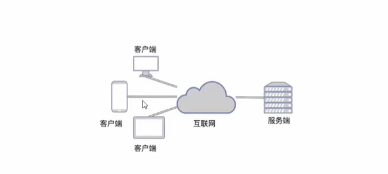

网络编程：

- 在网络通信协议下，实现网络互连的不同计算机上运行的程序间可以进行数据交换

##### _2. 网络编程三要素

​		**IP地址**

- 想要让网络中的计算机能够互相通信，必须为每台计算机指定一个标识号，通过这个标识号来指定要接收数据的计算机和识别发送的计算机，而IP地址就是这个标识号。也就是设备的标识

​		**端口**

- 网络的通信，本质上是两个应用程序的通信。每台计算机都有很多的应用程序，那么在网络通信时，如何区分这些应用程序呢？如果说IP地址可以唯一标识网络中的设备，那么端口号就可以唯一标识设备中的应用程序了。也就是应用程序的标识。

​		**协议**

- 通过计算机网络可以使多台计算机实现连接，位于同一个网络中的计算机在进行连接和通信时需要遵循一定的规则，这就好比在道路中行驶的汽车一定要遵守交通规则一样。在计算机网络中，这些连接和通信的规则被称为网络通信协议，它对数据的传输格式、传输速率、传输步骤等做了统一的规定，通信双方必须同时遵守才能完成数据交换。常见的协议有UDP协议和TCP协议

##### _3. IP地址

IP地址：是网络中设备的唯一标识

IP地址分为两大类

- IPv4：是给每个连接在网络上的主机分配一个32bit地址。按照TCP/IP规定，IP地址用二进制来表示，每个IP地址长32bit，也就是4个字节。例如一个采用二进制形式的IP地址是"11000000  10101000 00000001 01000010"，这么长的地址，处理起来也太费劲了。为了方便使用，IP地址经常被写成十进制的形式，中间使用符号"."分隔不同的字节。于是，上面的IP地址可以表示为"192.168.1.66"。IP地址的这种表示法叫做"点分十进制表示法"，这显然比1和0容易记的多
- IPv6：由于互联网的蓬勃发展，IP地址的需求愈来愈大，但是网络地址资源有限，使得IP的分配越发紧张。为了扩大地址空间，通过IPv6重新定义地址空间，采用128位地址长度，每16个字节一组，分成8组十六进制数，这样就解决了网络地址资源数量不够的问题

常用命令：

- ipconfig：查看本机IP地址
- ping IP地址：检查网络是否连通

特殊地址：

- 127.0.0.1：是回送地址，可以代表本机地址，一般用来测试使用

##### _4. InetAddress 的使用

为了方便我们对IP地址的获取和操作，Java提供了一个类InetAddress供我们使用

InetAddress：此类表示Internet协议(IP)地址

| 方法名                                    | 说明                                                         |
| ----------------------------------------- | ------------------------------------------------------------ |
| static InetAddress getByName(String host) | 确定主机名称的IP地址。主机名称可以是机器名称，也可以是IP地址 |
| String getHostName()                      | 获取此IP地址的主机名                                         |
| String getHostAddress()                   | 返回文本显示中的IP地址字符串                                 |

代码演示：

```java
package NetworkProgramming.NetworkProgramming01;

import java.net.InetAddress;
import java.net.UnknownHostException;

/**
 * InetAddress 的使用
 *
 *  static InetAddress getByName(String host) 确定主机名称的IP地址。主机名称可以是机器名称，也可以是IP地址
 *  String getHostName() 获取此IP地址的主机名
 *  String getHostAddress()  返回文本显示中的IP地址字符串
 * */
public class InetAddressDemo01 {

    public static void main(String[] args) throws UnknownHostException {

        //static InetAddress getByName(String host) 确定主机名称的IP地址。主机名称可以是机器名称，也可以是IP地址
//        InetAddress address = InetAddress.getByName("LAPTOP-4BF8GCTQ");
        InetAddress address = InetAddress.getByName("10.3.47.29");
        //String getHostName() 获取此IP地址的主机名
        String hostName = address.getHostName();
        System.out.println("主机名称：" + hostName);

        //String getHostAddress()  返回文本显示中的IP地址字符串
        String hostAddress = address.getHostAddress();
        System.out.println("IP地址：" + hostAddress);

    }
}

```

##### _5. 端口

端口：设备上应用程序的唯一标识

端口号：用两个字节表示的整数，它的取值范围是0~65535。其中，0~1023之间的端口号用于一些知名的网络服务和应用，普通的应用程序需要使用1024以上的端口号。如果端口号被另一个服务或应用所占用，会导致当前程序启动失败

##### _6. 协议

协议：计算机网络中，连接和通信的规则被称为网络通信协议

UDP协议

- 用户数据报协议(User Datagram Protocol)，不可靠。
- UDP是**面向无连接通信协议**，即在数据传输时，数据的发送端和接收端不建立逻辑连接。简单来说，当一台计算机向另外一台计算机发送数据时，发送端不会确认接收端是否存在，就会发出数据，同样接收端在收到数据时，也不会向发送端反馈是否收到数据。
  由于使用UDP协议消耗资源小，通信效率高，所以通常都会用于音频、视频和普通数据的传输
- 例如视频会议通常采用UDP协议，因为这种情况即使丢失一两个数据包，也不会对接收结果产生太大影响，。但是在使用UDP协议传送数据时，由于UDP的面向无连接性，不能保证数据的完整性，因此在传输重要数据时不建议使用UDP协议

TCP协议

- 传输控制协议(Transmission Control Protocol)，可靠。
- TCP协议是面向连接的通信协议，即传输数据之前，在发送端和接收端建立逻辑连接，然后再传送数据，它提供了两台计算机之间可靠无差错的数据传输。在TCP连接中必须要明确客户端与服务器端，由客户端向服务器发出连接请求，每次连接的创建都需要经过"三次握手"
- 三次握手：TCP协议中，在发送数据的准备阶段，客户端与服务器之间的三次交互，以保证连接的可靠
  第1次握手，客户端向服务器端发出连接请求，等待服务器确认
  第2次握手，服务器端向客户端回送一个响应，通知客户端收到了连接请求
  第3次握手，客户端再次向服务器端发送确认信息，确认连接
- 完成三次握手，连接建立后，客户端和服务器就可以开始进行数据传输了。由于这种面向连接的特性，TCP协议可以保证传输数据的安全性，所以应用十分广泛。例如上传文件、下载文件、浏览网页等

#### 2. UDP通信程序

##### _1. UDP通信原理

UDP协议是一种不可靠的网络协议，它在通信的两端各建立一个Socket对象，但是这两个Socket只是发送，接收数据的对象
因此对于基于UDP协议的通信双方而言，没有所谓的客户端和服务器的概念
Java提供了DatagramSocket类作为基于UDP协议的Socket

##### _2. UDP发送数据

发送数据的步骤

1. 创建发送端的Socket对象(DaatagramSocket)

   ​	DatagramSocket()方法实现

2. 创建数据，并把数据打包

   ​	DatagramPacket(byte[] buf , int length , InetAddress address , int port)

3. 调用DatagramSocket对象的方法发送数据

   ​	void send(DatagramPacket p)

4. 关闭发送端

   ​	void close();

代码演示：

```java
package NetworkProgramming.NetworkProgramming02;

import java.io.IOException;
import java.net.*;

/**
 * 发送数据的步骤
 *
 * 1. 创建发送端的Socket对象(DaatagramSocket)
 *
 *    	DatagramSocket()方法实现
 *
 * 2. 创建数据，并把数据打包
 *
 *    	DatagramPacket(byte[] buf , int length , InetAddress address , int port)
 *
 * 3. 调用DatagramSocket对象的方法发送数据
 *
 *   	void send(DatagramPacket p)
 *
 * 4. 关闭发送端
 *
 *    	void close();
 * */
public class UDPSendDemo {
    public static void main(String[] args) throws IOException {
        //1. 创建发送端的Socket对象(DaatagramSocket)
        DatagramSocket ds = new DatagramSocket();

        //2. 创建数据，并把数据打包
        //DatagramPacket(byte[] buf, int length, InetAddress address, int port)
        // 构造一个数据包，发送长度为 length的数据包到指定主机上的指定端口号。
        byte[] bys = "你好，我是UDP方式发送的数据！".getBytes();
//        int len = bys.length;
//        InetAddress address = InetAddress.getByName("10.3.47.29");
//        int port = 8080;

//        DatagramPacket dp = new DatagramPacket(bys,len,address,port);
        DatagramPacket dp = new DatagramPacket(bys,bys.length,InetAddress.getByName("10.3.47.29"),8080);

        //3. 调用DatagramSocket对象的方法发送数据
        //void send(DatagramPacket p) 从此套接字发送数据报包。
        ds.send(dp);

        //4. 关闭发送端
        //void close() 关闭此数据报套接字。
        ds.close();

    }
}

```

##### _3. UDP接收数据

接受数据的步骤

1. 创建接收端的Socket对象(DatagramSocket)

   ​	DatagramSocket(int port)

2. 创建一个数据包，用于接收数据

   ​	DatagramPacket(byte[] buf , int length)

3. 调用DatagramSocket对象的方法接收数据

   ​	void receive(DatagramPacket p)

4. 解析数据包，并把数据在控制台显示

   ​	byte[] getData()

   ​	int getLength()

5. 关闭接收端

   ​	void close()

代码演示：

```java
package NetworkProgramming.NetworkProgramming02;

import java.io.IOException;
import java.net.DatagramPacket;
import java.net.DatagramSocket;
import java.net.SocketException;

/**
 * 接受数据的步骤
 *
 * 1. 创建接收端的Socket对象(DatagramSocket)
 * 2. 创建一个数据包，用于接收数据
 * 3. 调用DatagramSocket对象的方法接收数据
 * 4. 解析数据包，并把数据在控制台显示
 * 5. 关闭接收端
 * */
public class UDPReceiveDemo {
    public static void main(String[] args) throws IOException {
        //1. 创建接收端的Socket对象(DatagramSocket)
        DatagramSocket ds = new DatagramSocket(8080);

        //2. 创建一个数据包，用于接收数据
        //DatagramPacket(byte[] buf, int length)
        // 构造一个 DatagramPacket用于接收长度为 length数据包。
        byte[] bys = new byte[2048];
        DatagramPacket dp = new DatagramPacket(bys,bys.length);

        //3. 调用DatagramSocket对象的方法接收数据
        ds.receive(dp);

        //4. 解析数据包，并把数据在控制台显示
//        byte[] datas = dp.getData();
        //int getLength() 返回要发送的数据的长度或接收数据的长度
//        int len = dp.getLength();
//        String dataString = new String(datas,0,len);
//        System.out.println("数据是：" + dataString);
        System.out.println("数据是：" + new String(dp.getData(),0,dp.getLength()));

        //5. 关闭接收端
        ds.close();
    }
}

```

注意：要想看见UDP数据接收(receive)效果，那么必须要于发送(Send)成对出现。

##### _4. UDP通信程序练习

按照下面的要求实现程序

- UDP发送数据：数据来自于键盘录入，直到输入的数据是886，发送数据结束
- UDP接收数据：因为接收端不知道发送端什么时候停止发送，故采用死循环接收

代码演示(UDP发送)：

```java
package NetworkProgramming.NetworkProgramming3;

import java.io.BufferedReader;
import java.io.IOException;
import java.io.InputStreamReader;
import java.net.*;

/**
 * 此类是UDP发送数据：数据来自于键盘录入，直到输入的数据是886，发送数据结束
 * <p>
 * 按照下面的要求实现程序
 * - UDP发送数据：数据来自于键盘录入，直到输入的数据是886，发送数据结束
 * - UDP接收数据：因为接收端不知道发送端什么时候停止发送，故采用死循环接收
 */
public class SendDemo {
    public static void main(String[] args) throws IOException {
        //创建发送端的Socket对象(DaatagramSocket),DatagramSocket()方法实现
        DatagramSocket ds = new DatagramSocket();

        //自己封装键盘录入数据
        System.out.println("开始输入：");
        BufferedReader br = new BufferedReader(new InputStreamReader(System.in));
        String line;
        while ((line = br.readLine()) != null) {
            //输入的数据是886，发送数据结束
            if (line.equals("886")) {
                break;
            }

            //创建数据，并把数据打包,DatagramPacket(byte[] buf , int length , InetAddress address , int port)
            byte[] bys = line.getBytes();
            DatagramPacket dp = new DatagramPacket(bys, bys.length, InetAddress.getByName("10.3.47.29"), 8088);

            //调用DatagramSocket对象的方法发送数据,void send(DatagramPacket p)
            ds.send(dp);
        }

        //关闭发送端
        ds.close();
    }
}

```

代码演示(UDP接收)：

```java
package NetworkProgramming.NetworkProgramming3;


import java.io.IOException;
import java.net.*;

/**
 * 此类是UDP接收数据：因为接收端不知道发送端什么时候停止发送，故采用死循环接收
 *
 * 按照下面的要求实现程序
 * - UDP发送数据：数据来自于键盘录入，直到输入的数据是886，发送数据结束
 * - UDP接收数据：因为接收端不知道发送端什么时候停止发送，故采用死循环接收
 * */
public class ReceiveDemo {
    public static void main(String[] args) throws IOException {
            //创建接收端的Socket对象(DatagramSocket)
            DatagramSocket ds = new DatagramSocket(8088);

        while(true) {
            //创建一个数据包，用于接收数据
            byte[] bys = new byte[1024];
            DatagramPacket dp = new DatagramPacket(bys, bys.length);

            //调用DatagramSocket对象的方法接收数据
            ds.receive(dp);

            //解析数据包，并把数据在控制台显示
            byte[] datas = dp.getData();
            int length = dp.getLength();
//            String dataString = new String(datas, length);
            System.out.println("数据是：" + new String(datas,0,length));
        }

            //关闭接收端
//            ds.close();
    }
}

```

#### 3. TCP通信程序

##### _1. TCP通信原理

TCP通信协议是一种可靠的网络协议，它在通信的两端各建立一个Socket对象，从而在通信的两端形成网络虚拟链路，
一旦建立了虚拟的网络链路，两端的程序就可以通过虚拟链路进行通信
Java对基于TCP协议的网络提供了良好的封装，使用Socket对象来代表两端的通信端口，并通过Socket产生IO流来进行网络通信
Java为客户端提供了Socket类，为服务器端提供了ServerSocket类

如图：

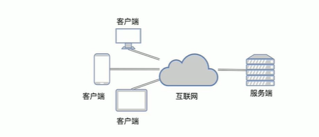

##### _2. TCP发送数据

发送数据的步骤

1. 创建客户端的Socket对象(Socket)

   ​	Socket(String host,int port)

2. 获取输出流，写数据

   ​	OutputStream getOutputStream()

3. 释放资源

   ​	void close();

代码演示：

```java
package NetworkProgramming.NetworkProgramming05;

import java.io.IOException;
import java.io.OutputStream;
import java.io.OutputStreamWriter;
import java.net.Socket;

/**
 * 发送数据的步骤
 *
 * 1. 创建客户端的Socket对象(Socket)
 *
 *    	Socket(String host,int port)
 *
 * 2. 获取输出流，写数据
 *
 *    	OutputStream getOutputStream()
 *
 * 3. 释放资源
 *
 *    	void close();
 *
 *    拓展：
 *    如果采用TCP方式进行数据传输，只有发送端，没有接收端就会出现异常ConnectException  (TCP方式传输需要与服务器进行三次握手)
 *      public class ConnectException
 *          extends SocketException指示尝试将套接字连接到远程地址和端口时发生错误。 通常，连接被远程拒绝（例如，没有进程正在监听远程地址/端口）。
 * */
public class ClientDemo {
    public static void main(String[] args) throws IOException {
        //1. 创建客户端的Socket对象(Socket)
        // Socket(String host,int port)
        Socket socket = new Socket("10.3.47.29",8848);

        //2. 获取输出流，写数据
        // OutputStream getOutputStream()
        OutputStream os = socket.getOutputStream();
        os.write("hello,我是TCP方式传输的数据！".getBytes());

        //释放资源
        socket.close();
    }
}

```

##### _3. TCP接收数据

接收数据的步骤

1. 创建服务器端的Socket对象(ServerSocket)

   ​	ServerSocket(int port)

2. 监听客户端连接，返回一个Socket对象

   ​	Socket accept()

3. 获取输入流，读数据，并把数据显示在控制台

   ​	InputStream getInputStream()

4. 释放资源

   ​	void close();

代码演示(Client)：

```java
package NetworkProgramming.NetworkProgramming05;

import java.io.IOException;
import java.io.OutputStream;
import java.io.OutputStreamWriter;
import java.net.Socket;

/**
 * 发送数据的步骤
 *
 * 1. 创建客户端的Socket对象(Socket)
 *
 *    	Socket(String host,int port)
 *
 * 2. 获取输出流，写数据
 *
 *    	OutputStream getOutputStream()
 *
 * 3. 释放资源
 *
 *    	void close();
 *
 *    拓展：
 *    如果采用TCP方式进行数据传输，只有发送端，没有接收端就会出现异常ConnectException  (TCP方式传输需要与服务器进行三次握手)
 *      public class ConnectException
 *          extends SocketException指示尝试将套接字连接到远程地址和端口时发生错误。 通常，连接被远程拒绝（例如，没有进程正在监听远程地址/端口）。
 * */
public class ClientDemo {
    public static void main(String[] args) throws IOException {
        //1. 创建客户端的Socket对象(Socket)
        // Socket(String host,int port)
        Socket socket = new Socket("10.3.47.29",8848);

        //2. 获取输出流，写数据
        // OutputStream getOutputStream()
        OutputStream os = socket.getOutputStream();
        os.write("hello,我是TCP方式传输的数据！".getBytes());

        //释放资源
        socket.close();
    }
}

```

代码演示(Server)：

```java
package NetworkProgramming.NetworkProgramming05;

import java.io.IOException;
import java.io.InputStream;
import java.net.ServerSocket;
import java.net.Socket;

/**
 * 接收数据的步骤
 *
 * 1. 创建服务器端的Socket对象(ServerSocket)
 * 2. 获取输入流，读数据，并把数据显示在控制台
 * 3. 释放资源
 * */
public class ServerDemo {
    public static void main(String[] args) throws IOException {
        //1. 创建服务器端的Socket对象(ServerSocket)
        //ServerSocket(int port) 创建绑定到指定端口的服务器套接字。
        ServerSocket ss = new ServerSocket(8848);

        //Socket accept() 侦听要连接到此套接字并接受它。
        Socket s = ss.accept();

        //2. 获取输入流，读数据，并把数据显示在控制台
        InputStream is = s.getInputStream();

        //字节流读数据(字节数组的方式)
        byte[] bys = new byte[1024];
        int len = is.read(bys);
        System.out.println("数据是：" + new String(bys,0,len));

        //关闭服务器端
        s.close();
        ss.close();

    }
}

```

##### _4. TCP通信程序练习

###### 练习1(服务器给出反馈)

- 客户端：发送数据，接收服务器反馈
- 服务器端：接收数据，给出反馈

代码演示(Client)：

```java
package NetworkProgramming.NetworkProgramming06;

import java.io.IOException;
import java.io.InputStream;
import java.io.OutputStream;
import java.net.Socket;

/**
 * 客户端：发送数据，接收服务器反馈
 * */
public class ClientDemo02 {
    public static void main(String[] args) throws IOException {
        //创建客户端的Socket对象(Socket)
        Socket socket = new Socket("10.3.47.29",8850);

        //获取输出流，写数据
        OutputStream os = socket.getOutputStream();
        os.write("嗨嗨嗨，TCP传数据来咯！".getBytes());

        //接收服务器的反馈
        InputStream is = socket.getInputStream();
        byte[] bys = new byte[1024];
        int len = is.read(bys);
        System.out.println(new String(bys,0,len));

        //释放资源
        socket.close();

    }
}

```

代码演示(Server)：

```java
package NetworkProgramming.NetworkProgramming06;

import java.io.IOException;
import java.io.InputStream;
import java.io.OutputStream;
import java.net.ServerSocket;
import java.net.Socket;

/**
 * 服务器端：接收数据，给出反馈
 * */
public class ServerDemo02 {
    public static void main(String[] args) throws IOException {
        //创建服务器端的Socket对象(ServerSocket)
        ServerSocket ss = new ServerSocket(8850);

        //监听客户端连接，返回一个Socket对象
        Socket s = ss.accept();

        //获取输入流，读数据，并把数据显示在控制台
        InputStream is = s.getInputStream();
        byte[] bys = new byte[1024];
        int len = is.read(bys);
        System.out.println(new String(bys,0,len));

        //给客户端进行一个反馈
        OutputStream os = s.getOutputStream();
        os.write("已收到所发送的数据！".getBytes());

        //释放资源
        ss.close();

    }
}

```

###### 练习2(客户端数据来自…)

- 客户端：数据来自于键盘录入，直到输入的数据是110，发送数据结束
- 服务器：接收到的数据在控制台输出

代码演示(Client)：

```java
package NetworkProgramming.NetworkProgramming06;

import java.io.*;
import java.net.Socket;

/**
 * 客户端：数据来自于键盘录入，直到输入的数据是110，发送数据结束
 */
public class ClientDemo06 {
    public static void main(String[] args) throws IOException {
        //创建客户端的Socket对象(Socket)
        Socket socket = new Socket("10.3.47.29", 9999);

        System.out.println("开始输入：");
        BufferedReader br = new BufferedReader(new InputStreamReader(System.in));
        //封装输出流对象
        BufferedWriter bw = new BufferedWriter(new OutputStreamWriter(socket.getOutputStream()));
        String line;
        while ((line = br.readLine()) != null) {
            if (line.equals("110")) {
                break;
            } else {
                //获取输出流，写数据
//                OutputStream os = socket.getOutputStream();
//                os.write(line.getBytes());
                bw.write(line);
                bw.newLine();
                bw.flush();

                //接收服务器的反馈
                InputStream is = socket.getInputStream();
                byte[] bys = new byte[1024];
                int len = is.read(bys);
                System.out.println(new String(bys,0,len));

            }
        }

        //释放资源
        socket.close();
    }
}

```

代码演示(Server)：

```java
package NetworkProgramming.NetworkProgramming06;

import java.io.*;
import java.net.ServerSocket;
import java.net.Socket;

/**
 * 服务器：接收到的数据在控制台输出
 * */
public class ServerDemo06 {
    public static void main(String[] args) throws IOException {
        //创建服务器端的Socket对象(ServerSocket)
        ServerSocket serverSocket = new ServerSocket(9999);

            //监听客户端连接，返回一个Socket对象
            Socket accept = serverSocket.accept();

            //获取输入流，读数据，并把数据显示在控制台
//            InputStream is = accept.getInputStream();
//            byte[] bys = new byte[1024];
//            int len = is.read(bys);
//            System.out.println(new String(bys, 0, len));
            BufferedReader br = new BufferedReader(new InputStreamReader(accept.getInputStream()));
            String line;
            while((line = br.readLine()) !=null){
                System.out.println(line);

                //给客户端进行一个反馈
                OutputStream os = accept.getOutputStream();
                os.write("已收到所发送的数据！".getBytes());

            }
        }
        //释放资源
//        serverSocket.close();
}

```

###### 练习3(服务器数据写入…)

- 客户端：数据来自于键盘录入，直到输入的数据是110，发送数据结束
- 服务器：接收到的数据写到文本文件

代码演示(Client)：

```java
package NetworkProgramming.NetworkProgramming07;

import java.io.*;
import java.net.Socket;

/**
 * 练习3
 * 客户端：数据来自于键盘录入，直到输入的数据是110，发送数据结束
 */
public class ClientDemo07 {
    public static void main(String[] args) throws IOException {
        //创建客户端的Socket对象(Socket)
        Socket socket = new Socket("10.3.47.29", 9999);

        System.out.println("开始输入：");
        BufferedReader br = new BufferedReader(new InputStreamReader(System.in));
        //封装输出流对象
        BufferedWriter bw = new BufferedWriter(new OutputStreamWriter(socket.getOutputStream()));
        String line;
        while ((line = br.readLine()) != null) {
            if (line.equals("110")) {
                break;
            } else {
                //获取输出流，写数据
//                OutputStream os = socket.getOutputStream();
//                os.write(line.getBytes());
                bw.write(line);
                bw.newLine();
                bw.flush();

                //接收服务器的反馈
                InputStream is = socket.getInputStream();
                byte[] bys = new byte[1024];
                int len = is.read(bys);
                System.out.println(new String(bys,0,len));
            }
        }

        //释放资源
        socket.close();
    }
}

```

代码演示(Server)：

```java
package NetworkProgramming.NetworkProgramming07;

import java.io.*;
import java.net.ServerSocket;
import java.net.Socket;

/**
 * 练习3
 * 服务器：接收到的数据写到文本文件
 * */
public class ServerDemo07 {
    public static void main(String[] args) throws IOException {
        //创建服务器端的Socket对象(ServerSocket)
        ServerSocket serverSocket = new ServerSocket(9999);

            //监听客户端连接，返回一个Socket对象
            Socket accept = serverSocket.accept();

            //获取输入流，读数据，并把数据保存到linlin.txt中
            BufferedReader br = new BufferedReader(new InputStreamReader(accept.getInputStream()));

            BufferedWriter brFile = new BufferedWriter(new FileWriter(
                    "src\\NetworkProgramming\\NetworkProgramming07\\TextFiles\\linlin.txt",true));
            String line;
            while((line = br.readLine()) !=null){
                //通过字符缓冲输出流将读取到的数据保存到到lin.txt文件中
                System.out.println("接收到数据：" + line);
                brFile.write(line);
                brFile.newLine();
                brFile.flush();

                //给客户端进行一个反馈
                OutputStream os = accept.getOutputStream();
                os.write("服务器端已通过9999端口接收到数据!\n并保存在服务器同级目录下的TextFiles文件夹中lin.txt文件中！".getBytes());

            }
        //释放资源
        brFile.close();
        serverSocket.close();
        }

}

```

文本演示(TxtFiles)：

```tex
你好啊，我的网络编程世界！
我来了哟
哈哈哈
一起加油，我要拿下你！
关于昨晚晚自习下课回去被耗子吓到这件事
关于国庆每天坚持学习，坚持锻炼这件事
充实又开心
对了对了，关键是收获到了知识
果然付出与收获是成正比的

```


###### 练习4(客户端数据来自…)

- 客户端：数据来自于文本文件
- 服务器：接收到的数据写入文本文件

代码演示(Client)：

```java
package NetworkProgramming.NetworkProgramming08;

import java.io.*;
import java.net.Socket;

/**
 * 练习4
 * - 客户端：数据来自于文本文件
 */
public class ClientDemo08 {
    public static void main(String[] args) throws IOException {
        //创建客户端的Socket对象(Socket)
        Socket socket = new Socket("10.3.47.29", 9999);

        System.out.println("开始输入：");
        //封装文本文件数据
        BufferedReader br = new BufferedReader(new FileReader(
                "src\\NetworkProgramming\\NetworkProgramming07\\TextFiles\\linlin.txt"));
        //封装输出流写数据
        BufferedWriter bw = new BufferedWriter(new OutputStreamWriter(socket.getOutputStream()));
        String line;
        while ((line = br.readLine()) != null) {
                //获取输出流，写数据
//                OutputStream os = socket.getOutputStream();
//                os.write(line.getBytes());
                bw.write(line);
                bw.newLine();
                bw.flush();

                //接收服务器的反馈
                InputStream is = socket.getInputStream();
                byte[] bys = new byte[1024];
                int len = is.read(bys);
                System.out.println(new String(bys,0,len));
        }

        //释放资源
        br.close();
        socket.close();
    }
}

```

代码演示(Server)：

```java
package NetworkProgramming.NetworkProgramming08;

import java.io.*;
import java.net.ServerSocket;
import java.net.Socket;

/**
 * 练习4
 * 服务器：接收到的数据写入文本文件
 * */
public class ServerDemo08 {
    public static void main(String[] args) throws IOException {
        //创建服务器端的Socket对象(ServerSocket)
        ServerSocket serverSocket = new ServerSocket(9999);

            //监听客户端连接，返回一个Socket对象
            Socket accept = serverSocket.accept();

            //获取输入流，读数据，并把数据保存到linlin.txt中
            BufferedReader br = new BufferedReader(new InputStreamReader(accept.getInputStream()));

            BufferedWriter brFile = new BufferedWriter(new FileWriter(
                    "src\\NetworkProgramming\\NetworkProgramming08\\TextFiles\\linlin.txt",true));
            String line;
            while((line = br.readLine()) !=null){
                //通过字符缓冲输出流将读取到的数据保存到到lin.txt文件中
                System.out.println("接收到数据：" + line);
                brFile.write(line);
                brFile.newLine();
                brFile.flush();

                //给客户端进行一个反馈
                OutputStream os = accept.getOutputStream();
                os.write("服务器端已通过9999端口接收到数据!\n并保存在服务器同级目录下的TextFiles文件夹中lin.txt文件中！".getBytes());

            }
        //释放资源
        brFile.close();
        serverSocket.close();
        }

}

```

###### 练习5(上传文件服务…)

- 客户端：数据来自于文本文件，接收服务器反馈
- 服务器：接收到的数据写入文本文件，给出反馈
- 出现问题：程序一直等待
- 原因：读数据的方法是阻塞的
- 解决办法：自定义结束标记;使用shutdownOutput()方法  **推荐使用**

代码演示(Client)：

```java
package NetworkProgramming.NetworkProgramming0901;

import java.io.*;
import java.net.Socket;

/**
 * 练习4
 * - 客户端：数据来自于文本文件
 */
public class ClientDemo0901 {
    public static void main(String[] args) throws IOException {
        //创建客户端的Socket对象(Socket)
        Socket socket = new Socket("10.3.47.29", 9999);

        //封装文本文件数据
        BufferedReader br = new BufferedReader(new FileReader(
                "src\\NetworkProgramming\\NetworkProgramming08\\TextFiles\\linlin.txt"));
        //封装输出流写数据
        BufferedWriter bw = new BufferedWriter(new OutputStreamWriter(socket.getOutputStream()));

        String line;
        while ((line = br.readLine()) != null) {
            bw.write(line);
            bw.newLine();
            bw.flush();

        }

//        System.out.println("22222");
        socket.shutdownOutput();

        //接收服务器的反馈
        BufferedReader bri = new BufferedReader(new InputStreamReader(socket.getInputStream()));
        String data = bri.readLine();//等待读取数据
        System.out.println("服务器的反馈：" + data);

        //释放资源
        br.close();
        socket.close();
    }
}

```

代码演示(Server)：

```java
package NetworkProgramming.NetworkProgramming0901;

import java.io.*;
import java.net.ServerSocket;
import java.net.Socket;

/**
 * 练习4
 * 服务器：接收到的数据写入文本文件
 */
public class ServerDemo0901 {
    public static void main(String[] args) throws IOException {
        //创建服务器端的Socket对象(ServerSocket)
        ServerSocket serverSocket = new ServerSocket(9999);

        //监听客户端连接，返回一个Socket对象
        Socket accept = serverSocket.accept();

        //获取输入流，读数据，并把数据保存到linlin.txt中
        BufferedReader br = new BufferedReader(new InputStreamReader(accept.getInputStream()));

        BufferedWriter brFile = new BufferedWriter(new FileWriter(
                "src\\NetworkProgramming\\NetworkProgramming0901\\PutFiles\\linlin.txt", true));
        String line;
        while ((line = br.readLine()) != null) {//等待读取数据
            //通过字符缓冲输出流将读取到的数据保存到到lin.txt文件中
            System.out.println("已上传数据：" + line);
            brFile.write(line);
            brFile.newLine();
            brFile.flush();
        }


//        System.out.println("11111");

        //给客户端进行一个反馈
        BufferedWriter bws = new BufferedWriter(new OutputStreamWriter(accept.getOutputStream()));
        bws.write("文件上传成功");
        bws.newLine();
        bws.flush();

        //释放资源
        brFile.close();
        serverSocket.close();
    }
}
```

###### 练习6(多线程实现文件上传)

- 客户端：数据来自于文本文件，接收服务器反馈
- 服务器：接收到的数据写入文本文件，给出反馈，代码用线程进行封装，为每一个客户开启一个线程

代码演示(Client)：

```java
package NetworkProgramming.NetworkProgramming10;

import java.io.*;
import java.net.Socket;

/**
 * 练习4
 * 客户端：数据来自于文本文件，接收服务器反馈
 */
public class ClientDemo10 {
    public static void main(String[] args) throws IOException {
        //创建客户端的Socket对象(Socket)
        Socket socket = new Socket("10.3.47.29", 9999);

        //封装文本文件数据
        BufferedReader br = new BufferedReader(new FileReader(
                "src\\NetworkProgramming\\NetworkProgramming08\\TextFiles\\linlin.txt"));
        //封装输出流写数据
        BufferedWriter bw = new BufferedWriter(new OutputStreamWriter(socket.getOutputStream()));

        String line;
        while ((line = br.readLine()) != null) {
            bw.write(line);
            bw.newLine();
            bw.flush();

        }

//        System.out.println("22222");
        socket.shutdownOutput();

        //接收服务器的反馈
        BufferedReader bri = new BufferedReader(new InputStreamReader(socket.getInputStream()));
        String data = bri.readLine();//等待读取数据
        System.out.println("服务器的反馈：" + data);

        //释放资源
        br.close();
        socket.close();
    }
}

```

代码演示(Server)：

```java
package NetworkProgramming.NetworkProgramming10;

import java.io.*;
import java.net.ServerSocket;
import java.net.Socket;

/**
 * 练习4
 * 服务器：接收到的数据写入文本文件，给出反馈，代码用线程进行封装，为每一个客户开启一个线程
 */
public class ServerDemo10 {
    public static void main(String[] args) throws IOException {
        //创建服务器端的Socket对象(ServerSocket)
        ServerSocket serverSocket = new ServerSocket(9999);

        while(true) {
            //监听客户端连接，返回一个Socket对象
            Socket accept = serverSocket.accept();

            //为每一个客户开启一个线程
            new Thread(new ServerThread(accept)).start();
        }

        //释放资源
//        serverSocket.close();
    }
}

```

代码演示(ServerThread实现Runnable类)：

```java
package NetworkProgramming.NetworkProgramming10;

import java.io.*;
import java.net.Socket;

public class ServerThread implements Runnable {
    private Socket s;

    public ServerThread() {
    }
    public ServerThread(Socket s){
        this.s = s;
    }

    //重写run方法
    @Override
    public void run() {

        try {
            //接收数据写到文本文件
            BufferedReader br = new BufferedReader(new InputStreamReader(s.getInputStream()));
            /*BufferedWriter bw = new BufferedWriter(new FileWriter(
                    "src\\NetworkProgramming\\NetworkProgramming10\\PutFiles\\Java.txt"));*/

            //解决名称冲突问题
            int count = 0;
            File file = new File(
                    "src\\NetworkProgramming\\NetworkProgramming10\\PutFiles\\Java.txt");
            while(file.exists()){
                count++;
                file = new File(
                        "src\\NetworkProgramming\\NetworkProgramming10\\PutFiles\\Java["+count+"].txt");
            }
            BufferedWriter bw = new BufferedWriter(new FileWriter(file));

            String line;
            while((line = br.readLine())!=null){
                bw.write(line);
                bw.newLine();
                bw.flush();
            }

            //给出反馈
            BufferedWriter bwServer = new BufferedWriter(new OutputStreamWriter(s.getOutputStream()));
            bwServer.write("文件上传成功");
            bwServer.newLine();
            bwServer.flush();

            //释放资源
            s.close();
        } catch (IOException e) {
            e.printStackTrace();
        }
    }
}

```

## 三十八、Lambda表达式


#### 1. 函数式编程思想概述

   	

在数学中，函数就是有输入量、输出量的一套计算方案，也就是"拿数据做操作"
面向对象强调"必须通过对象的形式来做事情"
函数式思想则尽量忽略面向对象的复杂语法："强调做什么，而不是以什么形式去做"
而我们要学习的Lambda表达式就是函数式思想的体现

#### 2. 体验Lambda表达式

需求：启动一个线程，在控制台输出一句话：多线程程序启动了

方式一：

- 定义一个类MyRunnable实现Runnable接口，重写run()方法
- 创建MyRunnable类的对象
- 创建Thread类的对象，把MyRunnable对象作为构造参数传递
- 启动线程

方式二：

- 匿名内部类的方式改进

方式三：

- Lambda表达式的方式改进

代码演示：

```java
package Lambda;

/**
 * 需求：启动一个线程，在控制台输出一句话：多线程程序启动了
 *
 * 方式一：
 *
 * - 定义一个类MyRunnable实现Runnable接口，重写run()方法
 * - 创建MyRunnable类的对象
 * - 创建Thread类的对象，把MyRunnable对象作为构造参数传递
 * - 启动线程
 *
 * 方式二：
 *
 * - 匿名内部类的方式改进
 *
 * 方式三：
 *
 * - Lambda表达式的方式改进
 * */
public class LambdaDemo01 {

    /**
     * 定义一个类MyRunnable实现Runnable接口，重写run()方法
     * */
    static class MyRunnable implements Runnable{
        //重写run()方法
        @Override
        public void run() {
            System.out.println("多线程程序启动了");
        }
    }

    /**
     * Lambda表达式测试类
     * */
    public static void main(String[] args) {
        /* 方式3 */
        //Lambda表达式的方式改进
        new Thread( () -> {
            System.out.println("多线程程序启动了");
        }).start();


        /* 方式2 */
//        //匿名内部类的方式改进
//        Thread thread = new Thread(new Runnable() {
//            @Override
//            public void run() {
//                System.out.println("多线程程序启动了");
//            }
//        });
////        System.out.println(thread.getName());//线程名称：Thread-0
//        //启动线程
//        thread.start();


        /* 方式1 */
//        //创建MyRunnable类的对象
//        MyRunnable myRunnable = new MyRunnable();
//
//        //创建Thread类的对象，把MyRunnable对象作为构造参数传递
//        Thread thread = new Thread(myRunnable);
//
//        //启动线程
//        thread.start();
    }
}

```

#### 3. Lambda表达式的标准格式

匿名内部类中重写run()方法的代码分析

- 方法形式参数为空，说明调用方法时不需要传递参数
- 方法返回值类型为void，说明方法执行没有结果返回
- 方法体中的内容，是我们具体要做的事情

**Lambda表达式的代码分析**

- ( )：里面没有内容，可以看成是方法形式参数为空
- ->：用箭头指向后面要做的事情
- { }：包含一段代码，我们称之为代码块，可以看成是方法体中的内容

组成Lambda表达式的三要素：**形式参数**，**箭头**，**代码块**

```java
	//匿名内部类
	new Thread(new Runnable() {
            @Override
            public void run() {
                System.out.println("多线程程序启动了");
            }
        }).start();
	
```

```java
	//Lambda表达式的方式改进
        new Thread( () -> {
            System.out.println("多线程程序启动了");
        }).start();
```

**Lambda表达式的格式**

- 格式：**(形式参数) -> {代码块}**
- 形式参数：如果有多个参数，参数之间用逗号隔开；如果没有参数，留空即可
- ->：由英文中画线和大于符号组成，固定写法。代表指向动作
- 代码块：是我们具体要做的事情，也就是以前我们写的方法体内容

#### 4. Lambda表达式的练习

Lambda表达式的使用前提

- 有一个接口
- 接口中有且仅有一个抽象方法

##### _1. 练习1(抽象方法无参…)

- 定义一个接口(Eatable)，里面定义一个抽象方法：void eat();

- 定义一个测试类(EatableDemo)，在测试类中提供两个方法

  ​	一个方法是：useEatable(Eatable e)

  ​	一个方法是主方法，在主方法中调用useEatable方法

代码演示(Eatable接口)：

```java
package Lambda.LambdaDemo02;

/**
 * 定义一个接口(Eatable)，里面定义一个抽象方法：void eat();
 * */
public interface Eatable {
    //定义一个抽象方法：void eat();
    public abstract void eat();
}

```

代码演示(EatableImpl接口实现类)：

```java
package Lambda.LambdaDemo02;

public class EatableImpl implements Eatable{
    //重写方法
    @Override
    public void eat() {
        System.out.println("即将吃晚饭了……");
    }
}

```

代码演示(EatableDemo测试类)：

```java
package Lambda.LambdaDemo02;

/**
 * 定义一个测试类(EatableDemo)，在测试类中提供两个方法
 *
 * 	一个方法是：useEatable(Eatable e)
 *
 * 	一个方法是主方法，在主方法中调用useEatable方法
 * */
public class EatableDemo {
    public static void main(String[] args) {
        //在主方法中调用useEatable方法
        Eatable e = new EatableImpl();
        useEatable(e);

        //匿名内部类
        useEatable(new Eatable() {
            @Override
            public void eat() {
                System.out.println("好好学习，天天向上！");
            }
        });

        //Lambda表达式
        useEatable( () -> {
            System.out.println("你有多努力，你就有多幸运！");
        });

    }

    /**
     * 方法区
     * */
    public static void useEatable(Eatable e){
        e.eat();
    }
}

```

##### _2. 练习2(抽象方法带参…)

- 定义一个接口(Flyable)，里面定义一个抽象方法：void fly(String s);

- 定义一个测试类(FlyableDemo)，在测试类中提供两个方法

  ​	一个方法是：useFlyable(Flyable f)

  ​	一个方法是主方法，在主方法中调用useFlyable方法

代码演示(Flyable接口)：

```java
package Lambda.LambdaDemo03;

/**
 * 定义一个接口(Flyable)，里面定义一个抽象方法：void fly(String s);
 * */
public interface Flyable {
    //定义一个抽象方法：void fly(String s);
    public abstract void fly(String s);
}

```

代码演示(FlyableImpl实现接口)：

```java
package Lambda.LambdaDemo03;

public class FlyableImpl implements Flyable{
    @Override
    public void fly(String s) {
        System.out.println(s);
    }
}

```

代码演示(FlyableDemo测试类)：

```java
package Lambda.LambdaDemo03;

/**
 * 练习2(抽象方法带参…)
 *
 * - 定义一个接口(Flyable)，里面定义一个抽象方法：void fly(String s);
 *
 * - 定义一个测试类(FlyableDemo)，在测试类中提供两个方法
 *
 *   	一个方法是：useFlyable(Flyable f)
 *
 *   	一个方法是主方法，在主方法中调用useFlyable方法
 * */
public class FlyableDemo {
    public static void main(String[] args) {
        //在主方法中调用useFlyable方法
        Flyable flyable = new FlyableImpl();
        useFlyable(flyable);

        //匿名内部类
        useFlyable(new Flyable() {
            @Override
            public void fly(String s) {
                System.out.println(s);
                System.out.println("要幽幽");
            }
        });

        //Lambda表达式
        useFlyable( (String s) ->{
            System.out.println(s);
        });
    }

    /**
     * 方法区
     * */
    public static void useFlyable(Flyable f){
        f.fly("不以物喜，不以己悲。");
    }
}

```

##### _3. 练习3(抽象方法带参<升级>…)

- 定义一个接口(Addable)，里面定义一个抽象方法：int add(int x , int y);

- 定义一个测试类(AddableDemo)，在测试类中提供两个方法

  ​	一个方法是：useAddable(Addable a)

  ​	一个方法是主方法，在主方法中调用useAddable方法

代码演示(Addable接口)：

```java
package Lambda.LambdaDemo04;

/**
 * 定义一个接口(Addable)，里面定义一个抽象方法：int add(int x , int y);
 * */
public interface Addable {
    //定义一个抽象方法：int add(int x , int y);
    public abstract int add(int x , int y);

}

```

代码演示(AddableImpl实现接口)：

```java
package Lambda.LambdaDemo04;

/**
 * 实现Addable接口
 * */
public class AddableImpl implements Addable{
    //重写方法
    @Override
    public int add(int x, int y) {
        return x+y;
    }
}

```

代码演示(AddableDemo测试类)：

```java
package Lambda.LambdaDemo04;

/**
 * 练习3(抽象方法带参<升级>…)
 * <p>
 * - 定义一个接口(Addable)，里面定义一个抽象方法：int add(int x , int y);
 * <p>
 * - 定义一个测试类(AddableDemo)，在测试类中提供两个方法
 * <p>
 * 一个方法是：useAddable(Addable a)
 * <p>
 * 一个方法是主方法，在主方法中调用useAddable方法
 */
public class AddableDemo {
    public static void main(String[] args) {
        //实现一个方法是：useAddable(Addable a)
        useAddable((int x, int y) -> {
            return x + y;
//            return x - y;
        });
    }

    /**
     * 方法区
     */
    public static void useAddable(Addable a) {
        int sum = a.add(2, 3);
        System.out.println(sum);
    }
}

```

#### 5. Lambda表达式的省略模式

省略规则：

- 参数类型可以省略。但是有多个参数的情况下，不能只省略一个
- 如果参数有且仅有一个，那么小括号可以省略
- 如果代码块的语句只有一条，可以省略大括号和分号，甚至是return

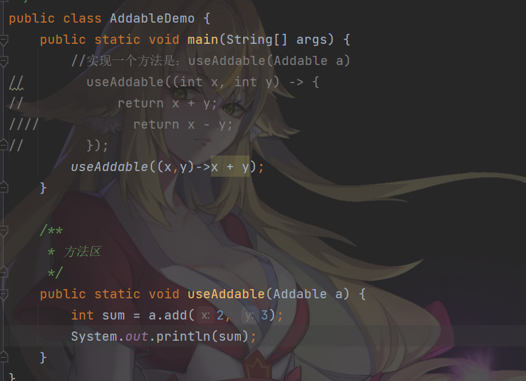

#### 6. Lambda表达式的注意事项

注意事项：

- 使用Lambda必须要有接口，并且要求接口中有且仅有一个抽象方法

- 必须有上下文环境，才能推导出Lambda对应的接口

  ​	根据局部变量的赋值得知Lambda对应的接口：Runnable r = () -> Sytem.out.pringln("Lambda表达式");

  ​	根据调用方法的参数得知Lambda对应的接口：new Thread( () -> System.out.println("Lambda表达式")).start;

#### 7. Lambda表达式和匿名内部类的区别

所需类型不同

- 匿名内部类：可以是接口，也可以是抽象类，还可以是具体类
- Lambda表达式：只能是接口

使用限制不同

- 如果接口中有且仅有一个抽象方法，可以使用Lambda表达式，也可以使用匿名内部类
- 如果接口中多余一个抽象方法，只能使用匿名内部类，而不能使用Lambda表达式

实现原理不同

- 匿名内部类：编译之后，产生一个单独的.class字节码文件
- Lambda表达式：编译之后，没有一个单独的.class字节码文件。对应的字节码会在运行的时候动态生成

## 三十九、接口组成更新

#### 1.接口组成更新概述

接口的组成

- 常量

  ​	public static final

- 抽象方法

  ​	public abstract

- 默认方法(Java 8)

- 静态方法(Java 8)

- 私有方法(Java 9)

#### 2. 接口中的默认方法

接口中给默认方法的定义格式：

- 格式：public **default** 返回值类型 方法名(参数列表){ }
- 范例：public **default** void show3(){ }

接口中默认方法的**注意事项**：

- 默认方法不是抽象方法，所以不强制被重写。但是可以被重写，重写的时候去掉default关键字
- public可以省略，default不能省略

#### 3. 接口中的静态方法

接口中静态方法的定义格式：

- 格式：public static 返回值类型 方法名(参数列表){  }
- 范例：public static void show(){  }

接口中静态方法的注意事项：

- 静态方法只能通过接口名调用，不能通过实现类名或者对象名调用
- public 可以省略，static不能省略

#### 4. 接口中私有方法

Java 9中新增了带方法体的私有方法，这其实在Java 8中就埋下了伏笔：Java 8允许在接口中定义带方法体的默认方法和静态方法。这样可能就会引发一个问题：当两个默认方法或者静态方法中包含一段相同的代码实现时，程序必然考虑将这段实现代码抽取成一个共性方法，而这个共性方法是不需要让别人使用的，因此用私有给隐藏起来，这就是Java 9增加私有方法的必然性

接口中私有方法的定义格式：

- 格式1：private 返回值类型 方法名(参数列表){  }
- 范例1：private void show(){  }
- 格式2：private static 返回值类型 方法名(参数列表){  }
- 范例2：private static void method(){  }

接口中私有方法的注意事项：

- 默认方法可以调用私有的静态方法和非静态方法
- 静态方法只能调用私有的静态方法

## 四十、方法引用

#### 1. 体验方法引用

在使用Lambda表达式的时候，我们实际上传递进去的代码就是一种解决方案：拿参数做操作
那么考虑一种情况：如果我们在Lambda中所指定的操作方案，已经有地方存在相同的方案，那是否还有必要再写重复逻辑呢？
答案肯定是没有必要
那我们又是如何使用已经存在的方案的呢？
这就是我们要讲解的方法引用，我们是通过方法引用来使用已经存在的方案

```java

//usePrintable是一个方法
//   ::  这个符号是方法引用符
eg：usePrintable(System.out :: println); 
原则：可推到的就是可省略的
```

#### 2. 方法引用符

方法引用符

- ::该符号为引用运算符，而它所在的表达式被称为方法引用

回顾一下我们再体验方法应用中的代码

- Lambda表达式：usePrintable(s -> System.out.println(s));

  ​	分析：拿到参数 s 之后通过Lambda表达式，传递给 System.out.println 方法去处理

- 方法引用：usePrintable(System.out :: println);

  ​	分析：直接使用System.out中的 Println 方法来取代Lambda，代码更加的简洁

推导与省略

- 如果使用Lambda，那么根据"可推到就可省略"的原则，无需指定参数类型，也无需指定的重载形式，它们都将被自动推导
- 方法引用是Lambda的孪生兄弟

#### 3. Lambda表达式支持的方法引用

常见的引用方式：

- 引用类方法
- 引用对象的实例方法
- 引用类的实例方法
- 引用构造器

##### _1. 引用类方法

引用类方法，其实就是引用类的静态方法

- 格式：类名 :: 静态方法

- 范例：Integer :: parselnt

  ​	Integer类的方法：public static int parselnt(String s)将此String转换为int类型数据

练习：

- 定义一个接口(Converter)，里面定义一个抽象方法

  ​	int convert(String s);

- 定义一个测试类(ConverterDemo)，在测试类中提供两个方法

  ​	一个方法是：useConverter(Converter c)

  ​	一个方法是主方法，在主方法中调用useConverter方法

代码演示(Converter接口)：

```java
package Lambda.LambdaDemo05;

/**
 * 定义一个接口(Converter)，里面定义一个抽象方法
 *
 * 	int convert(String s);
 * */
public interface Converter {

    //定义一个抽象方法 int convert(String s);
    int convert(String s);
}

```

代码演示(ConverterDemo测试类)：

```java
package Lambda.LambdaDemo05;

/**
 * 练习：
 *
 * - 定义一个接口(Converter)，里面定义一个抽象方法
 *
 *   	int convert(String s);
 *
 * - 定义一个测试类(ConverterDemo)，在测试类中提供两个方法
 *
 *   	一个方法是：useConverter(Converter c)
 *
 *   	一个方法是主方法，在主方法中调用useConverter方法
 * */
public class ConverterDemo {
    public static void main(String[] args) {
        //在主方法中调用useConverter方法
//        useConverter((String s) -> {
//            return Integer.parseInt(s);
//        });

        useConverter( s -> Integer.parseInt(s));

        //引用类方法
        useConverter(Integer :: parseInt);

        //Lambda表达式被类方法代替的时候，它的形式参数全部传递给静态方法作为参数

    }

    /**
     * 方法区
     * */
    public static void useConverter(Converter c){
        int number = c.convert("777");
        System.out.println(number);
    }
}

```

##### _2. 引用对象的实例方法

引用对象的实例方法，其实就引用类中的成员方法

- 格式：对象::成员方法

- 范例："HelloWorld" :: toUpperCase

  ​	String类中的方法：public String toUpperCase()将此String所有字符转换为大写

练习：

- 定义一个类(PrintString)，里面定义一个方法

  ​	public void printUpper(String s)：把字符串参数变成大写的数据，然后在控制台输出

- 定义一个接口(Printer)，里面定义一个抽象方法

  ​	void printUpperCase(String s)

- 定义一个测试类(PrinterDemo)，在测试类中提供两个方法

  ​	一个方法是：usePrinter(Printer p)

  ​	一个方法是主方法，在主方法中调用usePrinter 方法

代码演示(PrintString类)：

```java
package Lambda.LambdaDemo06;

import java.util.Locale;

/**
 * 定义一个类(PrintString)，里面定义一个方法
 *
 * 	public void printUpper(String s)：把字符串参数变成大写的数据，然后在控制台输出
 * */
public class PrintString {
    //里面定义一个方法public void printUpper(String s)
    // 作用：把字符串参数变成大写的数据，然后在控制台输出
    public void printUpper(String s){
        System.out.println(s.toUpperCase());
    }
}

```

代码演示(Printer接口)：

```java
package Lambda.LambdaDemo06;

/**
 * 定义一个接口(Printer)，里面定义一个抽象方法
 *
 * 	void printUpperCase(String s)
 * */
public interface Printer {
    //定义一个抽象方法 void printUpperCase(String s)
    void printUpperCase(String s);

}

```

代码演示(PrinterDemo测试类)：

```java
package Lambda.LambdaDemo06;

import java.util.Locale;

/**
 * 练习：
 *
 * - 定义一个类(PrintString)，里面定义一个方法
 *
 *   	public void printUpper(String s)：把字符串参数变成大写的数据，然后在控制台输出
 *
 * - 定义一个接口(Printer)，里面定义一个抽象方法
 *
 *   	void printUpperCase(String s)
 *
 * - 定义一个测试类(PrinterDemo)，在测试类中提供两个方法
 *
 *   	一个方法是：usePrinter(Printer p)
 *
 *   	一个方法是主方法，在主方法中调用usePrinter 方法
 * */
public class PrinterDemo {
    public static void main(String[] args) {
        //在主方法中调用usePrinter 方法
//        usePrinter((String s) -> {
////            String result = s.toUpperCase();
////            System.out.println(result);
//            System.out.println(s.toUpperCase());
//        });
        usePrinter(s -> System.out.println(s.toUpperCase()));

        //引用对象的实例方法
        PrintString ps = new PrintString();
        usePrinter(ps :: printUpper);
//        usePrinter(PrintString :: printUpper);//使用这种方式，PrintString类中调用的方法必须是静态
        
        //Lambda表达式被对象的实例方法替代的时候，它的形式参数全部传递给该方法作为参数

    }

    /**
     * 方法区
     * */
    //定义一个方法usePrinter(Printer p)
    public static void usePrinter(Printer p){
        p.printUpperCase("HelloJavaWorld!");
    }
}

```

##### _3. 引用类的实例方法

引用方法的实例方法，其实就是引用类中的成员方法

- 格式：类名::成员方法

- 范例：String ::substring

  ​	String类中的方法：public String substring(int beginIndex,int endIndex)

  ​	从beginIndex开始到endIndex结束，截取字符串。返回一个子串，字串的长度为endIndex-beginIndex

练习：

- 定义一个接口(MyString)，里面定义一个抽象方法：

  ​	String mySubString(String s , int x , int y)

- 定义一个测试类(MyStringDemo)，在测试类中提供两个方法

  ​	一个方法是：useMyString(MyString my)

  ​	一个方法是主方法，在主方法中调用useMyString方法

代码演示(MyString接口)：

```java
package Lambda.LambdaDemo07;

/**
 * 定义一个接口(MyString)，里面定义一个抽象方法：
 *
 *  String mySubString(String s , int x , int y)
 * */
public interface MyString {
    //定义一个抽象方法：String mySubString(String s , int x , int y)
    String mySubString(String s , int x , int y);

}

```

代码演示(MyStringDemo测试类)：

```java
package Lambda.LambdaDemo07;

/**
 * 练习：
 *
 * - 定义一个接口(MyString)，里面定义一个抽象方法：
 *
 *   	String mySubString(String s , int x , int y)
 *
 * - 定义一个测试类(MyStringDemo)，在测试类中提供两个方法
 *
 *   	一个方法是：useMyString(MyString my)
 *
 *   	一个方法是主方法，在主方法中调用useMyString方法
 * */
public class MyStringDemo {
    public static void main(String[] args) {
        //在主方法中调用useMyString方法
        useMyString((String s , int x , int y) -> {
            return s.substring(x, y);
        });

        useMyString((s,x,y) -> s.substring(x,y));

        //引用类中的实例方法
        useMyString(String::substring);

        //Lambda表达式被类的实例方法替代的时候
        //第一个参数作为调用者
        //后面的参数全部传递给该方法作为参数

    }

    /**
     * 方法区
     * */
    public static void useMyString(MyString my){
        String String = my.mySubString("abcde", 2, 5);
        System.out.println(String);
    }
}

```

##### _4. 引用构造器

引用构造器，其实就是引用构造方法

- 格式：类名::new
- 范例：Student::new

练习

- 定义一个类(Student)，里面有两个成员变量(name,age)

  ​	并提供无参构造方法和带参构造方法，以及成员变量对应的get和set方法

- 定义一个接口(StrdentBuilder)，里面定义一个抽象方法

  ​	Student build(String name,int age);

- 定义一个测试类(StudentDemo)，在测试类中提供两个方法

  ​	一个方法是：useStudentBuilder(StudentBuilder s)

  ​	一个方法是主方法，在主方法中调用useStudentBuilder方法

代码演示(Student类)：

```java
package Lambda.LambdaDemo08;

/**
 * 定义一个类(Student)，里面有两个成员变量(name,age)
 *
 *   并提供无参构造方法和带参构造方法，以及成员变量对应的get和set方法
 * */
public class Student {
    private String name;
    private int age;

    //无参构造方法和带参构造方法
    public Student() {
    }
    public Student(String name, int age) {
        this.name = name;
        this.age = age;
    }

    //成员变量对应的get和set方法
    public String getName() {
        return name;
    }

    public void setName(String name) {
        this.name = name;
    }

    public int getAge() {
        return age;
    }

    public void setAge(int age) {
        this.age = age;
    }
}

```

代码演示(StrdentBuilder接口)：

```java
package Lambda.LambdaDemo08;

/**
 * 定义一个接口(StrdentBuilder)，里面定义一个抽象方法
 *
 *     	Student build(String name,int age);
 * */
public interface StrdentBuilder {
    //定义一个抽象方法Student build(String name,int age);
    Student build(String name,int age);
}

```

代码演示(StudentDemo测试类)：

```java
package Lambda.LambdaDemo08;

/**
 * 练习
 *
 * - 定义一个类(Student)，里面有两个成员变量(name,age)
 *
 *   	并提供无参构造方法和带参构造方法，以及成员变量对应的get和set方法
 *
 * - 定义一个接口(StrdentBuilder)，里面定义一个抽象方法
 *
 *   	Student build(String name,int age);
 *
 * - 定义一个测试类(StudentDemo)，在测试类中提供两个方法
 *
 *   	一个方法是：useStudentBuilder(StudentBuilder s)
 *
 *   	一个方法是主方法，在主方法中调用useStudentBuilder方法
 * */
public class StudentDemo {
    public static void main(String[] args) {
        //在主方法中调用useStudentBuilder方法
//        useStudentBuilder((String name,int age) -> {
//            return new Student(name,age);
//        });
        useStudentBuilder((name,age) -> new Student(name,age));

        //引用构造器方法
        useStudentBuilder(Student :: new );

        //Lambda表达式被构造器代替的时候，它的形式参数全部传送给构造器作为参数

    }

    /**
     * 方法区
     * */
    public static void useStudentBuilder(StrdentBuilder s){
        Student student = s.build("小乔", 23);
        System.out.println(student.getName() + "," + student.getAge() + "岁");
    }
}

```

## 四十一、函数式接口

#### 1.函数式接口概述

函数式接口：有且仅有一个抽象方法的接口
Java中的函数式编程体现就是Lambda表达式，所以函数式接口就是可以适用于Lambda使用的接口
只有确保接口中有且仅有一个抽象方法，Java中的Lambda才能顺利地进行推导

如何检测一个接口是不是函数式接口呢？

- @FunctionalInterface
- 放在接口定义的上方：如果接口是函数式接口，编译通过；如果不是，编译失败

注意

- 我们自己定义函数式接口的时候，@FunctionalInterface是可选的，就算我不写这个注解，只要保证满足函数式接口定义的条件，也照样是函数式接口。但是，建议加上该注解

#### 2.函数式接口作为方法的参数

需求

- 定义一个类(RunnableDemo)，在类中提供两个方法

  ​	一个方法是：startThread(Runnable r) 方法参数Runnable是一个函数式接口

  ​	一个方法是主方法，在主方法中调用startThread方法

- 

如果方法的参数是一个函数式接口，我们可以使用Lambda表达式作为参数传递

- startThread( () -> System.out.println(Thread.currentThread().getName()) + "线程启动了");

代码演示：

```java
package Lambda.LambdaFunctionInterDemo01;

/**
 *需求
 *
 * - 定义一个类(RunnableDemo)，在类中提供两个方法
 *
 *   	一个方法是：startThread(Runnable r) 方法参数Runnable是一个函数式接口
 *
 *   	一个方法是主方法，在主方法中调用startThread方法
 *
 * 如果方法的参数是一个函数式接口，我们可以使用Lambda表达式作为参数传递
 *
 * - startThread( () -> System.out.println(Thread.currentThread().getName()) + "线程启动了");
 * */
public class RunnableDemo {
    public static void main(String[] args) {
        //在主方法中调用startThread方法
//        startThread(new Runnable() {
//            @Override
//            public void run() {
//                System.out.println(Thread.currentThread().getName() + ":这是一个线程启动了");
//            }
//        });
        startThread(()-> System.out.println(Thread.currentThread().getName()+ "：线程启动了"));

    }

    /**
     * 方法区
     *
     * 一个方法是：startThread(Runnable r) 方法参数Runnable是一个函数式接口
     *
     * */
    public static void startThread(Runnable r){
//        Thread t = new Thread(r);
//        t.start();
        new Thread(r).start();
    }
}

```

#### 3.函数式接口作为方法的返回值

需求

- 定义一个类(ComparatorDemo)，在类中提供两个方法

  ​	一个方法是：Comparator<String> getComparator() 方法返回值Comparator是一个函数式接口

  ​	一个方法是主方法，在主方法中调用getComparator

如果方法的返回值是一个函数式接口，我们可以使用Lambda表达式作为结果返回

- public static Comparator<String> getComparator() {

  ​	return (s1, s2) -> s1.length() - s2.length();

  }

代码演示：

```java
package Lambda.LambdaFunctionInterDemo02;

import java.util.ArrayList;
import java.util.Collections;
import java.util.Comparator;

/**
 * 需求
 * <p>
 * - 定义一个类(ComparatorDemo)，在类中提供两个方法
 * <p>
 * 一个方法是：Comparator<String> getComparator() 方法返回值Comparator是一个函数式接口
 * <p>
 * 一个方法是主方法，在主方法中调用getComparator
 */
public class ComparatorDemo {
    public static void main(String[] args) {
        //存储字符串的数组
        ArrayList<String> arrayList = new ArrayList<String>();
        arrayList.add("b");
        arrayList.add("eeeee");
        arrayList.add("aaa");

        System.out.println("排序前：" + arrayList);

        //在主方法中调用getComparator
//        Collections.sort(arrayList);
        Collections.sort(arrayList, getComparator());

        System.out.println("排序后：" + arrayList);

    }

    /**
     * 方法区
     * <p>
     * 一个方法是：Comparator<String> getComparator() 方法返回值Comparator是一个函数式接口
     */
    public static Comparator<String> getComparator() {
//        //匿名内部类的方式实现
//        Comparator<String> comp = new Comparator<String>() {
//            @Override
//            public int compare(String s1, String s2) {
//                return s1.length() - s2.length();
//            }
//        };

        //Lambda表达式
//        return (String s1,String s2) -> {
//            return s1.length() - s2.length();};'

        return (s1, s2) -> s1.length() - s2.length();
//        return null;
    }
}

```

#### 4.常用的函数式接口

Java 8在Java.util.function包下预定义了大量的函数式接口供我们使用

我们重点来学习下面的4个接口

- Supplier接口
- Consumer接口
- Predicate接口
- Function接口

#### 5.Supplier接口

##### _1. Supplier(生产型接口)

Supplier<T>：包含一个无参的方法

- T get()：获得结果
- 该方法不需要参数，它会按照某种实现逻辑(由Lambda表达式实现)返回一个数据
- Supplier<T>接口也被称为生产型接口，如果我们指定了接口的泛型是什么类型，那么接口中的get方法就会生产什么类型的数据供我们使用

代码演示：

```java
package Lambda.LambdaSupplierInter01;

import java.util.function.Supplier;

public class SupplierDemo01 {
    public static void main(String[] args) {
        String s = getString(() -> {
            return "大乔";
        });
        System.out.println(s);

        String name = getString(() -> "孙策");
        System.out.println(name);

        Integer i = getInteger(() -> 2022);
        System.out.println(i);

    }

    //定义一个方法，返回一个整数数据
    private static Integer getInteger(Supplier<Integer> supp){
        return supp.get();
    }

    //定义一个方法，返回一个字符串数据
    private static String getString(Supplier<String> supp){
        return supp.get();
    }
}

```

##### _2. 练习

- 定义一个类(Supplier Test)，在类中提供两个方法
  	一个方法是：int getMax(Supplier<Integer> sup) 用于返回一个int数组中的最大值
  	一个方法是主方法，在主方法中调用getMax方法

这次我们使用Lambda实现Supplier函数接口的练习就不能特别的简化了，因为我们方法体里面是多条语句。

代码演示：

```java
package Lambda.LambdaSupplierInter01;

import java.util.function.Supplier;

/**
 * 定义一个类(Supplier Test)，在类中提供两个方法
 * 	一个方法是：int getMax(Supplier<Integer> sup) 用于返回一个int数组中的最大值
 * 	一个方法是主方法，在主方法中调用getMax方法
 * */
public class SupplierDemo02 {
    public static void main(String[] args) {
        //定义一个数组
        int[] arr = {4,43,6,3,9,7,5};

        //在主方法中调用getMax方法
        int maxValue = getMax(()->{
            int max=arr[0];

            for (int i = 1;i<arr.length;i++){
                if (arr[i]>max){
                    max = arr[i];
                }
            }
            return max;
        });
        System.out.println("数组中最大值为：" + maxValue);
    }

    /**
     * 一个方法是：int getMax(Supplier<Integer> sup) 用于返回一个int数组中的最大值
     * */
    public static int getMax(Supplier<Integer> sup){
        return sup.get();
    }
}

```

#### 6.Consumer接口

##### _1. Consumer(消费型接口)

Consumer<T>：包含两个方法

- void accept(T t)：对给定的参数执行操作
- default Consumer<T> andThen(Consumer after)：返回一个组合的Consumer，一次执行操作，然后执行after操作
- Consumer<T>接口也被称为消费型接口，它消费的数据的数据类型由泛型指定

代码演示：

```java
package Lambda.LambdaConsumerInter01;

import javax.swing.*;
import java.util.function.Consumer;

/**
 * Consumer<T>：包含两个方法
 * <p>
 * - void accept(T t)：对给定的参数执行操作
 * - default Consumer<T> andThen(Consumer after)：返回一个组合的Consumer，一次执行操作，然后执行after操作
 * - Consumer<T>接口也被称为消费型接口，它消费的数据的数据类型由泛型指定
 */
public class ConsumerDemo01 {
    public static void main(String[] args) {
        //调用方法消费字符串
        /*operatorString("大乔",(String name)->{
            System.out.println(name);
        });*/
        operatorString("大乔", name -> System.out.println(name));
//        operatorString("大乔",System.out::println);

//        operatorString("大乔", name -> {
//            System.out.println(new StringBuilder(name).reverse().toString());
//        });
        operatorString("大乔", name -> System.out.println(new StringBuilder(name).reverse().toString()));

        System.out.println("----------------------");

        ////先拿name通过consumer1进行消费，再拿name通过consumer2进行消费，先输出：小乔  ：  后输出：乔小
        operatorString("小乔",name-> System.out.println(name),name-> System.out.println(new StringBuilder(name).reverse().toString()));

    }

    /**
     * 方法区域
     * */

    //定义一个方法，用不同的方式消费同一个字符串数据两次
    private static void operatorString(String name , Consumer<String> consumer1,Consumer<String> consumer2){
//        consumer1.accept(name);
//        consumer2.accept(name);
        //先拿consumer1进行消费name，再consumer2进行消费name
        consumer1.andThen(consumer2).accept(name);
    }

    //定义一个方法消费一个字符串数据
    private static void operatorString(String name, Consumer<String> consumer) {
        consumer.accept(name);
    }
}

```

##### _2. 练习

- String[] strArray = {"小乔,23","周瑜,25","孙策,19"};

- 字符串数组中有多条信息，请按照格式："姓名：XX   ,  年龄：XX"的格式将信息打印出来

- 要求：

  ​	把打印姓名的动作作为第一个Consumer接口的Lambda实例

  ​	把打印年龄的动作作为第二个Consumer接口的Lambda实例

  ​	将两个Consumer接口按照顺序组合到一起使用

代码演示：

```java
package Lambda.LambdaConsumerInter01;

import java.util.function.Consumer;

/**
 * 2. 练习
 * <p>
 * - String[] strArray = {"小乔,23","周瑜,25","孙策,19"};
 * <p>
 * - 字符串数组中有多条信息，请按照格式："姓名：XX,年龄：XX"的格式将信息打印出来
 * <p>
 * - 要求：
 * <p>
 * 把打印姓名的动作作为第一个Consumer接口的Lambda实例
 * <p>
 * 把打印年龄的动作作为第二个Consumer接口的Lambda实例
 * <p>
 * 将两个Consumer接口按照顺序组合到一起使用
 */
public class ConsumerDemo02 {
    public static void main(String[] args) {
        //新建数组
        String[] strArray = {"小乔,23", "周瑜,25", "孙策,19"};

        //调用方法，使用Lambda表达式进行操作
//        printInfo(strArray, (str) -> {
//            String name = str.split(",")[0];
//            System.out.print("姓名：" + name);
//        }, (str) -> {
//            int age = Integer.parseInt(str.split(",")[1]);
//            System.out.println(",年龄：" + age);
//        });

        //Lambda表达式优化
        printInfo(strArray, str -> System.out.print("姓名：" + str.split(",")[0])
                , str2 -> System.out.println("，年龄：" + str2.split(",")[1]));

    }

    private static void printInfo(String[] strArray, Consumer<String> con1, Consumer<String> con2) {
        //遍历集合
        for (String strGroup : strArray) {
            //先取出数组里面的单个元素
            String str = strGroup;
            con1.andThen(con2).accept(str);
        }
    }
}

```

#### 7.Predicate接口

##### _1. Predicate(判断型型接口)

Predicate<T>：常用的四个方法

- boolean test(T t)：对给定的参数进行判断(判断逻辑由Lambda表达式实现)，返回一个布尔值
- default Predicate<T> negate()：返回一个逻辑的否定，对应逻辑非
- default Predicate<T> and(Predicate other)：返回一个组合判断，对应短路与
- default Predicate<T> or(Predicate other)：返回一个组合判断，对应短路或
- Predicate<T>接口通常用于判断参数是否满足指定的条件

代码演示1：

```java
package Lambda.LambdaPredicateInter;

import java.util.function.Predicate;

/**
 * Predicate<T>：常用的四个方法
 *
 * - boolean test(T t)：对给定的参数进行判断(判断逻辑由Lambda表达式实现)，返回一个布尔值
 * - default Predicate<T> negate()：返回一个逻辑的否定，对应逻辑非
 * - default Predicate<T> and(Predicate other)：返回一个组合判断，对应短路与
 * - default Predicate<T> or(Predicate other)：返回一个组合判断，对应短路或
 * */
public class PredicateDemo01 {
    public static void main(String[] args) {
        //调用checkString方法进行判断
        boolean b1 = checkString("Mydear", (String s) -> {
//            return s.length() >8;//false
//            return s.length() > 2;//true
//            return s.length() > 2;//使用了非，返回false
            return s.length() > 2;//调用了negate()方法，则返回非值
        });
        System.out.println(b1);

    }

    /**
     * 方法区
     * */
    public static boolean checkString(String s , Predicate<String> pre){
        //boolean test(T t)：对给定的参数进行判断(判断逻辑由Lambda表达式实现)，返回一个布尔值
//        return pre.test(s);
//        return !pre.test(s);
        
        //default Predicate<T> negate()：返回一个逻辑的否定，对应逻辑非
        return pre.negate().test(s);
    }
}

```

代码演示2：

```java
package Lambda.LambdaPredicateInter;

import java.util.function.Predicate;

/**
 * - default Predicate<T> and(Predicate other)：返回一个组合判断，对应短路与
 * - default Predicate<T> or(Predicate other)：返回一个组合判断，对应短路或
 */
public class PredicateDemo02 {
    public static void main(String[] args) {
        //调用方法
        boolean b1 = checkString("hello", s -> s.length() > 8);
        System.out.println("b1:" + b1);//false
        boolean b2 = checkString("helloWorld", s -> s.length() > 8);
        System.out.println("b2:"+b2);//true

        boolean b3 = checkString("hello",s -> s.length()>8,s -> s.length()<15);
        System.out.println("b3:" + b3);//false

        boolean b4 = checkString("helloWorld",s -> s.length()>8,s -> s.length()<15);
        System.out.println("b4:" + b4);//使用and关系true

        boolean b5 = checkString("helloWorld",s -> s.length()>8,s -> s.length()<9);
        System.out.println("b5:" + b5);//使用or关系true
    }

    /**
     * 方法区
     */
    //同一个字符串给出两个不同的判断条件，最后把这两个判断的结果做逻辑与运算的记过作为最终的结果
    public static boolean checkString(String s, Predicate<String> pre1, Predicate<String> pre2) {
//        boolean b1 = pre1.test(s);
//        boolean b2 = pre2.test(s);
//        boolean b = b1 && b2;
//        return b;

        //or关系
        return pre1.or(pre2).test(s);

        //And关系
//        return pre1.and(pre2).test(s);
    }


    //判断给定的字符串是否满足要求
    public static boolean checkString(String s, Predicate<String> pre) {
        return pre.test(s);
    }
}

```

##### _2. 练习

- String[] strArray = {"林青霞,30","柳岩,34","张曼玉,35","貂蝉,31","王祖贤,33"};

- 字符串数组中有多条信息，请通过Predicate接口的拼接符合要求的字符串筛选到集合ArrayList中，并遍历ArrayList集合

- 同时满足如下要求：姓名长度大于2；年龄大于33

- 分析

  ​	有两个判断条件，所以需要使用两个Predicate接口，对条件进行判断

  ​	必须同时满足两个条件，所以可以使用and方法连接两个判断条件

代码演示：

```java
package Lambda.LambdaPredicateInter;

import java.lang.reflect.Array;
import java.util.ArrayList;
import java.util.function.Predicate;

/**
 * _2. 练习
 * <p>
 * - String[] strArray = {"林青霞,30","柳岩,34","张曼玉,35","貂蝉,31","王祖贤,33"};
 * <p>
 * - 字符串数组中有多条信息，请通过Predicate接口的拼接符合要求的字符串筛选到集合ArrayList中，并遍历ArrayList集合
 * <p>
 * - 同时满足如下要求：姓名长度大于2；年龄大于33
 * <p>
 * - 分析
 * <p>
 * 有两个判断条件，所以需要使用两个Predicate接口，对条件进行判断
 * <p>
 * 必须同时满足两个条件，所以可以使用and方法连接两个判断条件
 */
public class PredicateDemo03 {
    public static void main(String[] args) {
        //定义数组
        String[] strArray = {"林青霞,30", "柳岩,34", "张曼玉,35", "貂蝉,31", "王祖贤,33"};

        //调用方法
        ArrayList<String> afterArrayList = myFilter(strArray, s -> s.split(",")[0].length() > 2,
                s -> Integer.parseInt(s.split(",")[1]) > 33);

        //直接以数组的形式输出
        System.out.println(afterArrayList);

        //遍历输出
        for (String str :afterArrayList){
            System.out.println(str);
        }
    }

    /**
     * 方法区
     */
    private static ArrayList<String> myFilter(String[] strArray, Predicate<String> pre1, Predicate<String> pre2) {
        //定义集合
        ArrayList<String> array = new ArrayList<String>();

        //遍历集合
        for (String str : strArray) {
            if (pre1.and(pre2).test(str)) {
                array.add(str);
            }
        }

        return array;
    }
}
```

#### 8.Function接口

##### _1. Function(组合函数)

Function<T,R>：常用的两个方法

- R apply(T t)：将此函数应用于给定的参数
- default<V> Function andThen(Function after)：返回一个组合函数，首先将该函数应用于输入，然后将after函数应用于结果
- Function<T,R> 接口通常用于对参数进行处理，转换(处理逻辑由Lambda表达式实现)，然后返回一个新的值

代码演示：

```java
package Lambda.FunctionInter01;

import java.util.function.Function;

/**
 * Function<T,R>：常用的两个方法
 * <p>
 * - R apply(T t)：将此函数应用于给定的参数
 * - default<V> Function andThen(Function after)：返回一个组合函数，首先将该函数应用于输入，然后将after函数应用于结果
 * - Function<T,R> 接口通常用于对参数进行处理，转换(处理逻辑由Lambda表达式实现)，然后返回一个新的值
 */
public class FunctionDemo01 {
    public static void main(String[] args) {
        //调用方法，String类型转Integer类型,输出在控制台
        convert("999", s -> Integer.parseInt(s));

        //调用方法，把一个int类型的数据加上一个整数后，转为字符串在控制台输出
        convert(996, (i) -> String.valueOf(i + 3));

        //调用方法，把一个字符串转换int类型，把int类型的数据加上一个整数之后，转为字符串在控制台输出
        convert("466", s -> Integer.parseInt(s ), s -> String.valueOf(s+ 200));


    }

    /**
     * 方法区
     */
    //定义一个方法，String类型转Integer类型,输出在控制台
    private static void convert(String s, Function<String, Integer> fun) {
        Integer ss = fun.apply(s);
        System.out.println("String类型转Integer类型:" + ss);
    }

    //定义一个方法，把一个int类型的数据加上一个整数后，转为字符串在控制台输出
    private static void convert(Integer i, Function<Integer, String> fun) {
        String ss = fun.apply(i);
        System.out.println("Integer类型转String类型:" + ss);
    }

    //定义一个方法，把一个字符串转换int类型，把int类型的数据加上一个整数之后，转为字符串在控制台输出
    private static void convert(String s, Function<String, Integer> fun1, Function<Integer, String> fun2) {
//        Integer i = fun1.apply(s);
//        String ss = fun2.apply(i);
//        System.out.println("综合：" + ss);

        String ss = fun1.andThen(fun2).apply(s);
        System.out.println("综合：" + ss);

    }
}

```

##### _2. 练习

- String s = "小乔,30";

- 请按照我指定的要求进行操作：

  ​		1.将字符串截取得到数字年龄部分

  ​		2.将上一步的年龄字符串转换成int结果，在控制台输出

- 请通过Function接口实现函数拼接

代码演示：

```java
package Lambda.FunctionInter01;

import java.util.function.Function;

import static java.lang.Integer.parseInt;

/**
 * _2. 练习
 * <p>
 * - String s = "小乔,30";
 * <p>
 * - 请按照我指定的要求进行操作：
 * <p>
 * 1.将字符串截取得到数字年龄部分
 * <p>
 * 2.将上一步的年龄字符串转换成int结果，在控制台输出
 * <p>
 * - 请通过Function接口实现函数拼接
 */
public class FunctionDemo02 {
    public static void main(String[] args) {
        //定义一个字符串
        String s = "小乔,30";

        //调用方法
//        convert(s,(String ss) ->{
//            return s.split(",")[1];
//        },(String sss) -> {
//            return Integer.parseInt(sss);
//        },(sss) ->{
//            return sss+70;
//        });

        //Lambda表达式简写
//        convert(s, s1 -> s.split(",")[1],s1 -> Integer.parseInt(s1),s1 -> s1+70);

        //引用
        convert(s, s1 -> s.split(",")[1],Integer:: parseInt,s1 -> s1+70);

    }

    /**
     * 方法区
     */
    private static void convert(String s, Function<String, String> fun1, Function<String, Integer> fun2, Function<Integer, Integer> fun3) {
        Integer i = fun1.andThen(fun2).andThen(fun3).apply(s);
        System.out.println("相加后：" + i);
    }
}

```

## 四十二、Stream流

#### 1.体验Stream流

需求：按照下面的要求完成集合的创建和遍历

- 创建一个集合，存储多个字符串元素
- 把集合中所有以"张"开头的元素存储到一个新的集合
- 把"张"开头的集合中的长度为3的元素存储到一个新的集合
- 遍历上一步得到的集合

使用Stream流的方式完成过滤操作

- str.stream().filter(s -> s.startsWith("张")).filter((s -> s.length()==3)).forEach(System.out::println);
- 直接阅读代码的字面意思即可完善展示无关逻辑方式的语义：生成流、过滤姓张、过滤长度为3、逐一打印
- Stream流把真正的函数式编程风格引入到Java中

代码演示：

```java
package Lambda.StreamDemo01;

import java.util.ArrayList;

/**
 * 需求：按照下面的要求完成集合的创建和遍历
 *
 * - 创建一个集合，存储多个字符串元素
 * - 把集合中所有以"张"开头的元素存储到一个新的集合
 * - 把"张"开头的集合中的长度为3的元素存储到一个新的集合
 * - 遍历上一步得到的集合
 * */
public class StreamDemo {
    public static void main(String[] args) {
        //创建一个集合，存储多个字符串元素
        ArrayList<String> str = new ArrayList<String>();
        str.add("张无忌");
        str.add("黄蓉");
        str.add("张三丰");
        str.add("张流");
        str.add("孙策");

        //把集合中所有以"张"开头的元素存储到一个新的集合
        ArrayList<String> zhangList = new ArrayList<String>();
        for (String s : str){
            if (s.startsWith("张")){
                zhangList.add(s);
            }
        }
        System.out.println("张开头的单独存储：" + zhangList);//张开头的单独存储：[张无忌, 张三丰, 张流]

        //把"张"开头的集合中的长度为3的元素存储到一个新的集合
        ArrayList<String> threename = new ArrayList<String>();
        for (String s : zhangList){
            if (s.length() == 3){
                threename.add(s);
            }
        }
        System.out.println("姓名长度为3单独存储：" + threename);//姓名长度为3单独存储：[张无忌, 张三丰]

        //遍历集合
        for (String s : threename){
            System.out.println(s);
        }
        System.out.println("----------------");

        /**
         * Stream流来实现上面的案例
         * */
        System.out.println("Stream流：");
        str.stream().filter(s -> s.startsWith("张")).filter((s -> s.length()==3)).forEach(System.out::println);

    }
}

```

#### 2.Stream流的生成方式

Stream流的使用

- 生成流

  ​	通过数据源(集合,数组等)生成流

  ​	list.stream()

- 中间操作

  ​	一个流后面可以跟随零个或多个中间操作，其目的主要是打开流，做出某种程度的数据过滤/映射，然后返回一个新的流，交给下一个操作使用

  ​	filter()

- 终结操作

  ​	一个流只能由一个终结操作，当这个操作执行后，流就被使用"光"了，无法再被操作。所以这必定是流的最后一个操作

  forEach()

##### _1. Stream流的常见生成方式stream&static of(1)

- Collection体系的集合可以使用默认方法stream()生成流

  ​	default Stream<E> stream()

- Map体系的集合间接的生成流

- 数组可以通过Stream接口的静态方法of(T … values)生成流

代码演示：

```java
package Lambda.StreamDemo01;

import java.util.*;
import java.util.stream.Stream;

/**
 *
 * Stream流的常见生成方式
 *
 * - Collection体系的集合可以使用默认方法stream()生成流
 *
 *   	default Stream<E> stream()
 *
 * - Map体系的集合间接的生成流
 *
 * - 数组可以通过Stream接口的静态方法of(T … values)生成流*/
public class StreamModeDemo {
    public static void main(String[] args) {
        //Collection体系的集合可以使用默认方法stream()生成流
        List<String> list = new ArrayList<String>();
        Stream<String> listStream = list.stream();

        Set<String> set = new HashSet<String>();
        Stream<String> setStream = set.stream();

        //Map体系的集合间接的生成流
        Map<String , Integer> hashMapStream = new HashMap<String , Integer>();
        //Map集合 键 的流
        Set<String> keySet = hashMapStream.keySet();
        Stream<String> keySetStream = keySet.stream();
        //Map集合 值 的流
        Collection<Integer> values = hashMapStream.values();
        Stream<Integer> valuesStream = values.stream();
        //Map集合 键值对对象 的流
        Set<Map.Entry<String, Integer>> entrySet = hashMapStream.entrySet();
        Stream<Map.Entry<String, Integer>> entrySetStream = entrySet.stream();

        //数组可以通过Stream接口的静态方法of(T … values)生成流*/
        String[] strArray = {"张无忌","黄蓉","张三丰","黄盖"};
        Stream<String> strArrayStream = Stream.of(strArray);
        Stream<String> stringStream = Stream.of("张无忌", "黄蓉", "张三丰", "黄盖");
        Stream<Integer> integerStream = Stream.of(10, 60, 5, 25);
    }
}

```

##### _2. Stream流的常见中间操作方法filter(2)

Stream<T> filter(Predicate predicate)：用于对流中的数据进行过滤

​	Predicate接口中的方法	boolean test(T t)：对给定的参数进行判断，返回一个布尔值

代码演示：

```java
package Lambda.StreamDemo01;

import java.util.ArrayList;

/**
 * 需求：按照下面的要求完成集合的创建和遍历
 *
 * - 创建一个集合，存储多个字符串元素
 * - 把集合中所有以"张"开头的元素存储到一个新的集合
 * - 把"张"开头的集合中的长度为3的元素存储到一个新的集合
 * - 遍历上一步得到的集合
 * */
public class StreamDemo {
    public static void main(String[] args) {
        //创建一个集合，存储多个字符串元素
        ArrayList<String> str = new ArrayList<String>();
        str.add("张无忌");
        str.add("黄蓉");
        str.add("张三丰");
        str.add("张流");
        str.add("孙策");

        //把集合中所有以"张"开头的元素存储到一个新的集合
        ArrayList<String> zhangList = new ArrayList<String>();
        for (String s : str){
            if (s.startsWith("张")){
                zhangList.add(s);
            }
        }
        System.out.println("张开头的单独存储：" + zhangList);//张开头的单独存储：[张无忌, 张三丰, 张流]

        //把"张"开头的集合中的长度为3的元素存储到一个新的集合
        ArrayList<String> threename = new ArrayList<String>();
        for (String s : zhangList){
            if (s.length() == 3){
                threename.add(s);
            }
        }
        System.out.println("姓名长度为3单独存储：" + threename);//姓名长度为3单独存储：[张无忌, 张三丰]

        //遍历集合
        for (String s : threename){
            System.out.println(s);
        }
        System.out.println("----------------");

        /**
         * Stream流来实现上面的案例
         * */
        System.out.println("Stream流姓张：");
        str.stream().filter(s -> s.startsWith("张")).forEach(System.out::println);
        System.out.println("---------");
        System.out.println("Stream流长度为3");
        str.stream().filter(s -> s.length() == 3).forEach(System.out::println);
        System.out.println("--------");

        System.out.println("综合上面两种：");
        str.stream().filter(s -> s.startsWith("张")).filter((s -> s.length()==3)).forEach(System.out::println);

    }
}

```

##### _3. Stream流的常见中间操作方法limit&skip(3)

- Stream<T> limit(long maxSize)：返回此流中的元素组成的流，截取前指定参数的数据
- Stream<T> skip(long n )：跳过指定参数个数的数据，返回由该流的剩余元素组成的流

代码演示：

```java
package Lambda.StreamDemo01;

import java.util.ArrayList;

/**
 * - Stream<T> limit(long maxSize)：返回此流中的元素组成的流，截取前指定参数的数据
 * - Stream<T> skip(long n )：跳过指定参数个数的数据，返回由该流的剩余元素组成的流
 * */
public class StreamModeDemo02 {
    public static void main(String[] args) {
        //创建一个集合，存储多个字符串元素
        ArrayList<String> list = new ArrayList<String>();
        list.add("张无忌");
        list.add("黄蓉");
        list.add("张三丰");
        list.add("张流");
        list.add("孙策");
        list.add("张敏");

        //需求1：取前3个数据在控制台输出
        list.stream().limit(3).forEach(System.out::println);
        System.out.println("-------");

        //需求2：跳过3个元素，把剩下的元素在控制台输出
        list.stream().skip(3).forEach(System.out::println);
        System.out.println("--------");

        //需求3：跳过2个元素，把剩下的元素中前2个在控制台输出
        list.stream().skip(2).limit(2).forEach(System.out::println);

    }
}

```

##### _4. Stream流的常见中间操作方法concat&distinct(4)

static <T> Stream<T> concat(Stream a , Stream b)：合并a合并两个流为一个流

Stream<T> distinct()：返回由该流的不同元素(根据Object.equals(Object))组成的流

代码演示：

```java
package Lambda.StreamDemo01;

import java.util.ArrayList;
import java.util.stream.Stream;

/**
 * static <T> Stream<T> concat(Stream a , Stream b)：合并a合并两个流为一个流
 *
 * Stream<T> distinct()：返回由该流的不同元素(根据Object.equals(Object))组成的流
 * */
public class StreamModeDemo03 {
    public static void main(String[] args) {
        //创建一个集合，存储多个字符串元素
        ArrayList<String> list = new ArrayList<String>();
        list.add("张无忌");
        list.add("黄蓉");
        list.add("张三丰");
        list.add("张流");
        list.add("孙策");
        list.add("张敏");

        //需求1：取前4个数据组成一个流
        Stream<String> limitSream = list.stream().limit(4);

        //需求2：跳过2个数据组成一个流
        Stream<String> skipStream = list.stream().skip(2);

        //需求3：合并需求1和需求2得到的流，并把结果在控制台输出
//        Stream.concat(limitSream, skipStream).forEach(System.out::println);

        //需求4：合并需求1和需求2得到的流，并把结果在控制台输出，要求字符串元素不能重复
        Stream.concat(limitSream, skipStream).distinct().forEach(System.out::println);

    }
}

```

##### _5. Stream流的常见中间操作方法sorted构造方法(5)

Stream<T> sorted()：返回由此流的元素组成的流，根据自然顺序排序

Stream<T>sorted(Comparator comparator)：返回由该流的元素组成的流，根据提供的Comparator尽心排序

代码演示：

```java
package Lambda.StreamDemo01;

import java.util.ArrayList;

/***
 * Stream<T> sorted()：返回由此流的元素组成的流，根据自然顺序排序
 *
 * Stream<T>sorted(Comparator comparator)：返回由该流的元素组成的流，根据提供的Comparator尽心排序
 * */
public class StreamModeDemo04 {
    public static void main(String[] args) {
        //创建一个集合，存储多个字符串元素
        ArrayList<String> list = new ArrayList<String>();
        list.add("zhangwuji");
        list.add("huangrong");
        list.add("zhangsanfen");
        list.add("ahangliu");
        list.add("eunche");
        list.add("fhangming");

        System.out.println(list);

        //需求1：按照字母顺序把数据在控制台输出
        list.stream().sorted().forEach(System.out::println);

        System.out.println("---------------");

        //需求2：按照字符串的长度把数据在控制台输出
//        list.stream().sorted((s1,s2) -> s1.length() - s2.length()).forEach(System.out::println);
        list.stream().sorted((s1, s2) -> {
            int num = s1.length() - s2.length();
            int num2 = num == 0 ?s1.compareTo(s2):num;
            return num2;
        }).forEach(System.out::println);

    }
}

```

##### _6. Stream流的常见中间操作方法map&mapToInt().sum()(6)

<R> Stream <R> map(Function mapper)：返回由给定函数应用于此流的元素的结果组成的流
				Function接口中的方法			R apply(T t)

IntStream map ToInt(ToIntFunction mapper)：返回一个IntStream其中包含将给定函数应用于此流的元素的结果

代码演示：

```java
package Lambda.StreamDemo01;

import java.util.ArrayList;
import java.util.stream.IntStream;

/**
 * <R> Stream <R> map(Function mapper)：返回由给定函数应用于此流的元素的结果组成的流
 * 				Function接口中的方法			R apply(T t)
 *
 * IntStream map ToInt(ToIntFunction mapper)：返回一个IntStream其中包含将给定函数应用于此流的元素的结果
 * */
public class StreamModeDemo05 {
    public static void main(String[] args) {
        //新建集合对象
        ArrayList<String> list = new ArrayList<>();
        list.add("70");
        list.add("65");
        list.add("75");
        list.add("90");
        list.add("65");

        //<R> Stream <R> map(Function mapper)：返回由给定函数应用于此流的元素的结果组成的流
        list.stream().map(s -> Integer.parseInt(s)).forEach(System.out::println);
//        list.stream().map(Integer::parseInt).forEach(System.out::println);

        System.out.println("--------");

        //IntStream map ToInt(ToIntFunction mapper)：返回一个IntStream其中包含将给定函数应用于此流的元素的结果
        int result = list.stream().mapToInt(Integer::parseInt).sum();
        System.out.println(result);//365


    }
}

```

##### _7. Stream流的常见中间操作方法(7)

Stream流的常见终结操作方法

- void forEach(Consumer action)：对此流的每个元素执行操作

  ​		Consumer接口中的方法    void accept(T t )：对给定的参数执行此操作

- long  count()：返回此流中的元素数

代码演示：

```java
package Lambda.StreamDemo01;

import java.util.ArrayList;

/**
 * Stream流的常见终结操作方法
 *
 * - void forEach(Consumer action)：对此流的每个元素执行操作
 *
 *   		Consumer接口中的方法    void accept(T t )：对给定的参数执行此操作
 *
 * - long  count()：返回此流中的元素数
 * */
public class StreamModeDemo06 {
    public static void main(String[] args) {
        //创建一个集合，存储多个字符串元素
        ArrayList<String> list = new ArrayList<String>();
        list.add("张无忌");
        list.add("黄蓉");
        list.add("张三丰");
        list.add("张流");
        list.add("孙策");
        list.add("张敏");

        //void forEach(Consumer action)：对此流的每个元素执行操作
        list.stream().forEach(System.out::println);

        //long  count()：返回此流中的元素数
        long count = list.stream().filter(s -> s.startsWith("张")).count();
        System.out.println("姓张人数：" + count);
    }
}

```

##### _8. Stream流的练习

现在有两个ArrayList集合，分别存储6名男演员名称和6名女演员名称，要求完成如下的操作

- 男演员只要名字为3个字的前三人

- 女演员只要姓的，并且不要第一个

- 把过滤后的男演员姓名和女演员姓名合并到一起

- 把上一步操作后的元素作为构造方法的参数创建演员对象，遍历数据

  ​		演员类Actor已经提供，里面有一个成员变量，一个带参构造方法，以及成员变量对应的get/set方法

代码演示：

```java
package Lambda.StreamDemo01;

import java.util.ArrayList;
import java.util.stream.Stream;

/**
 * 现在有两个ArrayList集合，分别存储6名男演员名称和6名女演员名称，要求完成如下的操作
 * <p>
 * - 男演员只要名字为3个字的前三人
 * <p>
 * - 女演员只要姓杨的，并且不要第一个
 * <p>
 * - 把过滤后的男演员姓名和女演员姓名合并到一起
 * <p>
 * - 把上一步操作后的元素作为构造方法的参数创建演员对象，遍历数据
 * <p>
 * 演员类Actor已经提供，里面有一个成员变量，一个带参构造方法，以及成员变量对应的get/set方法
 */
public class StreamEg01 {
    public static void main(String[] args) {
        //创建一个ArrayList集合存储6名男演员
        ArrayList<String> boyList = new ArrayList<String>();

        //添加6名男演员
        boyList.add("肖战");
        boyList.add("白敬亭");
        boyList.add("刘耀文");
        boyList.add("胡歌");
        boyList.add("易烊千玺");
        boyList.add("周深");

        //创建一个ArrayList集合存储6名女演员
        ArrayList<String> girlList = new ArrayList<String>();
        //添加6名女演员
        girlList.add("杨紫");
        girlList.add("关晓彤");
        girlList.add("杨诗诗");
        girlList.add("杨幂");
        girlList.add("刘亦菲");
        girlList.add("杨允儿");

        //男演员只要名字为3个字的前三人
//        System.out.println("截取男明星名字是3个字的人：：");
        Stream<String> threeName = boyList.stream().filter(s -> s.length() == 3).limit(3);

        //女演员只要姓杨的，并且不要第一个
//        System.out.println("截取姓杨女演员，并且跳过第一个姓杨的：");
        Stream<String> nameYang = girlList.stream().filter(s -> s.startsWith("杨")).skip(1);

        //把过滤后的男演员姓名和女演员姓名合并到一起
        System.out.println("过滤后：");
        Stream<String> stream = Stream.concat(threeName, nameYang);

        //把上一步操作后的元素作为构造方法的参数创建演员对象，遍历数据
//        stream.map(Actor::new).forEach(System.out::println);
//        stream.map(Actor::new).forEach(n -> System.out.println(n.getName()));

        Stream.concat(boyList.stream().filter(s -> s.length() == 3).limit(3),
                girlList.stream().filter(s -> s.startsWith("杨")).skip(1)).map(Actor::new)
                .forEach(s -> System.out.println(s.getName()));


    }

    /**
     * 演员类Actor已经提供，里面有一个成员变量，一个带参构造方法，以及成员变量对应的get/set方法
     */
    static class Actor {
        private String name;

        /*无参 与 有参构造*/
        public Actor() {
        }

        public Actor(String name) {
            this.name = name;
        }

        /*get set 方法*/
        public String getName() {
            return name;
        }

        public void setName(String name) {
            this.name = name;
        }
    }

}

```

##### _9. Stream流的收集操作

对数据使用Stream流德方式操作完毕后，我想把流中的数据收集到集合中，该怎么办呢？
Stream流的收集方法

- R collect(Collector collector)
- 但是这个收集方法的参数是一个Collector接口

工具类Collectors提供了具体的收集方式

- public static <T> Collector toList()：把元素收集到List集合中
- public static <T> Collector toSet()：把元素收集到Set集合中
- public static Collector toMap(Function keyMapper,Function valueMapper)：把元素收集到Map集合中

代码演示：

```java
package Lambda.StreamDemo01;

import java.util.*;
import java.util.stream.Collectors;
import java.util.stream.Stream;

/**
 * Stream流的收集方法
 * <p>
 * - R collect(Collector collector)
 * - 但是这个收集方法的参数是一个Collector接口
 * <p>
 * 工具类Collectors提供了具体的收集方式
 * <p>
 * - public static <T> Collector toList()：把元素收集到List集合中
 * - public static <T> Collector toSet()：把元素收集到Set集合中
 * - public static Collector toMap(Function keyMapper,Function valueMapper)：把元素收集到Map集合中
 */
public class StreamDemoCollect {
    public static void main(String[] args) {
        //创建一个ArrayList集合存储6名男演员
        List<String> boyList = new ArrayList<String>();
        boyList.add("肖战");
        boyList.add("白敬亭");
        boyList.add("刘耀文");
        boyList.add("胡歌");
        boyList.add("易烊千玺");
        boyList.add("周深");

        /*
        //需求1：得到名字为3个字的流
        Stream<String> listStream = boyList.stream().filter(s -> s.length() == 3);

        //需求2：把使用Stream流操作完毕的数据收集到list集合中并遍历
        List<String> names = listStream.collect(Collectors.toList());
        for (String name : names){
            System.out.println(name);
        }
        */

        //创建Set集合对象
        HashSet<Integer> set = new HashSet<>();
        set.add(10);
        set.add(20);
        set.add(30);
        set.add(33);
        set.add(35);

        /*
        //需求3：得到年龄大于25的流
        Stream<Integer> setStream = set.stream().filter(age -> age > 25);

        //需求4：把使用Stream流操作完毕的数据收集到Set集合中并遍历
        Set<Integer> ages = setStream.collect(Collectors.toSet());
        for (Integer age :ages){
            System.out.println(age);
        }
        */

        //定义一个字符串数组，每一个字符串数据由姓名数据和年龄数据组合而成
        String[] strArray = {"肖战,30", "赵露思,25", "周深,33"};

        //需求5：得到字符串中年龄数据大于28的流
        Stream<String> arrayStream = Stream.of(strArray).filter(s -> Integer.parseInt(s.split(",")[1]) > 28);

        //需求6：把使用Stream流操作完毕的数据收集到Map集合中并遍历，字符串中的姓名作键，年龄作值
        Map<String, Integer> map = arrayStream.collect(Collectors.toMap(s -> s.split(",")[0], age -> Integer.parseInt(age.split(",")[1])));

        Set<String> keySet = map.keySet();
        for (String key :keySet){
            Integer age = map.get(key);
            System.out.println("姓名：" + key + " & " + "年龄：" + age + "岁");
        }

    }
}

```

## 四十三、反射

#### 1.类加载

##### _1. 类加载

​     当程序要使用某个类时，如果该类还未被加载到内存中，则系统会通过类的加载，类的连接，类的初始化这三个步骤来对类进行初始化。如果不出现意外情况，JVM将会连续完成这三个步骤，所以有时也把这三个步骤通称为类加载或者类初始化

类的加载

- 就是指将class文件读入内存，并为之创建一个java.lang.Class对象
- 任何类型被使用时，系统都为之建立一个java.lang.Class对象

类的连接

- 验证阶段：用于检验被加载的类是否有正确的内部结构，并和他类协调一致
- 准备阶段：负责为类的类变量分配内存，并设置默认初始化值
- 解析阶段：将类的二进制数据中的符号引用替换为直接引用

类的初始化

- 在该阶段，主要就是对类变量进行初始化

------------------------------------------------------------------------------------

**类的初始化步骤**

- 假如类还未被加载和连接，则程序先加载并连接该类
- 加入该类的直接父类还未被初始化，则先初始化其直接父类
- 加入类中有初始化语句，则系统依次执行这些初始化语句

**注意：**在执行第2个步骤的时候，系统对直接父类的初始化步骤也遵循初始化步骤1-3

**类的初始化时机：**

- 创建类的实例
- 调用类的类方法
- 访问类或者接口的类变量，或者为该类变量赋值
- 使用反射方式来强制创建某个类或接口对应的java.lang.Class对象
- 初始化某个类的子类
- 直接使用java.exe命令来运行某个主类


#### 2.反射


