# Maven 介绍

##Maven简介

###什么是Maven

> - Maven 的正确发音是**[ˈmevən]**。Maven 在美国是一个口语化的词语，代表专家、内行的意思。
>
> - Maven定义：Maven 是一个项目管理工具，它包含了一个项目对象模型 (POM**：**Project Object Model)，一组标准集合，一个项目生命周期(Project Lifecycle)，一个依赖管理系统(Dependency Management System)，和用来运行定义在生命周期阶段(phase)中插件(plugin)目标(goal)的逻辑。

###Maven能解决什么问题

> 1、我们需要引用各种 jar 包，尤其是比较大的工程，引用的 jar 包往往有几十个乃至上百个， 每用到一种 jar 包，都需要手动引入工程目录，而且经常遇到各种让人抓狂的 jar 包冲突，版本冲突。
>
> 2、不需要手动编译Java文件。我们写好的 Java 文件，需要将它编译成二进制字节码。现在这项工作可以由各种集成开发工具帮我们完成，如Eclipse、IDEA 等都可以将代码即时编译。
>
> 3、世界上没有不存在 bug 的代码。为了减少 bug，因此写完了代码，我们还要写一些单元测试，然后一个个的运行来检验代码质量。
>
> 4、再优雅的代码也是要出来卖的。我们后面还需要把代码与各种配置文件、资源整合到一起，定型打包，如果是 web 项目，还需要将之发布到服务器。如果现在有一种工具，可以把你从上面的繁琐工作中解放出来，能帮你构建工程，管理 jar包，编译代码，还能帮你自动运行单元测试，打包，生成报表，甚至能帮你部署项目，生成 Web 站点，你会心动吗？Maven 就可以解决上面所提到的这些问题。


##Maven的两个经典作用

###Maven的依赖管理

> - Maven 的一个核心特性就是依赖（jar包）管理。当我们涉及到多模块的项目（包含成百个模块或者子项目），管理依赖就变成一项困难的任务。Maven 展示出了它对处理这种情形的高度控制。
> - 传统的 WEB 项目中，我们必须将工程所依赖的 jar 包复制到工程中，导致了工程的变得很大。那么maven 工程是如何使得工程变得很少呢？

分析如下：

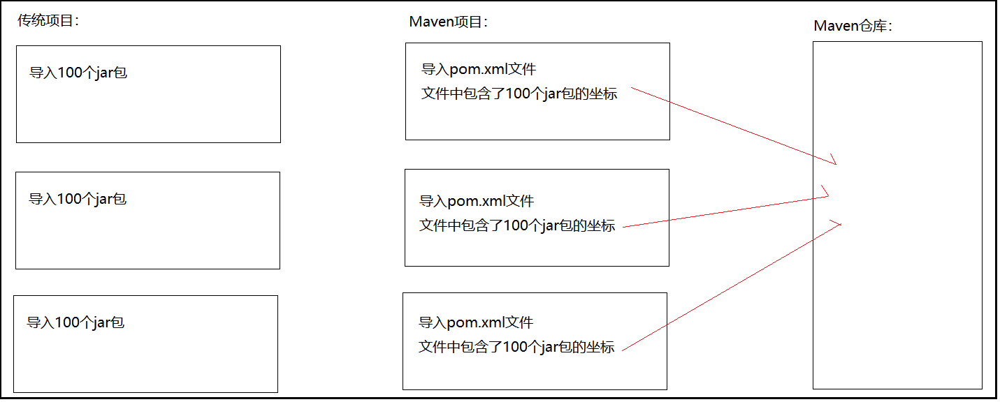

- 坐标

```xml
<dependency><!--依赖-->
    <groupId>javax.servlet</groupId><!--组ID，对应的是包名-->
    <artifactId>javax.servlet-api</artifactId><!--对应的是项目名称-->
    <version>3.1.0</version><!--版本-->
    <scope>provided</scope><!--作用范围-->
</dependency>
```

> 通过分析发现：maven 工程中不直接将 jar 包导入到工程中，而是通过在 pom.xml 文件中添加所需 jar包的坐标，这样就很好的避免了 jar 包直接引入进来，在需要用到 jar 包的时候，只要查找 pom.xml 文件，再通过 pom.xml 文件中的坐标，到一个专门用于”存放 jar 包的仓库”(maven 仓库)中根据坐标从而找到这些 jar 包，再把这些 jar 包拿去运行。

> 那么问题来了

> 第一：”存放 jar 包的仓库”长什么样？
>
> 第二：通过读取 pom.xml 文件中的坐标，再到仓库中找到 jar 包，会不会很慢？从而导致这种方式不可行！
>
> 第一个问题：.....
>
> 第二个问题：通过 pom.xml 文件配置要引入的 jar 包的坐标，再读取坐标并到仓库中加载 jar 包，这样我们就可以直接使用 jar 包了，为了解决这个过程中速度慢的问题，maven 中也有索引的概念，通过建立索引，可以大大提高加载 jar 包的速度，使得我们认为 jar 包基本跟放在本地的工程文件中再读取出来的速度是一样的。这个过程就好比我们查阅字典时，为了能够加快查找到内容，书前面的目录就好比是索引，有了这个目录我们就可以方便找到内容了，一样的在 maven 仓库中有了索引我们就可以认为可以快速找到 jar 包

###项目的一键构建

> 我们的项目，往往都要经历编译、测试、运行、打包、安装 ，部署等一系列过程。
>
> 什么是构建？
>
> 指的是项目从编译、测试、运行、打包、安装 ，部署整个过程都交给 maven 进行管理，这个过程称为构建。
>
> 什么是一键构建？
>
> 指的是整个构建过程，使用 maven 一个命令可以轻松完成整个工作。

- Maven 规范化构建流程如下：


#Maven 的使用 

##Maven的安装

###Maven 软件的下载

为了使用 Maven 管理工具，我们首先要到官网去下载它的安装软件。通过百度搜索“Maven“如下：

点击 Download 链接，就可以直接进入到 Maven 软件的下载页面：	

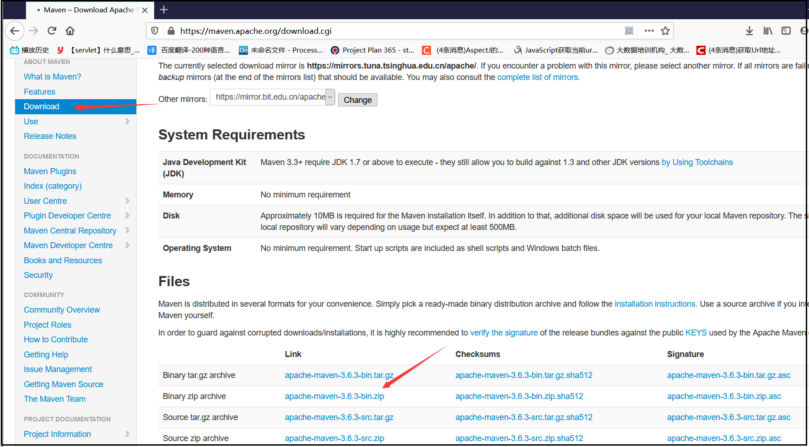

###Maven软件的安装

> Maven 下载后，将 Maven 解压到一个没有中文没有空格的路径下，比如 D:\Program Files (x86)\maven3.5.2下面。
>
> 解压后目录结构如下：
>
> bin:存放了 maven 的命令
>
> boot:存放了一些 maven 本身的引导程序，如类加载器等
>
> conf:存放了 maven 的一些配置文件，如 **setting.xml** 文件
>
> lib:存放了 maven 本身运行所需的一些 jar 包
>
> 至此我们的 maven 软件就可以使用了，前提是你的电脑上之前已经安装并配置好了 JDK。

###JDK的准备及统一

本次课程我们所使用工具软件的统一，JDK 使用 JDK8版本（建议统一）

###Maven及JDK 配置

> 电脑上需安装 java 环境，安装 JDK1.8 版本
>
> 配置 MAVEN_HOME ，变量值就是你的 maven 安装 的路径（maven的根目录）


> 配置path目录，为bin的根目录（不要使用绝对路径）


###Maven 软件版本测试

通过 mvn -v命令检查 maven 是否安装成功，看到 maven 的版本为 3.5.2 及 java 版本为 1.8 即为安装成功。

找开 cmd 命令，输入 mvn –v命令，如下图：


##Maven仓库

###**Maven** **仓库的分类**

maven 的工作需要从仓库下载一些 jar 包，如下图所示:

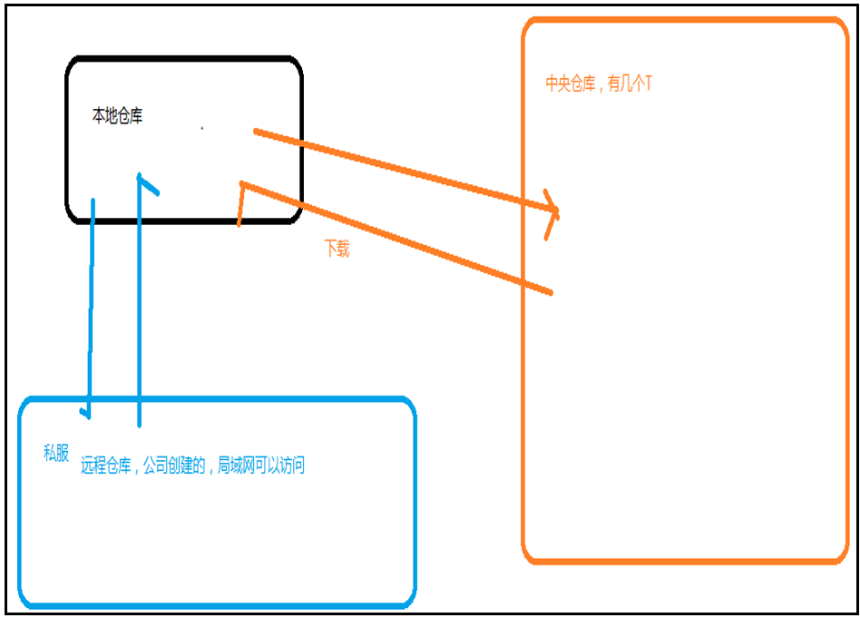


> 本地的项目会先通过 maven软件从**中央仓库**下载 jar 包并储存在**本地仓库**，**本地仓库**就是本地文件夹，当第二次需要此 jar 包时则不再从**中央仓库**下载，因为本地仓库已经存在了
>
> 一般开发会创建私服，将需要的jar包保存于一个服务器中，作为**远程仓库**


maven 中仓库的类型：

- 本地仓库 ：用来存储从远程仓库或中央仓库下载的插件和 jar 包，项目使用插件或 jar 包，优先从本地仓库查找
- 远程仓库：如果本地需要插件或者 jar 包，本地仓库没有，默认去远程仓库下载。远程仓库可以在互联网内也可以在局域网内。
- 中央仓库 ：在 maven 软件中内置一个远程仓库地址，它是中央仓库，服务于整个互联网，它是由 Maven 团队自己维护，里面存储了非常全的 jar 包，它包含了世界上大部分流行的开源项目构件


###Maven本地仓库的配置

- 仓库的默认地址，${user.home}表示 windows 用户目录，因为我们没有运行过项目Maven项目，所以暂时没有.m2文件


- 一般不会使用默认仓库，需要手动修改本地仓库地址

- 创建maven_repository目录


- 修改默认仓库的配置地址

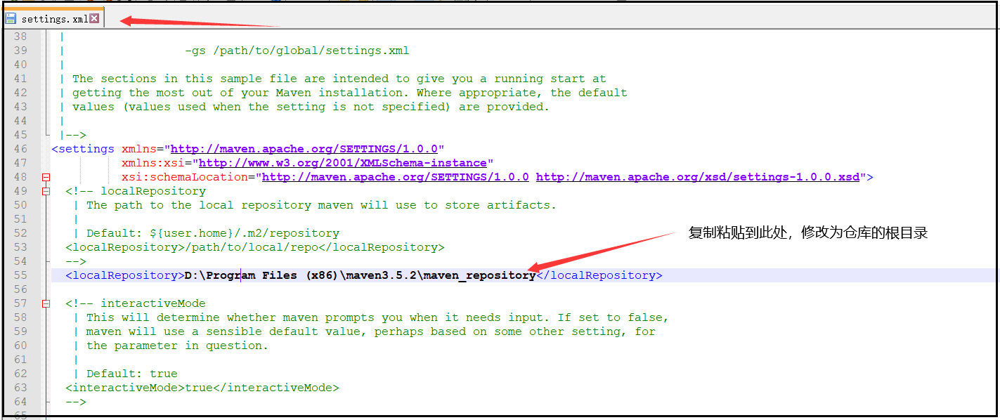

### 配置阿里的maven远程仓库

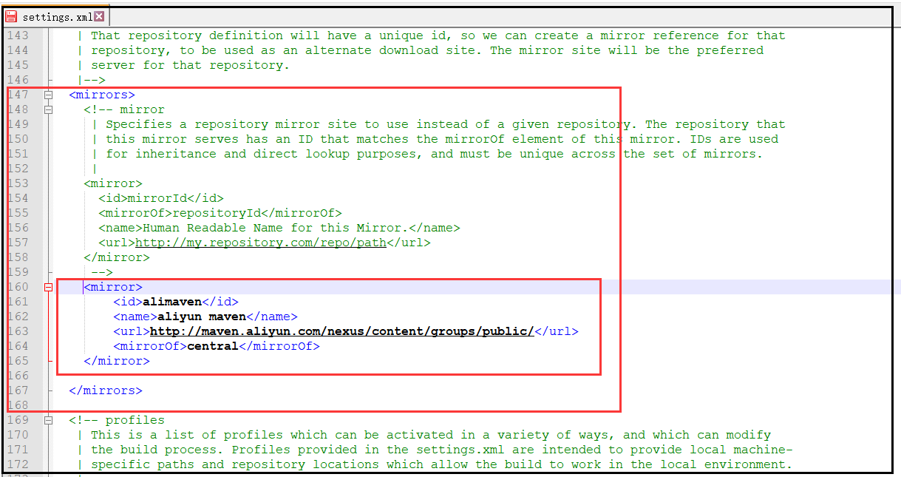

```xml
<mirror>
	<id>alimaven</id>
	<name>aliyun maven</name>
	<url>http://maven.aliyun.com/nexus/content/groups/public/</url>
	<mirrorOf>central</mirrorOf>
</mirror>
```
###全局Setting与用户setting

```xml
maven 仓库地址、私服等配置信息需要在 setting.xml 文件中配置，分为全局配置和用户配置。

在 maven 安装目录下的有 conf/setting.xml 文件，此 setting.xml 文件用于 maven 的所有 project项目，它作为 maven 的全局配置。如需要个性配置则需要在用户配置中设置，用户配置的 setting.xml 文件默认的位置在：${user.dir} /.m2/settings.xml 目录中,${user.dir} 指 windows 中的用户目录。maven 会先找用户配置，如果找到则以用户配置文件为准，否则使用全局配置文件
```


##Maven工程的认识

- maven工程的目录结构

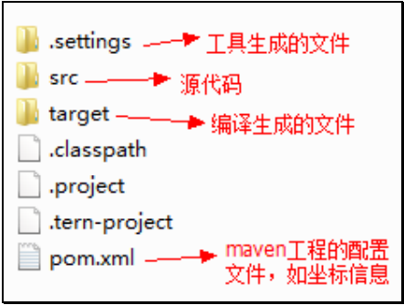

- 作为一个 maven 工程，它的 src 目录和 pom.xml 是必备的。进入 src 目录后，我们发现它里面的目录结构如下：

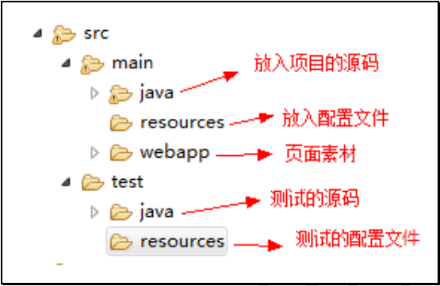

- src/main/java —— 存放项目的.java 文件
- src/main/resources —— 存放项目配置文件
- src/test/java —— 存放所有单元测试.java 文件，如 JUnit 测试类
- src/test/resources —— 测试的配置文件
- target —— 项目输出位置，编译后的 class 文件会输出到此目录
- **pom.xml——maven 项目核心配置文件**

- 注意：如果是普通的 java 项目，那么就没有 webapp 目录。


# 快速入门

## 创建普通项目（不用骨架）

###不选择骨架

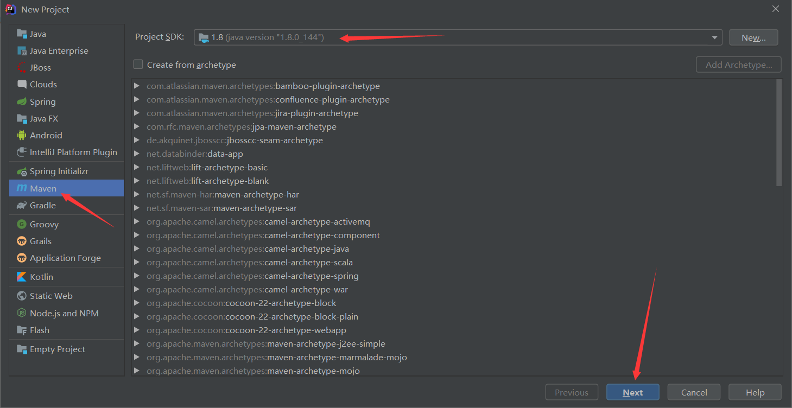

###项目名称


###项目结构


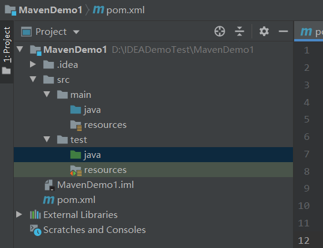

### idea集成maven


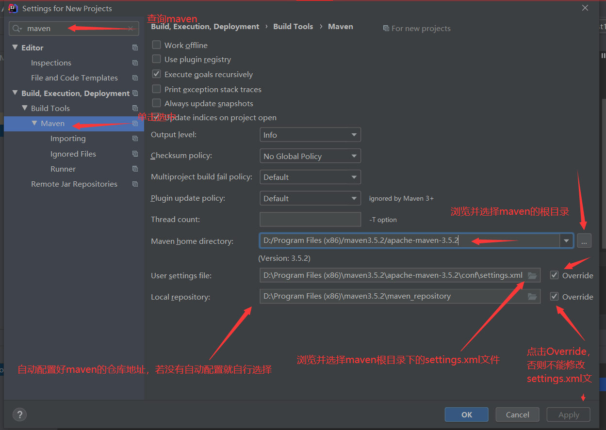


###简单演示


## 创建普通项目（使用骨架）

### 选择骨架

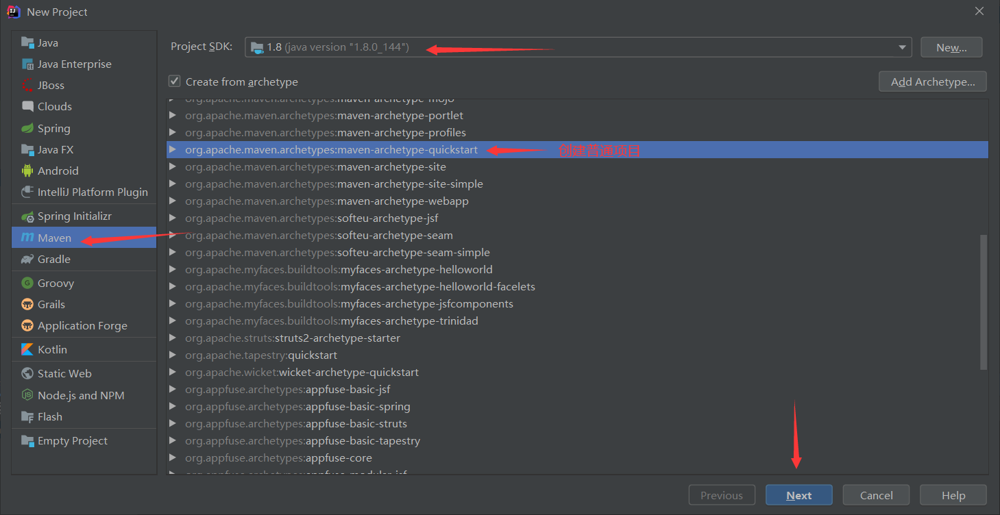

### 设置项目名称

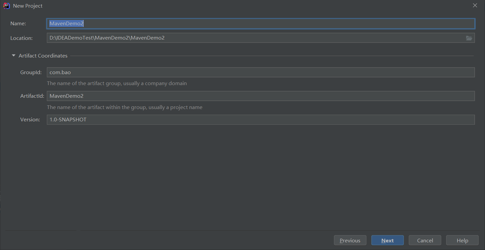

### 确定maven根目录、配置文件、仓库

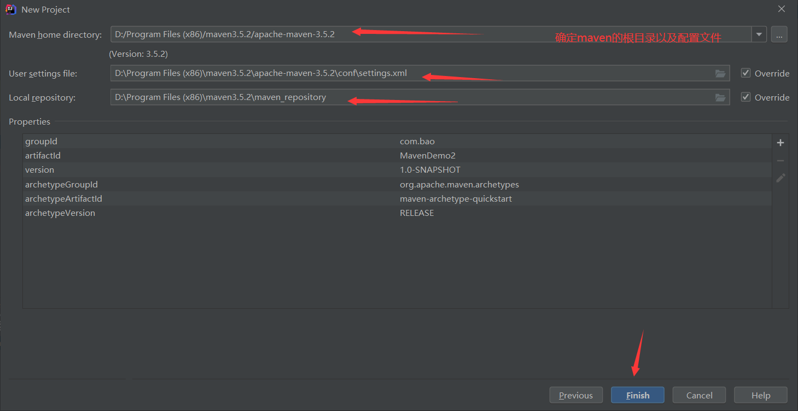

### 需要手动补全目录结构

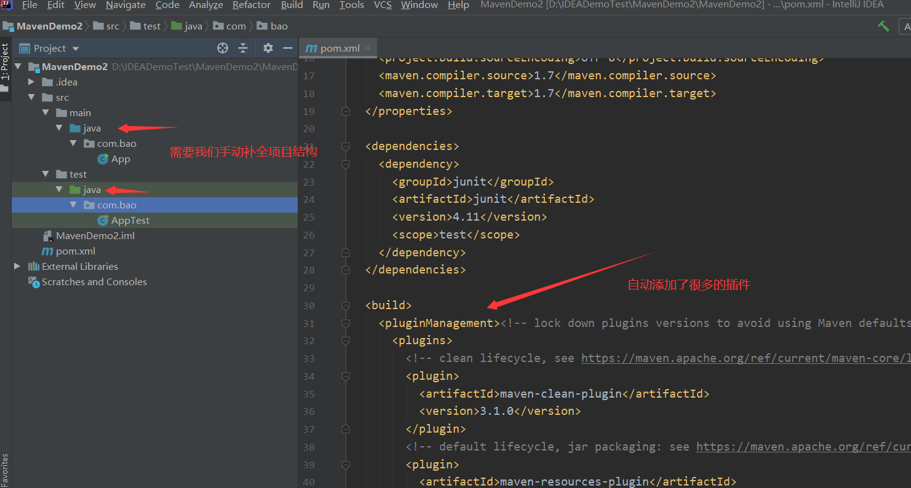

### 测试


## 创建Web项目(使用骨架)

### 选择骨架


### 设置项目名称

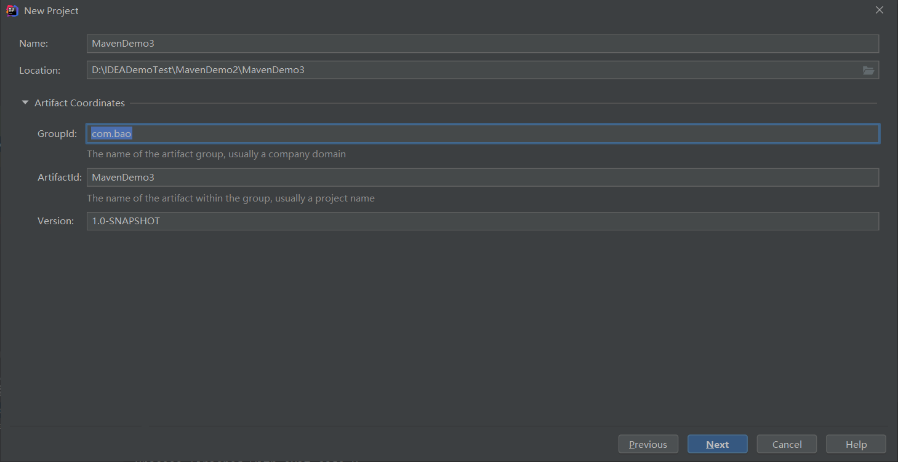

### 配置maven

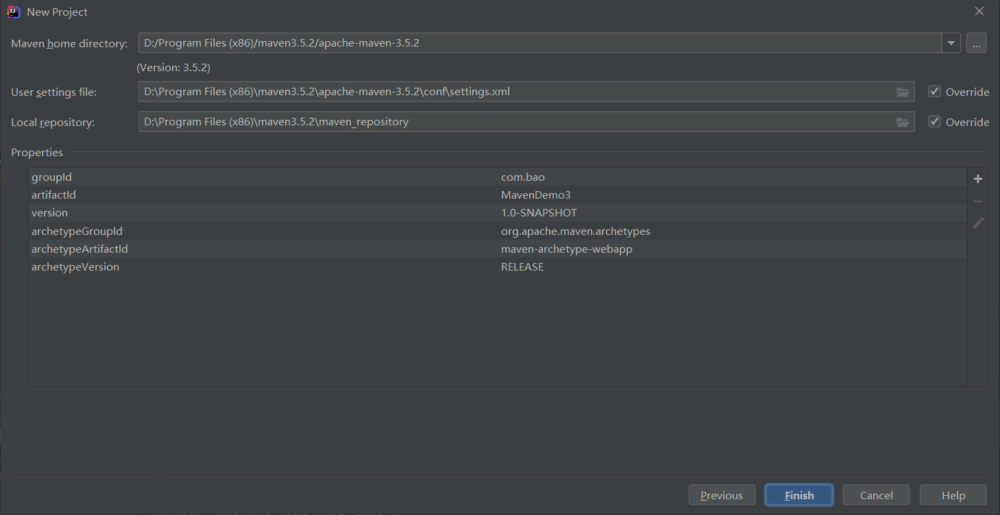

### 需要手动补全项目结构

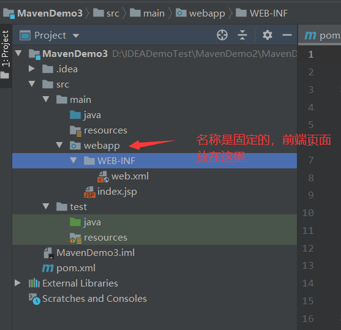

### idea集成tomcat插件

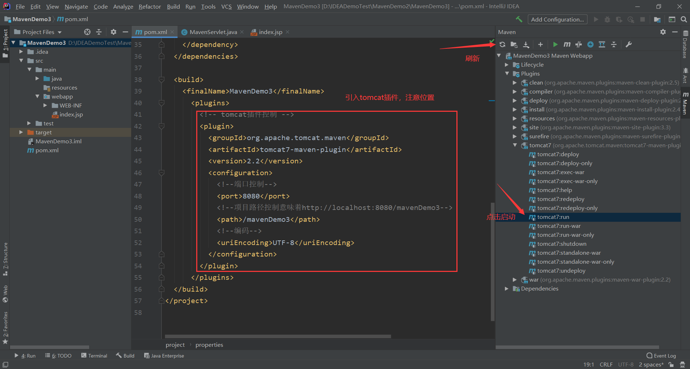

```xml
<!-- tomcat插件控制 -->
<plugin>
  <groupId>org.apache.tomcat.maven</groupId>
  <artifactId>tomcat7-maven-plugin</artifactId>
  <version>2.2</version>
  <configuration>
    <!--端口控制-->
    <port>8080</port>
    <!--项目路径控制意味着http://localhost:8080/mavenDemo3-->
    <path>/mavenDemo3</path>
    <!--编码-->
    <uriEncoding>UTF-8</uriEncoding>
  </configuration>
</plugin>
```

### pom.xml

```xml
<?xml version="1.0" encoding="UTF-8"?>

<project xmlns="http://maven.apache.org/POM/4.0.0" xmlns:xsi="http://www.w3.org/2001/XMLSchema-instance"
  xsi:schemaLocation="http://maven.apache.org/POM/4.0.0 http://maven.apache.org/xsd/maven-4.0.0.xsd">
  <modelVersion>4.0.0</modelVersion>

  <groupId>com.bao</groupId>
  <artifactId>MavenDemo3</artifactId>
  <version>1.0-SNAPSHOT</version>
  <packaging>war</packaging>

  <name>MavenDemo3 Maven Webapp</name>
  <!-- FIXME change it to the project's website -->
  <url>http://www.example.com</url>

  <properties>
    <project.build.sourceEncoding>UTF-8</project.build.sourceEncoding>
    <maven.compiler.source>1.7</maven.compiler.source>
    <maven.compiler.target>1.7</maven.compiler.target>
  </properties>

  <dependencies>
    <dependency>
      <groupId>junit</groupId>
      <artifactId>junit</artifactId>
      <version>4.11</version>
      <scope>test</scope>
    </dependency>
    <!-- https://mvnrepository.com/artifact/javax.servlet/javax.servlet-api -->
    <dependency>
      <groupId>javax.servlet</groupId>
      <artifactId>javax.servlet-api</artifactId>
      <version>4.0.1</version>
      <scope>provided</scope>
    </dependency>
  </dependencies>

  <build>
    <finalName>MavenDemo3</finalName>
      <plugins>
        <!-- tomcat插件控制 -->
        <plugin>
          <groupId>org.apache.tomcat.maven</groupId>
          <artifactId>tomcat7-maven-plugin</artifactId>
          <version>2.2</version>
          <configuration>
            <!--端口控制-->
            <port>8080</port>
            <!--项目路径控制意味着http://localhost:8080/mavenDemo3-->
            <path>/mavenDemo3</path>
            <!--编码-->
            <uriEncoding>UTF-8</uriEncoding>
          </configuration>
        </plugin>
      </plugins>
  </build>
</project>
```

### 配置命令

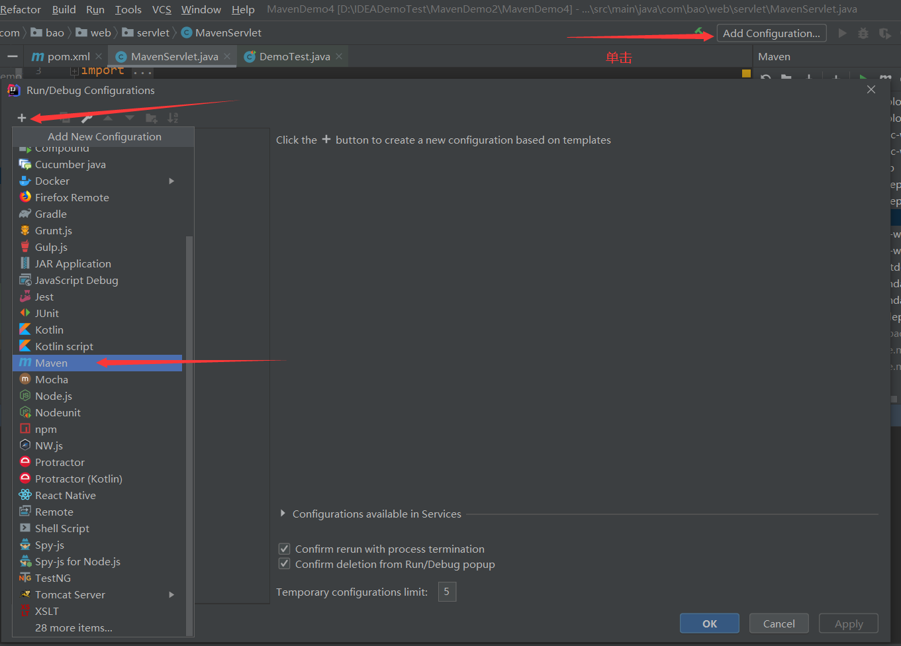


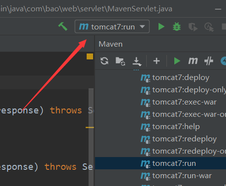


##创建Web项目(不用骨架)

> 手动补全目录结构

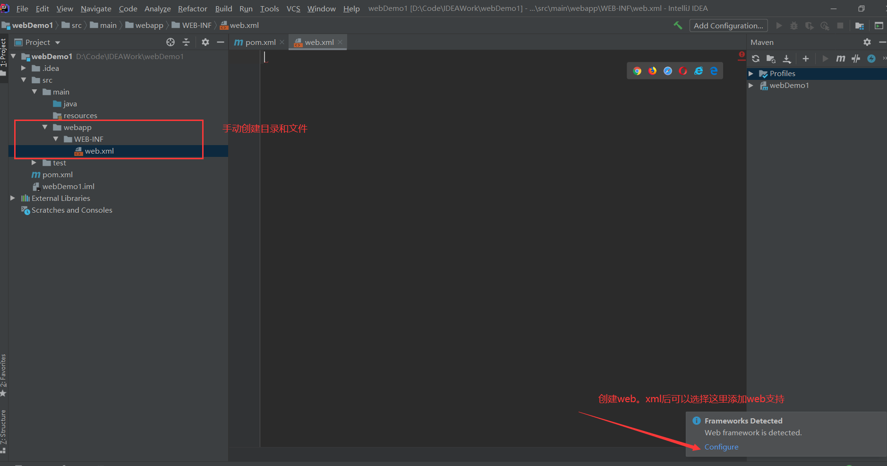

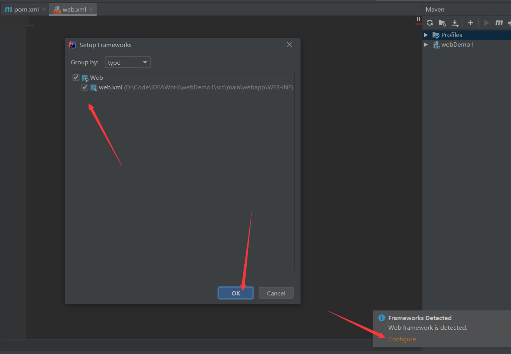


#Maven 命令

## 常用命令

###clean

clean 是 maven 工程的清理命令，执行 clean 会删除 target 目录及内容。

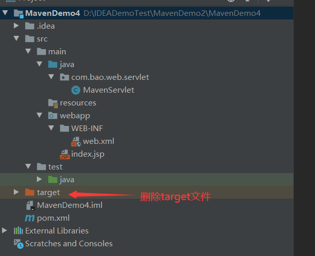

###compile

compile 是 maven 工程的编译命令，作用是将 src/main/java 下的文件编译为 class 文件输出到 target

目录下。

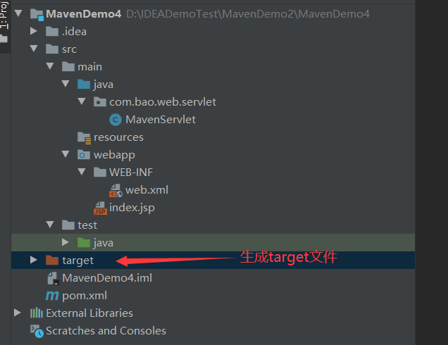

###test

test 是 maven 工程的测试命令，会执行 src/test/java 下的单元测试类。


###package

package 是 maven 工程的打包命令，对于 java 工程执行 package 打成 jar 包，对于 web 工程打成 war

包。


###install

install 是 maven 工程的安装命令，执行 install 将 maven 打成 jar 包或 war 包并发布到本地仓库。


> 从运行结果中可以看出：当后面的命令执行时，前面的操作过程也都会自动执行


##Maven简单配置

###Maven指令的生命周期

> maven 对项目构建过程分为三套相互独立的生命周期，这三套生命周期分别是：
>
> Clean Lifecycle 在进行真正的构建之前进行一些清理工作。
>
> Default Lifecycle 构建的核心部分，编译，测试，打包，部署等等。
>
> Site Lifecycle 生成项目报告，站点，发布站点（了解）
>

###maven的概念模型

Maven 包含了一个项目对象模型 (Project Object Model)，一组标准集合，一个项目生命周期(Project Lifecycle)，一个依赖管理系统(Dependency Management System)，和用来运行定义在生命周期阶段(phase)中插件(plugin)目标(goal)的逻辑。

- 项目对象模型 (Project Object Model)

> 一个 maven 工程都有一个 pom.xml 文件，通过 pom.xml 文件定义项目的坐标、项目依赖、项目信息、插件目标等。

- 一组标准集合

>  maven 将整个项目管理过程定义一组标准，比如：通过 maven 构建工程有标准的目录结构，有标准的生命周期阶段、依赖管理有标准的坐标定义等。

- 一个项目生命周期(Project Lifecycle)

> 使用 maven 完成项目的构建，项目构建包括：清理、编译、测试、部署等过程，maven 将这些过程规范为一个生命周期，如下所示是生命周期的各个阶段：
>


- 依赖管理系统(Dependency Management System)

> 通过 maven 的依赖管理对项目所依赖的 jar 包进行统一管理。

- 插件(plugin)目标(goal)

> maven 管理项目生命周期过程都是基于插件完成的。
>


### 依赖范围

- 确定我配的jar包，对哪些环境是有效的
  - 编译环境：在src/main中
  - 测试环境：在test中
  - 运行环境：在war包中

> compile：编译范围，此范围为默认依赖范围。编译范围的依赖会用在编译、测试、运行，由于运行时需要所以编译范围的依赖会被打包。 
>

> provided：provided 依赖只有在当 JDK 或者一个容器已提供该依赖之后才使用， provided 依 赖在编译和测试时需要，在运行时不需要，比如：servlet api 被 tomcat 容器提供。
>

> runtime：runtime 依赖在运行和测试系统的时候需要，但在编译的时候不需要。比如：jdbc的驱动包。由于运行时需要所以 runtime 范围的依赖会被打包。 
>

> test：test 范围依赖 在编译和运行时都不需要，它们只有在测试编译和测试运行阶段可用，比如：junit。由于运行时不需要所以 test范围依赖不会被打包。
>

> system：system 范围依赖与 provided 类似，但是你必须显式的提供一个对于本地系统中 JAR文件的路径，需要指定 systemPath 磁盘路径，system依赖不推荐使用。

- 总结：

> 默认引入 的 jar 包 ------- compile 【默认范围 可以不写】（编译、测试、运行 都有效 ） 
>
> servlet-api 、jsp-api ------- provided （编译、测试 有效， 运行时无效 防止和 tomcat 下 jar 冲突）
>
> jdbc 驱动 jar 包 ---- runtime （测试、运行 有效 ） 
>
> junit ----- test （测试有效）
>
> 依赖范围由强到弱的顺序是：compile>provided>runtime>test

- 图解

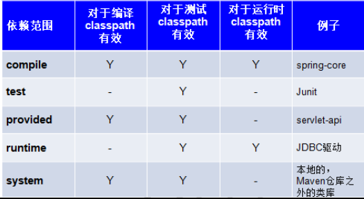

###设置 jdk 编译版本

本教程使用 jdk1.8，需要设置编译版本为 1.8，这里需要使用 maven 的插件来设置：

```xml
<!-- 设置jdk的版本-->
<plugin>
    <groupId>org.apache.maven.plugins</groupId>
    <artifactId>maven-compiler-plugin</artifactId>
    <configuration>
        <source>1.8</source>
        <target>1.8</target>
        <encoding>UTF-8</encoding>
    </configuration>
</plugin>
```


